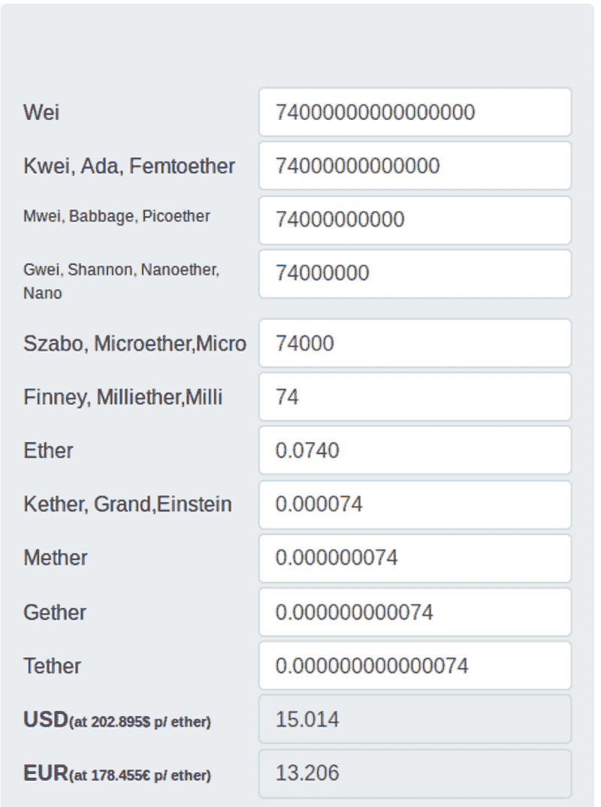
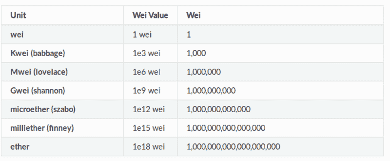
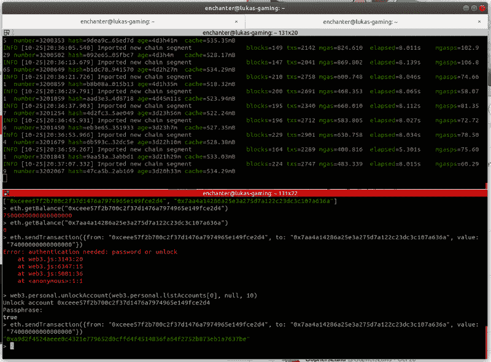
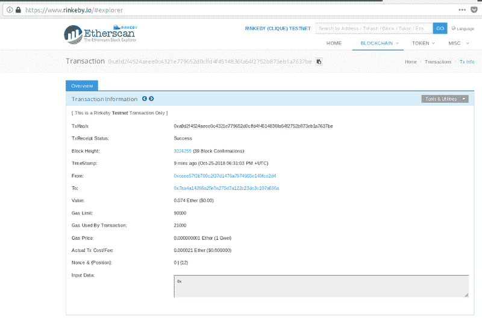

# 如何使用 GETH CLI 在以太网上转移资金

> 原文：<https://www.freecodecamp.org/news/how-to-transfer-funds-on-the-ethereum-network-using-the-geth-cli-b7eac16aa3a9/>

在我的[上一篇文章](https://medium.freecodecamp.org/ethereum-69-how-to-set-up-a-fully-synced-blockchain-node-in-10-mins-f6318d7aad40)中，你学习了如何在 10 分钟内建立一个完全同步的区块链节点。现在是时候学习如何使用 GETH CLI 在以太坊网络上执行交易了。

要想达成一致，先完成从[上一篇文章](https://medium.freecodecamp.org/ethereum-69-how-to-set-up-a-fully-synced-blockchain-node-in-10-mins-f6318d7aad40)开始的所有步骤。

完成了吗？完美。

在这一点上你知道:

*   如何运行完全同步的以太坊区块链节点
*   如何附加`GETH console`
*   如何查询以太坊账户余额

```
geth attach ipc:/home/enchanter/.gophersland_ethereum_r1/geth.ipc 
```

```
eth.getBalance("0xceee57f2b700c2f37d1476a7974965e149fce2d4")
```

```
> 7500000000000000000
```

你可能会想，是的，但是等一下 Lukas…为什么`7.5ETH`在`Geth console`中显示为`7500000000000000000`？

### 以太 vs 魏

以太坊虚拟机不支持小数或浮点数。显然，金融中的计算在整数上更容易。

因此，为了能够发送 1 ETH 的分数，以太坊基金会决定创建他们自己的公制系统，其中最小单位是 1 Wei，1 ETH 是 1e18 Wei。

但是别担心，有一些工具可以让你的生活变得更轻松。例如，我向魏强烈推荐以太在线转换器:

[https://以太转换器. online](https://etherconverter.online/)

为了发送价值 15 美元的乙醚，其中 1 ETH = = 200 美元(美好的旧时光…)，您将进行发送 0.0740 ETH 的交易，这将是并且必须用 Wei 表示为 7400000000000000。

**在线以太到魏转换器:**



**以太坊公制概述:**



熟能生巧。让我们实际上发送 74000000000000 魏(15 美元)到另一个帐户。

### 使用 GETH CLI 向另一个帐户发送以太网

在一个终端中，记得运行完全同步的区块链节点:

```
geth --rinkeby --datadir=~/.gophersland_ethereum_r1 --port=30304 --cache=2048 --rpc --rpcport=8546 --rpcapi=eth,web3,net,personal --syncmode=fast
```

在另一个终端，我们将创建我们的第二个以太坊账户，就像第 1 部分一样。

```
ls -la ~/.gophersland_ethereum_r1/keystore/> drwx------ 2 enchanter enchanter 4096 sep 24 15:36 .> drwx------ 4 enchanter enchanter 4096 sep 24 15:26 ..> -rw------- 1 enchanter enchanter  491 sep 24 15:36 
```

```
UTC--2018-09-24T13-36-43.069452577Z--ceee57f2b700c2f37d1476a7974965e149fce2d4geth --datadir=~/.gophersland_ethereum_r1 account new> INFO [09-24|15:36:33.566] Maximum peer count ETH=25 LES=0 total=25> Your new account is locked with a password. Please give a password. Do not forget this password.
```

```
> Passphrase: > Repeat passphrase: > Address: {7aa4a14286a25e3a275d7a122c23dc3c107a636a}ls -la ~/.gophersland_ethereum_r1/keystore/> drwx------ 2 enchanter enchanter 4096 oct 25 20:14 .> drwx------ 4 enchanter enchanter 4096 oct 25 19:48 ..> -rw------- 1 enchanter enchanter  491 sep 24 15:36 
```

```
UTC--2018-09-24T13-36-43.069452577Z--ceee57f2b700c2f37d1476a7974965e149fce2d4
```

现在，让我们像在上一篇文章中一样将 Geth 控制台连接到当前运行的区块链节点，以便通过执行`eth.sendTransaction`命令向这个新创建的帐户转账 15 美元。

```
geth attach ipc:/home/enchanter/.gophersland_ethereum_r1/geth.ipc 
```

```
eth.sendTransaction({from: "0xceee57f2b700c2f37d1476a7974965e149fce2d4",to: "0x7aa4a14286a25e3a275d7a122c23dc3c107a636a", value: "74000000000000000"})
```

错误:需要认证:密码或解锁。

您应该会得到一个错误。这是因为发送以太是一个“事务”，一个事务会改变状态，消耗气体，花费资金。这意味着它需要用我们存储在**密钥库中的私钥进行签名。为了解密密钥，我们必须提供一个密码，或者换句话说，解锁帐户。**

执行以下命令在接下来的 60 秒内解锁您的帐户，并再次执行 sendTransaction 命令。

```
web3.personal.unlockAccount(web3.personal.listAccounts[0], null, 60) 
```

```
eth.sendTransaction({from: "0xceee57f2b700c2f37d1476a7974965e149fce2d4", to: "0x7aa4a14286a25e3a275d7a122c23dc3c107a636a", value: "74000000000000000"})
```

我们也可以将密码作为第二个参数传递，而不是 null。但是这种方式更安全，因为您的密码只是在一个缓冲区中，而不是存储在任何日志中或在屏幕上可见。



**这次命令成功了，返回了一个交易哈希回执！哦耶！**

当我们连接到 Rinkeby 网络时，我们可以利用 Rinkeby GUI explorer 来检查该交易的状态、消耗的气体、气体价格等。

1.  打开[浏览器](https://www.rinkeby.io/#explorer)
2.  将交易收据散列粘贴到搜索栏
3.  成交，我们花了 21000 的气(送资金标准)，交易成功！



现在，您可以查询两个帐户的余额，并查看更改后的状态:

```
eth.getBalance("0xceee57f2b700c2f37d1476a7974965e149fce2d4") > 7425979000000000000 
```

```
eth.getBalance("0x7aa4a14286a25e3a275d7a122c23dc3c107a636a") > 74000000000000000
```

非常有效。

恭喜你！你:

*   学习了以太和卫的区别以及如何转换它们
*   通过全球以太坊测试网络 Rinkeby 提交了您的第一笔交易

您可以通过在 Go 中从头开始构建一个来继续扩展您的区块链技能！