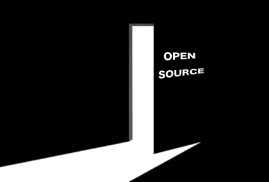
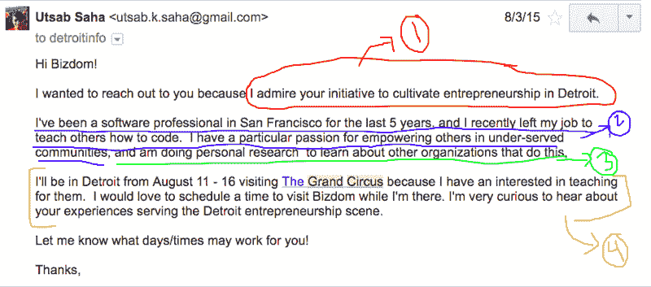
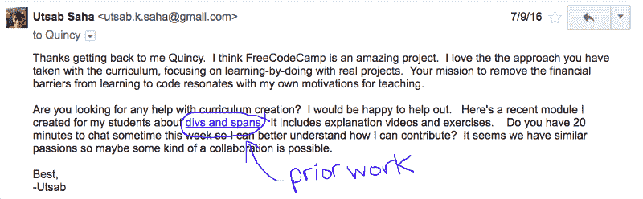
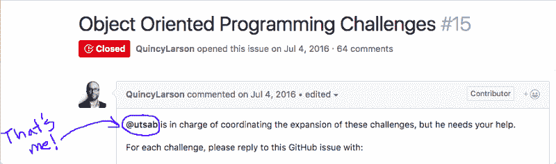
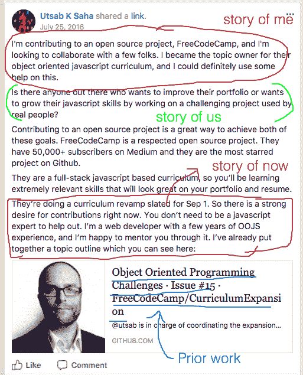
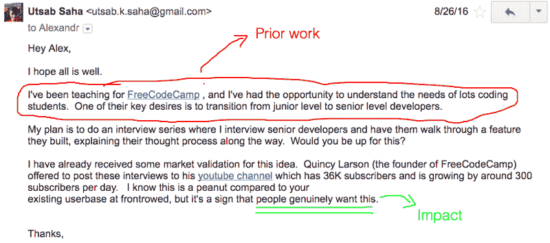
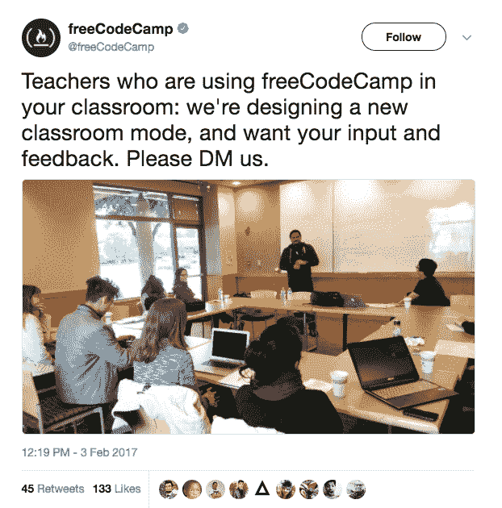
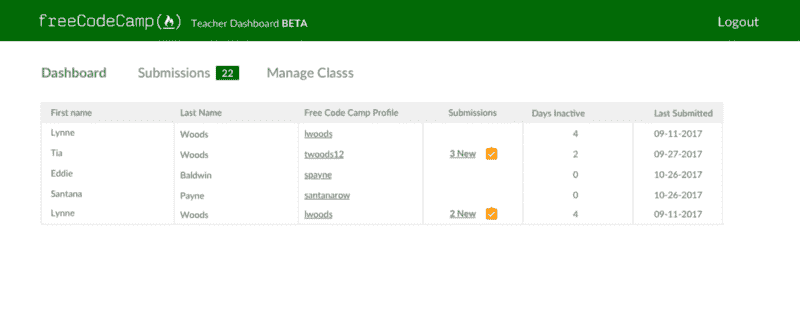
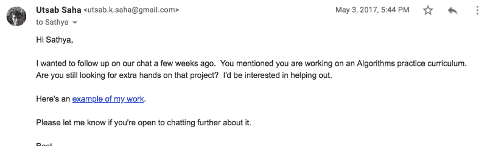

# 我是如何通过参与开源项目找到我的理想工作的

> 原文：<https://www.freecodecamp.org/news/how-i-found-my-dream-job-by-contributing-to-open-source-projects-ca98cbe60009/>

乌特萨布·萨哈

# 我是如何通过参与开源项目找到我的理想工作的

我经常从我的编程学生那里听到的一个担忧是，“没有计算机科学学位，我如何找到一份开发人员的工作？”

这是一个可以理解的担忧，我最近在申请成为加州州立大学(蒙特利湾分校)计算机科学讲师时也面临着这个问题。这种职位的通常要求是硕士学位，而我没有。

然而，由于我以前在开源项目上的工作，我能够克服硕士学位的要求。这项工作帮助我建立了技能、信誉和专业网络，最终成为进入这份工作的“后门”。

我相信志愿者工作和开源项目对任何人来说都是一种难以置信的资源，可以绕过科技公司“前门”上列出的通常要求，增强他们的体验。在这篇文章中，我将介绍指导我的过程的两个关键原则:

1.  成长:我通过自愿参加我还不知道如何做的项目来不断发展我的技能。
2.  服务:我通过向人们提供服务来建立我的职业网络，而不期望任何回报。

我将通过五个项目来阐述这些主题。我将讲述我是如何接触人们，倾听他们的需求，为他们提供服务，并在这个过程中逐渐积累我的技能。

### 先决条件:了解你的“理想工作”

> 你真的应该接受一份工作，如果你是独立富裕的人，你会接受这份工作——沃伦·巴菲特

我将要阐述的原则需要我付出大量的耐心和精力，而且通常没有任何直接的回报。这对我来说是可能的，因为我对我认为有意义的工作有一个清晰的愿景。

我热衷于提高社会流动性。我想创造一个世界，让每个人都能获得个人指导，不管他们是谁，住在哪里。我这样做的方式是帮助那些来自世界上未被充分代表的地区的人们学习编码。

我深感有必要做这项工作，以至于我已经**付钱**去做了。我作为一名付费学生参加了一个编码训练营(Dev Bootcamp ),尽管我已经作为一名 web 开发人员在几家公司工作过。我的目标不是学习如何编码，而是学习如何教学。

后来，我开始为一些组织做志愿者，比如 Code Tenderloin 和 freeCodeCamp，我觉得这些组织与我的愿景一致。

什么是你如此热爱的工作，以至于你愿意付钱去做，或者至少免费去做？我要求你比“软件开发人员”更具体。在软件开发中，你特别喜欢什么，为什么？

### 侦察工作:了解问题

> 我们有两只耳朵和一张嘴，所以我们听的是说的两倍

一旦我知道了我的“理想工作”，我的下一步就是研究其他已经在这个领域做着有趣工作的组织。

除了作为学生参加旧金山的 Dev 训练营之外，我还参观了密歇根州底特律的[大马戏团](https://www.grandcircus.co/bootcamps/)编码训练营。我对大马戏团很好奇，因为他们找到了一种方法，在一个不是你的传统技术中心的领域教编码。

我有很多问题:在学习编码仅仅 8 周后，学生们的技能组合是什么？在底特律这样的非技术中心地区教授编程面临哪些挑战？他们的学生在哪里找到工作？

为了回答这样的问题，我和来自许多不同组织的人安排了会面。

看看我如何安排这些会议可能会有所启发，所以我将分解一下我发给底特律创业孵化器 Bizdom 的一封冷冰冰的电子邮件:

1.  红色:这表明我花时间阅读了他们的网站，了解了他们的工作。这使我有别于一般的垃圾邮件发送者。
2.  蓝色:这是“我的故事”。我是谁，我为什么可信，我的动力是什么？我的为什么是什么？
3.  绿色:这是“我们的故事”。我如何看待 Bizdom 和我自己有一段有意义的关系
4.  黄色:这是“现在的故事”。现在正在发生的什么事情会让 Bizdom 和我一起去做一些事情？

这个公式有超过 50%的成功率与我从未见过的人安排会面。以下是我在为期 5 天的底特律之旅中所有会议的[笔记](https://workflowy.com/s/PG3.WqePKlvUSM)。

请注意，这个公式虽然有效，但确实需要做大量的功课。为了有一个令人信服的“我的故事”，我首先需要对我的理想工作有一个清晰的愿景。为了有一个令人信服的“我们的故事”，我需要研究其他组织。为了有一个令人信服的“当下的故事”，我需要已经计划好去底特律的旅行。

### 项目#1:我自愿帮助一个人

> 给我六个小时砍树，我会用前四个小时磨利斧头——亚伯拉罕·林肯

我底特律之行的真正成果并不是来自我事先安排的任何会议。

当我离开大马戏编码学校时，我有幸与一名学生共用一部电梯——姑且称他为“罗伯特”——他刚刚从他们的项目毕业。在我把我的故事，我们的故事，现在的故事的口头版本给了罗伯特之后，他同意和我一起吃午饭，这样我可以听到更多关于他的经历。

午餐时，我听了罗伯特的故事。我了解到，促使他参加编码训练营的原因是希望离开他在福特汽车公司的蓝领工作。我了解到他面临的主要挑战之一是为他 3 岁的女儿找一个保姆，这样他就可以参加编码训练营。我了解到他的梦想是为他的女儿开发一个有趣的教育手机应用程序。我了解到他的沮丧，因为编码训练营实际上并没有让他为构建这样一个应用做好准备。

后来，在他开发这个应用程序时，我自愿成为他的编码导师。尽管我做这份工作没有获得任何收入，但我还是做了，因为这离我梦想的工作更近了一步。我从仅仅和那些做有意义工作的组织聊天，变成了和一个真正的人一起实际工作。我很激动。

我也很害怕，因为我从来没有教过任何人编码。在我看来，这是我学习的机会。

我和 Robert 一起工作了几个月，在此期间，我会为他创建如下模块:

它最终没能和罗伯特长期相处，这让我当时非常失望。然而，这带来了一些意想不到的成果:

1.  罗伯特曾经对我为他制作的视频赞不绝口。因此，我了解到我的优势之一是制作教学视频，这激励我继续制作更多的视频，这一习惯将在以后很好地为我服务。
2.  我开始意识到我的一个弱点:缺乏组织性。我没有遵循的长期结构或课程，这可能对罗伯特的士气不利。
3.  我为罗伯特创建的所有[模块](https://workflowy.com/s/PG3.1FxwbKYlyg)让我开始为 freeCodeCamp 的课程做贡献，这成为我的下一个大项目。

### 项目#2:为 FreeCodeCamp 创建课程

> 如果说我比别人看得更远，那是因为我站在巨人的肩膀上。—艾萨克·牛顿

freeCodeCamp 很大程度上解决了我缺乏组织的问题。他们现成的项目正是我所需要的，以便作为一名编码老师更有条理。当我发现这一切都是开源的，我认为这太好了，难以置信。我想这其中一定有蹊跷。

所以我给自由代码营的创始人昆西·拉森发了一封电子邮件，问他我是否真的可以用他们的课程来教我自己的学生。

他答应了。没有陷阱。

我受到了 freeCodeCamp 理念的启发，所以我自愿提供帮助:

如果你仔细观察，你会发现我如何交流的常见元素:我的故事，我们的故事，现在的故事。

还有一个额外的元素，这是一个链接，指向我以前为罗伯特创作的作品。这是一个例子，说明了之前的志愿者工作是如何逐步建立我的技能组合的，这样我就可以从事更大更复杂的项目。

在与 Quincy 的几封电子邮件中，我从为一个人创建模块，到为 freeCodeCamp 的 100 多万用户创建模块！

多酷啊。我很激动。

我也很害怕，因为 OOJS 当时不是我最擅长的话题。但在我看来，这是我学习它的机会。我做好了准备，疯狂地阅读这本书。

我还决定寻求其他人的帮助，所以我联系了 Dev Bootcamp 脸书小组，发布了以下帖子:

这篇文章招募了 5 名热情的志愿者，他们和我一起完成了面向对象的 javascript 课程,现在可以在 freeCodeCamp 的测试版上看到。

请注意，这个项目的成果利用了我以前在 Dev Bootcamp 做的侦察工作。我当时绝对没有预料到我在 DBC 遇到的人有一天会和我合作。这说明了采取行动而不期待任何回报的潜在力量。

### 项目#3:高级开发人员案例研究

> 找到一个值得解决的问题的一个好方法是让自己完全沉浸在一个你热爱的垂直领域中，并和其他充满激情的人在一起。人难免有问题。”——*——**奔贫**——*的作者阿什莫利亚

当我与五位 Dev Bootcamp 毕业生一起创建 freeCodeCamp 课程时，我有幸听到了关于后编码 Bootcamp 生活盛衰的第一手证词。

他们最大的愿望之一是成长为高级开发人员，但是他们觉得他们在公司的日常工作没有为这样的成长做好准备。他们想做更有挑战性的工作，以便继续发展他们的技能。

我很好奇这是否适用于更多的编码训练营的毕业生，所以我采访了一些我在开发训练营时的朋友来询问他们这个问题。我按照[运行精益](https://www.amazon.com/Running-Lean-Iterate-Plan-Works/dp/1449305172/ref=sr_1_1?ie=UTF8&qid=1515015442&sr=8-1&keywords=Running+Lean)第 7 章中定义的“问题访谈”结构进行了这些对话。

从高层次来说，“问题访谈”的目标是了解你的听众的首要目标，并了解他们今天是如何解决问题的。这里有一个例子:(显示 Xavier 采访的链接)

采访中的关键见解:

*   Xavier 的头号目标(红色):“从初级开发人员成为中级开发人员”。
*   如何解决问题(蓝色):他问公司的高级开发人员他们是如何得出特定结论的。
*   一篇博文的想法(绿色):采访高级开发人员，并通过他们面临的具体挑战来更好地理解他们的思维过程。

我联系了我认识的更高级别的开发人员，包括 FrontRowEd 的首席技术官亚历山大·巴甫洛夫·库林，这是一家为 K-12 学生开发适应性学习软件的初创公司。这是我发给他的安排面试的邮件:

注意我描述影响的方式(绿色)。我发现激励人们行动的最有力的方式是强调他们贡献的更深层次的意义。关于动机的研究将“对他人的影响”和“掌握”列为意义的两种强有力的形式——这可能会让你想起引言中列出的两条指导原则，我用它们来激励自己！

我与 Alex 合作制作了以下案例研究，并发布到 freeCodeCamp 的 Youtube 频道:

我从这个项目中学到了很多。我敢打赌，我个人从采访亚历克斯的过程中学到的东西比看视频的任何人都多。

### 项目#4:为 freeCodeCamp 构建一个课堂模式功能

> “成功是通过给予而获得的，不求回报。”——基思·费拉齐

我和 Alex 在视频的最后发出行动号召，为 FreeCodeCamp 的开源存储库构建一个功能，作为将视频中的技能付诸实践的一种方式。

昆西·拉森建议创建一个“课堂模式”的功能。越来越多的老师已经开始在课堂上使用 freeCodeCamp 进行教学。然而，freeCodeCamp 并没有考虑到这个用例。我们能解决这个问题吗？

我招募了以下团队来帮忙:

*   乌迪·奇马成了我们的 UX 设计师
*   谢珍妮成了我们的项目经理
*   汤姆·李、普里扬卡·塞加尔和我成了开发者。

几乎所有这些人都是我在探索其他编码训练营时遇到的。

作为一名 UX 设计师，Udie 很想直接与使用课堂模式功能的其他人聊天。所以我们请求昆西代表我们做任何介绍。昆西代表我们发了以下推文:

这条推文导致了来自世界各地的大约 10 名教师接受用户采访。基于这些采访中的[见解](https://docs.google.com/document/d/1E2yK67gTg7C0Ixv-X0S9-_vdIht3pawOYYDuNXKQ-fQ/edit?usp=sharing)，Udie 创建了以下[互动线框](https://invis.io/J3C03W2SX):

由于昆西的推文，我们遇到的一个人是加州州立大学(蒙特雷湾)教授萨提亚·纳拉亚南博士。

### 项目 5:志愿去夏令营帮忙

在一次 zoom 会议上，我和 Sathya 聊了一会儿，他的愿景让女性和少数群体更容易获得大学体验，这让我深受启发。他的实验性的基于群组的模型旨在解决高等教育中的许多设计缺陷，这些缺陷是由 T2 布里奇特·伯恩斯的研究揭示的，这些缺陷导致了少数民族的毕业率较低。他们专注于教授超出传统学术知识的软技能，这让我特别感兴趣。

他提到，他在即将到来的数据结构夏令营中人手不足，我后来给他发了电子邮件，表示愿意提供帮助:

“我工作的例子”链接到我为 freeCodeCamp 的 Youtube 频道创建的一个高级开发者视频。

在那个夏天帮助萨提亚是一次充实的经历。事实证明，CSUMB 群组项目正如他所宣称的那样具有创新性和积极意义。

在训练营结束时，萨提亚提到 CSUMB 有一个公开的讲师职位，他正在招聘。这份工作通常需要硕士学位，但他说他会想办法免除我的要求。我去了。

### 结论

这是一种奇妙的感觉，我终于可以拿工资做我之前两年免费做的同类工作了。

我特别感谢罗伯特，这位来自底特律的学生，几年前我在电梯里遇见了他。谢谢你给我机会，成为我的第一个学生。

作为对读者的行动号召，如果你想参与一个开源项目，我可以帮助你第一次提交到我们为 freeCodeCamp 构建的课堂模式特性中。欢迎在 linkedin 上给我发消息。