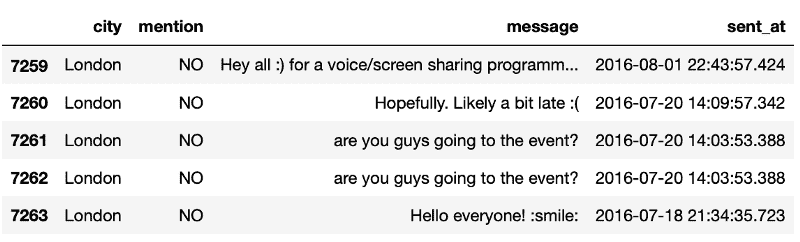
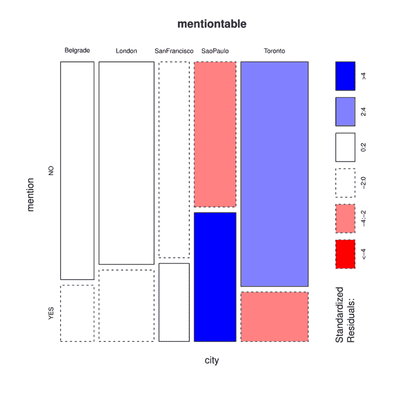

# 来自不同城市的人们如何在免费代码营聊天室中互动

> 原文：<https://www.freecodecamp.org/news/how-people-from-different-cities-interact-in-the-freecodecamp-chatrooms-a22378571790/>

作者德博拉·梅斯基塔

# 来自不同城市的人们如何在免费代码营聊天室中互动

#### 推理统计学和如何使用 spaCy 从文本中提取信息的初级读本


They’re talking about this article in the fcc chat-room (haha just kidding! Thanks [rawpixel](https://unsplash.com/photos/5eClbgffg8w) for the pic!)

在数据科学中，我们通常谈论很多关于[探索性数据分析](https://en.wikipedia.org/wiki/Exploratory_data_analysis)(描述性统计)，但还有另一个“统计世界”也非常有用:推断统计的世界**。**

> 推断统计分析推断人口的性质，例如通过检验假设和得出估计值。描述统计学只关心观察数据的性质，它不依赖于数据来自更大人群的假设。— [统计推断](https://en.wikipedia.org/wiki/Statistical_inference)

在本文中，我们将使用来自 freeCodeCamp 开放数据的 gitter-history 数据集来回答这个问题:**不同城市的聊天室中是否有不同的提及模式？**

我们将学习推理统计学，还将学习如何使用 spaCy 的 [Matcher](https://spacy.io/api/matcher) 类从文本中提取信息。首先让我们提取数据，然后我们将接触统计数据(嘿，这很有趣！你会明白的)。

### 用空间提取信息。制榫机

我们使用匹配器的方式与使用正则表达式的方式非常相似(事实上我们可以使用正则表达式来创建模式)。每个规则可以有许多模式，一个模式由一个字典列表组成，其中每个字典描述一个令牌。

```
// this pattern matches all tokens == 'hello' (lowercase){'LOWER': 'hello'}
```

让我们从这些信息中提取一些例子。

#### 问候

这里我们有 4 种模式用于相同的规则(`"GREETINGS"`):

```
matcher = Matcher(nlp.vocab) 
```

```
self.matcher.add("GREETINGS", None,                 [{"LOWER": "good"}, {"LOWER": "morning"}],                   [{"LOWER": "good"}, {"LOWER": "evening"}],                     [{"LOWER": "good"}, {"LOWER": "afternoon"}],                     [{"LOWER": "good"}, {"LOWER": "night"}])
```

```
matches = matcher(text)
```

#### 带标点符号的邮件

我们可以使用所有可用的[令牌属性](https://spacy.io/usage/linguistic-features#adding-patterns-attributes)作为模式。让我们看看一个消息是否有标点符号。

```
matcher = Matcher(nlp.vocab)
```

```
self.matcher.add("PUNCT", None,                 [{"IS_PUNCT": True}])
```

```
matches = matcher(text)
```

#### 人们的感受是什么？

这里事情变得更有趣了。我们将匹配动词 be 的[引理](https://en.wikipedia.org/wiki/Lemma_(morphology))来检测动词的所有变形。匹配器还允许您使用量词，被指定为`'OP'`键。我们将匹配动词 *be* 之后的所有副词标记(使用`'OP': '*'`我们可以匹配它们中的任何一个或全部)。

在那之后，接下来的两个单词有很大的可能性，所以我们将使用通配符标记`{}`来匹配它们。

```
matcher = Matcher(nlp.vocab)
```

```
self.matcher.add("FEELING", None,                 [                 {"LOWER": "i"}, {"LEMMA":"be"},                    {"POS": "ADV", "OP": "*"},                     {"POS": "ADJ"}                 ])
```

```
matches = matcher(text)
```

#### 提及

@some_token 没有令牌属性，所以让我们创建一个。

```
mention_flag = lambda text: bool(re.compile(r'\@(\w+)').match(text))
```

```
IS_MENTION = nlp.vocab.add_flag(mention_flag)
```

```
self.matcher.add("MENTION", None, [{IS_MENTION: True}])
```

```
matches = matcher(text)
```

我构建了一个数据集，其中包含了本文剩余部分的提及。

```
[menssage, mention, sent_at, city]
```

你可以在这里找到所有代码[。](https://github.com/dmesquita/chi-square-test-for-homogeneity)

### 推理统计学入门

统计推断是使用数据分析**来推断潜在概率分布** ( [统计推断](https://en.wikipedia.org/wiki/Statistical_inference))的性质的过程。

我们有样品，想比较一下。通过检验统计量，我们可以测量它们是否来自同一分布的概率*。将此应用于我们的场景，**如果来自*相同*分布的提及概率*低于阈值*** (由我们定义)，那么我们将能够推断出**来自不同城市的人具有不同的提及模式**。*

*让我们定义一些概念来澄清事情(所有的定义都取自维基百科):*

*   ***频率分布**:显示[样本中各种结果出现频率的列表、表格或图形](https://en.wikipedia.org/wiki/Sampling_(statistics))*
*   ***零假设**:两个被测现象之间没有关系*或组间没有关联的一般陈述或默认立场**
*   ***p 值**:当零假设为真时，获得等于或大于实际观察结果的概率。 *p* 值越小，显著性越高，因为它告诉研究者所考虑的假设可能不足以解释观察结果*
*   ***统计显著性**:如果某样东西允许我们拒绝零假设，那么它就是具有统计显著性的*

*在处理统计假设检验时要记住的一件事是，它是这样的:*

1.  *我们假设某事是真的*
2.  *然后我们试图证明这不可能是真的*
3.  *然后当我们看到，事实上，我们得到的结果可能不是这样的，我们拒绝这个观点*

> *"**零假设检验是一种适合统计学的[反证法](https://en.wikipedia.org/wiki/Reductio_ad_absurdum)论证。实质上，如果一项索赔的反索赔不太可能**，则该索赔被视为有效。— [P 值](https://en.wikipedia.org/wiki/P-value)*

*在我们的例子中，我们处理的是分类变量(一个可以取有限的、通常是固定数量的可能值之一的变量)。因此，我们将使用卡方分布。*

> *在概率论与统计中，自由度为 *k* 的**卡方分布**(也称**卡方**或**χ2-分布**)是 *k* 个独立标准正态随机变量的平方和的分布。这是推断统计中最广泛使用的概率分布之一，特别是在假设检验或置信区间的构造中。— [卡方分布](https://en.wikipedia.org/wiki/Chi-squared_distribution)*

> *统计学家已经确定了几种常见的分布，称为概率分布。从这些分布中，可以根据特定分数在具有这些常见形状的分布中出现的频率来计算得到特定分数的概率。”— [使用 R 发现统计数据](https://www.discoveringstatistics.com/books/discovering-statistics-using-r/)*

### *了解同质性的卡方检验*

*我们想知道每个城市的提及分布是否相同。首先我们假设他们确实来自同一个人群，然后我们从每个城市得到所有的信息，并把它们加起来。如果我们假设每个城市来自相同的人群，那么这种分布(所有消息一起)对于每个城市应该是相同的。*

*我们不能用统计学来证明这些分布是不同的，但是我们可以**拒绝它们是相同的**。*

> *“我们需要零假设的原因是因为我们不能用统计学来证明实验假设，但是我们可以拒绝零假设。如果我们的数据给了我们拒绝零假设的信心，那么这就为我们的实验假设提供了支持。然而，请注意，即使我们可以拒绝零假设，**这并不能证明**实验假设——它只是支持它**。**——[利用 R 发现统计](https://www.discoveringstatistics.com/books/discovering-statistics-using-r/)*

*这一点非常重要。我们并没有证明实验(或替代)假说是正确的。我们说**在给定的显著性水平上，很可能是真的**。*

> *“因此，与其谈论接受或拒绝一个假设(一些教科书告诉你这样做)，我们应该谈论‘假设零假设为真，获得我们收集的数据的机会’。”— [使用 R 发现统计数据](https://www.discoveringstatistics.com/books/discovering-statistics-using-r/)*

*本质上，当我们收集数据来测试理论时，我们只能谈论获得一组特定数据的概率。判断我们使用 p 值。*

*   ***高 p 值**:你的数据**可能**为真空*
*   ***低 P 值**:你的数据**不太可能**为真空，( [*如何正确解读 P 值*](http://blog.minitab.com/blog/adventures-in-statistics-2/how-to-correctly-interpret-p-values) )*

*我们将显著性水平设置为 5% ( *p 值*阈值为 0.05)。*

*好了，现在回到测试。*

#### *数据*

*我们将使用 freeCodeCamp 的 Gitter 聊天室中所有聊天活动的数据集。这个数据集可以在[这里](https://github.com/freeCodeCamp/open-data/tree/master/gitter-history)找到。*

*

How the data looks like after we extracted the mention information* 

*我们的样本包含了 2015 年 8 月 16 日至 2016 年 8 月 16 日(一年的信息)期间来自旧金山、多伦多、波士顿、贝尔格莱德、伦敦和圣保罗的所有信息。*

#### *进行同质性卡方检验的条件*

*要使用卡方检验，我们需要满足一些条件:*

1.  *对于每个群体，抽样方法是简单随机抽样*
2.  *所有预期的计数都是 5 或更大*

*我们假设满足第一个条件(每个城市 1 年的数据)。我们来看看第二个条件是否满足。*

#### *探索数据*

*因为我们正在啜饮统计的水，所以让我们使用 R 而不是 Python。*

*我创建了一个 JSON 文件，我们将使用 jsonlite 库将它加载到一个 dataframe 中。要查看内容，我们将使用计数功能。*

```
*`> library(jsonlite)`*
```

```
*`> df <- fromJSON("experiment_sample_data.json")`*
```

```
*`> library(mosaic)`*
```

```
*`> mentiontable <- tally(~city+mention, data=df, margins=T)> mentiontable              mentioncity            NO YES  Belgrade     184  45  Boston       383 121  London       278  98  SanFrancisco 156  51  SaoPaulo     153 132  Toronto      379  81`*
```

*现在是介绍列联表的时候了。*

*   ***列联表**:在统计学中，列联表(也称为交叉制表或交叉表)是一种以矩阵格式显示变量(多元)频率分布的表格。*

*使用`chisq.test`,我们可以执行卡方列联表测试和拟合优度测试。让我们来计算这个样本的预期计数。*

*预期结果=(该行数据总和)×(该列数据总和)/总数据。*

*因此，圣保罗市有提及(提及=是)的消息的预期数量是:*

*285 * 407/1557 =**7449903***

*`chisq.test`的`expected`值给出了所有城市在零假设下的预期计数:*

```
*`> chisq.test(mentiontable)$expected               mentioncity                 NO       YES  Belgrade     170.3333  58.66667  Boston       374.8821 129.11790  London       279.6739  96.32606  SanFrancisco 153.9694  53.03057  SaoPaulo     211.9869  73.01310  Toronto      342.1543 117.84571`*
```

*预期的计数都大于 5，因此我们可以执行测试。*

#### *执行卡方检验*

*我们假设分布是相同的，因此 total 列是该分布的最佳估计值:*

```
*`> tally(~mention, data=df)mention  NO  YES 1150  407`* 
```

*卡方检验用于确定**预期频率**和**观察频率**之间是否存在显著差异。*

> *对于每个小区，从观测频率中减去**预期频率，对差值进行平方，并将总和除以预期频率**。然后对所有单元格中的值求和。这个总和就是卡方检验统计量— [卡方检验](http://www.tiem.utk.edu/~gross/bioed/bealsmodules/chi-square.html)*

*利用卡方检验的值和自由度的值(number _ if _ rows-1×number _ of _ columns-1 ),我们可以计算得到结果的概率。*

```
*`> chisq.test(mentiontable)        Pearson's Chi-squared test`*
```

```
*`data:  mentiontableX-squared = 84.667, df = 5, p-value < 2.2e-16`*
```

*p 值低于α值(0.05)，因此我们将**拒绝零假设**。这意味着对于每个城市的这些结果，不可能所有城市都具有相同的提及分布。*

*我们还可以检查测试差异的来源。*

#### *检查差异来源的残差*

*我们有每个城市的期望值，所以有可能看到残差:`(observed - expected) / sqrt(expected)`*

> *标准化残差提供了观察值与期望值偏差的度量，它保留了表中每个单元格的偏差方向(观察值是大于还是小于期望值对于解释是有意义的)。它的缩放非常类似于标准正态分布，为绝对值超过 2 或 3 的“大”偏差提供缩放比例。— [带 R 的中间统计量](http://www.math.montana.edu/courses/s217/documents/_book/chapter5.html#section5-7)*

```
*`mosaicplot(mentiontable, shade=T)`*
```

*

Mosaic plot* 

*对于圣保罗和多伦多，提及和未提及的消息数量似乎与预期值相差超过 2.4 个标准偏差。圣保罗聊天室提及他人的人**比预期多**，而多伦多聊天室提及他人的人**比预期少**。*

*那很有趣。下一步将是探索这些差异的来源。也许是因为每个聊天室的人数？或者也许他们已经认识彼此，所以他们有更多的一对一的谈话？*

### *最后*

*在推断统计学中，我们**推断潜在概率分布的性质。**当您有一个分类变量时，您可以使用卡方检验来找出两个或多个总体(或总体的子群体)的分布相同的概率。*

*使用统计假设检验的步骤是:*

1.  *首先假设零假设为真*
2.  *然后试着证明它不可能是真的*
3.  *然后，如果我们看到，事实上，我们得到的结果可能不是真的，我们拒绝零假设(或者我们不能拒绝和接受数据支持实验假设)*

*除此之外，我们还看到了空间。Matcher 是一种从文本中提取信息的好方法。在这里，我们对每条消息中的提及进行了实验，但是[代码](https://github.com/dmesquita/chi-square-test-for-homogeneity)具有我们可以探索的其他提取模式。*

*就是这样！感谢阅读！*