# 如何使用 react-native-maps 在 React Native 中集成地图

> 原文：<https://www.freecodecamp.org/news/how-to-integrate-maps-in-react-native-using-react-native-maps-5745490fe055/>

作者:穆罕穆德·哈桑沙

# 如何使用 react-native-maps 在 React Native 中集成地图

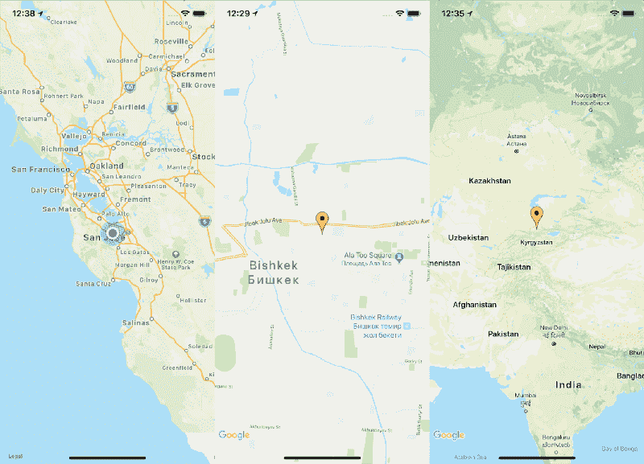

如今，几乎所有的移动应用程序都有地图功能。我必须将谷歌地图集成到我的 react 原生应用程序中，唯一的选择是 Airbnb 的 react-native-maps(这是唯一一个仍然受 React 原生社区支持的地图)。

我找到了几个关于如何设置这个库的教程，但是没有一个完全适合我。这是因为我必须在 iOS 和 Android 平台上运行，还必须支持 iOS 版谷歌地图。

让我们使用 **react-native-cli** 从头开始创建一个 React Native 应用程序，一步一步地展示所有东西是如何安装的。如果你想为你现有的应用集成 react-native-maps，跳过**步骤 1** 。

#### 步骤 1:安装和设置 React 本地应用程序

如果还没有安装 React 原生命令行界面，运行:`npm install -g react-native-cli`。现在您可以创建您的项目，只需使用:`react-native init ReactNativeMaps`

以下是构建此项目时的依赖项版本:

*   "反应":" 16.6.1 "
*   " react-native": "0.57.5 "
*   “react-native-maps”:“0 . 22 . 1”——我们稍后会安装这个。

现在，您可以尝试运行您的应用程序，`react-native run-ios`或`react-native run-android`。通常，这没有任何问题。

#### 步骤 2:添加并链接 react-native-maps 包

现在让我们安装 react-native-map: `npm install --save react-native-maps`在安装完这个包之后，你应该把它链接到你的本地应用:`react-native link react-native-maps`。

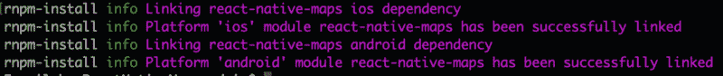

You also got this? Cool, now we can continue.

#### 第三步:设置苹果地图(iOS)

如果我们按平台分别设置的话会容易一些，所以先在 iOS 上做吧。在集成谷歌地图之前，我们将检查苹果地图是否正常工作。将以下代码添加到当前渲染组件中要渲染 MapView 的位置。

```
import MapView from 'react-native-maps'
```

```
export default class App extends Component<Props> {  render() {    return (      <MapView        style={{flex: 1}}        region={{          latitude: 42.882004,          longitude: 74.582748,          latitudeDelta: 0.0922,          longitudeDelta: 0.0421        }}        showsUserLocation={true}      />    );  }}
```

您可以测试您想要的任何位置，只需指定适当的纬度和经度。如您所见，我只需将`showUserLocation`属性添加到 MapView 组件就可以启用用户定位。如果你在真实设备上运行，你会看到你当前的位置。

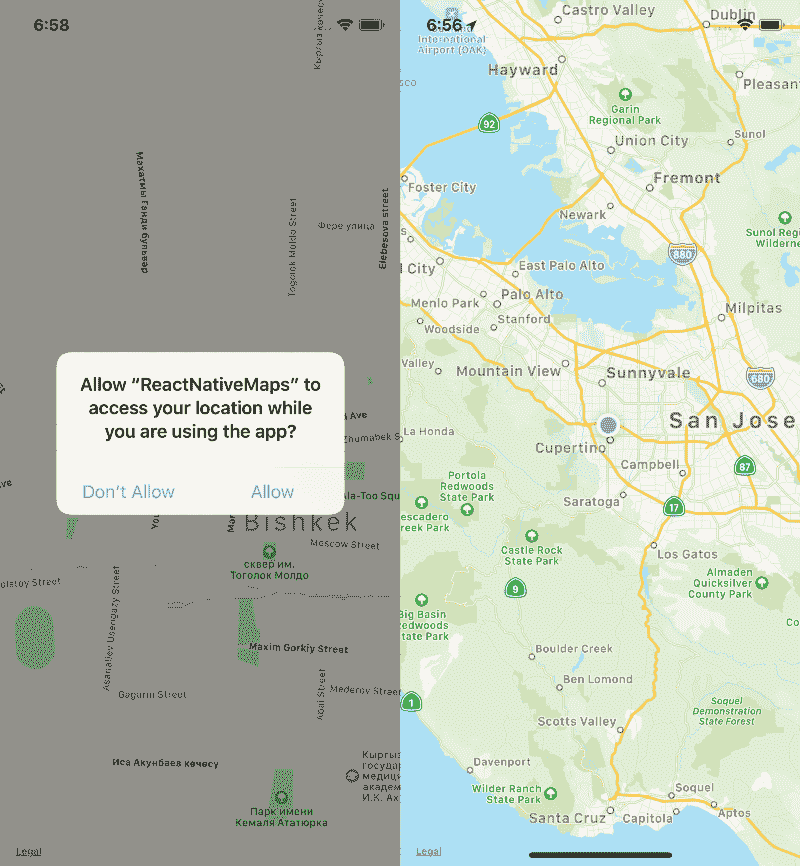

所以，如你所见，默认情况下苹果地图已经在工作了。不仅如此，如果您正确地链接了所有内容并启用了用户位置，它实际上为我们做了很多事情(带有默认消息的用户位置权限)。如果你来自原生 iOS 开发，那么你可能知道什么是 info.plist 文件。

#### 步骤 4:安装 Cocoapods 和“GoogleMaps”包(iOS)

苹果地图很简单，对吧？同意——让我们看看谷歌地图为我们提供了什么。我们必须为 iOS 安装谷歌地图 SDK。我们将使用椰子。如果你以前没用过，运行`sudo gem install cocoapods`。

现在您必须创建一个 Podfile，您将在其中指定您的 iOS 应用程序的依赖项。在 React 本地应用中导航到 iOS/文件夹并运行:`pod init`或者你可以使用`touch Podfile`你应该有类似这样的东西:

```
# platform :ios, '9.0'
```

```
target 'ReactNativeMaps' do
```

```
# Pods for ReactNativeMaps
```

```
pod 'GoogleMaps'
```

```
end
```

如你所见，我添加了 pod GoogleMaps，现在我们必须安装它。如果你还在 iOS/ folder 上，运行:`pod install`。如果您现在尝试运行它，您可能会得到一个错误:

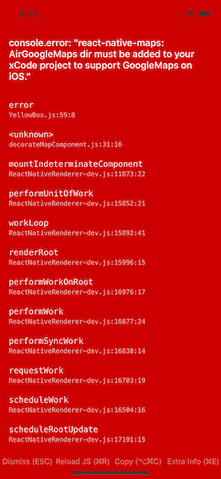

好吧，让我们做它想做的。现在我们应该打开 xCode 工作区。

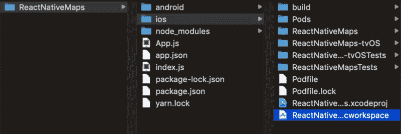

从 node_modules/导航到 AirGoogleMaps 文件夹

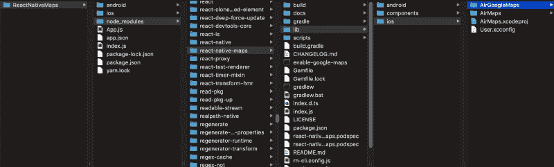

并将它拖到 xCode 项目的顶部

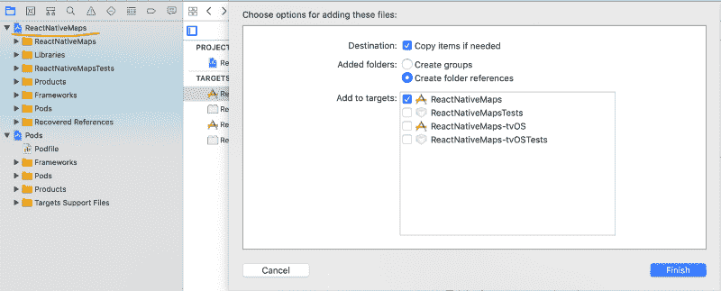

如果失败，请尝试构建您的 xCode 项目

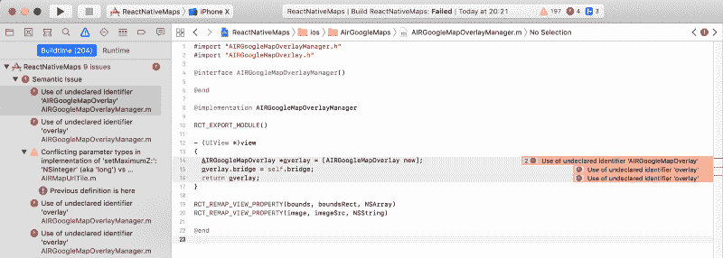

您应该添加`HAVE_GOOGLE_MAPS=1`预处理器宏来构建设置

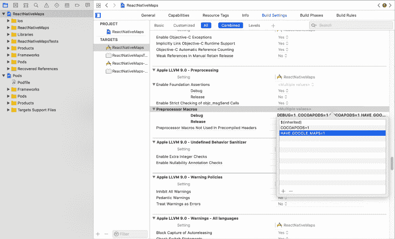

#### 第五步:获取谷歌地图 API 密钥，用谷歌地图运行 iOS 应用程序

所以现在我们要生成一个[**Google Maps API key**](https://developers.google.com/maps/documentation/ios-sdk/get-api-key)**。**

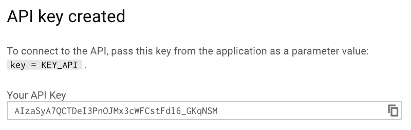

复制您的 API 密钥并添加到 AppDelegate.m 文件中。

`#import <GoogleMaps/GoogleMaps`。h >

`[GMSServices provideAPIKey:@"YOUR_API_KEY"]`

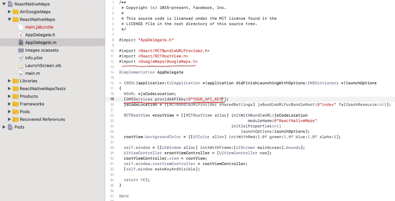

现在你可以告诉你的 MapView 组件你已经准备好使用谷歌地图了。

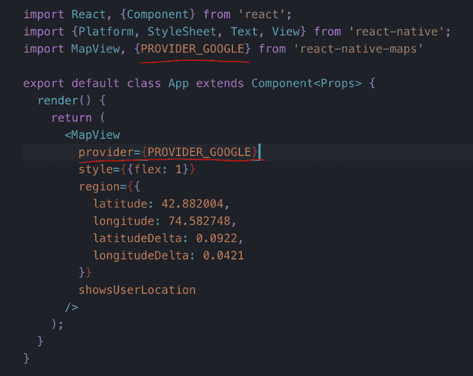

哦，是的，请运行你的 iOS 应用程序。你会得到谷歌地图。

我希望如此。

#### 第六步:现在让我们试试安卓系统

好了，现在我们可以退出 xCode，让我们试试`react-native run-android`。如果您得到与此相同的结果:


检查你的 android/app/build.gradle 文件。替换这个:

`compile project(':react-native-maps')`有了这个:

```
implementation(project(':react-native-maps')){        exclude group: 'com.google.android.gms', module: 'play-services-base'        exclude group: 'com.google.android.gms', module: 'play-services-maps'    }implementation 'com.google.android.gms:play-services-base:12.0.0'implementation 'com.google.android.gms:play-services-maps:12.0.0'
```

哦，别忘了给 AndroidManifest.xml 文件添加 API_KEY。

```
<application>   <meta-data      android:name="com.google.android.geo.API_KEY"      android:value="YOUR_API_KEY"/></application>
```

是的，现在你的应用可以在两个平台上运行。请查看[**react-native-maps**](https://github.com/react-community/react-native-maps/blob/master/README.md)repo，了解更多您可以使用 MapView 组件做的有趣事情。

#### 结论

希望我的第一篇关于媒体的文章对你有所帮助。请，如果你看到任何错误不要犹豫留下评论，我会感谢你的评论！