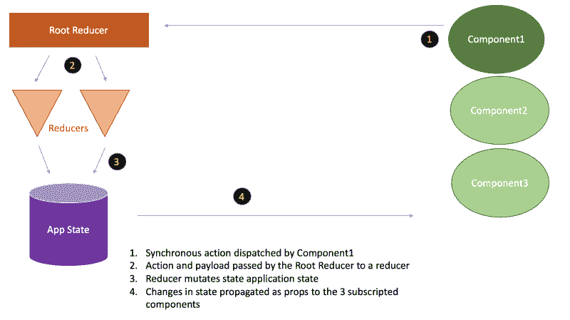
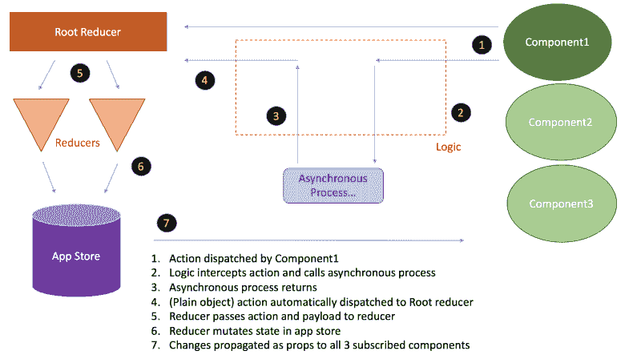
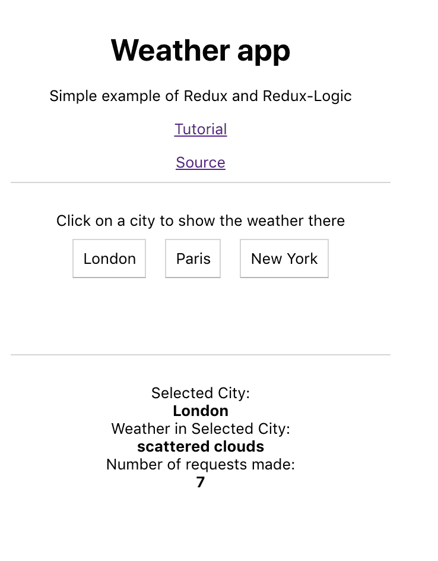
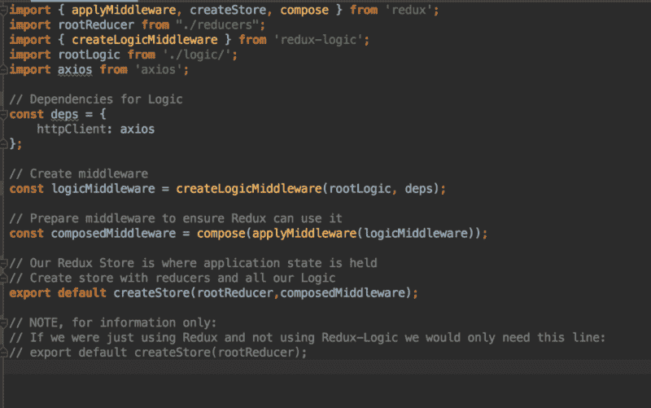
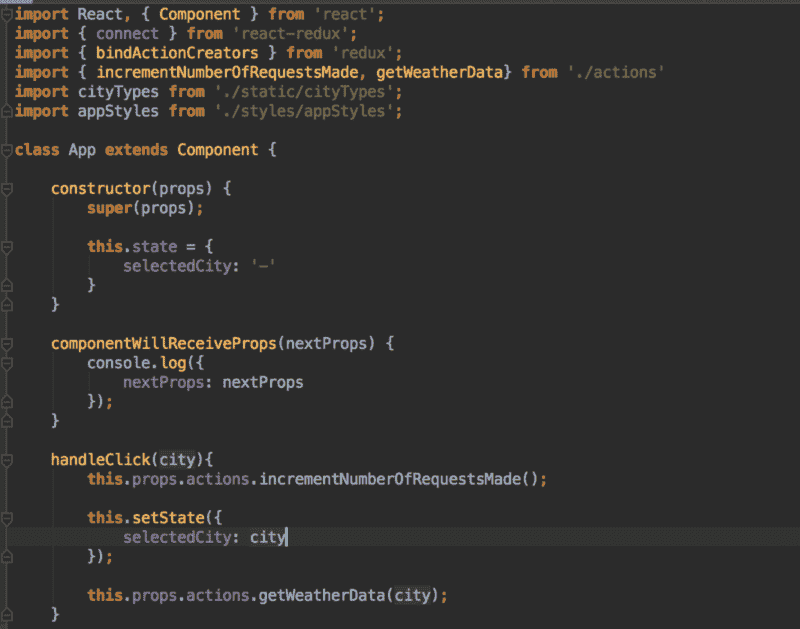
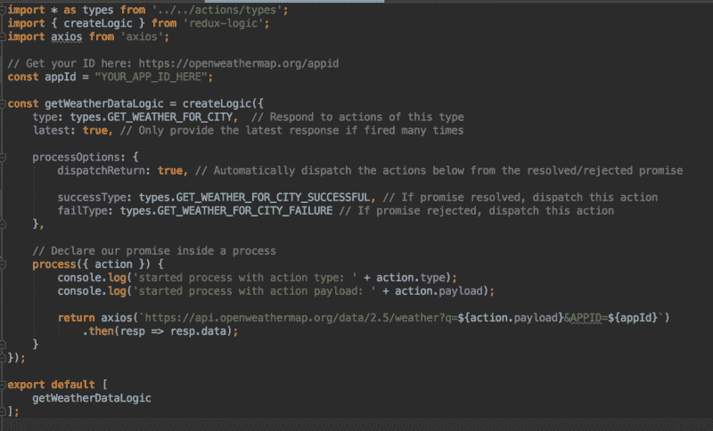
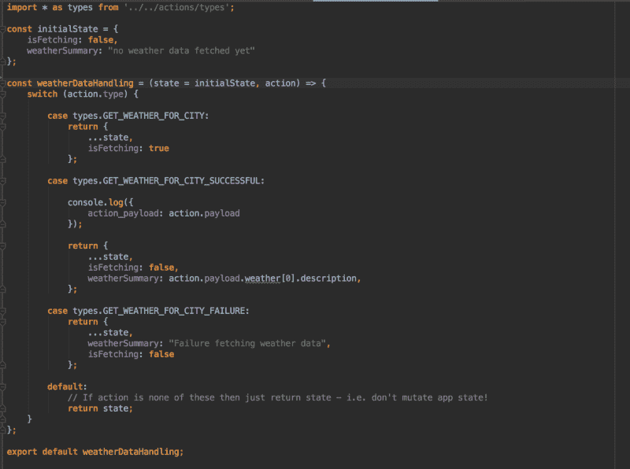

# 冗余逻辑导论

> 原文：<https://www.freecodecamp.org/news/introduction-to-redux-logic-2f01c97d6c52/>

山姆·奥拉森

# 冗余逻辑导论


Photo by [Helloquence](https://unsplash.com/photos/5fNmWej4tAA?utm_source=unsplash&utm_medium=referral&utm_content=creditCopyText) on [Unsplash](https://unsplash.com/search/photos/work?utm_source=unsplash&utm_medium=referral&utm_content=creditCopyText)

本文将对 [Redux-Logic](https://github.com/jeffbski/redux-logic) 进行一个高层次的概述。我们将看看它是什么，为什么需要它，它与其他 Redux 中间件有何不同，以及为什么我认为它是最佳选择。然后，我们将看到一个简单的[天气应用](https://github.com/SamOllason/weather-app-redux-logic-example)的例子，展示核心概念是如何付诸实践的。

本文假设您对 React 和 Redux 有很好的理解。

### **Redux 的快速复习**

Redux 是 JavaScript 应用程序的状态容器，通常与 React 一起使用。它为存储应用程序中使用的数据提供了一个中心位置。Redux 还提供了一个使**可预测**状态突变的框架。使用 Redux 可以更容易地编写、理解、调试和扩展数据驱动的动态应用程序。

在 Redux 中，组件调用**动作创建者**来分派**动作**。动作是(通常！)表达意图或指令的简单小物件。动作还可以包含“有效载荷”(即数据)。

应用程序状态由**还原器**管理。他们听起来比实际更复杂！根缩减器处理动作，然后将动作和有效负载传递给特定的缩减器。这个 reducer 将**获取应用程序状态的副本**，**变异** **，** **复制**(根据动作及其有效负载)，然后更新应用程序**存储库**中的状态。

### 为什么需要 Redux 逻辑？

默认情况下，Redux 中的所有动作都是同步调度的。这对于任何需要支持异步行为(比如从 API 获取数据)的应用程序来说都是一个挑战…几乎任何应用程序都是如此！

为了使用 Redux 处理异步行为，我们需要某种中间件[在动作被分派和动作到达 Redux 之间做一些处理。有几个流行的库可以提供这种功能。](https://en.wikipedia.org/wiki/Middleware)

在探索了各种选项之后，我已经在各种项目中使用 Redux-Logic 有一段时间了，并且发现它非常棒！

### **冗余逻辑生命周期**

Redux-Logic 提供了中间件，该中间件在从组件分派动作到动作到达缩减器之间执行一些处理。

我们使用 [redux-logic](https://github.com/jeffbski/redux-logic) 库来创建‘逻辑’。这些基本上是拦截特定的**普通对象**动作，执行异步处理，然后分派另一个**普通对象** t 动作的函数。正如我们将要看到的，逻辑函数确实是声明性的和灵活的！

这里需要注意的一点是，Redux-Logic 处理的所有动作都是普通对象。由 UI 组件调度的动作和由逻辑调度的动作将**总是**是一个普通的对象(例如，与函数相对)。当我们比较不同的中间件选项时，我们将在下面重新讨论这个问题。

在引擎盖下，Redux-Logic 使用“可观察”和反应式编程。[点击此处了解更多信息](https://github.com/jeffbski/redux-logic)。

### **数据流**

为了比较，下面是我创建的图表，显示了同步 redux 流程生命周期中的重要点。没有包括中间件(因为不需要！).



现在这里有一个图表，展示了使用 redux-logic 库来处理异步操作的项目的重要部分。这将有助于参考后面的例子。



您可以看到中间件是如何在一个动作被分派和一个缩减器处理之间运行的。

### 与其他解决方案的主要区别

Redux-Thunk 是 Redux 中间件的一个流行选择，它也允许您支持异步行为。为了使用 Redux-Thunk 处理异步行为，你的动作创建者必须**返回函数**，而不是使用 Redux-Logic 返回普通对象。我相信用 Redux-Logic 调度普通对象会使您的代码更容易编写和理解。

此外，我相信处理异步行为的“简单对象”方法更自然地适合(同步)Redux 架构的其余部分，这使得这个中间件更有机地适合 Redux。

另一个流行的 Redux 中间件是 [**Redux-Saga**](https://redux-saga.js.org/docs/introduction/BeginnerTutorial.html) 。当我看到这个选项时，我发现理解 sagas(一个相对较新的 ES6 特性)的学习曲线非常陡峭。如果您想将这个库引入到一个由几个人组成的团队管理的应用程序中，这将会很复杂。此外，我认为如果它们没有得到很好的管理，那么与你用 redux-logic 创建的逻辑相比，sagas 可以创建看起来复杂的代码。这可能会影响开发速度和代码的可维护性。

### **示例概述**

下面是来自一个简单的 React 应用程序的简单片段，该应用程序可以获取一个城市的当前天气状况并呈现给用户。该示例使用 Redux-Logic 来支持异步行为，以使用免费的 [OpenWeatherMap](https://openweathermap.org/api) API 来获取数据。

为了比较，我包含了一个同步 Redux 进程，显示用户发出的请求数量。

[这里的](https://github.com/SamOllason/weather-app-redux-logic-example)是源代码。



### 设置开发环境

这些是我在开始创建应用程序时运行的命令:

```
npx create-react-app appnpm install --save reduxnpm install --save react-reduxnpm install --save redux-logicnpm install --save axios
```

要查看应用程序:

```
npm start
```

很高兴我可以在 *localhost:3000* 看到默认的 Create React 应用主页，然后我开始写一些代码！

下面的代码片段展示了将 Redux-Logic 集成到项目中的要点。

### 向我们的 Redux 商店添加中间件

在 *appStore.js* 中，如果我们没有使用任何中间件，我们通常只会向 createStore 方法提供我们的根 reducer。这是我们将 Redux-Logic 中间件链接到应用程序其余部分的地方。

我们指定希望使用 *axios* 作为我们的客户端来发出 HTTP 请求。

然后我们使用 redux-logic 中的一个方法来创建我们的中间件，最后我们将它作为一个参数添加到 createStore 方法中。这意味着我们的 Redux 代码将能够访问我们的中间件。太好了！



appStore.js — used to create our Store and integrate our Logic

### 调度异步操作

使用 Redux-Logic，触发异步行为的动作以与触发同步状态更新的动作相同的方式被分派。没有什么不同！

为了完整起见，您可以在下面看到，当用户点击一个按钮时，我们调用一个动作创建器，它已经作为道具传递给我们的组件。



### 拦截异步操作

这是我们第一次看到 redux-logic 中间件发挥作用的地方。我们使用 redux-logic 库来创建一些“逻辑”来拦截指定的动作。

在我们的逻辑属性中，我们告诉 redux-logic 我们希望它拦截哪个动作。我们指定我们希望 redux-logic 只提供来自组件调度的这种类型的最后一个动作的数据。在我们的例子中，如果人们持续点击一个按钮，这种声明性行为是有用的，因为他们将从最近一次发送的动作中获得值，而不一定是最后一次返回的承诺！

接下来，我们指定当异步流程返回时，我们**立即** **分派**两个动作中的一个。如果承诺返回成功，我们返回一个*GET _ WEATHER _ FOR _ CITY _ SUCCESSFUL*动作。这就是我们想要的！

或者，如果返回的承诺被拒绝，那么我们发送*GET _ WEATHER _ FOR _ CITY _ FAILURE*。

**这就是 redux-logic 真正大放异彩的地方**。逻辑代码的意图很清楚，发出的是易于阅读和解释的简单对象！我发现这真的很容易阅读，理解和调试。

在底部，我们清楚地表明了我们希望异步流程做什么。我们想要返回一个承诺的值。请注意我们是如何将动作附带的有效载荷传入 URL 的。



### 处理异步操作

您可以从*weatherdatahandling . js*reducer 中看到，从我们的逻辑分派的动作被视为普通的对象动作。减速器以与同步动作相同的方式在**中改变状态。所以下面的截图就是你之前和 Redux 合作时所期待的。超级！**



### 摘要

Redux 是 JavaScript 应用程序的一个流行的可预测状态容器。默认情况下，所有 Redux 动作只支持同步行为，对于异步行为，您将需要某种中间件解决方案。

Redux-Logic 提供了一个**清晰的**和**强大的**中间件，允许您在 Redux 应用程序中使用异步操作。您将中间件添加到 Redux **存储库**中，以允许您的应用程序使用 Redux-Logic。您使用 [redux-logic](https://github.com/jeffbski/redux-logic) 库来创建**逻辑**，它拦截特定的动作，并在一些异步处理(比如从 API 获取数据)完成后分派进一步的动作。

所有涉及的动作都是**普通对象**动作。我相信与其他解决方案相比，这使得**更容易编写**，而**更容易理解**。此外，redux-logic 感觉更像是 redux 架构的其他部分的有机组合。

感谢阅读，我欢迎下面的任何评论或问题！