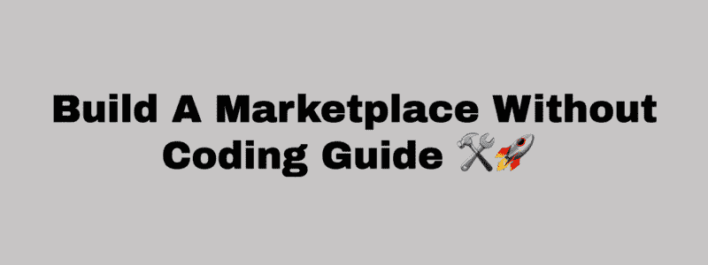

# 没有软件开发技能，如何从 idea 到 live marketplace MVP？️?

> 原文：<https://www.freecodecamp.org/news/how-to-go-from-idea-to-live-marketplace-mvp-with-no-software-development-skills-289ceae4226a/>

作者:迈克·威廉姆斯

# 没有软件开发技能，如何从 idea 到 live marketplace MVP？️?

Airbnb、Turo、Hipcamp、Grailed 和其他在线市场表明，共享经济可以释放宝贵的资产，进而创造大规模的市场业务。但在过去，市场通常很难建立和启动。

在本文中，我将带您通过使用市场平台解决方案，将您的市场理念逐步转化为 MVP。如果您没有编码技能，我们将消除在构建和启动市场时面临的一些限制。

*请注意，这也是一个视频格式的帖子。我发现尽可能具体的最好方法是从头到尾直接分享整个过程，并使用一个真实的例子。*

#### 目录:

*   介绍
*   第 1 部分:基本市场设置
*   第 2 部分:特定于您的概念和市场需求的市场配置
*   第 3 部分:最终市场配置、外部测试准备和发布！
*   资源:其他 Sharetribe 市场示例

#### 介绍

在我们开始之前，值得一提的是，在选择构建市场的正确方式(软件平台解决方案、技术堆栈、工具等)和方法时，有许多选项可供选择。还有许多考虑因素，也可能是针对您和您的市场概念的。

为了让这一点普遍适用于那些希望在没有编码的情况下将他们的想法带到市场 MVP 的人，我将使用 [Sharetribe 的](http://bit.ly/2gXICOV)交钥匙市场平台解决方案，他们称之为 [Sharetribe GO](http://bit.ly/2gXICOV) 。我认为这是一个不需要编码或软件开发技能就能将想法推向市场 MVP 的好方法。

我使用 [Sharetribe](http://bit.ly/2gXICOV) 和他们的各种市场解决方案已经有几年了，并且有丰富的使用经验。我甚至对它进行了定制，以满足我的特定市场需求，因为我建立和推出的市场已经扩大了规模(特别是[工作室](http://www.studiotime.io))。

*你可以在[这里](https://hackernoon.com/sharing-economy-scaled-to-hundreds-of-users-in-hours-70e4b8cc72eb)阅读更多关于我如何在一个晚上建立并启动 Studiotime 的故事。它现在是世界上最大的在线音乐工作室预订市场，遍布 35 个以上的国家！*

#### 第 1 部分:注册 Sharetribe 和基本市场设置

如上所述，我们将使用 [Sharetribe GO](http://bit.ly/2gXICOV) ，这是他们托管的市场平台。这是一个交钥匙市场解决方案，涵盖产品和商品、服务、空间和其他市场类型。

使用下面的视频，我们将继续浏览注册过程([此处为](http://bit.ly/2gXICOV))，以建立我们租赁音乐工作室的演示市场。

#### 第 2 部分:特定于您的概念和市场需求的市场配置

#### 第 3 部分:最终市场配置、外部测试准备和发布！

#### 资源:其他 Sharetribe 市场 MVP 示例

希望你发现这个指南和上面分享的所有资源是有用的！如果你在建立自己的市场时有任何具体问题，你可以在 Twitter 上发给我(我是 [@Yoroomie](https://twitter.com/yoroomie) )，我会很快回复。

你也可以查看我的 YouTube 频道,里面有更多的教程、操作视频，以及对建立、启动和扩展市场的见解。