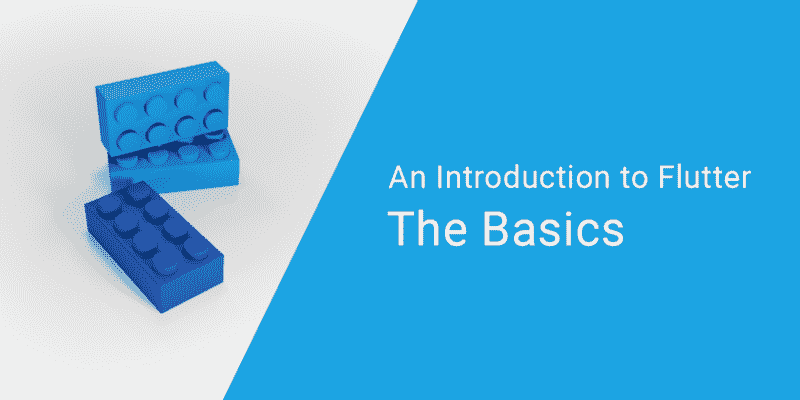
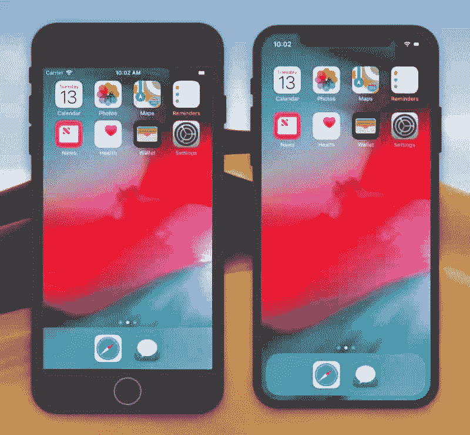
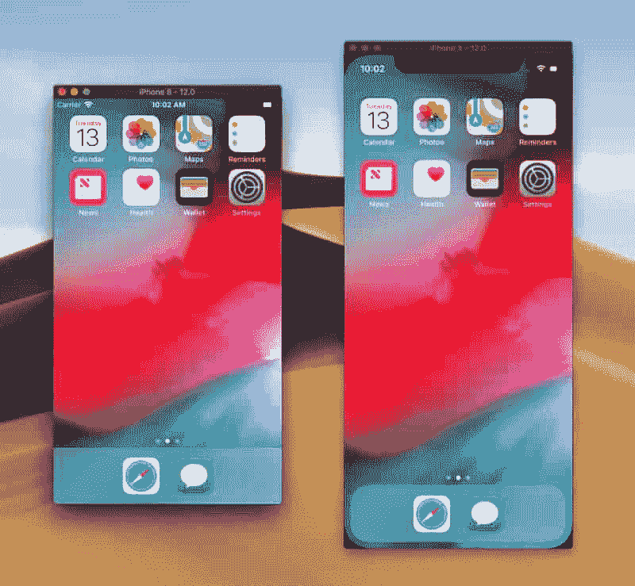
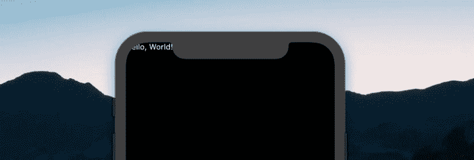
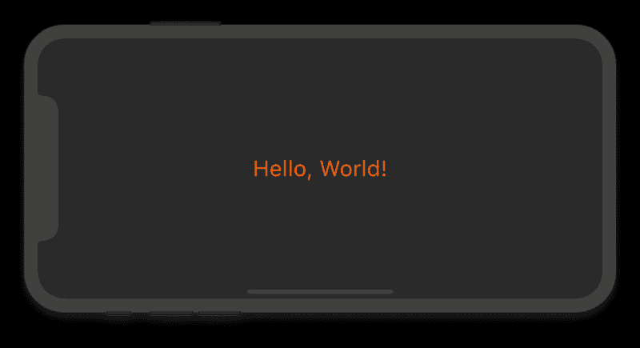
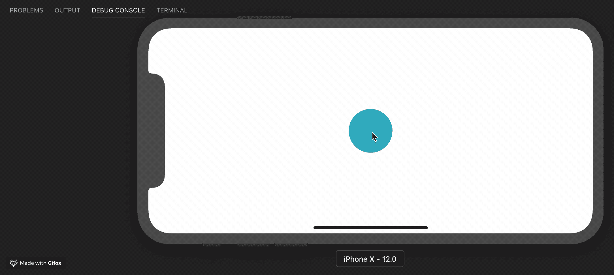
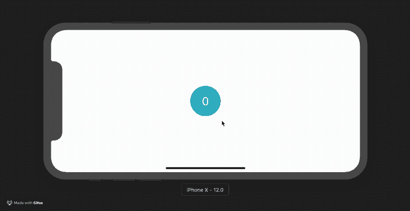

# 颤振介绍:基础知识

> 原文：<https://www.freecodecamp.org/news/an-introduction-to-flutter-the-basics-9fe541fd39e2/>

斯坦尼斯拉夫·赫莫萨

# 颤振介绍:基础知识



我一直听说 Flutter 有多神奇，我决定尝试一下，学习一些新的东西。我希望有更多的话题与同事们讨论。

最开始是看，然后看，然后我开始编码。这是一次很好的经历。应用程序正在运行，编写的所有内容都不难理解。

然而，这个过程还不够顺利——有些细节在参考资料中没有解释。此外，由于一切对我来说都是新的(平台本身、编程语言、方法甚至移动应用程序开发)，缺乏这些细节是令人痛苦的。

任何时候有东西不工作，我不知道谷歌什么:飞镖，颤振，窗口，屏幕，路线，部件？

我认为阅读 Dart、Flutter 及其所有小部件的文档不是一个好主意，因为这太费时间了。此外，我没有很多时间，因为我的目的是了解新事物，而不是成为该领域的专家。我当时想，如果有一个关于 Flutter 的简短指南，能够描述理解框架的所有必要概念，并能够编写简单的应用程序，那就太棒了，但仅此而已！

#### 关于指南

大部分关于这个话题的文章都写得很好，很直白。问题是它们要求你知道一些基本的东西，而那些小东西在应该给你基本知识的文章中没有描述。

在本系列中，我将尽量避免这个问题。我们将从头开始，创建应用程序，整理我们所做的每一步。在这个系列中，我们将使用**所有基本的小部件**，设计**一个独特的界面**，与**原生模块**交互，并为 iOS 和 Android 平台**构建我们的应用**。

这个系列是从一个 web 开发人员的角度来写的。你们大多数人可能对这个堆栈很熟悉。与一个熟悉的平台的类比比你必须建造房子或使用动物、狗、食物、酒吧等的平台要好。

为了节省你的时间，我长话短说。对于你们中最好奇的人，我会在文本周围放上有用的链接。

#### 关于平台

Flutter 非常新，但却是一个有前途的平台，它已经吸引了已经发布应用程序的大公司的注意。它之所以有趣，是因为它比开发 web 应用程序简单，也因为它比本地应用程序快。

颤振方面的高性能和生产率是通过使用几种技术来实现的:

*   与许多其他流行的移动平台不同，Flutter **不以任何方式使用 JavaScript**。Dart 是一种编程语言。它编译成二进制代码，这就是为什么它能以 Objective-C、Swift、Java 或 Kotlin 的本机性能运行。
*   Flutter **不使用原生 UI 组件**。一开始听起来可能有点尴尬。但是，因为组件是在 Flutter 本身中实现的，所以在视图和代码之间没有通信层。正因如此，游戏在智能手机中达到了图形的最佳速度。所以按钮、文本、媒体元素、背景都是由 Flutter 的图形引擎绘制的。题外话，需要提到的是，Flutter“Hello，World”应用的捆绑包相当小:iOS ≈ 2.5Mb，Android ≈ 4Mb。
*   Flutter **使用声明式方法**，受 React web 框架的启发，基于小部件(在 web 世界中称为“组件”)构建其 UI。为了从窗口小部件中获得更多，它们只在必要的时候才被渲染**，通常是在它们的状态被改变的时候(就像虚拟 DOM 为我们做的那样)。**
*   **除了以上所有这些，框架还集成了**热重装**，这对于 web 来说很典型，但是在本地平台上仍然没有。这允许 Flutter 框架自动重建部件树，允许您快速查看更改的效果。**

**有一篇关于这些特性实际应用的优秀文章，作者是一位 Android 开发人员，他从 Java 到 Dart 重新创建了他的[应用程序，并分享了他的印象。](https://proandroiddev.com/why-flutter-will-change-mobile-development-for-the-best-c249f71fa63c)**

**我想和你分享一些他文章中的数字。**

*   **Java (之前):文件数= 179，代码行数 12176**
*   ****Dart** (之后):文件数= 31，代码行数 1735。**

**你可以阅读更多关于平台的[技术细节或者看看](https://flutter.io/docs/resources/inside-flutter)的[应用实例。](https://itsallwidgets.com/)**

#### **关于 Dart**

**Dart 是一种编程语言，我们将用它来开发我们在 Flutter 中的应用程序。如果你有 Java 或 JavaScript 的经验，学习它并不难。你会很快明白的。**

**我试图为您写一篇关于 Dart 的文章，描述 Flutter 所需的最小范围。几次尝试之后，我还是没能写出一篇短小精悍，同时涵盖核心概念的文章。Dart 语言之旅的作者们很好地处理了这个任务！**

#### **初始设置**

**这个话题，就像飞镖一样，在官方指南中有很好的涵盖——所以我在这里就不复制了。**

**通过选择您的操作系统并一步一步地遵循它，浏览这个简短的[设置指南](https://flutter.io/docs/get-started/install)。另外，[配置你喜欢的编辑器](https://flutter.io/docs/get-started/editor?tab=vscode)来处理 Dart 和 Flutter(通常它需要 2 个不同的插件)。[运行您的应用程序](https://flutter.io/docs/get-started/test-drive?ide=vscode)以确保您准备好继续。**

**这里给 MacOS 用户一个提示。如果你不喜欢虚拟设备挡板浪费了太多空间，你可以关闭它们，并切换到 iPhone 8 型号(它没有 iPhone X 长):**

*   **硬件→设备→ iOS # → iPhone 8**
*   **窗口→显示设备挡板**

**没有虚拟按键也可以生活，因为我们有热键: **Shift + Cmd** (⌘) **+ H** -回家， **Cmd (** ⌘) **+ Right -** 旋转手机，你可以在硬件菜单中找到更多。我还建议打开屏幕键盘，因为了解当一半屏幕重叠时你的应用程序是否可用是很重要的。为此，在你聚焦于一个输入域后，你按下 **Cmd (** ⌘ **) + K** 。**

******

iPhone 8 & iPhone X with and without bezels** 

#### **项目结构**

**让我们先看看由 Flutter 框架生成的项目中有什么:**

*   ****lib/** -就像 [pub](https://www.dartlang.org/guides/libraries/create-library-packages) (Dart 的包管理器)，所有的代码都会在这里**
*   ****pub spec . yml**——存储运行应用程序所需的包列表，就像 **package.json** 做的那样。你应该记住，在 Flutter 项目中，你不能直接使用 pub，而是使用 Flutter 命令:`flutter pub get <package_na` me >**
*   **我相信你知道这是怎么回事。对吗？你可以通过颤振测试来运行它们**
*   ****IOs/**&**【Android/**-特定于每个平台的代码，包括应用程序图标和设置，您可以在其中设置应用程序所需的权限(如访问位置、蓝牙)。**

**我们暂时不需要了解文件夹中文件的更多信息。让我们打开 **lib/** 文件夹，那里有 **main.dart** 在等着我们。正如您所猜测的，这是我们应用程序的入口点。就像在 C 语言(或其他许多语言)中一样，这个应用程序将通过调用 main()函数来执行。**

#### **关于 widgets (Hello World 在这里)**

**在 Flutter 中，一切都是建立在小部件上的。UI 元素、样式、主题甚至状态都在特定的小部件中进行管理。先从一个小应用说起。**

**用下面给出的代码替换 **main.dart** 中的代码，阅读注释，然后运行应用程序。**

```
`import 'package:flutter/widgets.dart'; // basic set of widgets

// When Dart is running the application, it calls to the main() function
main() => runApp( // The function runApp() starts the Flutter application
  Text( // this is a widget, it renders the given text (think of it like a <span>)
    'Hello, World!!!', // the first argument is a text that needs to be rendered
    textDirection: TextDirection.ltr, // here we set the direction "left to right"
  ),
);`
```

**main.dart**

****runApp(…)** 只有一个 widget 参数。该小部件将成为整个应用程序的根小部件。顺便说一句，热重载不能改变根部件，所以你必须重启应用程序才能看到改变。**

**[**文本(……)**](https://docs.flutter.io/flutter/widgets/Text-class.html)-如果不知道文本方向的偏好，Flutter 无法渲染文本。为了渲染文本，我们必须设置**。不要将其与 CSS [**文本对齐**](https://developer.mozilla.org/en-US/docs/Web/CSS/text-align) 规则混淆。它是 [**方向**](https://developer.mozilla.org/en-US/docs/Web/CSS/direction) 的类比——国际化 API 的一部分。然而，不要担心，我们不需要为每个**文本**小部件设置它——稍后我们将看到如何为整个应用程序设置它。****

**您的应用程序已经在运行了吗？耶！“你好，世界！”现在在屏幕上。对吗？呃，出了点问题。**

**

Content overlapped by the iPhone notch** 

**文本被缺口覆盖。我们可以将整个屏幕用于我们的应用程序，我们将内容打印在它的最上面，系统信息也呈现在那里。**

**让我们试着改变我们的内容。**

```
`import 'package:flutter/widgets.dart';

main() => runApp(
  Center( // The widget that aligns content in the center
    child: Text(
      'Hello, World!',
      textDirection: TextDirection.ltr,
    ),
  ),
);`
```

**main.dart**

****Center(…)** 是将**子**属性中给定的另一个小部件对齐到自身中心的小部件。你会经常在 Flutter 应用程序中看到**子**和**子**属性，因为几乎所有的小部件都在使用它们，如果它们需要一个或几个小部件在其中呈现的话。**

**Flutter 中的小部件组合用于表示界面、改变外观和共享数据。例如， **Directionality(…)** 为所有嵌套的小部件设置文本的方向(所以我们不需要每次都为**文本**指定方向)。**

```
`import 'package:flutter/widgets.dart';

main() => runApp(
  Directionality(
    textDirection: TextDirection.ltr,
    child: Center(
      child: Text('Hello, World!'),
    ),
  ),
);`
```

**main.dart**

**让我们来看看一个非常重要的小部件，并改变我们的应用程序的设计:**

```
`import 'package:flutter/widgets.dart';

main() => runApp(
  Directionality(
    textDirection: TextDirection.ltr,
    child: Container( // the new widget! It is <div> for the Flutter's world
      // For [Container], property [color] means the color of the background
      color: Color(0xFF444444),
      child: Center(
        child: Text(
          'Hello, World!',
          style: TextStyle( // we use the [TextStyle] widget to customize text
            color: Color(0xFFFD620A), // set the color
            fontSize: 32.0, // and the font size
          ),
        ),
      ),
    ),
  ),
);`
```

**main.dart**

**

Hello World application done with Flutter** 

**关于如何使用**颜色(…)** 小工具，在[上有几个选项。我们使用了这个小部件，它的编号是用十六进制表示法给定的。这看起来几乎和我们在网页上设置的十六进制颜色一样，但是在这里我们有两个额外的符号。这是一个表示透明度的数字，其中 0x00 是完全透明的，0xFF 是完全不透明的。](https://docs.flutter.io/flutter/dart-ui/Color-class.html)**

**[**text style(……)**](https://docs.flutter.io/flutter/dart-ui/TextStyle/TextStyle.html)更有趣。您可以使用它来设置颜色、字体大小和粗细、行距、文本下划线等。**

**颤振应用完成！你可以阅读如何为 [Android](https://flutter.io/docs/deployment/android) 和 [iOS](https://flutter.io/docs/deployment/ios) 构建它，在那里你也可以学习如何将它发布到相关的应用商店。如果这对你来说还不够，我在下面介绍了几个话题。**

#### **关于无状态小部件**

**现在我们知道使用小部件有多简单了。下一个合乎逻辑的步骤是创建我们的小部件。我之前提到过有两种小部件(实际上更多，但是现在不要让它过于复杂)。有无状态和有状态的小部件。**

**在前面的例子中，我们一直在使用无状态小部件。“无国籍”并不意味着他们根本没有国家。小部件是 Dart 类，可以用属性声明。但是在无状态小部件中更改这些属性不会影响已经呈现的内容。更新有状态小部件的属性将触发生命周期挂钩，并使用新状态呈现其内容。我们将从无状态小部件开始，因为它们看起来更容易一些。**

**要创建一个，我们需要:**

1.  **新类的美丽名字。**
2.  **从 **StatelessWidget** 扩展我们的类。**
3.  **实现 **build()** 方法，该方法将接收一个类型为 **BuildContext** 的参数，并返回一个类型为 **Widget** 的结果。**

```
`import 'package:flutter/widgets.dart';

main() => runApp(
  Directionality(
    textDirection: TextDirection.ltr,
    child: Center(
      child: MyStatelessWidget()
    ),
  ),
);

class MyStatelessWidget extends StatelessWidget {
  // @override annotation is needed for optimization, by using it
  // we say that we don't need the same method from the parent class
  // so the compiler can drop it
  @override
  Widget build(BuildContext context) { // I'll describe [context] later
    return Text('Hello!');
  }
}`
```

**main.dart**

**带有参数的小部件示例:**

```
`// …

class MyStatelessWidget extends StatelessWidget {
  // All properties of the Stateless widget must be declared with final or const keyword
  final String name; // usual class property
  MyStatelessWidget(this.name); // usual class constructor

  @override
  Widget build(BuildContext context) { // it is yet to early to describe [context]
    return Text('Hello, $name!');
  }
}`
```

**main.dart**

**关于无状态小部件，我没有更多要补充的了。它们很简单。**

#### **关于热重装**

**请注意，一旦我们将应用程序内容移动到单独的小部件中，应用程序就会在我们每次保存更改时重新呈现。这是热装弹。**

**理解这一点也很重要，当您在开发模式下启用热重载时，应用程序的运行速度会比在发布模式下慢得多。**

#### **关于手势检测器**

**

GestureDetector widget handling a Tap action** 

**我们将在下一节创建 StatefulWidget。为了确保有趣，我们需要能够改变小部件的状态，对吗？为此，我们将使用[**(…)**](https://docs.flutter.io/flutter/widgets/GestureDetector-class.html)。这个小部件不会在屏幕上呈现任何东西，但是会处理用户与屏幕的交互，并调用相关的函数。**

**以下示例在屏幕中央创建了一个蓝色按钮，一旦按下该按钮，文本将打印到终端:**

```
`import 'package:flutter/widgets.dart';

main() => runApp(
  Directionality(
    textDirection: TextDirection.ltr,
    child: Container(
      color: Color(0xFFFFFFFF),
      child: App(),
    ),
  ),
);

class App extends StatelessWidget {
  @override
  Widget build(BuildContext context) {
    return Center(
      child: GestureDetector( // just a normal widget
        onTap: () { // one of the [GestureDetector] properties
          // This function will be called when child widget is pressed
          print('You pressed me');
        },
        child: Container( // the [Container] will represent our button
          decoration: BoxDecoration( // this is how you style the [Container]
            shape: BoxShape.circle, // change its shape from rectangular to circular
            color: Color(0xFF17A2B8), // and paint it in blue
          ),
          width: 80.0,
          height: 80.0,
        ),
      ),
    );
  }
}`
```

**main.dart**

**按下按钮，消息将被打印到终端。再按一次，文字又会出现。**

#### **关于有状态小部件**

**StatefulWidget 很简单。是啊，比**的无状态小工具**还要简单！然而，有一个细微的差别。它们不是独立存在的。它们需要一个额外的类来存储小部件的状态。此外，小部件的可视部分成为它的状态。**

**下面是 **StatefulWidget** 类的例子:**

```
`// …

class Counter extends StatefulWidget {
  // The state is stored not in the widget, but in the specific class
  // that is created by createState()
  @override
  State<Counter> createState() => _CounterState();
  // The result of the function is an object, that must be
  // of the type State<Counter> (where Counter is the name of our widget)
}`
```

**main.dart**

**我们创建了一个“空”小部件，它只实现了一种方法，不包含状态或 UI 表示。强迫这种分离，颤振寻求更大的应用优化。**

**状态对象也不复杂。的确，它就像我们的 **StatelessWidget** 。主要区别是它的父类。**

```
`// …

class _CounterState extends State<Counter> {
  // Finally, we can declare dynamic variables inside of our classes,
  // to store the state of our widgets

  // In this case, we'll store the number
  int counter = 0;

  // The rest is super simple, we just implement the familiar to us build() method,
  // in the same way as we did it for our [StatelessWidget]
  @override
  Widget build(BuildContext context) {
    // Almost nothing has changed since the last example.
    // I've added comments to highlight the difference
    return Center(
      child: GestureDetector(
        onTap: () {
          // Once the button is tapped we increase the value of [counter] variable
          setState(() {
            // Using setState() is required to trigger lifecycle hooks
            // so the widget will know that it should be updated
            ++counter;
          });
        },
        child: Container(
          decoration: BoxDecoration(
            shape: BoxShape.circle,
            color: Color(0xFF17A2B8),
          ),
          width: 80.0,
          child: Center(
            child: Text( // here we print the value of the [counter]
              '$counter', // to see how it changes
              style: TextStyle(fontSize: 30.0),
            ),
          ),
        ),
      ),
    );
  }
}`
```

**main.dart**

**

Counter application built using primitive Flutter widgets** 

**我以下划线开始命名我们的 state 类。在 Dart 语言中，所有以下划线开头的名字都是私有的(与 JavaScript 或 Python 不同，它们在库之外是不可用的)。通常，我们不需要在库之外公开我们的状态类，所以保持它们私有是一个好的做法。**

**我们已经构建了如此出色的应用程序。伟大的结果！**

**在结束这一部分之前，让我们来看看几个更有趣的小部件。这次我们一次写更多的代码，我不会解释每一行。您可能已经理解了大部分代码:**

```
`import 'package:flutter/widgets.dart';

main() => runApp(App());

class App extends StatelessWidget {
  @override
  Widget build(BuildContext context) {
    return Directionality(
      textDirection: TextDirection.ltr,
      child: Container(
        padding: EdgeInsets.symmetric(
          vertical: 60.0,
          horizontal: 80.0,
        ),
        color: Color(0xFFFFFFFF),
        child: Content(),
      ),
    );
  }
}

class Content extends StatelessWidget {
  @override
  Widget build(BuildContext context) {
    return Column(
      children: [
        Counter('Manchester United'),
        Counter('Juventus'),
      ],
    );
  }
}

class Counter extends StatefulWidget {
  final String _name;
  Counter(this._name);

  @override
  State<Counter> createState() => _CounterState();
}

class _CounterState extends State<Counter> {
  int count = 0;

  @override
  Widget build(BuildContext context) {
    return Container(
      margin: EdgeInsets.only(bottom: 10.0),
      padding: EdgeInsets.all(4.0),
      decoration: BoxDecoration(
        border: Border.all(color: Color(0xFFFD6A02)),
        borderRadius: BorderRadius.circular(4.0),
      ),
      child: Row(
        mainAxisAlignment: MainAxisAlignment.spaceBetween,
        children: [
          // [widget] is the property of the State class that stores
          // the instance of the [StatefulWidget] ([Counter] in our case)
          _CounterLabel(widget._name),
          _CounterButton(
            count,
            onPressed: () {
              setState(() {
                ++count;
              });
            },
          ),
        ],
      ),
    );
  }
}

class _CounterLabel extends StatelessWidget {
  static const textStyle = TextStyle(
    color: Color(0xFF000000),
    fontSize: 26.0,
  );

  final String _label;
  _CounterLabel(this._label);

  @override
  Widget build(BuildContext context) {
    return Text(
      _label,
      style: _CounterLabel.textStyle,
    );
  }
}

class _CounterButton extends StatelessWidget {
  final count;
  final onPressed;
  _CounterButton(this.count, {@required this.onPressed});

  @override
  Widget build(BuildContext context) {
    return GestureDetector(
      onTap: onPressed,
      child: Container(
        padding: EdgeInsets.symmetric(horizontal: 6.0),
        decoration: BoxDecoration(
          color: Color(0xFFFD6A02),
          borderRadius: BorderRadius.circular(4.0),
        ),
        child: Center(
          child: Text(
            '$count',
            style: TextStyle(fontSize: 20.0),
          ),
        ),
      ),
    );
  }
}`
```

**main.dart**

**

Using composition of widgets for counter application** 

**所以我们使用了两个新的小部件: [**列()**](https://docs.flutter.io/flutter/widgets/Column-class.html) 和 [**行()**](https://docs.flutter.io/flutter/widgets/Row-class.html) 。不难猜到他们的目的是什么。**

**在下一篇文章中，我们将更精确地研究它们。我们还将学习如何组装几个小部件，并使用 Flutter 的素材库创建一个性感的应用程序。**

#### **额外资源**

**如果您希望了解更多关于上述主题的信息，这里列出了一些有趣的链接:**

*   **[https://flutter.io/docs/get-started/flutter-for/web-devs](https://flutter.io/docs/get-started/flutter-for/web-devs)**
*   **使用 [VS 代码](https://flutter.io/docs/development/tools/ide/vs-code)和 [IntelliJ](https://flutter.io/docs/development/tools/ide/android-studio) 进行编码**
*   **[关于小工具的更多详情](https://flutter.io/docs/development/ui/widgets-intro)**
*   **阅读[热重装](https://flutter.io/docs/development/tools/hot-reload)也很重要，可以了解你的应用程序何时以及为什么不能自动更新。**