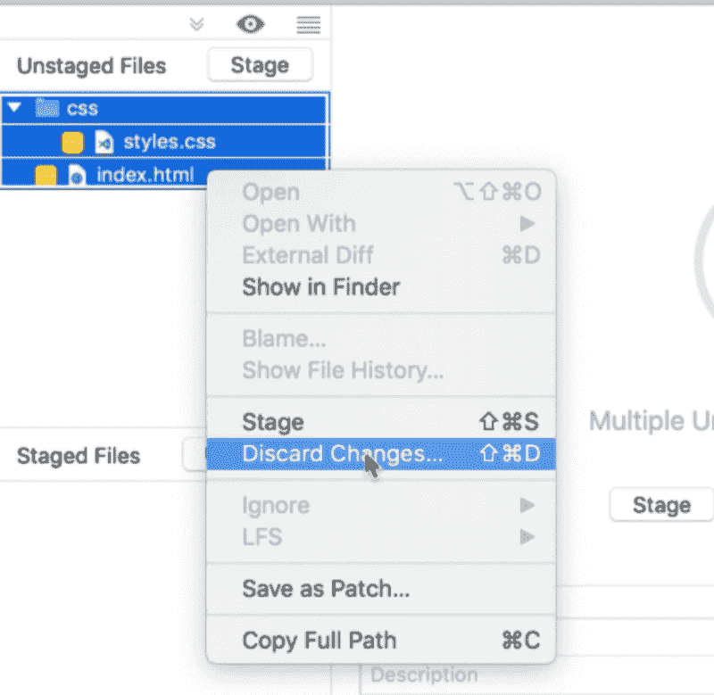
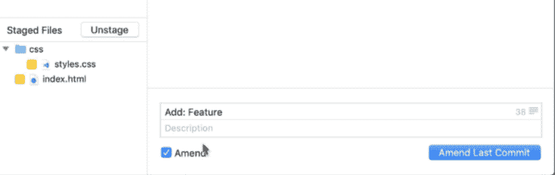
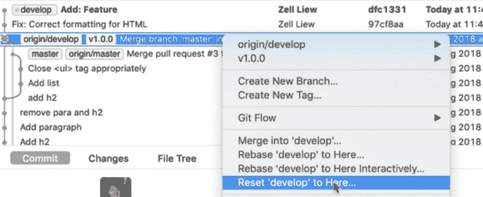
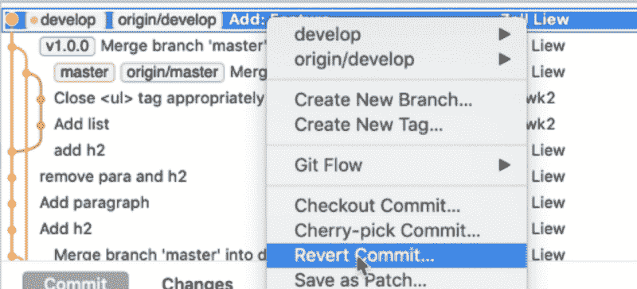
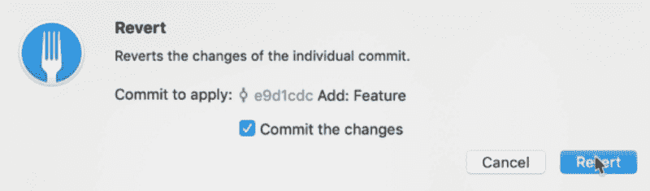

# 如何撤销 Git 中的更改

> 原文：<https://www.freecodecamp.org/news/how-to-undo-changes-in-git-e1da7930afdb/>

您可能已经知道 Git 就像一个保存点系统。使用 Git，您最初通常要学习的是保存您的更改并将它们提交给远程存储库。但是你如何撤销一个改变，并回到以前的状态呢？

这就是我们将在这篇文章中讨论的内容。

如果你喜欢通过观看而不是阅读来学习，我已经在一个视频中介绍了本文的内容。

### 本地与远程

撤销已经在遥控器上的东西更复杂。这就是为什么你想把事情留在你的本地，直到他们得到某种确认。

### 四种常见场景

我们将讨论以下四种常见场景

1.  放弃本地更改
2.  修改以前的提交
3.  回滚到上一次提交
4.  恢复已推送到远程的提交

注意:在下面的截图中，我使用了 Mac OS 的[Fork](https://git-fork.com/)Git 客户端。您可以在其他类似的 Git 客户端中做同样的事情。

#### 场景 1:放弃本地更改

第一个场景是当您创建了一些更改时。他们还没有承诺。并且您想要删除这些更改。

假设我们想要创建一个新的特性。我们将在项目中添加一些 HTML 和 CSS:

```
<!--In index.html-->
<div class="feature"></div>
```

```css
/* In CSS file */
.feature {
  font-size: 2em; 
  /* Other styles */
}
```

要放弃这些更改:

1.  去集结地
2.  选择要放弃更改的文件
3.  右键单击文件
4.  选择放弃更改



#### 场景 2:修改以前的提交

当您创建了一个提交，但遗漏了一些更改，并且想要将这些更改添加到之前的提交消息中时。

1.  去集结地
2.  暂存要提交的文件
3.  点击修改复选框
4.  编辑您的提交消息
5.  犯罪



#### 场景 3:回滚到上一次提交

您的本地存储库中已经有一些提交。您决定不再需要这些提交，并希望从以前的状态“加载”您的文件。

1.  进入 Git 历史
2.  右键单击要回滚到的提交
3.  在这里选择复位`branch`



> 注意:您只能重置到尚未推入远程的提交。

#### 场景 4:恢复已经推送到远程的提交

如果您有一个已经被推入远程分支的提交，您需要恢复它。

> 恢复意味着通过创建新的提交来撤消更改。如果您添加了一行，此还原提交将删除该行。如果您删除了一行，此还原提交会将该行添加回来。

要恢复，您可以:

1.  转到 Git 历史
2.  右键单击要恢复的提交
3.  选择还原提交
4.  确保勾选了`commit the changes`。
5.  单击还原



### 其他场景

GitHub 有一篇有用的文章向你展示了如何用 Git 撤销几乎所有的事情。如果面对其他场景会有帮助。在这里阅读[。](https://blog.github.com/2015-06-08-how-to-undo-almost-anything-with-git/)

感谢阅读。这篇文章对你有什么帮助吗？如果是的话，[我希望你考虑分享它](http://twitter.com/share?text=Undoing%20changes%20in%20Git%20by%20@zellwk%20?%20&url=https://zellwk.com/blog/git-undo/&hashtags=)。你可能会帮助别人。谢谢大家！

这篇文章最初发布在[我的博客](https://zellwk.com/blog/git-undo) g.
如果你想要更多的文章来帮助你成为一个更好的前端开发者，请注册我的[简讯](https://zellwk.com/)。