# 你可能不知道 JS:来自 JavaScript 圣经的见解

> 原文：<https://www.freecodecamp.org/news/you-might-not-know-js-insights-from-the-javascript-bible-2ee9518302aa/>

你使用了一些 JavaScript 来使你的 web 应用程序动态化吗？这是这种语言的常见用法，但还有更多等着你。

在阅读了由[凯尔](https://www.freecodecamp.org/news/you-might-not-know-js-insights-from-the-javascript-bible-2ee9518302aa/undefined)辛普森所著的《你不知道的 JS 》系列畅销书后，我意识到我以前并不知道 JS。JavaScript 社区将本系列视为该语言的参考之一。很厚但是很完整。这个系列是帮助你提高技能的无价(免费)伙伴。


You Don’t Know JS (book series)

在这篇文章中，我为你收集了其中最重要的见解。从简单的东西到困难的东西(这个关键字和承诺)。我没有引用这本书的内容，但我更愿意建立自己的例子。就当这是本书系列的介绍吧。

如果你和我一样在学校学过 JavaScript，我打赌你先学的是 Java。小心，学习 JavaScript 不是模仿 Java。它不是这样的——你必须把它当作一门新语言来学。

### 第 1 课—逻辑运算符

在许多语言中，实现逻辑运算符如**和**和**或**的表达式返回一个布尔值。相反，JavaScript 返回两个操作数中的一个，如本 [ECMAScript 规范注释](https://tc39.github.io/ecma262/#sec-binary-logical-operators)所述。

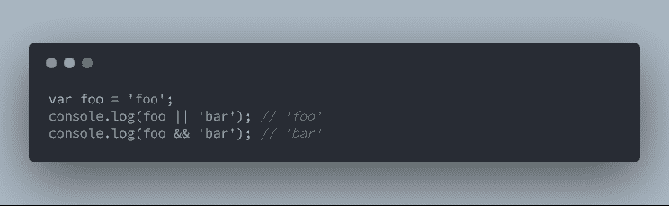

对于这两个运算符，它返回第一个操作数，从而停止计算。通过将`foo`或`bar`设置为`false`布尔值来尝试一下。同样，如果你不包含任何括号，**和**操作符优先于**或**。

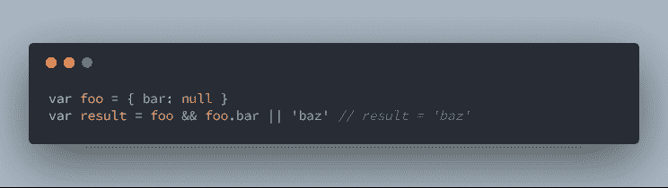

它首先对`foo && foo.bar`求值，就好像它在括号之间。你可以说**和**优先于**或**。

假定**或**操作符返回满足它的第一个操作数，您可以用它来为空的或未定义的变量设置默认值。这是在 ES6 之前定义[默认功能参数](https://developer.mozilla.org/en-US/docs/Web/JavaScript/Reference/Functions/Default_parameters)的首选方式。

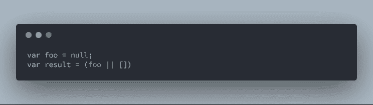

这些逻辑运算符的另一个用例是避免使用`if-else`块和三元表达式:

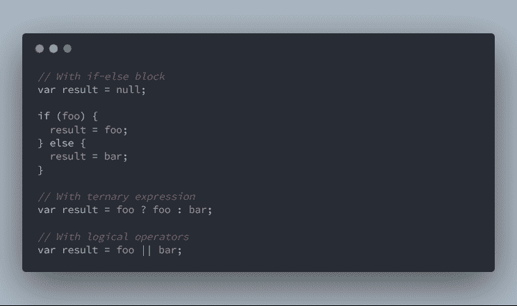

以下是三元表达式的等价形式:

*   `a || b`相当于`a ? a : b`
*   `a && b`相当于`a ? b : a`

### 第 2 课—类型转换

除了像`valueOf`这样的函数，JavaScript 还提供了[类型转换](https://en.wikipedia.org/wiki/Type_conversion)。它是另一种转换变量类型的方法。

*   **转换**发生在编译时，使用显式转换操作符
*   强制发生在运行时，通常使用隐式语法

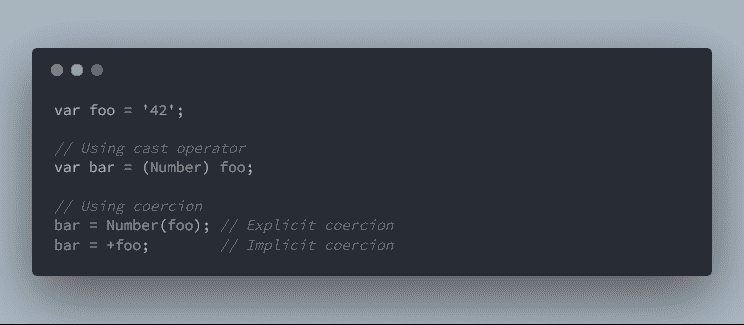

隐式强制是较难看到的转换类型，因此开发人员通常避免使用它们。然而，了解一些常见的隐性胁迫还是有好处的。下面是`String`和`Boolean`的例子。

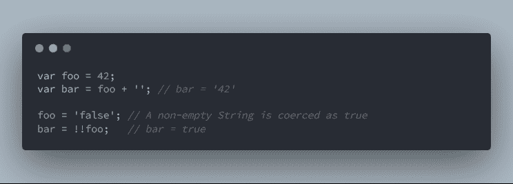

另一个有用但很少使用的操作符是`~`，它相当于`-(x+1)`操作。检测常见的 [**哨兵值**](https://en.wikipedia.org/wiki/Sentinel_value) `-1`很有帮助。

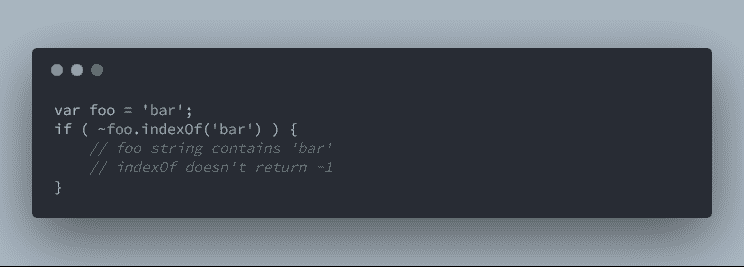

### 第三课——虚伪的价值观

条件是编程的基本结构之一，我们经常使用它们。对了，传说中说人工智能程序充满了`if`。了解它在任何编程语言中的行为是很重要的。

赋予条件的值要么被认为是**假的**要么被认为是**真的**。[ECMAScript 规范](https://tc39.github.io/ecma262/#table-10)附带了一个精选的 falsy 值列表:

*   `'’`空字符串
*   `undefined`
*   `null`
*   `false`布尔值
*   `0`数值
*   `-0`数值
*   `NaN`不是数字值

用下面的代码片段做实验:

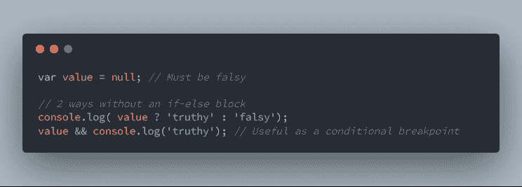

Test if a value is truthy or falsy

不在列表中的任何其他值都是真实的。例如，要小心`{}`(空文字对象)`[]`(空数组)`'false'`(假字符串)，它们都是`true`。

结合逻辑操作符，您可以在不使用`if`的情况下，仅当值为真时调用函数。

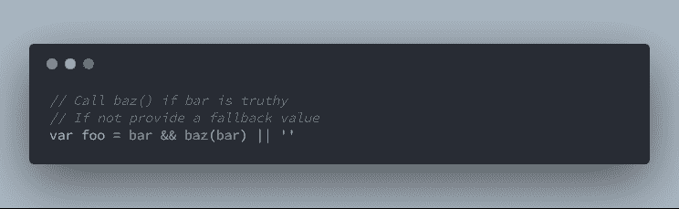

### 第 4 课——范围和生活

第一次写 JavaScript 时，有人可能会告诉你使用下面的符号，因为*“这样更好”*。

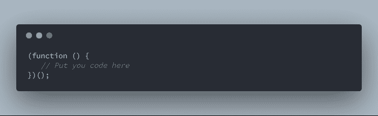

它的作用与声明一个常规函数然后立即调用它是一样的。

这个符号是一个[生命](https://en.wikipedia.org/wiki/Immediately-invoked_function_expression)，它代表**立即调用的函数表达式**。它并没有更好地工作，但是它防止了变量碰撞。

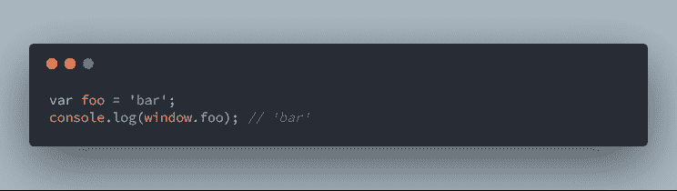

来自**脚本标签**的`foo`变量被神奇地附加到窗口上。当你知道库和框架使用相同的技术定义它们自己的变量时，这非常有趣。

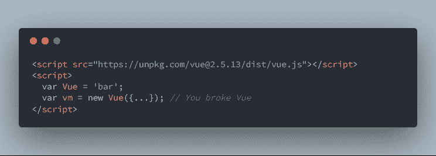

Variable collision on the variable named ‘Vue’

实际上用`var`关键字定义的变量的**范围**并不局限于所有的块。这些块是用花括号分隔的代码部分，例如在`if`和`for`表达式中。

只有`function`和`try-catch`区块可以限制`var`的范围。甚至`if-else`格挡和`for`循环都做不到。

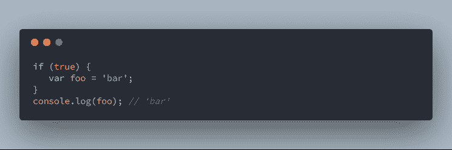

使用 IIFE 提供了一种从外部隐藏变量并限制其范围的方法。因此，没有人可以通过改变窗口的变量值来改变业务逻辑。

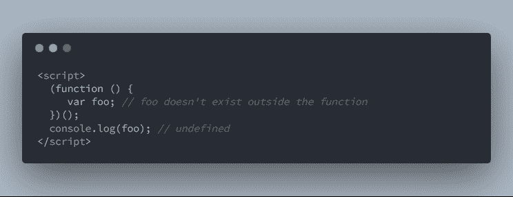

ES6 带有`let`和`const`关键字。使用这些关键字的变量被绑定到用花括号定义的块中。

### 第 5 课—对象和贴图

对象有助于将具有相同主题的变量收集到一个唯一的变量下。您最终得到一个包含许多属性的对象。访问对象属性有两种语法:点语法和数组语法。

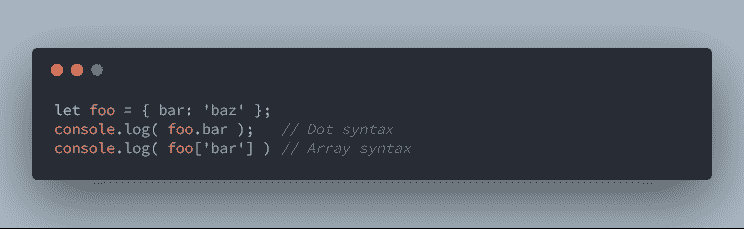

数组语法似乎是创建地图的最佳解决方案，但事实并非如此。在这个设置中，键必须是字符串。如果不是，它将被强制转换成一个字符串。例如，任何对象都被强制为`[object Object]`键。

```
// From here, examples are a bit lengthy.
// I’ll use emebeded code so you can copy/paste and try yourself!

let map = {};
let x = { id: 1 },
    y = { id: 2 };

map[x] = 'foo';
map[y] = 'bar';

console.log(map[x], map[y]); // 'bar', 'bar'
```

从这里开始，例子有点冗长。我将使用 gists，这样你就可以复制/粘贴和尝试自己！

实际上，这个映射在`[object Object]`键下只有一个值。首先，它的值是`'foo'`，然后它变成了`'bar'`。

为了避免这个问题，使用 ES6 中引入的[地图对象](https://developer.mozilla.org/en-US/docs/Web/JavaScript/Reference/Global_Objects/Map)。但是要小心，从键中获取值的查找操作使用了一个[严格等式](https://developer.mozilla.org/en-US/docs/Web/JavaScript/Equality_comparisons_and_sameness#Strict_equality_using)。

```
var map = new Map();
map.set(x, 'foo');
map.set(y, 'bar');

console.log(map.get(x), map.get(y)); // 'foo', 'bar'

// undefined, undefined
console.log(map.get({ id: 1 }, map.get({ id: 2 });
```

这个细节只对复杂变量(如对象)有影响。因为两个内容相同的对象不会严格相等地匹配。您必须使用您输入的确切变量作为键来从地图中检索您的值。

### 第六课——这是什么？

关键字`this`用于用类构建的语言中。通常，`this`(和它的兄弟`self`)指的是正在使用的类的当前实例。它的意思在 [OOP](https://en.wikipedia.org/wiki/Object-oriented_programming) 中没有太大变化。但是，JavaScript 在 ES6 之前没有类(尽管它仍然有`this`关键字)。

JavaScript 中`this`的值根据上下文不同而不同。为了确定它的值，你必须首先检查你使用它的函数的**调用点**。

```
function foo () {
   console.log( this.a );
}

// #1: Default binding
var a = 'bar';

// [call-site: global]
foo(); // 'bar' or undefined (strict mode)
```

当您将这种行为与 OOP 标准进行比较时，这似乎很奇怪。第一条规则并不重要，因为大多数 JavaScript 代码使用[严格模式](https://developer.mozilla.org/en-US/docs/Web/JavaScript/Reference/Strict_mode)。同样，感谢 ES6，开发者将倾向于使用`let`和`const`而不是传统的`var`。

这是默认情况下将值绑定到`this`的第一个规则。总共有 4 条规则。以下是剩下的 3 条规则:

```
// It’s not easy to understand, copy this code and do some tests!

// #2: Implicit binding
const o2 = { a: 'o2', foo };
const o1 = { a: 'o1', o2 };

o1.o2.foo(); // [call-site: o2] 'o2'

// #3: Explicit binding
const o = { a: 'bar' }; 
foo.call(o); // [call-site: o] 'bar'

const hardFoo = foo.bind(o); // [call-site: o]
hardFoo(); // [call-site: o] 'bar'

// #4: New binding
function foo() {
   this.a = 'bar';
}
let result = new foo(); // [call-site: new]
console.log(result.a); // 'bar'
```

最后一个**新绑定规则**是 JavaScript 尝试使用的第一个规则。如果这条规则不适用，它将回到其他规则:**显式绑定**、**隐式绑定**以及最终**默认绑定**。

要记住的最重要的事情是:

> 这随着函数调用位置的改变而改变，用于绑定的规则获得优先级

除了这些规则，还有一些边缘情况。当根据调用位置或`this`值跳过一些规则时，这变得有点棘手。

```
// 1- Call-site issue
const o = { a: 'bar', foo };
callback(o.foo); // undefined

function callback(func){
  func(); // [call-site: callback]
}

// 2- Default binding isn't lexical binding
var a = 'foo';
function bar(func){
   var a = 'bar'; // Doesn't override global 'a' value for this
   func();
}
bar(foo); // 'foo'

// 3- this is null or undefined
var a = 'foo';
foo.call(null); // 'foo' because given 'this' is null
```

关于`this`装订就是这样。我同意乍一看不容易理解，但过一会儿就会理解的。你必须努力学习它是如何工作的，并大量练习。

老实说，这是对整个系列第三部的总结。不要犹豫，从这本书开始，读一些章节。[凯尔](https://www.freecodecamp.org/news/you-might-not-know-js-insights-from-the-javascript-bible-2ee9518302aa/undefined)辛普森给出了更多的例子和非常详细的解释。

### 第 7 课—承诺模式

在 ES6 之前，处理异步编程的常见方式是使用回调。你调用了一个不能立即提供结果的函数，所以你提供了一个函数，它会在结束后调用。

承诺与回调有关，但它们将取代回调。承诺的概念不容易理解，所以花点时间去理解这个例子并尝试一下吧！

#### 从回电到承诺

首先说一下回调。你有没有意识到使用它们会在程序执行中引入一个控制反转？您调用的函数获得对脚本执行的控制。

```
// Please call 'eatPizza' once you've finished your work
orderPizza(eatPizza);

function orderPizza(callback) {
   // You don't know what's going on here!
   callback(); // <- Hope it's this
}

function eatPizza() {
   console.log('Miam');
}
```

一旦披萨送到，订单完成，你就可以吃披萨了。`orderPizza`背后的过程对我们来说是不可见的，但对图书馆的功能来说是一样的。它可能会多次调用`eatPizza`，根本没有调用，甚至等待很长时间。

有了承诺，你可以逆转回调的 IoC。该函数不会要求回调，而是给你一个承诺。然后，你可以订阅，这样你就可以在承诺完成后(完成或拒绝)得到通知。

```
let promise = orderPizza(); // <- No callback 

// Subscribes to the promise
promise.then(eatPizza);     // Fulfilled promise
promise.catch(stillHungry); // Rejected promise

function orderPizza() {
  return Promise.resolve(); // <- returns the promise
}
```

基于回调的函数通常要求两次回调(成功和失败),或者向唯一的回调传递一个参数，让您查找错误。

有了承诺，那两个回调就变成了`then`和`catch`。它匹配成功和失败，但承诺条款是不同的。一个**兑现的承诺是成功的**(带`then`)，一个**拒绝的承诺是失败的**(带`catch`)。

取决于 API，或者您用于承诺的库，`catch`可能不可用。相反，`then`接受两个函数作为参数，这与基于回调的函数的模式相同。

在这个例子中，`orderPizza`返回一个实现的承诺。通常，这种异步函数会返回一个待定的承诺([文档](https://developer.mozilla.org/en-US/docs/Web/JavaScript/Reference/Global_Objects/Promise))。但是，在大多数情况下，你不需要承诺构造函数，因为`Promise.resolve`和`Promise.reject`就足够了。

承诺只不过是一个具有国家属性的对象。一旦完成工作，您调用的函数会将这种状态从**挂起**更改为**完成**或**拒绝**。

```
// Function executed even if there are no then or catch
let promise = Promise.resolve('Pizza');

// Add callbacks later, called depending on the promise status
promise.then(youEatOneSlice);
promise.then(yourFriendEatOneSlice);
promise.then(result => console.log(result)); // 'Pizza'

// Promise is an object (with at least a then function: it's a thenable object)
console.log(promise); // { state: 'fulfilled', value: 'Pizza' }
```

您可以将一个值加入到承诺中。它作为参数(`then`和`catch`)被转发给订阅的回调。在本例中，完成回叫有两个订阅。一旦承诺兑现，这两个订阅的函数以任意顺序触发。

**总结一下:还是有承诺的回调。**

但是承诺就像一个可信的第三方。它们在完成后是不可变的，因此不能多次解析。此外，在下一部分，你会看到，当一个承诺仍然悬而未决很长一段时间，有可能作出反应。

注意你可以用几行代码把一个基于回调的函数变成一个基于承诺的函数。当然有图书馆。有时它也包含在语言 API 中(TypeScript 有一个 promisify 函数)。

#### 利用 Promise API

回调和承诺都必须处理依赖异步任务的问题。当第一个异步函数的结果需要调用第二个异步函数时，就会出现这种情况。另外，第三个异步函数需要第二个函数的结果，依此类推…

重要的是要看如何妥善处理这种情况。这导致了可怕的代码库。看一下下面的代码，你应该对它很熟悉:

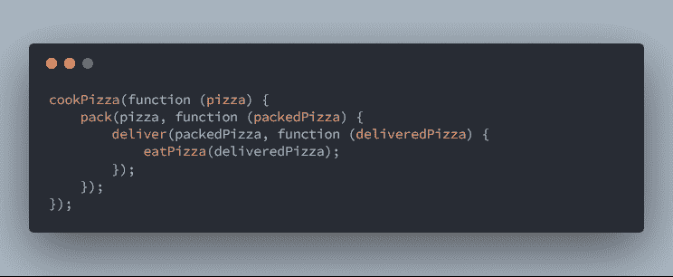

An example of callback hell

你刚刚遇到了一个[回调地狱](https://en.wiktionary.org/wiki/callback_hell)。要吃比萨饼，厨师必须烹饪它，然后包装它，送货员把它送到你面前。最后，你可以吃送来的披萨。

每一步都是异步的，需要前一步的结果。这就是导致你写回调地狱代码的原因。承诺可以避免它，因为它们可以返回其他承诺或值(包装在承诺中)。

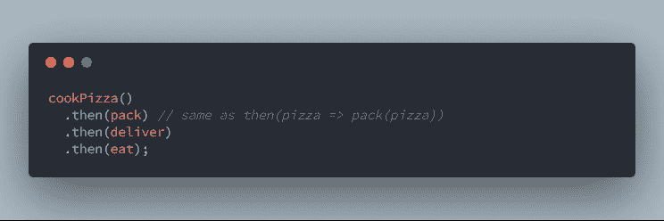

Promise chain with syntax shortcus

这个片段看起来既复杂又简单。代码很小，但似乎我们放入了一些神奇的东西。让我们把每一步分开，去掉 ES6 语法，让它变得清晰:

```
// Detailled promise chain with plain ES5, try the pratice part!

const cookPromise = cookPizza();

const packPromise = cookPromise.then(function(pizza) {
    return pack(pizza); // Returns a promise stored in packPromise
});

const deliverPromise = packPromise.then(function (packedPizza) { // value from pack(pizza)
    return deliver(packedPizza);
});

deliverPromise.then(function (deliveredPizza) {
    return eat(deliveredPizza);
});

/* For you to practice */
// - An example for cookPizza, pack, deliver and eat implementation
//   Each function append something to the previous step string
function pack(pizza) { 
    return Promise.resolve(pizza + ' pack');
}

// - Retrieve the result of eat and display the final string
//   Should be something like: 'pizza pack deliver eat'
eatPromise.eat((result) => console.log(result));
```

现在，您有了最短的语法和最冗长的语法。为了更好地理解这段代码，您应该:

*   实现`cookPizza`、`pack`、`deliver`和`eat`功能
*   使用`eatPromise`检查每个函数是否改变了字符串
*   逐步重构代码以获得简短的语法

还有来自承诺的常规用法。 [Promises API](https://developer.mozilla.org/en-US/docs/Web/JavaScript/Reference--/Global_Objects/Promise#Methods) 还提供了帮助器来处理常见的并发交互情况，如**门**、**竞赛**和**闩锁**。

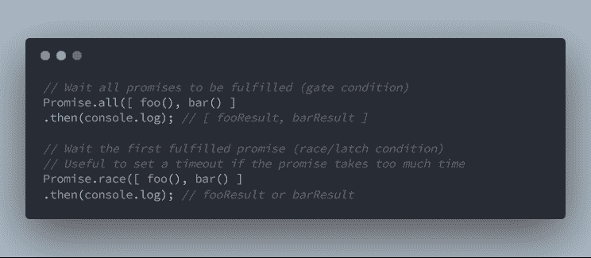

在这个例子中，仅使用了`then`，但是`catch`也是可用的。对于`Promise.all`来说，如果至少有一个承诺被拒绝，它将触发而不是`then`。

如前所述，您可以使用承诺来"*检查并在承诺长时间未决时采取行动*"。这是`Promise.race`的常见用例。如果你想得到一个完整的超时例子，请查看本书的[部分](https://github.com/getify/You-Dont-Know-JS/blob/master/async%20%26%20performance/ch3.md#never-calling-the-callback)。

#### 借助 ES7 走得更远

在一些代码中，你可能会找到 [**延迟对象**](https://developer.mozilla.org/en-US/docs/Mozilla/JavaScript_code_modules/Promise.jsm/Deferred) 来处理承诺。例如，AngularJS 通过 [$q 服务](https://docs.angularjs.org/api/ng/service/$q)提供它。

使用它们似乎更自然、更容易理解，但事实并非如此。你最好花点时间学习承诺。

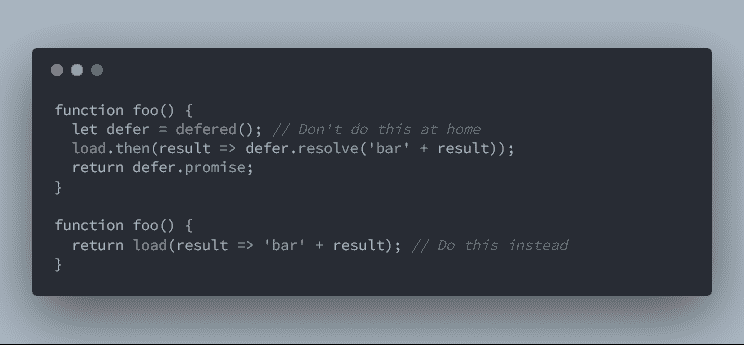

您可能需要返回一个承诺，并在以后更改其状态。在你选择这个解决方案之前，确保没有其他方法。反正 Promise API 不返回延期对象。

不要使用延期宾语。如果你认为有必要，再检查一遍承诺

但是您可以使用 Promise 构造函数来模拟这种行为。检查[我的这个要点](https://gist.github.com/jbardon/da9faa37cfc8cf31c2726cca1923262c)以了解更多但记住——它是坏的！

最后但同样重要的是，ES7 引入了一种新方法，通过利用[生成器语法](https://developer.mozilla.org/en-US/docs/Web/JavaScript/Reference/Statements/function*)来处理承诺。它允许您使异步函数看起来像常规的同步函数。

```
// ES6 syntax
function load() { 
  return Promise.all([foo(), bar()])
    .then(console.log);
}
load();

// ES7 syntax
async function load() { 
  let a = await foo();

  // Gets here once 'foo' is resolved and then call 'bar'
  let b = await bar(); 
  console.log(a, b);
}
load();
```

用关键字`async`标记调用异步函数`foo`和`bar`的`load`。并将`await`放在异步调用之前。你可以像以前一样用经典的`load()`来使用`load`。

这种语法很吸引人，不是吗？没有回调和无限缩进的承诺地狱。但是等等，您应该考虑生成器如何工作以避免性能问题。

在上面的例子中，`bar`只在`foo` promise 解决后执行一次。它们的执行不是平行的。通过编写类似`foo.then(bar)`的东西，你会得到完全相同的结果。

以下是修复方法:

```
async function load() {
   let fooPromise = foo();
   let barPromise = bar();

   // foo and bar are executed before Promise.all
   let results = await Promise.all([fooPromise, barPromise]);
   console.log(results);
}
load();
```

利用`Promise.all`。实际上，`await`的意思是你要一步一步的执行你的功能。一、从头至首`await`。一旦来自第一个`await`的承诺解决，它将恢复到下一个`await`关键字的功能。如果没有更多的函数，就跳到函数的末尾。

在本例中，`foo`和`bar`在第一步中执行。`load`功能在`Promise.all`暂停。此时`foo`和`bar`已经开始了他们的工作。

这是对承诺的一个快速介绍，并附有一些你不想落入的陷阱的说明。这是系列的第五本书[的总结，深入描述了异步模式和承诺。](https://github.com/getify/You-Dont-Know-JS/tree/master/async%20%26%20performance)

也可以看看[这篇文章](https://medium.com/@pyrolistical/how-to-get-out-of-promise-hell-8c20e0ab0513)作者[罗纳德陈](https://www.freecodecamp.org/news/you-might-not-know-js-insights-from-the-javascript-bible-2ee9518302aa/undefined)。他收集了许多有前途的反模式。这篇文章将帮助你逃离所谓的承诺地狱。

### 包扎

这些是我通过阅读[你不知道 JS](https://github.com/getify/You-Dont-Know-JS) 学到的最重要的经验。本书系列有更多的课程和细节来教你 JavaScript 是如何工作的。

提醒一下:对我来说，当作者引用 ECMAScript 规范和冗长的例子时，有时很难理解。这些书肯定很长，但也很完整。顺便说一下，我几乎要放弃了，但最后，我一直读到最后，我可以告诉你——这是值得的。

这不是凯尔的某种广告。我只是喜欢这个系列，把它当作一个参考。此外，通过 [GitHub 知识库](https://github.com/getify/You-Dont-Know-JS)，可以免费阅读和撰写该系列文章。

**如果您觉得这篇文章有用，请点击**？**按钮几下，让别人找到文章，表示你的支持！**？

**别忘了关注我，获取我即将发布的文章的通知**？

### 查看我的其他文章

#### JavaScript

*   [React for 初学者系列](https://medium.freecodecamp.org/a-quick-guide-to-learn-react-and-how-its-virtual-dom-works-c869d788cd44)
*   [如何通过编写自己的 Web 开发框架来提高自己的 JavaScript 技能](https://medium.freecodecamp.org/how-to-improve-your-javascript-skills-by-writing-your-own-web-development-framework-eed2226f190)
*   [使用 Vue.js 时要避免的常见错误](https://medium.freecodecamp.org/common-mistakes-to-avoid-while-working-with-vue-js-10e0b130925b)

#### 提示和技巧

*   [如何掌握 IntelliJ 以提高您的工作效率](https://medium.freecodecamp.org/how-to-master-intellij-to-boost-your-productivity-44b9da20c556)
*   [停止痛苦的 JavaScript 调试，用源代码图拥抱 Intellij】](https://medium.com/dailyjs/stop-painful-javascript-debug-and-embrace-intellij-with-source-map-6fe68eda8555)
*   [如何毫不费力地减少庞大的 JavaScript 包](https://medium.com/dailyjs/how-to-reduce-enormous-javascript-bundle-without-efforts-59fe37dd4acd)