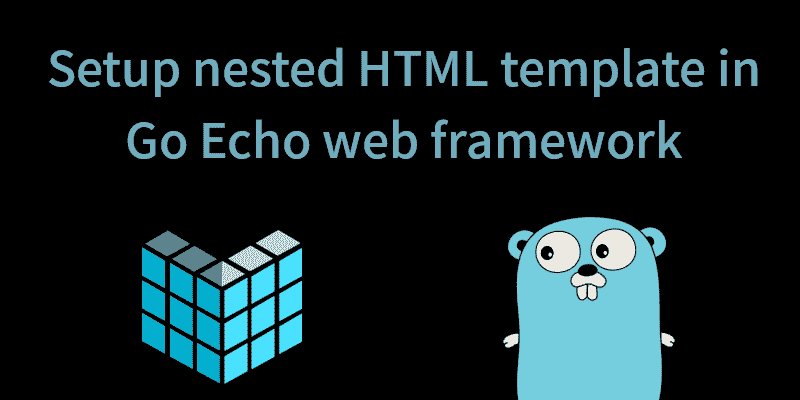
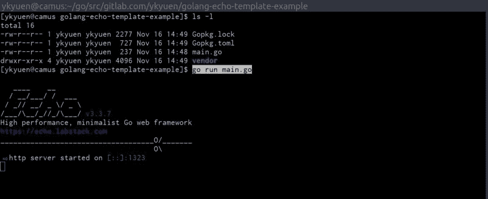
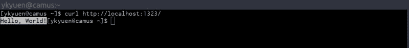

# 如何在 Go Echo web 框架中设置嵌套的 HTML 模板

> 原文：<https://www.freecodecamp.org/news/how-to-setup-a-nested-html-template-in-the-go-echo-web-framework-670f16244bb4/>

作者:应洁媛

# 如何在 Go Echo web 框架中设置嵌套的 HTML 模板

Echo 是 [Go](https://golang.org/) 中一个轻量级但完整的 web 框架，用于构建 RESTful APIs。它速度很快，并且包含了一系列用于处理整个 HTTP 请求-响应周期的中间件。对于渲染部分，它适用于任何模板引擎，但是为了简单起见，我使用了标准的 [html/template](https://godoc.org/html/template) 包。到本文结束时，我们将有一个嵌套模板 [Echo](https://echo.labstack.com/) 项目设置。

如果你已经知道 [Echo](https://echo.labstack.com/) 是如何工作的，那么使用嵌套模板部分跳到[。](#b8ff)

### 基本的 Echo 项目设置

#### 在适当的$GOPATH 下创建项目文件夹

完整的项目代码存放在 [Gitlab](https://gitlab.com/ykyuen/golang-echo-template-example) 上。首先我们将在这里创建项目文件夹:*$ GOPATH/src/git lab . com/yk yuen/golang-echo-template-example*。

#### 创建 main.go

在新创建的文件夹中，让我们从官方网站 [Echo](https://echo.labstack.com/) 复制 hello world 示例并创建 *main.go* 。

**main.go**

#### 使用 dep 下载 Echo 包

如果安装了 [dep](https://github.com/golang/dep) ，只需运行 **dep init** 。你可以参考这篇文章了解更多关于 dep 的信息:[使用 dep](https://blog.boatswain.io/post/manage-go-dependencies-using-dep/) 管理 Go 依赖关系。

或者运行 **go 获取 github.com/labstack/echo**下载 *$GOPATH* 中的 [Echo](https://echo.labstack.com/) 包。

#### 运行 hello world

通过键入 **go run main.go** 启动应用程序，然后通过浏览器或 **curl** 命令访问 [http://localhost:1323](http://localhost:1323) 。

Start the Echo server.

Send a request and get the hello world.

### 返回一个 JSON 响应

在构建 RESTful API 时，客户端更有可能希望接收 JSON 响应，而不是字符串。让我们在 *main.go* 中写一些 [Go](https://golang.org/) 代码。

**main.go**

### 返回 HTML

类似于返回一个 JSON 对象，我们只需要在 **return** 语句中调用另一个方法。

**main.go**

以上只是两个简单的例子。 [Echo](https://echo.labstack.com/) 有一些更方便的方法返回 JSON 和 HTML。详情请参考[文档](https://echo.labstack.com/guide/response)。

#### 使用模板引擎呈现 HTML

正如一开始提到的，我们可以在返回 HTTP 响应时实现一个模板引擎。但在此之前，让我们对项目进行如下重组:

**main.go**

在这个 *main.go* 中，我们定义了一个名为 **TemplateRegistry** 的类型，并实现了**渲染器**接口。一个**渲染器**是一个简单的接口，它包装了 **Render()** 函数。在一个 **TemplateRegistry** 实例中，它有一个 **templates** 字段，包含了 [Echo](https://echo.labstack.com/) 服务器呈现 html 响应所需的所有模板，这是在 **main()** 流中配置的。

另一方面，我们定义了 **HomeHandler** ，以便将逻辑保存在一个单独的文件中。

**handler/home_handler.go**

当调用 **c.Render()** 时，它执行已经在我们的 **TemplateRegistry** 实例中设置的模板，如 **main.go** 中所述。这三个参数是:

1.  HTTP 响应代码
2.  模板名称
3.  可以在模板中使用的数据对象

**view/home.html**

上述模板被命名为**home.html**，如**定义**声明中所述。它可以为 **<标题**>**从 **c.Render()** 中读取**名称**和**消息**字符串；一个** d < h1 >标签。

#### 使用嵌套模板

在上面的设置中，每个 HTML 模板都有一套完整的 HTML 代码，其中许多都是重复的。使用嵌套模板可以更容易地维护项目。

最初，**模板注册表**中的**模板**字段包含了所有的模板文件。在新的设置中，我们将它放入一个数组字段中，每个数组项都是一组特定 HTML 页面的模板文件。

我们将一些文件添加到项目中，它应该看起来像这样:

下面的代码就是基于 [rand99](https://gist.github.com/rand99) 创造的这个[要旨](https://gist.github.com/rand99/808e6e9702c00ce64803d94abff65678)。

**main.go**

我们添加了一个新的路由 **/about** ，它由一个 **AboutHandler 处理。**从上面几行 [34-36](https://gist.github.com/ykyuen/a8bcf35a338f398ddfe61275ac91e439#file-main-go-L34-L36) 可以看出，**模板**数组包含了不同 HTML 页面的不同模板文件集。 **Render()** 将 **name** 参数作为 **templates** 数组键，因此它可以执行正确的模板集。

**view/base.html**

**template** 语句告诉模板引擎要在模板集中寻找 **{{title}}** 和 **{{body}}** 的定义，它们在**home.html**和**about.html**中都有定义。

**查看/about.html**

这里是**about handler**与 **HomeHandler** 没有太大区别。

**handler/about_handler.go**

### 摘要

这只是一个使用 [Echo](https://echo.labstack.com/) 中的 [Go](https://golang.org/) 标准 [html/template](https://godoc.org/html/template) 库实现嵌套模板的基本例子。通过适当的设置，我们可以为 [Echo](https://echo.labstack.com/) 开发一个更加定制和方便的模式，甚至可以让它与任何其他模板引擎一起工作。

完整的例子可以在[gitlab.com](https://gitlab.com/ykyuen/golang-echo-template-example)上找到。

—最初发布在[水手长博客](https://blog.boatswain.io/post/setup-nested-html-template-in-go-echo-web-framework/)上。