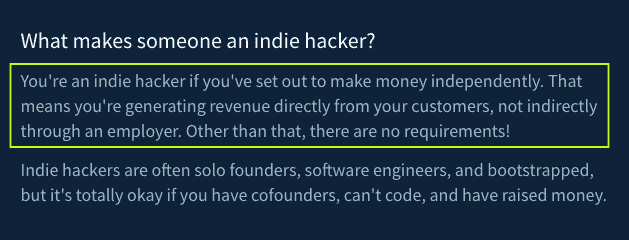
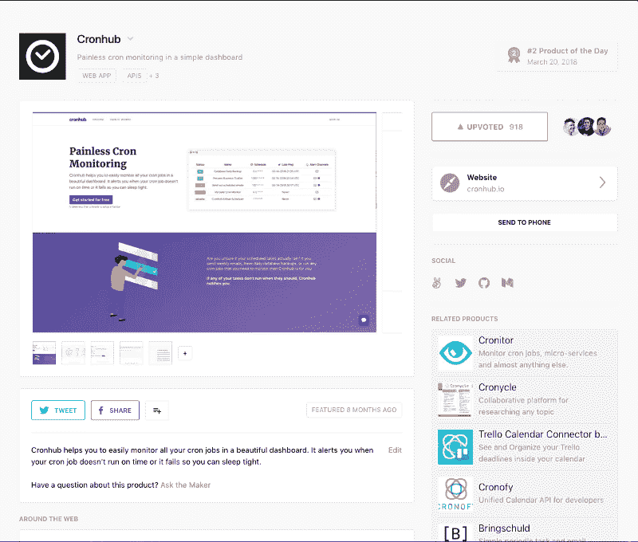
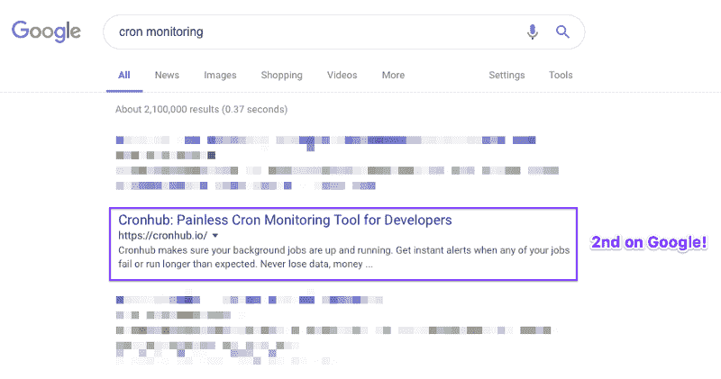
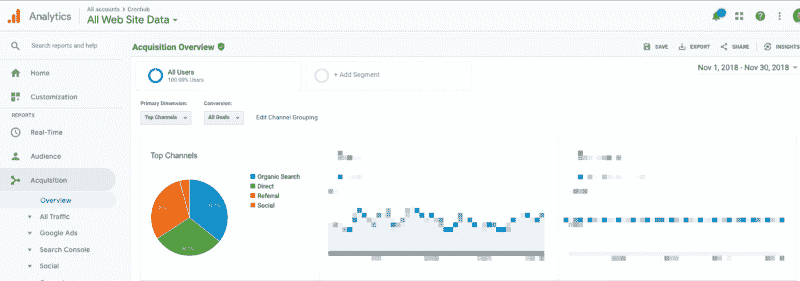
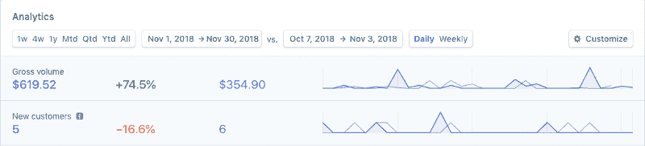

# 作为独立黑客的思考

> 原文：<https://www.freecodecamp.org/news/reflections-on-being-an-indie-hacker-95e19d2edb47/>

作者:蒂格兰·哈科比安

# 作为独立黑客的思考

Spent a week in Wells, VT to disconnect from work and reflect on all the things!

我的名字是 Tigran，根据定义，我可能是一个半独立的黑客。为什么一半你会问？因为我是 Buffer 的全职软件工程师，但同时我也在建立一个名为 [Cronhub](http://www.cronhub.io/) 的在线盈利副业。

如果我们想想我最喜欢的互联网网站之一[独立黑客](http://www.indiehackers.com/)是如何定义它的，我想我符合这个定义，但不完全符合。

How IndieHackers.com defines indie hacker

我通过自己创造的产品独立赚钱，但也有一个主要的收入来源，那就是我的雇主。我是一名 solo 创始人，在过去 8 个月左右的时间里一直在启动 Cronhub。如你所见，我可能有权称自己为独立黑客，对吗？如果你的答案是肯定的，那么让我们进一步阅读我的故事。另外，如果你想了解更多关于我如何远程工作的信息，我已经为[写了另一篇文章](https://blog.cronhub.io/reflections-on-being-a-remote-developer/)。

出于多种原因，我想成为一名独立黑客，但最大的动机一直是我对构建产品的热情。在过去，我已经建立了其他免费的附带项目。当我在罗切斯特理工学院(RIT)学习时，我甚至创建了一个名为 Wheelie 的兼职项目。它成为 RIT 学生的官方拼车在线平台。然而，两年前我关闭了它，因为我对这个产品失去了兴趣，也因为我太担心安全问题。所以，是的，我喜欢兼职项目，因为它很有趣，你可以学到广泛的技能。

我创办 Cronhub 的另一个原因是财务收入。我明白金钱不一定能买到幸福，但它可以买到自由，我认为这是一件大事，至少对我来说。没有足够的钱总是很有压力，赚钱通常更有趣。

在过去的一年左右，我开始珍惜我的时间，并决定如果我参与兼职项目，它不会是免费的。有一份全职工作和一个家庭不会给你太多的空闲时间，所以我最好证明我把时间花在了什么上。这种想法真的改变了我对我热衷的事情的看法。这篇文章反映了这一历程。

#### 这篇文章背后的动机

写这篇文章的动机主要是想和其他想成为独立黑客的人分享我的知识和经验。当我开始这段旅程时，我总是喜欢阅读其他人的故事，他们是如何想出一个想法的，他们是如何经营他们的业务的，以及作为一名独立黑客是什么样的。

不幸的是，没有一个可以分享的建立成功企业的通用公式。甚至“成功”这个词对不同的人也有不同的含义。有人可能用收入来定义成功，而其他人则关心其他指标。

因此，我的目标不是给出任何建议，而是公开分享我在这一年中所学到和经历的一切，这样你就可以做出自己的结论。我还想鼓励其他独立黑客写下他们的故事，因为有更多的数据点只会帮助那些想开始建立自己的产品和独立赚钱的人。

互联网已经成为结识志同道合者、阅读故事并从中获得灵感的最具创新性的媒介。灵感和动力是两种巨大的力量，它们为你实现目标和梦想提供动力。所以我希望我能通过这篇文章激励你一点点。如果我做了，那么我写这篇文章的时间是完全合理的。

### 发动

创办自己的企业并有副业收入已经在我的脑海里很长时间了。自从我改变了对副业的看法，我知道如果我要把时间花在做一些事情上，那就不会是免费的。

为我自己的产品获得报酬从来都不是为了辞掉我的全职工作。我认识很多独立黑客，他们的主要动机是变得独立，不为任何人工作。我能看到这种观点并尊重它。然而，我喜欢目前在 Buffer 的工作，而且近期没有离开的打算。我会全职为自己工作吗？我还不知道。

想出一个可以变成生意的想法并没有我想象的那么难。我有几个要求，我用它们来评估我的想法。

对于每个想法，我都会问以下问题:

*   这是我熟悉的市场的想法吗？
*   这个产品是在解决我自己的问题吗？
*   我能为这个产品收费吗？
*   这是我热爱的事情吗？

最后只有两个想法走到了最后一步:

1.  关于如何使用 Laravel 和 Vue.js 构建 SaaS 产品的在线课程
2.  面向开发人员的简单 Cron 监控工具

我最终选择了上面的第二个选项，只是因为我知道与制作在线课程相比，启动 MVP 会花费我更少的时间。

我以前从来没有上过网上课程，所以我知道完成它需要相当长的时间。我告诉自己，我要尝试一下这个想法，如果不成功，我就退一步，只专注于为开发人员创建教育材料。我知道对这类产品总会有需求。

Cron 监控一直是非常棘手和具有挑战性的。在 Buffer，我处理许多 cron 作业，需要确保它们按时运行，如果它们失败了，我想知道。在 Buffer 之前，当我在 YCharts 的时候，我为团队创建了一个定制的仪表板来跟踪所有内部计划的工作。仪表板将包含计划作业列表和一些日志。

然而，我们知道作业是否运行的方法是查看内部仪表板。这意味着我们必须每天检查仪表板，以确保所有检查都已通过。这并不理想。

当我与其他开发人员交谈时，我意识到这种模式在许多工程团队中重复出现。所以对我来说，这是一个存在问题的重要信号。所以我决定开发一个产品，让监控 Cron 作业变得轻而易举。如果我能构建它，我可以把它用于我的副业和缓冲区。

在做了近 2 个月的第一版产品(兼职)后，我于 2018 年 3 月 20 日在 [Product Hunt 上推出了 Cronhub。PH 社区的反应相当积极，这开启了我的独立黑客之旅。](https://www.producthunt.com/posts/cronhub)

Cronhub’s listing on ProductHunt

推出新产品是一个伟大的里程碑，但之后的事情可能是大多数人都在纠结的。发展你的产品并找到适合市场的产品是一个巨大的挑战，尤其是对第一次创业的人来说。

#### 增长和吸引用户

试图发展副业会面临许多挑战。显然，时间是最大的制约因素，但弄清楚做什么是大多数创始人面临的另一个问题。在早期，当你没有很多用户或客户时，很难依靠数据并做出数据驱动的决策。所以剩下的唯一选择就是要么向其他创始人寻求建议，要么跟随自己的直觉。

早期大多数基于产品的决定都是基于我自己的直觉。因为我是为自己构建 Cronhub 的，所以我非常清楚我需要关注的特性。成为你自己的用户是一个很大的优势，我强烈认为解决你自己的问题的想法是非常正确的。

推出自己的产品后，你通常会做两件事:

1.  迭代产品
2.  销售你的产品

我认识的大多数开发人员，包括我自己，都擅长迭代，但在销售和市场营销方面有点糟糕。我没有销售知识，所以我专注于市场营销。

我决定吸引用户和获得顾客的方式是内容营销。我不仅喜欢写作，还知道它对 SEO 有很大的长期好处。这有助于扩大你的受众，获得更多曝光率。

在遵循了所有基本的 SEO 指南并发布了文章之后，我能够在某些关键词下将 Cronhub 带到 Google 的第一页，比如“cron monitoring”。在我在博客上分享文章后的几个月内，它从第六页跳到了第二个搜索结果。

查看 Cronhub 2018 年 11 月的谷歌分析数据，有机搜索是最大的获取渠道。所以我认为如果你喜欢写作，写作真的会有回报。

Jumped to the first page for certain keywords!

然而，内容营销非常耗时，所以对于一个单枪匹马的创始人来说很难，有时也不可持续。让它成为你的主要营销渠道需要你在写作上投入大量的时间。

我开始考虑适合 Cronhub 的不同分销渠道。其中之一是我目前正在开发的 Github marketplace。有了这个，我希望能多接触到开发者。我将在另一篇文章中分享我在 Github Marketplace 上发布 Cronhub 后的经历，敬请关注。

#### 当前增长

在过去的几个月里，如果考虑到我在 Cronhub 上花费的时间，增长一直很慢，但部分满足了我自己的预期。11 月是收入最高的月份，我的收入达到了 620 美元左右。

The organic search is the top acquisition channel

我确实想加快增长，增加收入，但我认为这需要改变我的战略。首先，我需要了解我的理想客户是谁，如果我的目标是开发团队，那么我应该进一步缩小范围。它将帮助我创建一个计划，将更多相关用户带到 Cronhub，并提高转化率。

除了给网站带来更多的潜在客户，我还想改进新用户的入职流程。新用户应该能够轻松地将他们的系统作业与 Cronhub 监视器集成在一起。我通常每天有 7 - 10 个注册，但只有 2 - 3 个真正激活了显示器。

为了增加激活，我想消除它需要的手动工作。为此，我正在构建一个新的 CLI 工具，开发人员可以在他们的服务器上运行该工具，以便轻松地将他们的 cron 作业与 Cronhub 监视器联系起来。我对这个工具非常兴奋，迫不及待地想在明年发布第一个版本。

另一个帮助我增加注册人数的小功能是支持 Github 认证。我花了不到一天的时间就完成了，但是到目前为止，我的新用户中几乎有一半选择注册 Github。那些用户有没有更高的转化率是另外一个关注点。

#### 反光

像这样写文章真的是一个很好的方式来反思你过去的旅程。我觉得写作在某种程度上是一种冥想，你试图控制自己的想法，把它们导向一个单一的目的——写作。

所以在这里我会试着写下我想到的每一件事，每一件值得与你分享的事。这些想法完全基于我在全职工作的同时创建副业的经历。我之所以强调这一点，是因为它可能与全职从事自己项目的人非常不同。

当我亲自或在网上遇到新朋友，并告诉他们我的业余项目时，他们总是问我，除了工作之外，我是如何找到时间做其他事情的。我的答案在过去的一年里都是一样的。我花的时间很少，但每天都做。可能是一个小时或两个小时，但不会超过这个时间。每天做同样的工作后，随着时间的推移会变得更容易，并成为一种习惯。

当我知道我每天只有 1 - 2 个小时在 Cronhub 上工作时，我对我应该做的事情非常严格。我通常把我的任务分解，这样我就可以在一天内完成。我知道如果超过一两天，我会放弃它。这很难，但我每次都遇到这种情况。我让我的任务保持小规模，这有助于我完成任务。

有些日子我情绪低落，只想看看网飞。我相信这发生在每个人身上，我注意到在我的案例中有一个模式。当我两周左右没有新客户时，我会失去动力，因为我认为增长已经停止了。当这种情况发生时，我试着鼓励自己要有耐心，或者有时打开一张新的 Dropbox 纸，写下一些可以帮助我加速成长的想法。

我有时会怀念有一个联合创始人的日子。我需要有人听听我的想法或征求一下意见。这也有助于激励。当你与真正关心你的人分享你的担忧，并了解事情的来龙去脉时，会有所帮助，因为当你分享时，你会突然感觉好很多。

我会尝试为 Cronhub 寻找一个联合创始人吗？也许吧。我想了很多，很明显，我不想要一个仅仅为了让我感觉更好的联合创始人。？

在我开始积极寻找一个角色之前，我确实想充分定义这个角色。我还需要理解有一个联合创始人和独自一人之间的权衡。

客户支持和定价也是我很想知道的事情。一个如何影响另一个？我认为在某种程度上是这样的。如果我考虑长期独自经营自己的企业，我需要确定我想要服务的客户类型。

我可以有很多低接触客户，也可以有几个高接触客户。我不想在客户支持上花太多时间，因为我没有时间做产品工作。我觉得我还是专注于高接触客户，专注于服务团队比较好。另一方面，瞄准高接触业务表明我应该开始从事销售工作，这真的让我害怕。

产品与市场的契合总能打动我。一个人如何定义找到一个适合市场的产品？或者你怎么知道你找到了呢？我读过很多关于这些话题的文章，但我仍然不清楚你如何将理论应用于实践。有一个信号可能告诉我，我还没有找到适合市场的产品，那就是增长缓慢。

因此，我想继续开发产品，让它变得更好，然后才踩下增长踏板。我想了解更多关于人们在考虑产品与市场匹配时寻找的症状。

在过去一年的 Cronhub 工作中，我发现自己对帮助开发人员有着强烈的热情。我意识到我是多么热爱和享受为开发人员构建工具。如果从公司层面来看，提高开发人员的生产力，即使利润很小，也是一件大事，具有很强的商业价值。

即使是 5%的开发人员生产力的提高也可以在任何公司发挥巨大的作用，并直接影响业务交付的价值。这种认识帮助我形成了我的职业愿景——我想帮助开发人员更有效率。我目前正在定义“如何”的部分。

我发现了一份很棒的报告， [Stripe](http://www.stripe.com/) 的《开发者系数》对 30 多个行业的数千名高管和开发者进行了研究。调查问题之一如下:

> 对于上层管理来说，提高开发人员的生产力有多重要？

> 答案是 96%。

然后我开始思考我可以最大限度地影响开发人员的环境。我怎样才能产生更大的影响？这真的很难回答，但是我已经考虑了一段时间了。从长远来看，我可以为自己工作，成为一名企业家，或者有一个雇主，在那里我可以建立自己的事业。现在，我已经采取了混合的方法，我两者都做，但我很好奇，看看这如何随着时间的推移而演变。也许这是另一个时代的故事。

感谢阅读。如果你是一名使用 cron 作业或任何预定任务的开发人员，那么试试 [Cronhub](https://cronhub.io/) 。如果你能分享这个词，对我来说意义重大。谢谢大家！

我还要感谢我的妻子阿尼帮我编辑这篇文章。❤️

*原载于[blog . cron hub . io](https://blog.cronhub.io/reflections-on-being-an-indie-hacker/)2018 年 12 月 5 日。*