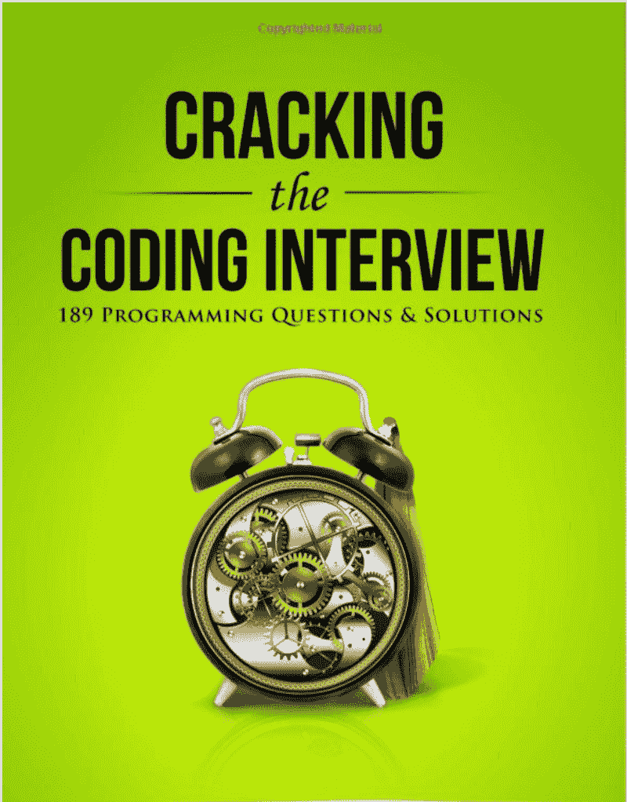

# 你能从一个 30 岁的人的第一次编码面试中学到什么

> 原文：<https://www.freecodecamp.org/news/what-you-can-learn-from-a-30-year-olds-first-coding-interview-abaecd042b0b/>

肖恩·崔

#### 从美国海军资深厨师到程序员

我以前写过关于我如何帮助青少年学习如何编程的文章。在那篇文章中，我分享了一些我发现对青少年学习编程有效的教学方法。

在这篇文章中，我想采取不同的方法，分享一个完全不同的个人经历，让一个 30 岁的美国海军退伍厨师准备他的第一次编码面试。

不像教一群青少年，教一个成年人的重点不再是互动或有趣。相反，许多成年人是目标驱动的，当他们真的想取得成就时，他们会努力工作。

对于这位经验丰富的厨师来说，主要的动机是从烹饪艺术职业过渡到计算机编程职业。

但是，我意识到，仅仅有一个明确的目标和动力是不足以轻松学会编程并在编程面试中取得成功的。所以，我想和大家分享一下我所看到的问题以及我自己解决这些问题的方法。

此外，我希望这篇文章能吸引其他成年人去寻找他们第一次学习如何编程时所采用的方法。

Random Chef image from [Pixabay](https://pixabay.com/en/photos/chefs/)

#### 为什么突然转行了？

正如标题听起来那样具有煽动性，当我的弟弟，一位 30 岁的美国海军资深厨师，一年前宣布他将回到大学主修计算机科学时，我的家人都感到震惊。

这并不是说我哥哥的厨师生涯失败了。事实上，他毕业于美国烹饪学院，这是美国最负盛名的烹饪艺术学校之一，并设法在硅谷的一家科技公司找到了一份高薪的烹饪经理工作。

然而，烹饪艺术的职业对体力要求很高，并且伴随着长时间的工作，其中大部分时间是站着度过的。我的哥哥是一名残疾退伍军人，脚踝上有多根金属棒，所以身体上的要求对他来说越来越难以忍受。

他知道他不能继续干很长时间，他需要一份对体力要求不高的职业。他从小就精通技术，认为回到学校学习编程是个好主意。因此，他参加了俄勒冈州立大学的一个为期两年的项目，以获得计算机科学学士学位。

#### 为第一次编码面试做准备

他完成了一年的大学计算机科学教育，包括基本的面向对象编程、系统编程、web 编程，并且以很高的 GPA 完成了学业。

由于第一个暑假即将来临，我的兄弟开始寻找软件工程实习职位。我哥哥知道大多数软件工程师面试都有一个交互式编码环节，于是他开始寻找有望在这些面试中获得成功的书籍和资料。他匆忙从亚马逊购买了一本[书，该书向读者承诺，他们将 ***破解*** 编码面试。](https://amzn.to/2DN3t1n)

[Book for cracking the coding interview](https://amzn.to/2DN3t1n)

浏览这本书几天后，这是我们的第一次对话。

> *哥哥:*“我怎么能把 189 道编程题的答案都背下来？”

> *我:*“你没有也不应该。你需要学习每个问题背后的算法和数据结构。”

> 哥哥:“但是有太多太多的算法和数据结构要学，我没有足够的时间。让我先试着把这些问题背下来。”

> *我*:“我可以向你保证，问题比算法多……”

我对他的决定持怀疑态度，让他去探索他长大后所做选择的后果。

在潜心记忆书中和各种网站上的每个问题后，如 [LeetCode](https://leetcode.com) 和 [HackerRank](https://www.hackerrank.com/) ，他变得非常自信，他擅长这种他以前从未做过的交互式编程，他开始申请并收到来自脸书和谷歌等知名公司的面试请求。

#### 第一次编码面试…

我想我已经给了足够的剧透。对于他的谷歌面试，他收到了一个他从未见过的问题，他无法解决它。对于脸书的面试，他非常有信心通过，因为他遇到了一个他曾经见过的问题。

然而，他没有成功，他回来向我寻求帮助。我们从回溯他在之前的面试中做错了什么开始，也是为了更好地了解他在面试中的表现。

我问他是否想做一次模拟面试，不管有没有他知道的问题。他同意了，经过几次采访后，我发现了一些问题，我想与大家分享，以造福大家。

#### 面对一个看不见的问题

这是一个非常明显的问题。虽然我哥哥研究了数百个问题，但他已经记住了每个问题的答案，却不理解它们背后的算法和数据结构。一旦某个问题偏离了他看到的问题列表，他就会结巴起来，开始思考如何解决它。

有时，他能够应用类似的知识，但他很难识别算法的类别，以用于大多数时间看不见的问题。如果他有一套广泛用于编码面试的算法的高级知识，他需要做的就是找到应用它们的方法。

我对这个问题提出的解决方案是**关注算法，而不是解决方案。**事实上，当你处理一个问题时，一定要注意你认为你需要使用哪种算法，然后验证解决方案是否真的使用了那种算法。

#### 过分偏爱一种语言胜过另一种语言

当你第一次学习编程时，大多数人从学习语言和语言结构的细节开始，比如循环和条件，而不是编程的重要概念。

我知道这样做的原因是因为学习者想马上开始编程。然而，这种做法会带来可怕的后果，作为一名初级程序员，它会使你对单一语言的认识变得狭隘。

因此，一旦面试官要求应聘者实现一些你最喜欢的语言中已经存在的库函数，应聘者通常会完全忘记，主要是因为他们总是认为库函数是理所当然的。

这也发生在我哥哥身上。他最熟悉 C++和 JavaScript，当我让他实现一个简单的库函数时，比如一个幂函数，他一片空白，除了一个简单的实现，他什么也想不出来。

还有，对于字符串相关的问题，他重点使用了像`substring`这样的现有方法，这是第一次学习问题本质时最好避免的。

面试官可以很友好，让你使用库函数，但你不能总是期望如此慷慨。所以，我对这类问题提出的解决方案是**关注编程概念，而不是语言结构*。***

事实上，当我第一次在加州理工学院学习编程时，我的入门级计算机科学教师努力不教语言的细节。他们只给出了学生在课堂上需要的语言的最低限度的一些信息，并允许学生只使用编程作业中讨论的最低限度的功能。

这种实践允许学生在以后根据哪种语言更适合用例来轻松地切换编程语言。此外，当他们不得不面对一个问题时，它允许他们跳出框框思考。

#### 说话太少

有句话说得好“少说多做”。然而*，*这不是一个潜在候选人在做节目面试时应该遵循的建议。

当我把一个问题交给我的兄弟时，他开始写东西而没有谈论他将要写的代码。当我问他在想什么的时候，说出来的话很杂，我很难听懂。

作为一名多年来面试过多个候选人的面试官，我总是想听听候选人是如何大声说出自己的想法，以及他们是如何找到解决方案的。

许多人认为这浪费了宝贵的时间。然而，不与面试官讨论就过于深入一个不正确的解决方案可能会浪费更多的时间。大多数时候，面试官寻找的是他们正在思考的解决方案。所以，和面试官交谈会让你们两人达成共识。

当然，提出不正确的方法是不好的。所以，在提出建议之前，一定要三思。因此，我提出的一个建议是**大声地思考，但是你所说的话要清晰、有条理*。***

#### 自负

有一次，弟弟要解决一个问题，早前在网上看到了解决方案。他非常自信，认为自己通过了面试。

我问他问题的细节，他说他准确地编码了他记忆的答案。然而，他很难描述算法的细节，如时间复杂度，也很难编写测试代码。那时我知道他在面试中表现不好。

大多数时候，当人们看到一个他们知道的问题时，他们会不假思索地浏览代码。大多数时候，这种情况发生在简单的问题上。

然而，当面试官提出一个简单的问题时，主要目的是挖掘问题的本质细节。因此，仅仅知道解决方案是不够的。

您必须准备好了解算法如何运行的细节，包括时间复杂性和空间复杂性，以及您的解决方案如何在各种情况下失败。

还有，回到我前面提到的，不要只写解决方案而不谈。面试官一定会知道你以前见过这个问题。因此，我对这个问题的解决方案是**不要过于自信，注意细节*。***

#### 最后的想法

成年后转行很难。与年轻时相比，大多数成年人发现很难改变做法和习惯。因此，当他们习惯了一些习惯，如使用一种语言或不大声思考，这是非常非常难以改变的。

同样，我弟弟要改变他已经养成的习惯，需要越来越多的练习和时间，但我相信他最终会成功的。事实上，有勇气在有家庭支持的情况下改变职业，表明他有改变和适应新环境的意愿。他现在作为一名软件工程师有着光明的前景，我为他感到非常高兴。

> 感谢你阅读我的文章，也请随意分享你的经历！我相信他们会非常非常激励大家！