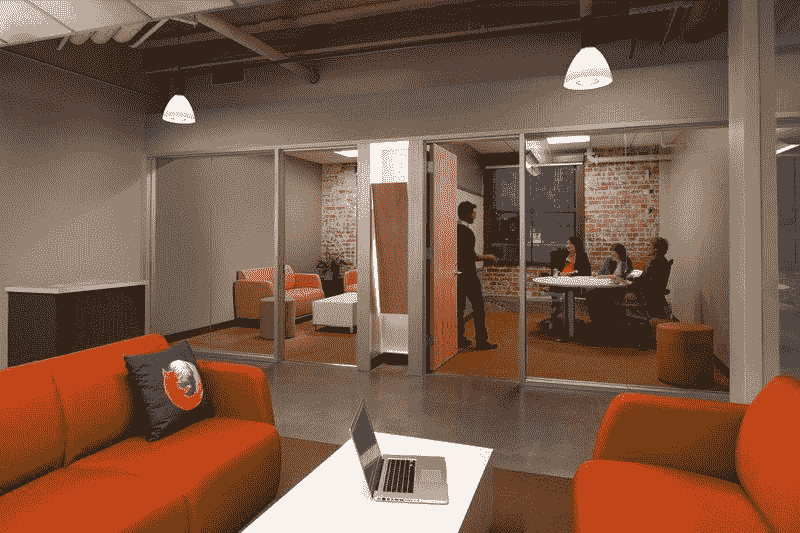
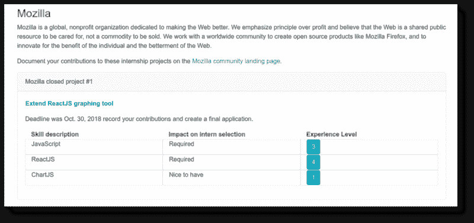
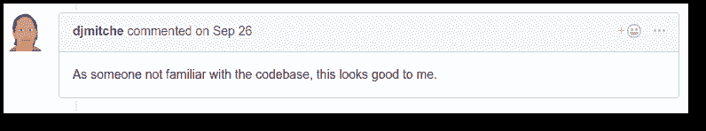
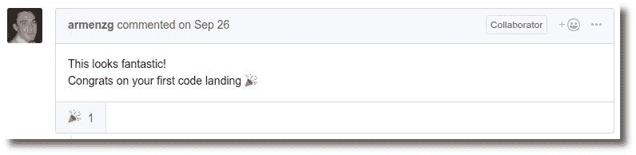

# 我是如何通过 Outreachy 获得 Mozilla 的远程带薪实习机会的

> 原文：<https://www.freecodecamp.org/news/how-i-got-a-remote-paid-internship-at-mozilla-through-outreachy-60958fe9264a/>

Syeda Aimen Batool

# 我是如何通过 Outreachy 获得 Mozilla 的远程带薪实习机会的

我在 10 个月前开始学习 JavaScript，这段旅程充满了挫折、希望和动力。在开始学习 JavaScript 之前，我认为我了解它的大部分内容——但我错了。有很多东西要学，普通的 JavaScript、Node.js、React——然后做一些虚拟的附带项目来应用这些知识。时间很紧，因为我想在短短的 2-3 个月内学会并实施一切，以便尽快开始工作。

失业和没有你想要的工作技能是最糟糕的感觉。你需要强大的意志力和动力来继续学习，继续前进，对未来充满希望。

我开始了 [freeCodeCamp](https://freecodecamp.org) 课程和一些其他教程(我将在另一篇文章中分享更多)来学习和提高我的 JavaScript 技能。在掌握了大量的知识，在 Express.js、Node.js、Handlebars、MongoDB 中做了一个功能齐全的 web app 之后，我有了一些信心，决定跳到前端，学习 React.js，然后我又掌握了 React 的一些基础知识，做了一些可以扔的 app。

但是我不能专注于学习更多的东西，因为我现在想挣钱。对我来说，不赚钱就工作变得很难。于是，我积极地开始申请远程 JavaScript 工作。我曾经一天至少申请两份工作，但对大多数来说，我都不是最佳人选，所以答案是否定的。

在申请了许多工作后，我意识到大多数公司对远程雇佣初级开发人员不感兴趣。他们更喜欢初级员工在现场，而那些有一定经验的人可以远程工作。

沮丧但有动力，我决定完全专注于学习 React，并回到我的 freeCodeCamp 课程。除了让自己有价值获得一份不错的远程工作之外，我还决定制作一个作品集。

一天早上，当我打开邮箱时，有一封来自[outreach](https://www.outreachy.org/)时事通讯的邮件，宣布他们的申请开始了。几个月前，当前几轮的申请即将结束，我刚刚开始我的旅程时，我已经注册了这份时事通讯。我几乎忘记了它，几个月后，就在我需要它的时候，它又出现了。于是我忘记了自己申请的所有工作，不再寻找更多的工作，全力以赴，决定努力获得外联实习。

我读了以前校友的许多文章，记下了他们的建议，探索了外联，看了 Youtube 视频等等。我给了自己一个证明自己的机会。除了外延，我什么也看不见。我努力工作，学习开源，熬夜，周末工作来实现我的目标。这是一个向自己证明自己的机会。

今天，我与你分享我的旅程来帮助你。帮助那些努力编码的人，那些在这个技术世界中努力生存的人，那些梦想着一份远程工作和一张梦想中的家庭办公桌的人。这篇文章是给你的，外联是给你的。

### **什么是 Outreachy？**

Outreachy 是一个为那些在这些项目中代表性不足的人提供 3 个月免费开源软件带薪实习的计划。实习生获得 5500 美元的津贴和 500 美元的差旅费资助，以参加导师批准的与其项目相关的任何国家或国际活动。外联实习不仅限于编程。它们还包括用户界面/UX、文档、数据科学、图形设计、视频文档和插图。

这份实习最大的好处是它很偏远，实习生可以在世界上任何地方工作，不会因为肤色、国家、宗教、性别或文化的差异而影响他们的工作。

许多梦想科技公司分享他们的项目，并接受实习生指导他们，给他们机会与他们最好的开发人员一起工作。Mozilla、Debian、Git、GNOME、Kubernetes 和 OpenStack 就是其中的几个。

以前，Outreachy 只接受女性、跨性别者、跨性别者、同性恋者和其他一些在科技界代表性不足的人。但好消息是，从这一轮开始，它现在对所有人开放。

### **我是如何赢得 Mozilla 的拓展实习机会的**

这里是外展申请过程和我是如何通过它的。

#### 1)初次申请

创建账户后，我找到了一份初始申请表。你提供一些信息，他们决定下一阶段是接受还是拒绝申请人。在这份表格中，你需要提供姓名、性别、国家、城市等信息，最重要的是你在实习期间是否有空。

Outreachy 要求实习生在实习期全职工作，每周工作 40 小时。我知道有一个申请人不能进入下一步，因为她不能全职工作。因此，第一步是筛选那些符合标准的候选人。我有资格进入下一步，即选择一个项目并开始捐款。

#### 2)项目选择和贡献

啊啊！这是**过程中最重要的**步骤，也是有点艰难的部分。一个错误的项目选择会让你失去实习机会，或者正确的选择会为你打开学习和接触的大门。完成第一步后，实习生现在可以看到所有项目的列表及其详细信息。

The project I was selected for

**错误的选择方式:**
仔细检查每一个项目和公司，阅读细节，却什么都不记得，最后弄得一塌糊涂。

你不需要阅读和查看每个项目的细节，从一个项目切换到另一个项目。它会消耗你的时间和精力。

正确的方法:
根据与你的技能相匹配的所需技能，将项目列入候选名单。现在你已经有几个项目了。接下来，您可以根据主要技能所需的支持技能进一步筛选候选人。或者你可以根据你感兴趣的领域来选择。

就我而言，我擅长 JavaScript。我有许多基于 JavaScript 的项目，但我对 ReactJS 感兴趣，以提高我的技能。对我来说，选择一个项目并停止在其他项目上浪费时间很容易，因为我清楚地知道我想与 React 合作。

#### 3)建立项目，了解代码库，并开始贡献

女士们先生们，请系好安全带，因为在申请的这个阶段，你们将会经历许多不同的情绪。你会感到哑口无言，一点都不自信，害怕贡献，害怕拒绝拉请求，害怕不写高质量的代码，害怕问回购负责人问题来帮助你建立项目，等等。

> 把那个综合症扔出窗外:)

这是我的导师为了回应我的恐惧而要求我做的。我建议你也这样做。一旦你把它扔出去，你就会做得很好。你会赢的。恐惧不会带你去任何地方！

现在，您必须设置项目回购，在可用文档的帮助下使其在本地机器上运行，并开始寻找好的初始问题。从好的第一个问题开始是有帮助的，因为它们很容易解决，你会获得很多信心和动力继续下去。

请记住，Outreachy 要求至少有一项贡献才有资格获得最终申请和实习机会——但他们高度鼓励实习生继续贡献以增加机会。现在，根据我的经验，我警告你不要被一两个贡献困住而感到满足。

竞争是激烈的，人们不止一次地从世界各地投稿，增加了他们被选中的机会。所以，确保你有不止一个——真正好的贡献会增加你的机会。

我以前从未参与过任何项目，我甚至不知道什么是拉式请求，也不知道如何去做。其实我在申请过程中学到了一切。

我发现了一个未分配的问题，并打开了一个带有解决方案的拉动式请求。我的导师在不同的时区，所以在他们醒来之前，我打开了两个拉请求，我无法入睡，只是等待着看到回应。我熬夜到凌晨 3 点，直到我的公关得到回应。令我惊讶的是…

然后

Yay :-D

你无法想象我有多开心。我感觉像在飞，像超人一样飞上天空。简而言之，我在第七天空！

但是我必须下来解决更多的问题。这给了我很大的信心，然后我没有停止贡献。到应用程序提交的最后一天，我已经合并了 6 个拉请求。我提交了最后一份申请，之后一直在投稿。

在外展结果公布之前，我的桶里总共有 10 个拉动请求，这使我成为这个项目更强的申请人。

### 结果公告

等待结果很难。我不耐烦地数着日子来得到消息。有了信心和希望，也有了紧张。而被录取的消息，不过是挫折天气和学习旅途中的一缕清风。我很兴奋，很开心，诸如此类。漫长的学习和制作测试应用程序的旅程让我来到了 Mozilla 公司，与世界上最好的开发人员一起工作。

在接下来的几个月里，我无法停止想象学习更多的东西，成为另一个优秀的开发者。然后从 Mozilla 获得 MacBook Pro 的消息就像蛋糕上的樱桃。我已经开始不喜欢我的惠普机器了。:-D

最后，我现在要开始另一段学习之旅，与世界顶级科技公司的导师一起做一个真实的项目。我的实习从 2018 年 12 月 4 日开始。我很兴奋，等不及要开始了。我希望学习并从中获得最大收益。

### **为什么我觉得 Mozilla 如此特别**

Mozilla 的实习生除了津贴和差旅费之外，还有三项福利，这让这次实习更加令人兴奋。

1.  所有的 Mozilla 实习生都拿到了最新款的 MacBook Pro，配有很酷的大规格。

我的 MacBook Pro 将在几天后到货，规格如下:

*   *2.9GHz 6 核第八代英特尔酷睿 i9 处理器，睿频加速至 4.8GHz*
*   *32GB 2400MHz DDR4 内存*
*   *镭龙 Pro 560X，4GB gddr 5 内存+英特尔 UHD 显卡*
*   *512GB 或 1TB 基于 PCIe 的闪存存储*
*   *触摸条*

令人垂涎？绝对是！

2.向 Mozilla All Hands 发出邀请，这是一个邀请公司所有员工与他们的同事见面，并与他们通常不会见面的其他人分享经验和互动的活动。实习生有机会见到其他员工、志愿者，尤其是他们的项目导师。

3.所有 Mozilla 实习生都获得了 LDA 证书，这意味着他们将拥有一个官方的 Mozilla 电子邮件 id——username@mozilla.org。

### **赢得外展的智慧金块**

根据我的经验和观察，以下是促使我赢得这次机会的原因，我建议你这么做:

*   把所有的恐惧、不安全感或不自信都抛在脑后，投入其中。申请外展，贡献，学习，提问，尝试解决问题。如果你第一次没有做对，那也没关系——你会得到反馈，你可以在第二次、第三次或第四次尝试中得到反馈。最后，学习很重要——而不是你犯错误的次数。
*   做出一两次贡献后，不要觉得太有成就感，也不要过于自信。尽可能多地解决问题。即使在截止日期后也要坚持贡献，直到你得到结果。这对我帮助很大。这让我的导师们意识到我是一个学习者、热情者和积极的参与者，他们总是很欣赏我。所以我推荐你继续投稿。
*   即使问题很蠢，也不要害怕提问。有一个问题，我向我的导师问了太多问题，但他很友好地回答了所有问题。尽管如此，还是要确保你是在做了一些个人调查后问的。不要随便问任何问题。如果你有什么不清楚的，就问一问。问吧。问吧。问吧。
*   留意你的竞争对手。我过去常常每天访问项目回购，检查有多少新申请人试图解决这些问题。开了多少 PRs，谁会是我最大的竞争对手。每当一个新的申请人出现时，我的心脏都会跳得很厉害，这帮助我不要停下来。
*   尽早开始。注册订阅时事通讯。如果你开始得早，你将会有很多你可以解决的未分配的简单错误。你将有很好的机会了解项目并解决大部分问题。
    申请过程漫长耗时，不是一两周就能搞定的。
*   与项目导师合作。不要让他们忘记你。贡献，解决 bug，提出(有效的)问题。
*   最重要的是:我已经知道 Mozilla 提供了笔记本电脑和全体会议邀请，但我没有申请 Mozilla 项目的这两件事。我申请是因为在所有列出的项目中，只有几个项目需要 JavaScript 和 React——而且只有两个项目我能理解一点。其中一个来自 Mozilla。你的主要目标应该是赢得任何组织的实习机会，获取知识，学习，并为自己的未来铺平道路。不要因为一些额外津贴而选择一家公司。你最终会失去一个好的项目，并把你的头撞向其他不适合你的项目。选择一个项目，如果你真的觉得你可以做得很好。
*   专注于一个项目，全力以赴。如果你的项目没有更多的问题，请你的导师给你推荐一些其他的项目。这发生在我身上。
*   别管结果了。实习没争取到也没关系，会学到很多东西。你将得到一些导师，并开始开源之旅。在某个时刻，我决定继续为这个项目做贡献，即使我没有赢得实习机会。因为与我在过去几个月的演示项目中获得的知识相比，我在这个过程中获得的知识量是很大的。

哈！我有很多话要说。我应该为下一篇文章保留其他内容。我很兴奋能在 Mozilla 开始实习。我非常鼓励挣扎中的新手申请外展服务。你不需要成为一个伟大的开发者——你只需要成为一个伟大的学习者。

这些实习就是来教你增长见识的。如果我能得到它，你肯定能得到它。任何一个有上进心，愿意学习和努力的人都可以得到。下一轮外展将于 2019 年 2 月开始。不要错过！

### **非常感谢**

最后，我要向 outreach 的组织者塞奇·夏普、T2·玛丽娜、Mozilla 的伊丽莎白·努南以及所有支持 outreach 帮助新手学习和超越开源的人大声疾呼。最后，非常非常感谢我的丈夫告诉我关于外展，给我发来链接，并激励我申请和努力工作。没有他的精神支持，这是不可能的。

如果我不提我的导师阿门·詹布拉诺和 T2·达斯汀·米切尔给予我的支持和激励，那将是完全不公平的。我感到幸运的是，我有支持我的导师，他们庆祝我的小成就。不用说，他们坚定不移的支持总是在那里解决我面临的各种问题。非常感谢你的友好和帮助。

啊！我等不及要开始了！

#### **上进？**

如果你打算申请下一轮，但在申请过程中感到不自信或失落，请随时联系我们。我很乐意帮助你。我希望 Outreachy 能够帮助每一个为职业生涯的良好开端而奋斗的人。

#### 纪念

> "人在一生中的任何时候都有能力做自己梦想的事情。"炼金术士

我的代码是 [@aimenbatool](https://github.com/aimenbatool) ，我发微博@ [aimenbatool](https://twitter.com/aimenbatool) 。如果需要帮助，请联系我。