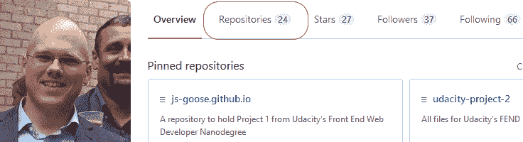
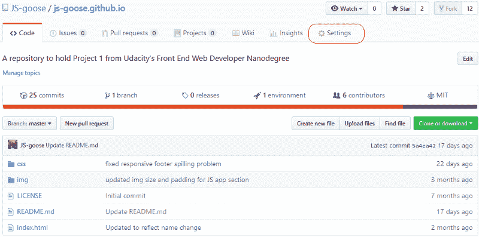
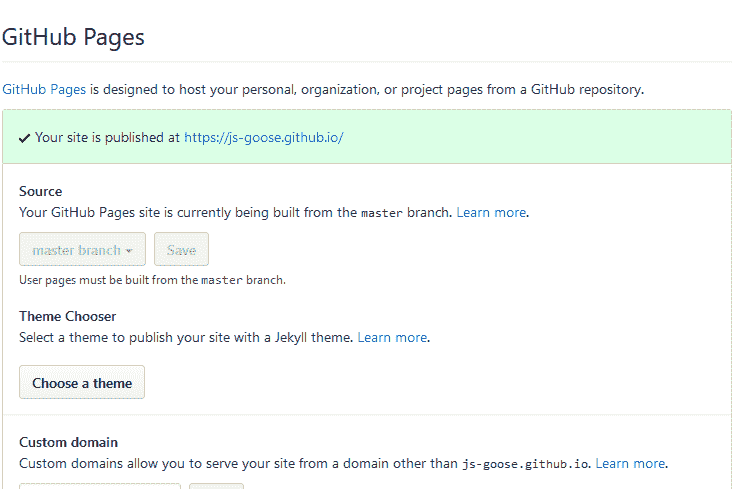
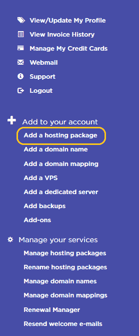
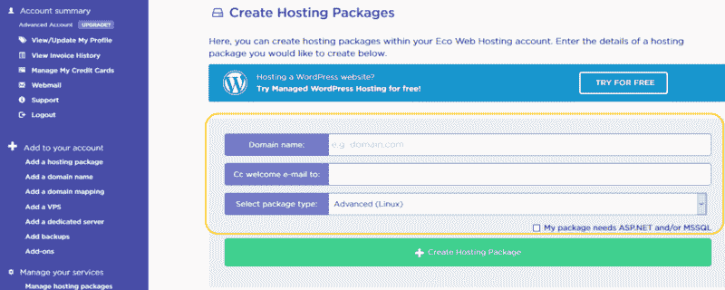
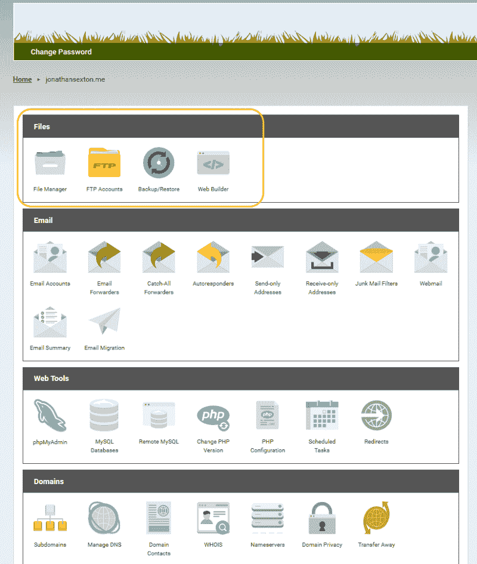

# 通过这些简单的方法部署您的投资组合，建立您的在线形象

> 原文：<https://www.freecodecamp.org/news/establish-your-online-presence-with-these-simple-ways-to-deploy-your-portfolio-37101569909/>

你已经对你的作品集做了“最后”的润色(好像任何项目都已经真正完成了……哈哈),看起来很棒。你列出了一些很棒的项目。你所有的联系信息都在那里，你搜索了几个小时的那个报价很好地补充了这个流程。

现在，你唯一的问题是它仍然在你的本地机器上。你是唯一能看到你的努力成果的人。

我在这里用这篇文章来帮助你改变这种情况。在我们深入研究这篇文章的核心之前，让我们先把形式放在一边。

正如我所有的书面工作一样，我与本文中链接的任何服务或平台都没有任何关系或商业利益。我没有因为链接到这些资源而获得任何形式的报酬。我做了一些研究，得出了这里链接的作品。

当然，除了我在这里提到的，还有其他的选择。一如既往，我鼓励你做自己的研究，永远不要轻信任何东西。

我们将看看托管您的投资组合的两个选项。在这两条路线中，GitHub 路线需要的工作要少得多。

然而，在做出选择之前，应该考虑两者的利弊。

让我们分析一下哪种选择最适合你和你的情况。

#### github pages

不到十个动作，你就可以通过 [GitHub Pages](https://pages.github.com/) 公开访问一个网站。让我们开始吧。

*   登录您的 [GitHub](https://www.github.com) 账户(如果您没有，设置一个账户只需不到 5 分钟)
*   登录后，点击**存储库**部分

The GitHub homepage options

*   选择要使用的存储库。在本文中，它应该是你的投资组合托管的地方。但是，你可以公开主持任何项目。
*   进入回购主页后，点击右上角的**设置**选项卡

Repository homepage

*   在设置选项卡上，向下滚动到名为 **GitHub 页面的部分。**在**源**部分下，选择您想要托管的分支。(如果你像我一样，在你的大部分回复中有几个分支，你可以在那里尝试新的想法或技术。此选项使您能够选择不同的分支来托管)。点击**保存**。

Your page is now live!

*   您应该会收到一条旁边带有绿色复选标记的消息。它会告诉你的行动是成功的，并给你新托管的投资组合的地址！

网站上线可能需要 10 分钟，所以请耐心等待！

然而，一旦它已经加载，你就设置好了。如果您希望对您的投资组合进行更改，您可以在本地(在您的机器上)进行更改。然后，只需对回购进行修改。你也可以直接在网页上的 GitHub 编辑器中制作它们。这些变化将在你按下它们后的五分钟内生效。

您也可以在 GitHub 页面托管中使用自定义域名，但是需要做更多的工作。这个主题超出了本文的范围，但是有可能。

恭喜你！您的作品集现在正在直播，供您向全世界炫耀！

#### **通过服务自我托管**

如果你不喜欢浏览 GitHub 页面，还有一个简单的方法可以向全世界展示你的作品集。

这个选项需要做更多的工作，并且**不是免费的**。然而，如果您选择利用它们，这个选项提供了更好的控制和一些额外的好处。

我们开始吧！

如果你还没有，你需要从网上成千上万的域名市场中的一个购买一个域名。周围有很多，简单的搜索就会产生很多很棒的结果。

购买域名时，你有几个选择，你想“租”多久的名字。如果这是你第一次购买域名，我强烈建议你最多只支付一年的费用。

我之所以这么说，是因为你可能会改变对你买的名字的想法。你可能想更名，你可能决定你不再有兴趣拥有自己的付费域名。在这种情况下，您只能使用这个名称。

这并不意味着你不能购买更多的域名——这只是意味着你已经支付了一些你不必支付的费用。我现在已经换了两次域名，我很高兴我只选择了一年。

购买域名时，你应该把注意力集中在提供免费[域名隐私](https://en.wikipedia.org/wiki/Domain_privacy)(也称为 WHOIS 保护)的服务上。这是保护您的信息免受垃圾邮件/电话/邮件攻击的重要一步。

很多时候，你购买域名的提供商也会提供[托管包](https://www.pcmag.com/article2/0,2817,2427219,00.asp)。为了简单起见，我建议你从同一个提供商那里获得域名和主机包。

你不一定要这样做。然而，如果你选择独立的域名注册商和托管服务提供商，还有一些额外的步骤，这些超出了本文的范围。

你选择的主机包应该与你的需求相关。在这种情况下，你只需要一个小的东西来托管一个站点。将来您可以随时升级。

那么，你已经购买了你的域名和你的主机包——现在呢？下面的图片来自我的个人托管平台 [Eco Web Hosting](https://www.ecowebhosting.co.uk) 。他们是一家英国公司，我相信并支持他们的使命。我之前说过，我链接到他们的平台没有经济补偿。我只是喜欢他们的服务和产品。

无论你选择哪个托管解决方案，看起来都可能不同，但是无论你选择在哪里登陆，所有的步骤都是可行的。

*   一旦登录到您的帐户，寻找类似“添加新的主机包”或“创建新的主机”
*   点击该按钮，进入屏幕，让您提供详细信息

The homepage list

*   此部分将询问域名(您之前购买的)以及欢迎电子邮件的发送目的地(此电子邮件将包含控制面板登录信息和其他重要信息。一定要把它留着做记录——你以后会需要它的！).

Setting up a new hosting package

*   除非您特别需要[ASP.NET](https://msdn.microsoft.com/en-us/library/4w3ex9c2.aspx)或 [MSSQL](https://en.wikipedia.org/wiki/Microsoft_SQL_Server) ，否则请确保将其保留为包类型的 [Linux](https://en.wikipedia.org/wiki/Linux)
*   您将收到一封电子邮件，其中包含关于您创建的托管包的所有细节的重要信息
*   一旦你得到它，跟随链接到你的控制面板——同样你的可能看起来不同，但是大多数有相同的图标/链接

The admin control panel

*   文件管理器是你网站上所有文件的存储地。你可以从本地文件中复制/粘贴，也可以从 [FTP 客户端](https://filezilla-project.org/faq.php)上传，比如 [FileZilla](https://filezilla-project.org/index.php) 。有许多免费的替代品，但这是我使用和喜欢的一个。
*   如果你选择使用 FTP 客户端，你需要通过你的主机设置一个 FTP 帐号。一旦你设置好了，在你的 FTP 客户端你需要提供凭证(IP 地址，名称，密码等)
*   您可能还需要解锁 FTP 访问—默认情况下，我的主机会锁定 FTP 访问。我可以解锁一段时间，从 1 小时到 28 天不等。

如果你不习惯使用 FTP，想让你的文件夹运行起来，你总是可以把你的文件复制粘贴到文件管理器中。

这是在服务器上获取文件的次优方式，但同样有效。为了正常工作，这些文件需要与本地计算机上相同的文件结构。

一旦你的文件已经上传或你已经复制/粘贴它们，确保你上传任何你想以同样的方式使用的图像。

恭喜你！你有一个新的作品集来展示你的作品，并向世界展示！

你从主机包和/或购买域名时收到的电子邮件非常重要。你需要把它存放在一个安全的地方。它包含您的主机包的所有登录信息。如果你丢失了它，你可以得到另一个发送，但更容易的是不要丢失第一个:)

此外，在您购买域名后的 2 到 14 天内，您应该会收到来自 [ICANN](https://www.icann.org) ( [互联网名称与数字地址分配机构](https://en.wikipedia.org/wiki/ICANN))的跟进邮件。该组织负责“协调与互联网的[名称空间](https://en.wikipedia.org/wiki/Namespace)和数值空间相关的多个[数据库](https://en.wikipedia.org/wiki/Database)的维护和程序，确保网络的稳定和安全运行”。

你需要知道的是，如果你没有向 ICANN 注册或申请你的域名，你的网站将无法访问。因此，请留意它，并确保您遵循其中的说明。

#### 包扎

如果，在任何时候，你需要一些帮助或想问一个问题，我会非常乐意帮助你。我的联系信息在我的个人资料里。我不能承诺你的结果，但我会尽我所能帮助你的投资组合上线！

我希望这篇文章对你有所帮助，并且你为自己在建立网上形象方面迈出了一大步而感到自豪。确保你在评论中添加了你的作品集的链接——我很乐意去看看！

请考虑捐赠一些掌声，因为这有助于其他人找到我的工作。我也很想收到你的来信！在 [Twitter](https://twitter.com/jj_goose) 上发表评论或对我大喊——我总是很高兴与友好的面孔和开发伙伴联系！

我也有一个[博客](https://www.jonathansexton.me/blog)，在那里我发布与前端 web 开发相关的技术文章。你可以订阅我的时事通讯，了解我所有的写作经历。一定要过来打个招呼！

一如既往，祝你有一个充满编码、爱、家庭和幸福的美好的一天！