# 为什么大多数重新设计都失败了

> 原文：<https://www.freecodecamp.org/news/why-most-redesigns-fail-6ecaaf1b584e/>

作者 Girish Rawat

# 为什么大多数重新设计都失败了

#### 大牌再设计失败的案例研究以及你能从中学到什么

一位产品经理走进设计部门，要求重新设计网站。“我们的网站看起来太旧了！我们所有的竞争对手都有更华丽的网站。让我们重新设计它。有彩色阴影的纽扣才是未来！”

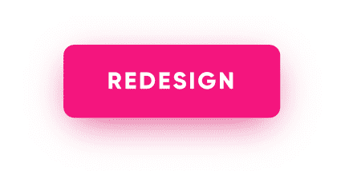

设计师:“好吧，让我们从进行可用性测试开始——”
PM:“你有 3 周时间，我希望所有的颜色都变成热粉色、前卫蓝色或千禧橙色。”

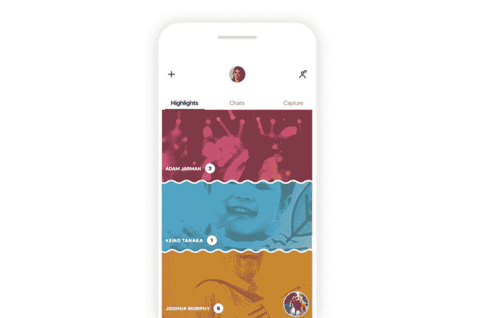

Skype Redesign 2018

这就是你如何谋杀你的转化率。虽然上述情景可能有些夸张，但每年从根本上重新设计品牌的公司数量肯定不是这样。看看脸书吧，几乎每次我打开它，它就像一个新网站。[在脸书](https://www.facebook.com/groups/whobrokethebuild/)有一个由 3k 名成员组成的团体，他们跟踪公司变化的每一个细节。

任何面向用户的产品都不可避免地要在不断变化的市场中保持最新和新鲜。重新设计对网站、应用程序或任何与任何类型的用户或利益相关者互动的产品都至关重要。如果通过数据驱动的流程和明确定义的设计关键绩效指标正确完成，重新设计的产品可以提高转化率，增加销售额，让用户满意。

但更多的时候，重新设计让人感觉很不受欢迎，转化率下降，用户愤怒，应用程序评价负面。无论是像 Snapchat 这样的小公司还是像微软这样的大公司，比如 T2 的 Windows 8 和 T4 的 Skype，似乎没有人能幸免于重新设计的失败。

### 为什么重新设计会失败？

重新设计，不管是视觉上的还是功能上的，都是用户对你的产品印象的改变。人们不喜欢改变。当你改变用户访问应用程序设置页面的方式时，你是在要求他们改掉一个习惯。以前能够毫不犹豫地导航到应用程序的设置页面的用户现在正在摸索着找到它。这导致了微侵袭。作为一名设计师，你的工作就是最小化这些微侵略，并激励他们建立新的习惯。

### Snapchat 的导航重新设计

我们来分析一下 snapchat 是如何重新设计他们的一个核心用户故事的——查看朋友的故事。

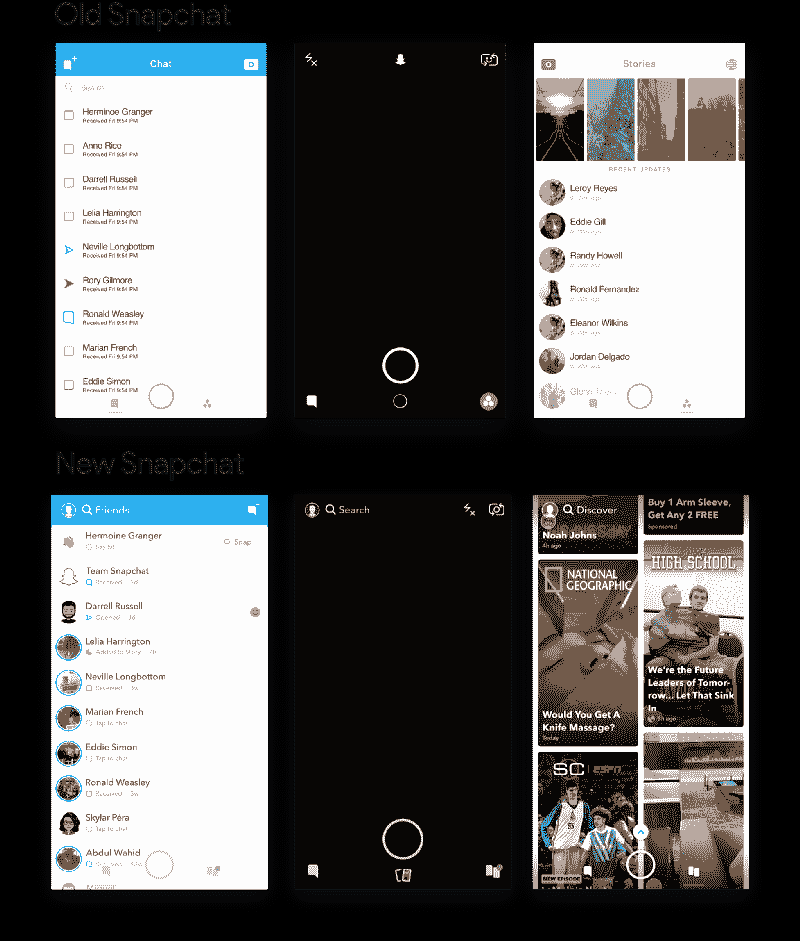

旧版本的 snapchat 设置了以下导航结构:向左滑动查看故事，向右滑动与朋友聊天。要查看你朋友的故事，你必须从主摄像头屏幕向左滑动，然后点击你朋友的故事。

名人和媒体的宣传故事是故事页面的一部分。它们出现在你朋友的故事旁边。

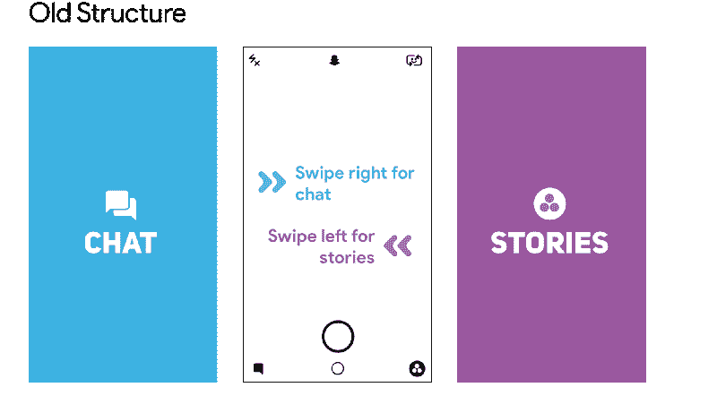

当 Snapchat 决定重新设计时，朋友的故事被移到了左边，并与聊天相结合。推广故事有了自己的版面。这次重新设计让 Snapchat 摆脱了之前“聊天”和“故事”的分裂。它专注于朋友和出版商之间的划分，使出版商可以轻松地推广付费内容，同时将朋友的所有内容集中在一个地方。

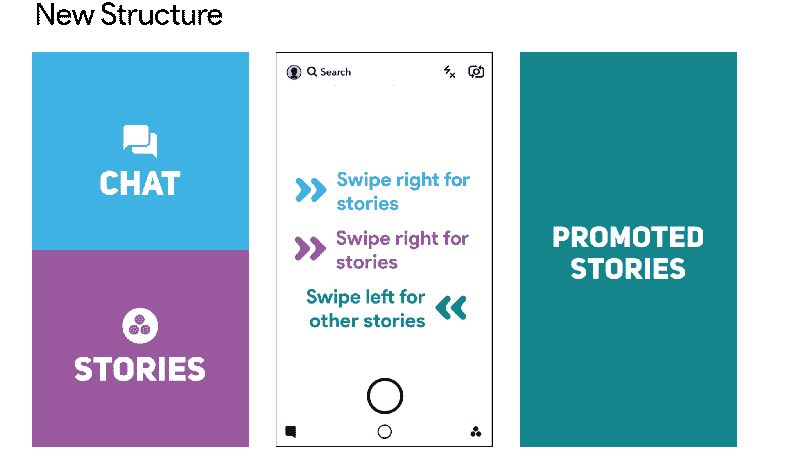

在重新设计中，点击查看故事的主要区域也被缩小了。以前，用户可以点击一个矩形栏来查看他们朋友的故事。重新设计后，它被缩小到一个更小的圆圈，一直推到屏幕的左侧。

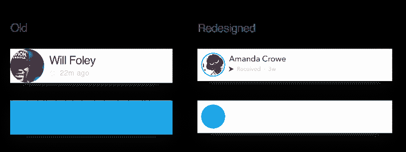

Area to click to view story

至少有两条经验法则被改变了:导航结构和点击区域来浏览故事。不用说，用户不太喜欢这些变化。一周之内，Snapchat 的平均评分从 3.1 星降至 2.4 星。

我用 Appbot 对用户评论进行了情感分析。我们可以清楚地看到，在重新设计向用户推出后，负面评价激增。

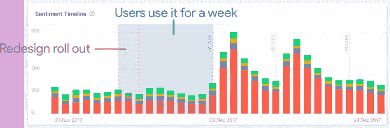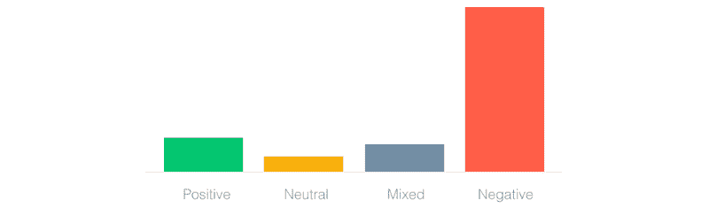

Histogram Legend

Snapchat 的重新设计是一场灾难。它的日用户从 1.93 亿下降到 1.88 亿，降幅为 2%。广告浏览量和收入[下降了 36%](https://marketingland.com/forecast-downgrades-2018-snap-ad-revenue-outlook-by-36-percent-249332) 。许多出版商转换了平台，开始将 Instagram 称为他们的新家。

重新设计推出 6 个月后，Snapchat 做出了弥补，并宣布逆转。朋友的故事将被移回到出版商故事旁边的右边页面。直接引用:

> 我们了解到，将观看故事和与朋友交流结合到同一个地方会使这两种竞争行为更难优化。我们目前正在推出一个更新来解决这个问题，将《老友记》中的故事移到应用程序的右侧。——Snapchat 首席执行官埃文·斯皮格尔

### Windows 8 开始菜单重新设计

现在我们来看看微软是如何在 Windows 8 中重新设计他们的开始菜单的。让我们尝试在 Windows 7 和 8 中打开控制面板。

要在 Windows 7 中打开控制面板，您需要单击开始按钮来列出所有应用程序。然后你点击控制面板。

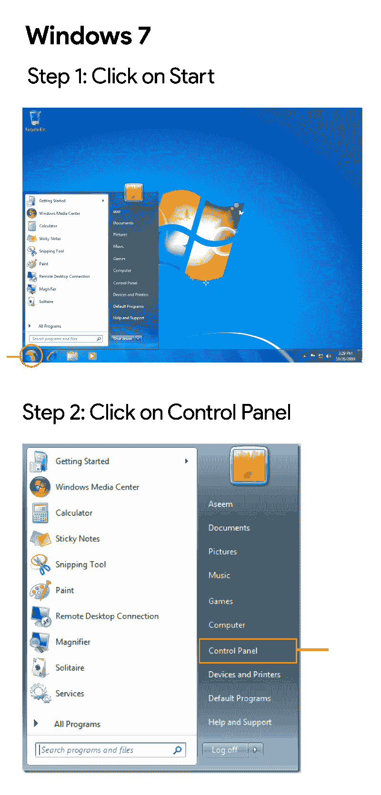

在 Windows 8 中，你已经从开始菜单开始了。一个好的开始，对吗？不对。在列出的应用程序中找不到控制面板。也没有列出所有程序的选项。

要访问面板，您需要打开 Charms 菜单。将鼠标悬停在屏幕的右上角或右下角可以打开菜单。当你打开了魅力菜单后，你点击设置，然后点击控制面板。

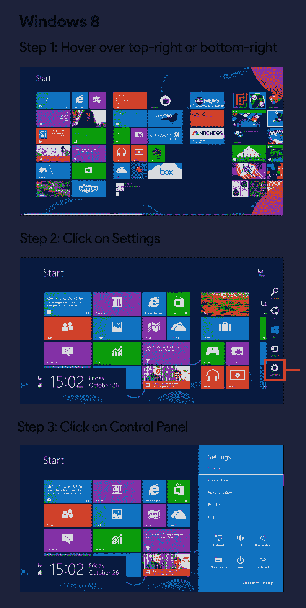

当 Windows 8 推出时，这种基于手势的面板访问过程对用户来说是完全陌生的。Windows 没有提供任何帮助用户发现 charms 菜单的功能。即使用户通过谷歌搜索或者从他们的朋友那里发现了魅力菜单，他们仍然对它感到不舒服。手势和悬停对操作系统来说都是新概念。

### 所有的重新设计都是不好的吗？

重新设计就是改变，人们不喜欢改变。从上面的例子中很容易想到，花时间重新设计来改变产品的工作方式对你的产品来说可能不是一个好的投资。但是，不进化和保持相同设计以“安全行事”的产品不可避免地会被行动更快的竞争对手淘汰。

轻量级和渐进式的改变，用户能够很容易地接受，使得重新设计变得可以忍受。有时，这可能意味着跳过华丽的动画、手势或导航结构，使用用户已经习惯的更简单的替代方式。

### 脸书的导航重新设计

2012 年，脸书准备对其移动应用的导航方式进行重大的重新设计。到目前为止，导航到好友请求、消息和通知的方式是通过顶部的蓝色图标操作栏。这个动作栏旨在模拟用户在网站上导航的方式。它的外观和感觉就像网站标题的样子。

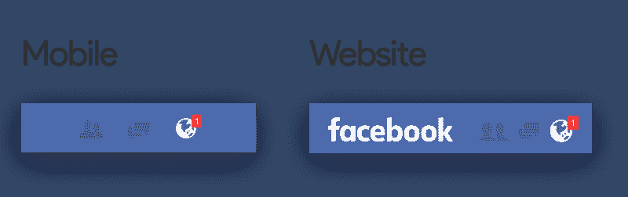

Android 和 iOS 都以相似的方式实现了导航，都有相同的操作栏。

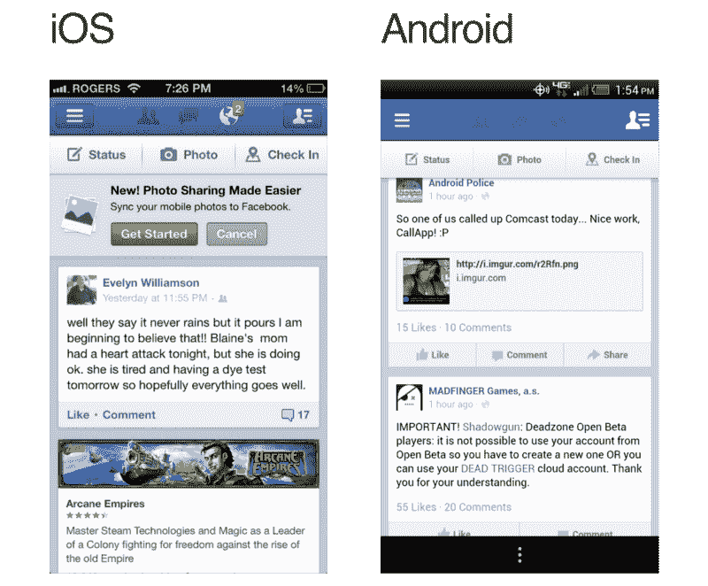

但是移动用户群正在迎头赶上，移动优先用户将会超过桌面优先用户。Instagram、Snapchat 和 Vine 等纯移动社交网络越来越受欢迎。很明显，在不久的将来，人们会花更多的时间在手机上，而不是电脑上。

因此，当脸书决定简化他们的移动导航结构时，他们决定抛弃一致性，将 Android 和 iOS 视为两种不同的产品。脸书为各自的应用程序引入了两种不同的导航结构。Android 应用程序的可滑动标签栏贴在顶部，而 iOS 应用程序的静态标签栏贴在底部。

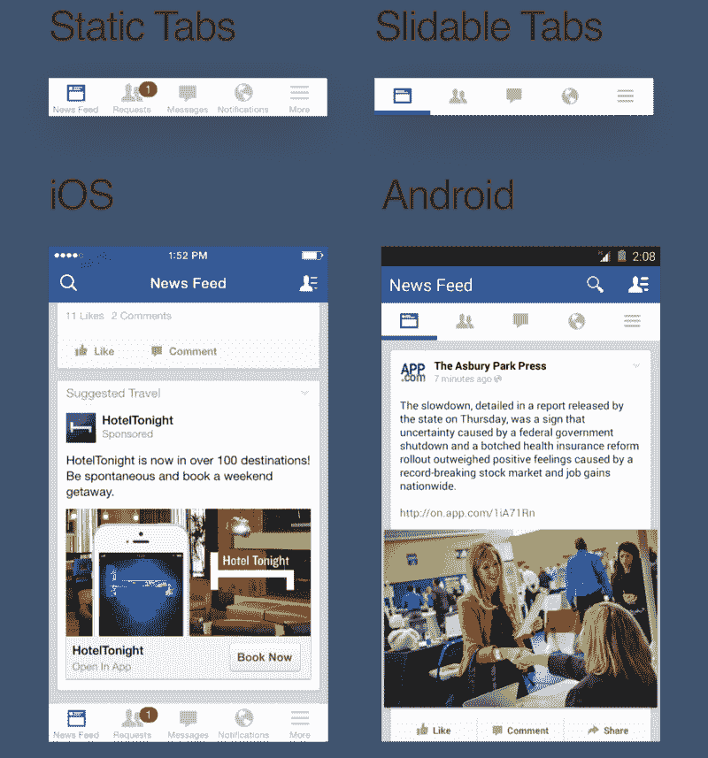

这些变化对应用程序来说是新的，但对用户来说不是。虽然重新设计确实需要用户打破习惯，转到蓝色的操作栏来导航，但是用户已经熟悉了他们的平台特定的标签栏。可滑动标签栏已经在 Android 生态系统中存在了几年。用户从动作栏切换到标签栏并没有花费太多时间。同样，iOS 标签栏自平台诞生以来就一直存在，用户并不觉得陌生。

脸书在 Android 和 iOS 中的标签分离对他们来说非常好。不久之后，它们成为了行业标准，大多数装有 Android 和 iOS 应用程序的移动平台都实现了类似的导航功能。

### 学习

#### 最有效的重新设计通常不是最漂亮的

重新设计不是美化事物的过程。视觉方面是重新设计的一部分，但不是重新设计。如果你只是为了更好的视觉效果而重新设计你的产品，从 Dribbble 的视网膜模型中汲取灵感，在没有任何研究支持的情况下实施设计趋势，你的重新设计注定会失败。

有时问题可能是你过时的设计语言稀释了你的品牌价值。您的客户正在转向拥有更好看的设计系统的竞争对手。重新设计你的设计系统让它看起来更好是完全没问题的。但是盲目地跟随设计趋势而没有任何策略或研究来支持它会导致不利的结果。

重新设计是为了解决特定业务约束和需求的问题。

这个来自 Dribbble 的谷歌重新设计概念使用大胆的颜色和浓重的阴影来吸引你的注意力。虽然它看起来飞了起来，但这个重新设计有一些重大缺陷，永远不会在谷歌出现。首先，谷歌过去 20 年来一直坚持的标志性多彩品牌不见了。其次，所有谷歌网站的头像都在右边，而在这里头像在左边。我可以继续说下去，但希望你能明白我想表达的要点。

#### 重新设计是一个过程，而不是目的地

产品设计是一个对产品或过程进行原型设计、测试、分析和提炼的循环过程。重新设计并不意味着产品已经完成。这仅仅意味着它已经“足够完整”来满足任何当前的需求。没有任何产品或用户界面是“完美”的。

#### 关注微转化

重要的是要读懂字里行间的意思，以帮助你更好地描绘你的用户和他们的活动。通常，当我们谈论科技垂直领域的转化时，我们关注的是应用安装数量、用户注册数量或销售额。

微转化经常被遗忘，有时甚至不被跟踪。微转化是低挂的果实，准确的说是引导用户达到最终目标的行动，也就是宏转化。微转化的例子可以是使用搜索功能的用户数量、更新其个人资料图片的用户数量或确认其电话号码的用户数量。微观转化充当转化漏斗中的过程里程碑，并影响最终步骤，或宏观转化。

这些微转化做的怎么样？您是否看到了特定微转换指标的下降？用户不能添加好友是因为新的搜索栏很难找到吗？你注册免费试用的行动号召是否被新的布局掩盖了，用户再也找不到了？定义精确的微观转化目标并跟踪它们，将有助于您评估重新设计的平台的用户之旅中的摩擦点。

### 结论

**感谢阅读！**这项分析是我实习申请的一部分，但我最终没有申请。希望这篇文章能帮助你更好地理解一些重新设计，以及我们能从中学到什么。欢迎在下面的评论中提供任何反馈或提出任何问题。