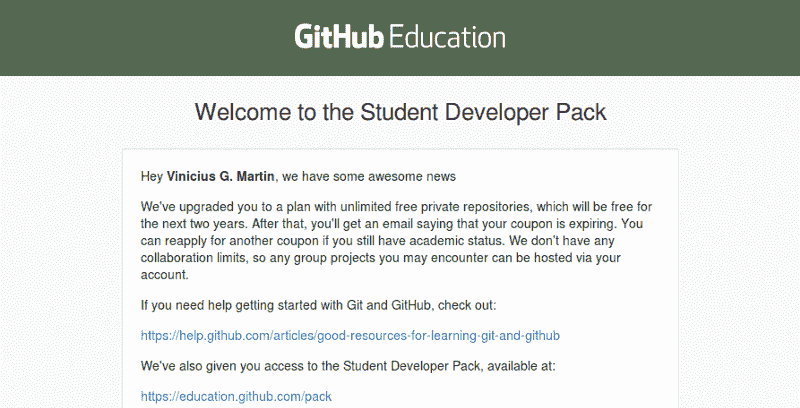

# 如何获得自己的 GitHub 学生开发者包

> 原文：<https://www.freecodecamp.org/news/how-to-get-your-own-github-student-developer-pack-ef40ec71c0d2/>

由 Vinicius Gularte

# 如何获得自己的 GitHub 学生开发者包

[https://education.github.com/pack](https://education.github.com/pack)

大家好！今天我将向你展示我是如何从 GitHub 获得学生包的，以及你也可以如何获得它。

以下是学生套餐的一些优势:

*   无限的私有存储库。
*   免费访问开发工具。
*   50 美元的数字海洋信用。
*   [这里的](https://education.github.com/pack)是一个完整的列表。

### 要求

要获得学生包，您必须满足以下要求:

*   必须注册学习授予学位或文凭的课程。
*   必须是 13 岁以上的学生。
*   必须有 GitHub 账户。

如果你满足这些要求，我们将继续。

### 如何获得包装

您可以访问[这里](https://education.github.com/pack/offers)并点击加入 GitHub 教育。

你会看到这个:

填写此表格，然后单击下一步。

现在我们有两个选择来验证我们的学校学位。

用你学校的邮件，比如 myname@school.com。

或者

上传你的学历证明。

以我为例，我用巴西葡萄牙语上传了我的学术状态，效果非常好。一周后，我收到了这个:

学生包将持续两年。如果你还在学习，你可以更新你的计划。

这就是了。我希望你喜欢它，不要忘记？。回头见。