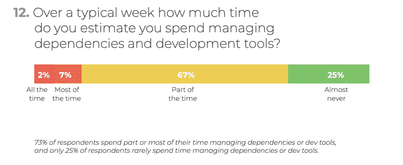

# 如何简化开发人员入职:作为代码的开发环境

> 原文：<https://www.freecodecamp.org/news/dev-env-as-code-c25f1ce83ec2/>

想象一下，仅仅十年前，系统管理员手动部署、配置和维护软件系统。这样做消耗了他们无尽的宝贵生命和精力。


Source: [http://dilbert.com/strip/2017-01-02](http://dilbert.com/strip/2017-01-02)

今天，在微服务架构时代，系统变得更加复杂。尝试手动维护操作和部署不再是可选的。现在我们做“DevOps”或“基础设施即代码”。我们已经知道，以声明性和形式化的方式描述软件系统对于自动和连续地部署应用程序是强制性的。

### 我们的开发环境怎么样？

虽然我们已经实现了应用程序的自动化部署，但是我们大多数人还没有将相同的技术应用到开发环境中。相反，让一个新的团队成员参与任何重要的项目通常需要几个小时(如果不是几天的话)的练习。

事情往往是这样的:

1.  **一名新开发人员被指向自述文件**
2.  **阅读冗长且大多过时的设置程序**
3.  **在开发者机器上安装需求，**
    **更新/降级版本等。**
4.  **尝试运行构建…等待 20 分钟**
5.  构建失败。试着找出问题所在。
6.  **同事问道。“哦，是的。你还需要做 X&Y**
7.  **转到 3**

在某个时刻经过多次迭代之后，构建以某种方式工作了。你不知道为什么，但现在那已经不重要了。当然，您没有更新文档，因为您不确定也不知道您是如何得到一个工作设置的。当前状态是否可以重现？所以如果你更新自述文件，你最好只添加你想出的东西。你不敢去掉你不理解或跳过的部分，因为它们对你没用。

太糟糕了，设置只在第一眼起作用。在接下来的几周里，你将不得不解决一些小问题，并添加一些没有列出的工具。可能调试还不行，或者你看不到上游依赖的源码。最终，它会变得平滑。只有当一个同事改变了需求中的一些东西时，通常需要两天时间，直到整个团队都注意到并相应地改变他们的环境。

不幸的是，痛苦不止于此。

### 它在我的机器上工作

你可能知道著名的短语“它在我的机器上工作”？一个 bug 只出现在一台机器上，在其他机器上很难重现的情况？**生产中发生了不好的事情，却无法在本地重现时的那种感觉？**不过，这并不奇怪，只要您在基于不同设置的不同平台上运行代码。


### **回去修理旧树枝上的东西**

另一个恼人的问题是当你需要在维护分支上修复一些东西的时候。修复实际的 bug 可能很容易，因为你知道如何修复它。然而，在你称之为完成之前，你需要能够构建和测试这个老怪物。这耗费了你无穷无尽的时间。

修补一个六个月前的技术堆栈是如此烦人。你必须处理所有那些旧的库和它们的版本。然而，你还是要让它以某种方式工作。


Photo by [JESHOOTS.COM](https://unsplash.com/@jeshoots?utm_source=medium&utm_medium=referral) on [Unsplash](https://unsplash.com?utm_source=medium&utm_medium=referral)

如果我们将“基础设施即代码”的思想应用到我们的开发环境中，所有这些痛苦都可以结束。为什么不通过以可执行的格式写下来，并将其签入到项目的源代码库中，使开发环境设置自动化、可靠地可再现，并进行版本控制呢？

### **开发环境代码**

毕竟，开发环境通常比使用它们的运行时应用程序更复杂。您通常需要在运行时需求之上添加所有的开发工具，比如构建工具、编译器、linters 和一个像样的编辑器/ IDE。

如果您想确保变更不会破坏任何东西，每个人都需要在 CI 构建运行的相同环境上编码、运行和测试。

所以让我们停止污染我们的自述文件，开始正式地写下安装说明，这样它们就可以被执行了。

#### 码头文件

Docker 文件是描述开发环境的一种非常简洁的方式。假设您想要将类似于'*asciidor*'的东西添加到项目的工具链中。您可以将下面一行添加到您的开发环境的 docker 文件中:

```
RUN apt-get install -y asciidoctor
```

一旦您将变更推送到存储库，docker 映像就会得到更新(自动)，所有团队成员在他们的开发环境中都有了这个新工具。我们需要点击一下就开始编码。


Photo by [Clément H](https://unsplash.com/@clemhlrdt?utm_source=medium&utm_medium=referral) on [Unsplash](https://unsplash.com?utm_source=medium&utm_medium=referral)

#### **自动化 IDE 设置**

> 免责声明:我附属于下面提到的一些工具。

如果您的开发工具有一个 UI，比如桌面 IDE，Docker 方法就有点笨拙。你可以把它们打包在 Docker 里，但是你必须通过 X11 公开 IDE 的 UI。另一种选择是使用像 vim 这样的终端编辑器，但是当然，对于我们大多数人来说这不是一个选项。

一些桌面 ide 有允许自动设置的工具。例如，Eclipse 有一个叫做 Oomph 的工具。Oomph 允许您声明性地描述 Eclipse IDE，包括插件、配置甚至工作区设置。(即 git 信息)。

到目前为止，最好的选择是运行在浏览器中的集成开发环境，比如新的忒伊亚集成开发环境。忒伊亚在 Eclipse 基金会下是开源的。它可以被看作是运行在浏览器和桌面上的 VS 代码，可定制性更强一些。

对于一个简单的基于 Docker 的开发环境，您可以将忒伊亚添加到您的 Docker 映像中。它提供了一个完整的 IDE，包括到您的工作区映像的终端。

下一步是将您的开发环境视为某种无服务器功能，您只在需要时才生成，完成后就忘记了。在线服务 [Gitpod](https://www.gitpod.io) 正是这么做的。

它与 GitHub 等代码托管平台相集成。它通过自动化消除了所有繁琐的转换。您在一些网站上看到代码，并想在真实的开发环境中尝试一下？Gitpod 会尽一切努力让你只需点击一下鼠标就能到达目的地。它让您提供自定义 Docker 文件或 Docker 图像，并运行忒伊亚 ide。

### **总结**

将从 DevOps 中学到的经验应用到我们的开发设置中可以节省我们很多宝贵的时间和精力。[active state 2018 年开发者调查](https://www.activestate.com/developer-survey-2018-open-source-runtime-pains/)用一些数字强调了这一点:



我们真的需要欢迎有着痛苦入职经历的新同事或贡献者吗？让我们跳过 *readme* 中的散文，编写代码来让我们的开发环境设置**自动化、可重复和版本化。**