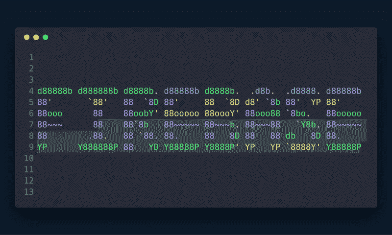
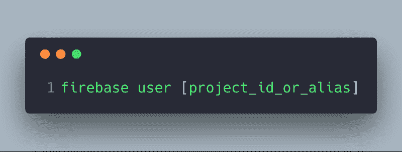
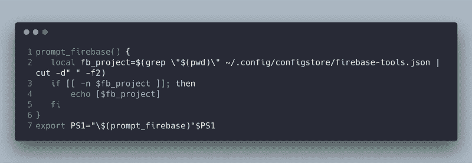
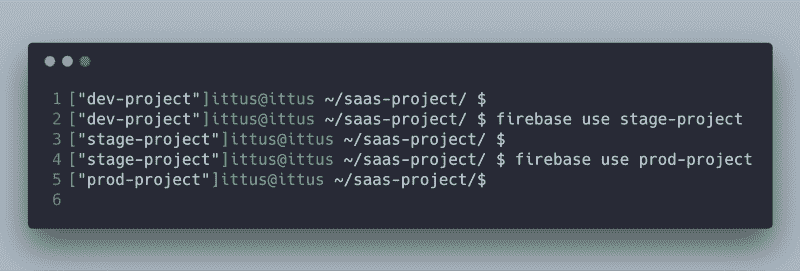
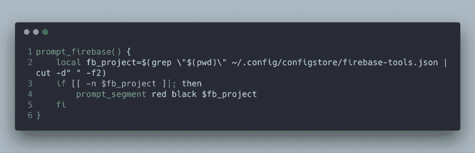
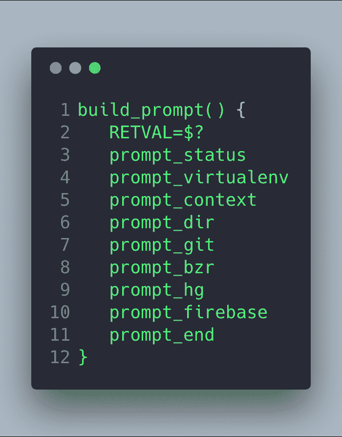
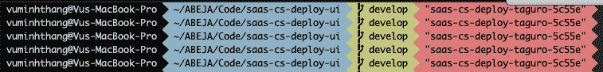

# 如何在命令行提示符下显示当前的 Firebase 项目名称，以防止出现危险的错误

> 原文：<https://www.freecodecamp.org/news/how-to-show-your-current-firebase-project-name-on-the-command-line-prompt-to-prevent-dangerous-1bfee6293811/>

用你的梯子

# 如何在命令行提示符下显示当前的 Firebase 项目名称，以防止出现危险的错误

Firebase

当处理一个有多个阶段(开发、试运行、生产)的项目时，开发人员使用命令`firebase use`在项目之间切换。在生产环境而不是开发环境中运行命令非常容易。这是非常危险的。

Command to switch between firebase project

**注**:你随时可以在我的 [GitHub 库](https://github.com/ittus/firebase-prompt)找到最新的脚本。

通常，开发人员只参与开发项目。他们只在检查或进行修补时才切换到生产环境。有几次我忘记切换回开发项目。我不小心更改了数据库，没有想到这会影响实际用户。

深入研究 *firebase CLI* ，我发现它使用 [configstore](https://github.com/yeoman/configstore) 来管理本地配置。所有配置都保存在 JSON 文件中，易于阅读。我创建了一个小脚本，用于在 **shell 提示符**上显示 firebase 项目名称。

### 如何设置它

#### 尝试

将以下脚本添加到`~/.bash_profile`的末尾:

Add script to ~/.bash_profile

然后运行`source ~/.bash_profile`或打开一个新的终端窗口:

Firebase project name is displayed as dev-project, stage-project and prod-project

#### iTerm2 与 oh-my-zsh

Oh-my-zsh 是一个流行的 Zshell 开源框架。我喜欢它是因为它有许多漂亮的终端主题和许多有用的插件。

这里我就用*不可知论者*主题:
编辑`~/.oh-my-zsh/themes/agnoster.zsh-theme`来举例说明

Script for oh-my-zsh

然后将`prompt_firebase`添加到`build_prompt`函数中:

Change build_promt function

最后一步，运行`source ~/.zshrc`或打开一个新的终端窗口:

saas-cs-deploy-taguro-5c55e is displayed as last text in terminal prompt

我希望这可以帮助你防止一个意想不到的(和糟糕的)情况。

**注**:你随时可以在我的 [GitHub 库](https://github.com/ittus/firebase-prompt)找到最新的脚本。