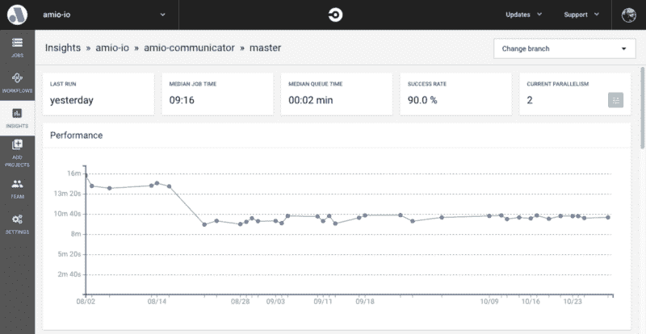

# 如何利用 CircleCI 测试并行性提高构建时间

> 原文：<https://www.freecodecamp.org/news/how-to-boost-build-time-with-circleci-test-parallelism-f89e5eab1397/>

作者卡雷尔·罗歇尔特

# 如何利用 CircleCI 测试并行性提高构建时间


为一个高度开发的项目提供一个无错误的 API 不是一件容易的事情。很可能，首先想到的是测试。对于一个中等规模的 API，您可能要编写数百甚至数千个端到端的测试。这些测试大大延长了构建时间。

在本帖中，我们将解释我们如何使用 CircleCI 测试并行性和 Gradle/Grails 为 [Amio](https://amio.io) 主服务解决构建时间过长的问题。

### CircleCI 设置

CircleCI 的[文档](https://circleci.com/docs/2.0/parallelism-faster-jobs/)很好地解释了如何使用他们的[命令行界面](https://circleci.com/docs/2.0/local-cli/) (CLI)工具来启用测试并行性。当我第一次开始研究它时，并不完全清楚返回的结果会是什么样子。我问自己，“那么，我运行这个命令，它会神奇地开始拆分我的测试吗？”嗯，当然不是！结果是应该在特定容器上执行的测试文件的列表。

这听起来复杂吗？我举个例子解释一下。

我们要做的第一件事是在`.circleci/config.yml`文件中设置 parallelism 键。来自 CircleCI 文档:

> `*parallelism*`键指定将设置多少个独立的执行器来运行作业的步骤。

任何大于 1 的值都将启用并行执行，但是为了这个例子，让我们使用 2。这样，每次 CircleCI 作业启动时，它将产生两个容器，这两个容器将执行相同的任务。

如果我们在没有额外配置的情况下使用 parallelism 键，它将只运行我们所有的测试两次。这不是我们想要的。我们想在容器之间拆分我们的测试。

这就是 CircleCI CLI 的用武之地。它提供了两个命令，当一起使用时，将我们的测试分成两个容器中相等的部分。

假设这些是我们项目中的测试文件:

```
src/integration-test/groovy/com/package1/Test1.groovysrc/integration-test/groovy/com/package1/Test2.groovysrc/integration-test/groovy/com/package2/Test3.groovysrc/integration-test/groovy/com/package2/Test4.groovysrc/integration-test/groovy/com/package2/Test5.groovy
```

自然，我们的项目中会有其他源文件；不仅仅是我们的测试。它们可能位于同一个`src/integration-test/…`目录中。为了实现我们的测试分割目标，我们需要只为项目选择测试文件。这是通过使用 [glob](https://circleci.com/docs/2.0/parallelism-faster-jobs/#globbing-test-files) 命令完成的:

```
circleci tests glob "src/integration-test/**/*.groovy"
```

这个命令将输出我们的测试列表(全部 5 个)。？现在我们使用 split 命令在容器之间分割它们:

```
circleci tests glob "src/integration-test/**/*.groovy" | circleci tests split --split-by=timings
```

`split`命令提供了几种分割测试的策略，但是`timings`是我最喜欢的。它使用 CircleCI 收集的计时数据(这必须通过 [store_test_results](https://circleci.com/docs/2.0/configuration-reference/#store_test_results) 键启用)来将测试分成执行时间相似的部分。容器索引是自动的。我们可以在每个容器上运行相同的命令。在我们的示例中，在容器 0 上运行该命令可能会输出:

```
src/integration-test/groovy/com/package1/Test1.groovysrc/integration-test/groovy/com/package2/Test3.groovy
```

在容器 1 上:

```
src/integration-test/groovy/com/package1/Test2.groovysrc/integration-test/groovy/com/package2/Test4.groovysrc/integration-test/groovy/com/package2/Test5.groovy
```

我说“可能”是因为实际结果取决于计时数据。如你所见，每个容器都完成了一半的测试。

### Gradle setup

在 CircleCI 分开测试是比较容易的部分。困难的部分是让 Gradle 只执行 split 命令结果中的测试。如果我们使用 JavaScript 和 Mocha，那就简单多了。Mocha 接受应该执行的文件列表。在 Gradle 3 中，我一直使用这个命令来运行测试:`./gradlew check -i`

Gradle 的[文档](https://docs.gradle.org/current/userguide/gradle_wrapper.html)并没有真正的帮助。仅仅弄清楚检查任务做什么是一件痛苦的事情。幸运的是，可以将我们的测试列表作为参数传递给 Gradle 任务。

```
./gradlew check -i -PtestFilter="`circleci tests glob "src/integration-test/**/*.groovy" | circleci tests split --split-by=timings`"
```

现在，当`check`任务启动时，它可以访问`testFilter`参数。为了让一切正常工作，我们还需要添加一些代码来处理我们的 **build.gradle** 中的参数:

```
integrationTest {  if (project.hasProperty("testFilter")) {    List<String> props = project.getProperties().get("testFilter").split("\\s+")    props.each {      include(it.replace("src/integration-test/groovy/com/", "**/").replace(".groovy", ".class"))    }  }}
```

请注意，参数是作为单个字符串传递给任务的。在上面的代码块中，第 3 行包含将其拆分回行的逻辑。调用 include 将告诉 Gradle 只执行我们包含的测试。现在我们可以包括所有的行，我们很好，对不对？

没有。Gradle 不知道如何处理源文件。它只理解类。我们需要将编译好的类文件传递给它。

这有两个问题。首先，编译后的类不在同一个目录中。第二，后缀不是。很棒但是很棒。

为了克服第一个问题，我们用**/替换了常见的前缀。这表示，“在根目录及其所有子目录中查找。”当然，你可以用类似于`build/classes/integrationTest/com`的东西来代替它。那更干净，但不是必须的。只要测试类名是唯一的，这应该是安全的。上面代码块中的第 5 行包含了解决这两个问题的逻辑。

最后，你的`.circleci/config.yml`应该是这样的(只是相关的部分):

```
- run:    # This is just for debugging purposes, you can omit this step    name: test splitting output    command: circleci tests glob “src/integration-test/**/*.groovy” | circleci tests split --split-by=timings | xargs -n 1 echo
```

```
- run:    name: test    command: ./gradlew check -i -PtestFilter="`circleci tests glob “src/integration-test/**/*.groovy” | circleci tests split --split-by=timings`"
```

### 结论

就是这样！很简单，对吧？嗯，这比应该做的要多一点。让我们的测试时间减少将近一半绝对是值得的！通过应用测试并行，我们将构建时间从大约 15 分钟减少到了 9 分钟。

