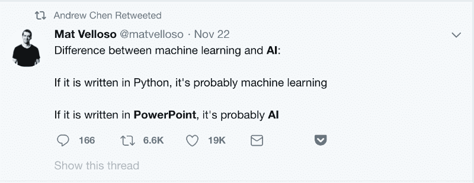
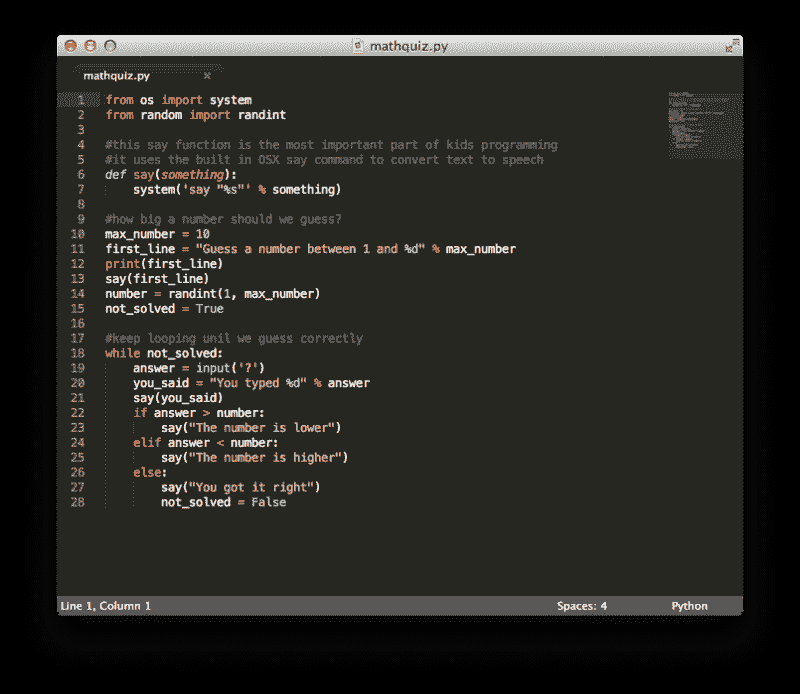
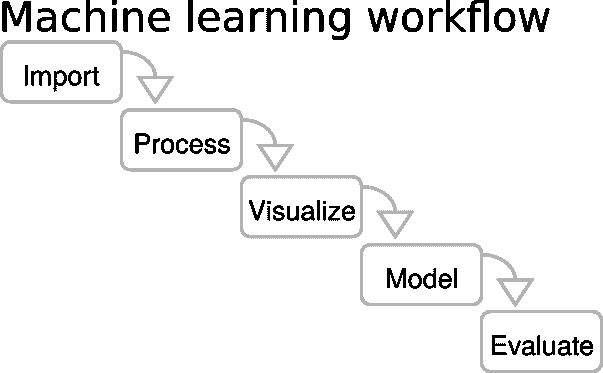
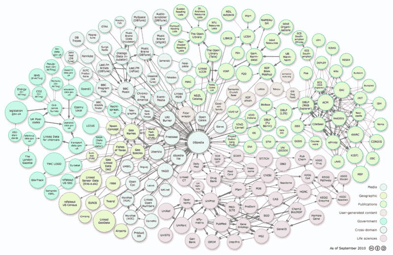
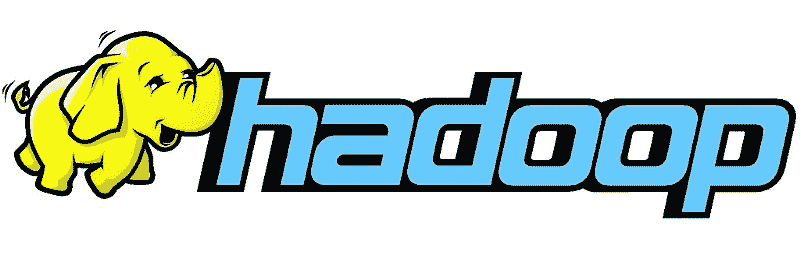

# 如何通过人工智能炒作成为一名机器学习工程师

> 原文：<https://www.freecodecamp.org/news/how-to-cut-through-the-ai-hype-to-become-a-machine-learning-engineer-b0d2c5e4ae02/>

我相信你已经听说过令人难以置信的人工智能应用——从可以击败世界上最好的围棋选手的程序到自动驾驶汽车。

问题是，大多数人都被人工智能的炒作所吸引，将技术讨论与哲学讨论混为一谈。

如果你希望打破人工智能的宣传，并与实际实现的数据模型一起工作，那么就去接受数据工程师或机器学习工程师职位的培训。

不要在 AI 文章里面寻找有趣的 AI 应用。在数据工程或机器学习教程中寻找它们。

A Twitter screenshot that perhaps best summarizes

这些是我构建[这个有趣的小刮刀的步骤，我构建这个刮刀是为了分析](https://github.com/Rogerh91/Springboard-DS2/blob/master/Springboard%20DS2%20Capstone%20Project%20-%20Diversity%20in%20Bootcamps.ipynb)不同编码训练营中的性别多样性。这是我为跳板公司的[新人工智能/人工智能在线训练营做研究时走的路。](https://www.springboard.com/workshops/ai-machine-learning-career-track)

这里有一个逐步进入机器学习领域的指南，每个领域都有一组重要的资源。

### **1。开始复习你的 Python 和软件开发实践**

你会想从拥抱 Python 开始，Python 是大多数机器学习工程师的首选语言。

方便的脚本语言是大多数数据工程师和数据科学家的首选工具。大多数数据工具都是在 Python 中构建的，或者构建了 API 访问以方便 Python 访问。

谢天谢地，Python 的语法相对容易掌握。这种语言有大量的文档和培训资源。它还支持从函数式编程到面向对象编程的各种编程范式。

有一件事可能有点难以理解，那就是组织和激活代码所需的制表符和空格。在 Python 中，空白真的很重要。

作为一名机器学习工程师，你将在一个团队中工作，构建复杂的、通常是关键任务的应用程序。因此，现在也是更新软件工程最佳实践的好时机。

学会使用 Github 等协作工具。养成使用测试框架(如 nose)为代码编写全面单元测试的习惯。使用 Postman 等工具测试您的 API。使用像 Jenkins 这样的 CI 系统来确保你的代码不会中断。培养良好的代码审查技能，以便更好地与未来的技术同事合作。

**读一件事** : [数据科学最好的 Python IDE 是什么？](https://www.kdnuggets.com/2018/11/best-python-ide-data-science.html)快速通读一遍，这样您就可以了解您希望使用什么工具集来在数据集上实现 Python。

我自己用的是 Jupyter 笔记本，因为它预装了你会用到的大多数重要的数据科学库。它带有一个简单、干净的交互界面，允许你动态编辑你的代码。

Jupyter Notebook 还带有扩展功能，允许您轻松地与全世界分享您的成果。生成的文件也非常容易在 Github 上使用。

**要做的一件事** : [熊猫食谱](https://github.com/jvns/pandas-cookbook)允许你进入熊猫框架的实例，这是最强大的数据操作库之一。您可以快速地通过一个示例了解如何使用数据集。

### **2。研究机器学习框架和理论**

一旦你开始使用 Python 并进行实践，是时候开始研究机器学习理论了。

你将学习使用什么算法。对机器学习背后的理论有一个基本的了解会让你轻松地实现模型。

**需要阅读的一件事** : [机器学习新手的十大算法之旅](https://towardsdatascience.com/a-tour-of-the-top-10-algorithms-for-machine-learning-newbies-dde4edffae11)将帮助你从基础开始。你会知道没有“免费的午餐”。没有哪种算法能给你每种设置的最佳结果，所以你必须钻研每种算法。

**要做的一件事**:在 Python 课程中玩互动的[免费机器学习](https://www.springboard.com/resources/learning-paths/machine-learning-python#!)——发展您的 Python 技能并开始实现算法。

### **3。开始使用数据集并进行实验**

你已经掌握了工具和理论。你应该考虑做一些可以帮助你提高技能的小项目。

**需要阅读的一件事**:为你的第一个数据科学项目看一看[的 19 个免费公共数据集，并开始寻找你可以在网上找到不同数据集的地方。](https://www.springboard.com/blog/free-public-data-sets-data-science-project/)

**要做的一件事** : [Kaggle 数据集](https://www.kaggle.com/datasets)将让你处理大量公开可用的数据集。这个集合的酷之处在于，你可以看到某些数据集有多受欢迎。您还可以查看使用相同数据集构建的其他项目。

### **4。使用 Hadoop 或 Spark 扩展您的数据技能**

既然您正在较小的数据集上练习，那么您将希望学习如何使用 Hadoop 或 Spark。数据工程师处理 TB 级甚至 Pb 级的实时生产级数据流。通过学习大数据框架来提高技能。

**要读的一件事**:这篇短文[Hadoop 和 Spark 如何叠加？](https://logz.io/blog/hadoop-vs-spark/)将帮助您了解 Hadoop 和 Spark，以及它们之间的对比。

**要做的一件事**:如果你想马上开始使用大数据框架，[托管在 Databricks 上的 Spark Jupyter 笔记本](https://databricks-prod-cloudfront.cloud.databricks.com/public/4027ec902e239c93eaaa8714f173bcfc/346304/2168141618055109/484361/latest.html)提供了该框架的教程级介绍，并让你用生产级代码示例进行实践。

### **5。使用深度学习框架，如 TensorFlow**

你已经探索完了机器学习算法，并使用了不同的大数据工具。

现在是时候进行那种强大的强化学习了，它已经成为新进展的焦点。学习 TensorFlow 框架，你将处于机器学习工作的前沿。

**要读的一件事**:读[什么是张量流？](https://www.infoworld.com/article/3278008/tensorflow/what-is-tensorflow-the-machine-learning-library-explained.html)了解这个强大的深度学习框架背后发生了什么。

**要做的一件事** : [TensorFlow 和没有博士学位的深度学习](https://codelabs.developers.google.com/codelabs/cloud-tensorflow-mnist/#0)是由谷歌建立的一个互动课程，它将放在幻灯片中的理论与带有代码的实践实验室相结合。

### **6。开始处理大型生产级数据集**

现在，您已经使用了深度学习框架，可以开始处理大型生产级数据集了。

作为一名机器学习工程师，你将在管理大量数据和部署系统方面做出复杂的工程决策。

这将包括从 API 和网络抓取、SQL + NoSQL 数据库收集数据，当你使用它们时，使用管道框架，如 Luigi 或 Airflow。

当您部署应用程序时，您可以使用基于容器的系统(如 Docker)来获得可伸缩性和可靠性，并使用工具(如 Flask)来为您的应用程序创建 API。

**需要阅读的一件事** : [为机器学习处理大数据文件的 7 种方法](https://machinelearningmastery.com/large-data-files-machine-learning/)是一个关于如何处理大数据集的很好的理论练习，可以作为一个方便的战术清单来使用。

**要做的一件事** : [公开可用的大数据集](https://hadoopilluminated.com/hadoop_illuminated/Public_Bigdata_Sets.html)是一个可以获得非常大的数据集的地方的列表——准备在上面实践你新发现的数据工程技能。

### 7 .**。实践，实践，实践，建立一个文件夹，然后一份工作**

最后，你已经到了可以建立工作机器学习模型的地步。推进你的机器学习职业生涯的下一步是在一家拥有这些大型数据集的公司找到一份工作，这样你就可以每天将你的技能应用到一个前沿的机器学习问题上。

**必读的一件事** : [41 个必备的机器学习面试问题(附答案)](https://www.springboard.com/blog/machine-learning-interview-questions/)将帮助你练习在机器学习面试中获得王牌所需的知识。

**要做的一件事**:走出去，在 [Meetup](http://meetup.com/) 上寻找致力于机器学习或数据工程的聚会——这是结识同行和潜在招聘经理的好方法。

希望这篇教程有助于打破对人工智能的大肆宣传，让你可以使用一些实用和定制的东西。如果你觉得你还需要一点点，我工作的公司 Springboard，[提供了一个致力于人工智能和机器学习的职业跟踪训练营，有工作保证](https://www.springboard.com/workshops/ai-machine-learning-career-track)，还有机器学习专家一对一的指导。