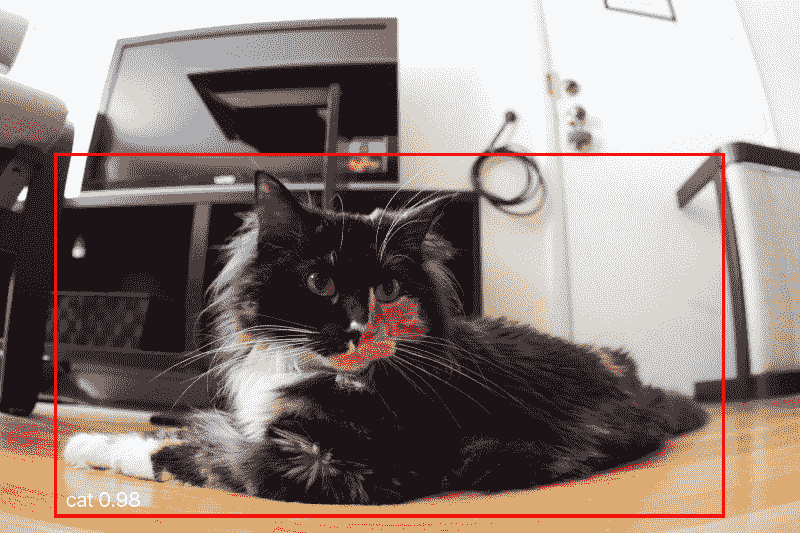
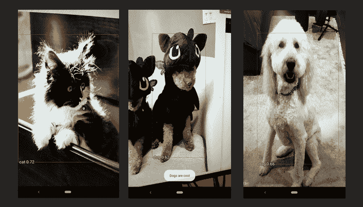
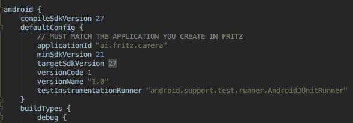
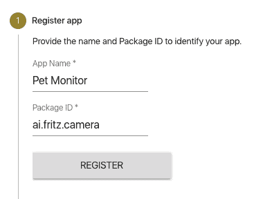

# Fritz 对象检测指南:使用机器学习在 Android 中构建宠物监控应用程序

> 原文：<https://www.freecodecamp.org/news/a-guide-to-object-detection-with-fritz-build-a-pet-monitoring-app-in-android-with-machine-learning-a8ed500978e5/>

萧立伦

# Fritz 对象检测指南:使用机器学习在 Android 中构建宠物监控应用程序



无论是[为农民检测植物损害](https://heartbeat.fritz.ai/community-spotlight-nuru-a-mobile-app-by-plantvillage-to-detect-crop-disease-in-africa-28d142bf63d5)，跟踪路上的车辆，还是监控你的宠物——[**物体检测**](https://fritz.ai/features/object-detection.html) 的应用层出不穷。随着 **TensorFlow Lite** 和 **Core ML 等移动框架的兴起，**越来越多的移动应用利用机器学习的力量来创建让我们惊叹的功能。

#### *那么到底什么是物体检测呢？*

简单地说，对象检测*通过边界框识别和定位图像或直播视频中的特定项目。*



The middle one is a poodle dressed up as Toothless for Halloween

但是创造由机器学习驱动的功能并不容易。许多工程团队无法证明时间和资源的合理性。您需要合适的内部专家来收集数据、训练模型并迭代性能和准确性。可以理解的是，在产品团队要求快速为最终用户交付价值的压力下，潜在的功能被搁置在积压的深渊中。

在这篇文章中，我将向您展示任何 Android 开发人员如何使用实时对象检测来创建一个检测和识别宠物的应用程序——全部在 30 分钟内完成。为此，我将使用 [Fritz SDK](https://fritz.ai) (完全公开，我在 Fritz 工作)，这使得在没有任何经验的情况下更容易利用机器学习能力。

### 入门指南

为了开始使用 Fritz SDK，我们将在我们创建的示例应用程序中添加必要的依赖项。

#### 1.首先，创建一个 Fritz 帐户

[在这里注册](https://fritz.ai?utm_source=medium&utm_campaign=freecodecamp)并按照[的入门指南](https://docs.fritz.ai/get-started.html?utm_source=medium&utm_campaign=freecodecamp)进行操作。

#### **2。**克隆示例相机应用程序

设置一个包含视频源和摄像头代码的框架应用程序。在本教程中，我们不会深入到 [Camera 2 API](https://developer.android.com/reference/android/hardware/camera2/package-summary) 中，但如果您有任何问题，请留下评论。

```
git clone https://github.com/fritzlabs/camera-sample-app
```

#### **3。**在 webapp 中注册 Android 应用

您需要向 Fritz 注册您的应用程序才能使用 ML-features。当你将应用添加到 Fritz 时，使用与 **app/build.gradle.** 相同的应用 Id (ai.fritz.camera)



In your app/build.gradle, notice the applicationId field



The package ID must match the applicationId shown above for your application. In this case, the package id is **ai.fritz.camera**

确保记下步骤 5 的 API 键。如果您需要再次访问它，您可以前往项目设置>您的应用程序(宠物监视器)>显示 API 键(在选项菜单中)。

#### **4。**在 **app/build.gradle 中添加 FritzCore +依赖项**

确保添加 Fritz 存储库。这将允许您下载必要的依赖项:

在 dependencies 部分，添加这两个库:

```
dependencies {    implementation "ai.fritz:core:2.0.0"    implementation "ai.fritz:vision-object:2.0.0"}
```

#### 5.配置 SDK

使用您在步骤 3 中获得的 API 密钥调用**应用程序**或 **MainActivity onCreate** 生命周期方法中的 **Fritz.configure** 。

这样，您就可以在应用中使用对象检测了。

### 检测实时视频中的猫狗

现在让我们开始有趣的事情。我们将跳转到 MainActivity，并对视频流中传入的每一帧使用对象检测预测器。

#### 1.获取 FritzVisionObjectPredictor 的实例

预测器接受一个 **FritzVisionImage** 并返回一个检测到的**fritzvisioningobjects**的列表。

#### **2。**将每一帧转换成一个 **FritzVisionImage** 对象

使用 **fromBitmap** 或 **fromMediaImage** 静态方法从**位图**或**媒体创建对象。图像**对象。对于示例应用程序，使用 MediaImage 、中的**，它也接受应用于来自相机的图像的旋转。**

旋转取决于设备旋转和相机方向传感器。 **cameraId** 标识设备上正在使用的活动摄像机(正面、背面等)。)，并且可以用下面的 helper 方法得到旋转角度。

```
int rotation = FritzVisionOrientation.getImageRotationFromCamera(this, cameraId);
```

最后，用**图像**和旋转值创建一个 **FritzVisionImage** 对象。

#### **3。运行预测**

将图像传递到预测器中，以检测图像中的不同对象。

#### **4。过滤结果并显示边界框**

每个 **FritzVisionObject** 都带有一个标签、一个置信度得分和一个边界框，显示它在原始图像上的位置。在这种情况下，我们只关心宠物(特别是猫和狗)，所以我们可以过滤掉其他项目。

最后，在你的宠物周围显示边界框。 **FritzVisionObject** 有一个方便的方法叫做 **drawOnCanvas** ，可以很容易的显示检测到的物体。

以下是渲染回调后的完整代码:

注意盒子上的比例因子。这是因为**媒体。我们用来创建 FritzVisionImage 对象的 Image** 对象与预览视窗的大小相同。在相机样本应用程序中，它是 1280 x 960。边界框将具有与预览大小相关联的坐标。因为我们想在全屏上显示，我们需要将结果缩放到手机的视口。

下面是最终结果:

完成的代码，看一下 [GitHub repo](https://github.com/fritzlabs/pet-monitor-android) 。

### 为什么这很有用

有了这个基本应用程序背后的机器学习功能，你可以创建大量不同的功能(既实用又愚蠢):

*   如果遛狗的人还没回来，用短信提醒主人。
*   录制一条信息，告诉你的狗“坐下！”当他们独自在房间里跑来跑去的时候。我打赌你也能在这一刻捕捉到你的狗的有趣照片。
*   当检测到一只猫/狗时，向用户显示一条消息(请看完整的代码示例)
*   摄像头检测到猫就报警(我过敏)。

当然，没有多少人有多余的 Android 平板电脑/手机可以用作昂贵的宠物监控相机，但这只是许多不同可能性中的一个简单例子，你可以如何使用 [Fritz](https://fritz.ai?utm_source=medium&utm_campaign=freecodecamp) 创建一个带有[对象检测](https://docs.fritz.ai/features/object-detection/about.html?utm_source=medium&utm_campaign=freecodecamp)的应用程序。我迫不及待地想看看世界上所有有创造力的开发人员使用对象检测构建了什么。

有主意了吗？留言评论！

我是弗里茨公司的首席开发人员，专门研究移动机器学习。如果你正在寻找创建由 AI/ML 驱动的特性，我们提供预建的 API([图像分割](https://docs.fritz.ai/features/image-segmentation/about.html?utm_source=medium&utm_campaign=freecodecamp)、[图像标记](https://docs.fritz.ai/features/image-labeling/about.html?utm_source=medium&utm_campaign=freecodecamp)、[样式转换](https://docs.fritz.ai/features/style-transfer/about.html?utm_source=medium&utm_campaign=freecodecamp))和[定制模型](https://docs.fritz.ai/custom-models/overview.html?utm_source=medium&utm_campaign=freecodecamp)支持。