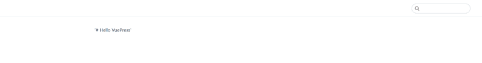
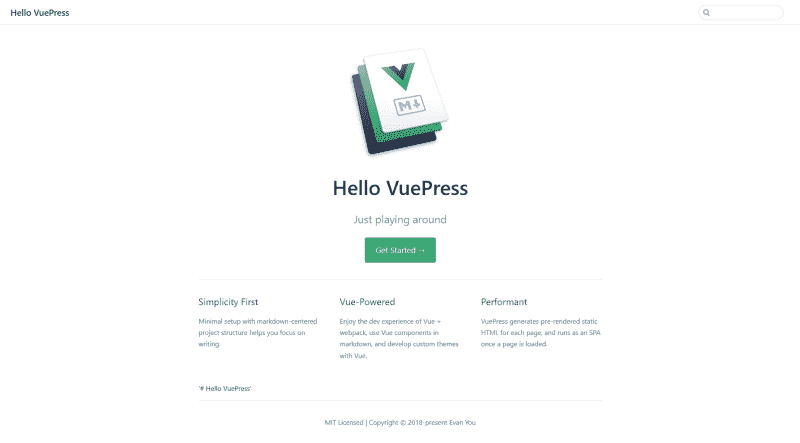
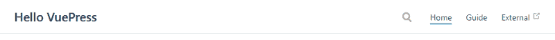
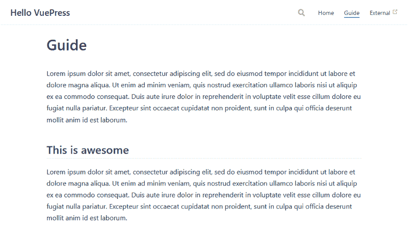
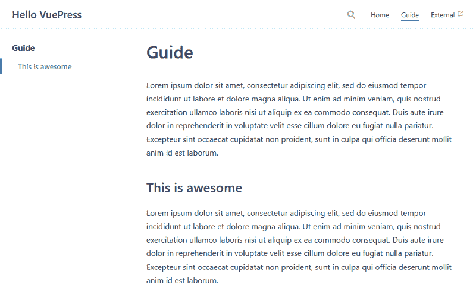
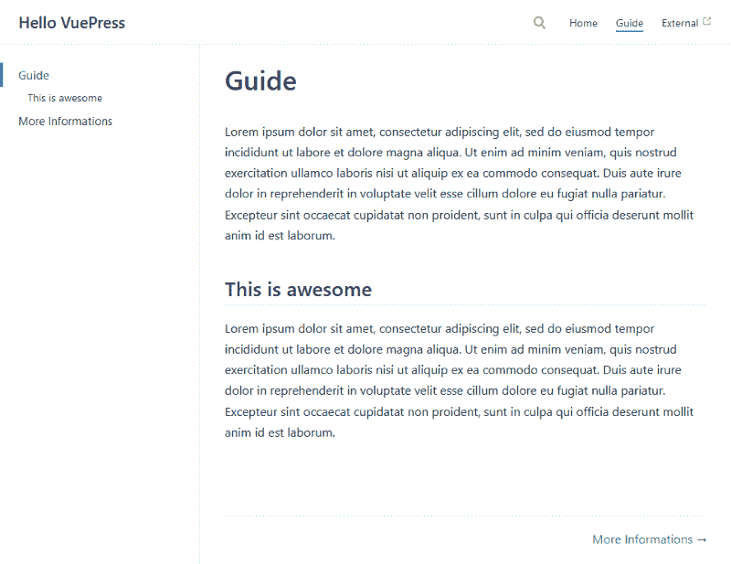

# 如何使用 vexpress 创建文档网站

> 原文：<https://www.freecodecamp.org/news/how-to-create-a-documentation-website-using-vuepress-eeabe8a99045/>

#### VuePress 简介及其使用方法

为你的最新项目创建文档网站可能会令人生畏，而且会花费很多时间。大多数情况下，你只是想有一个现成的网站，这样其他人就可以查看和/或使用你的项目。

VuePress 使创建文档网站变得容易，无需编写大量代码。

### 什么是 VuePress？

VuePress 是一个 Vue 驱动的静态站点生成器，它从 markdown 文件生成 HTML 页面。这些可以让你专注于编写文档，而不是致力于完善你的网站。

在 VuePress 中，每个页面都有自己的预渲染静态 HTML，因此它提供了很好的加载性能，并且它也是真正的 SEO(搜索引擎优化)友好的。

它还提供了一个默认的主题，通过为您提供一个现成的主题来启动您的开发过程。这些也用于[官方 VuePress 文档网站](https://vuepress.vuejs.org/)。

### 安装 VuePress 和创建项目

安装 VuePress 并创建一个项目或将 VuePress 添加到一个现有项目中非常简单。您可以使用 NPM 安装 VuePress:

```
npm install -g vuepress
```

或者通过使用纱线:

```
yarn global add vuepress
```

您也可以将 VuePress 添加到现有项目中。为此，我推荐 yarn，因为如果项目将 Webpack 3.x 作为依赖项，Npm 将无法生成正确的依赖树。

要将 VuePress 添加到现有项目，请使用:

```
yarn add -D vuepress
```

### 运行项目

要运行一个项目，打开一个命令行，进入您的工作目录并键入 *vuepress dev* 来启动开发服务器。

首先我们会得到一个 404 错误，说这里什么都没有。这是因为我们还没有创建任何降价文件，所以让我们快速使用命令行来创建我们的第一个降价文件:

```
echo '# Hello VuePress' > README.md
```

输入这个命令后，您将看到页面刷新，显示一个搜索栏以及我们在 echo 命令中指定的文本。VuePress 自动让用户搜索网站中包含的所有 h2 和 h3 标签。

您可以看到下面页面的图像:



Figure 2: Start VuePress Site

### 添加配置文件

没有任何配置，页面就不能提供很多功能，用户也无法在站点中导航。要添加定制配置，我们需要创建一个 *config.js* 文件，我们需要将它放入一个*中。vuepress* 文件夹，其中将包含所有 vuepress 特有的文件。

因此，我们的新项目结构将如下所示:

```
|-- Project
   |-- README.md
   |-- .vuepress
      |-- config.js
```

现在我们将创建一个 Javascript 对象，我们可以用它来指定我们的配置。我们将在其中指定标题和描述:

```
module.exports = {

 title: 'Hello VuePress',

 description: 'Just playing around'
}
```

如果你现在看一下这个网站，你会看到它有一个标题。如果你使用开发者工具检查网站，你应该在标题中看到一个*元描述标签*。

### 默认主题

正如本文开头提到的，VuePress 为主页、导航条、侧边栏等等提供了一个默认主题。

默认主题有一个经典的文档站点外观(至少对我来说是这样),对于为你的网站风格提供一个起点非常有帮助。

您可以从 [VuePress 文档](https://vuepress.vuejs.org/theme/default-theme-config.html#homepage)中获取默认主题。

对于主页的样式，使用了 YAML front matter，我们唯一需要做的就是将它复制并粘贴到我们的根 README.md 文件中。

所以现在我们的根 README.md 文件看起来像这样:

```
---
home: true
heroImage: https://vuepress.vuejs.org/hero.png
actionText: Get Started →
actionLink: /guide/
features:
- title: Simplicity First

 details: Minimal setup with markdown-centered project structure helps you focus on writing.
- title: Vue-Powered

 details: Enjoy the dev experience of Vue + webpack, use Vue components in markdown, and develop custom themes with Vue.
- title: Performant

 details: VuePress generates pre-rendered static HTML for each page, and runs as an SPA once a page is loaded.
footer: MIT Licensed | Copyright © 2018-present Evan You
---

'# Hello VuePress'
```

你可以在下图中看到新的主页设计:



Figure 3: Default Homepage Design

### 创建导航栏

VuePress 允许你通过在 *config.js* 文件中指定一个 *themeConfig* 对象并向其传递一个 nav 对象数组来添加导航条。

就像在官方文档中一样，我们将添加一个到指南页面的链接，到目前为止还没有创建，以及一个到 google.com 的链接。

```
module.exports = {
   title: 'Hello VuePress',
   description: 'Just playing around',
   themeConfig: {
       nav: [
         { text: 'Home', link: '/' },
         { text: 'Guide', link: '/guide/' },
         { text: 'External', link: 'https://google.com' },
       ]
   }
}
```



Figure 4: Navbar

### 创建路线

现在我们有了一个导航栏，可以在不同的页面之间移动，我们需要创建一个指南页面。

VuePress 实现了一个易于使用的路由系统。对于 */guide/* 路径，它在指南目录中搜索 README.md 文件。

创建目录和文件后，我们的项目结构如下所示:

```
|-- Project
   |-- README.md
   |-- .vuepress
      |-- config.js
   |-- guide
      |-- README.md
```

作为 README.md 文件的内容，我们将只输入一些标题和 lorem ipsum 文本。

```
# Guide

Lorem ipsum dolor sit amet, consectetur adipiscing elit, sed do eiusmod tempor incididunt ut labore et dolore magna aliqua. Ut enim ad minim veniam, quis nostrud exercitation ullamco laboris nisi ut aliquip ex ea commodo consequat. Duis aute irure dolor in reprehenderit in voluptate velit esse cillum dolore eu fugiat nulla pariatur. Excepteur sint occaecat cupidatat non proident, sunt in culpa qui officia deserunt mollit anim id est laborum.

## This is awesome

Lorem ipsum dolor sit amet, consectetur adipiscing elit, sed do eiusmod tempor incididunt ut labore et dolore magna aliqua. Ut enim ad minim veniam, quis nostrud exercitation ullamco laboris nisi ut aliquip ex ea commodo consequat. Duis aute irure dolor in reprehenderit in voluptate velit esse cillum dolore eu fugiat nulla pariatur. Excepteur sint occaecat cupidatat non proident, sunt in culpa qui officia deserunt mollit anim id est laborum.
```

现在，如果我们导航到指南页面，我们会看到:



Figure 5: Guide Page

### 创建边栏

大多数文档网站都提供了侧边栏，便于在单个页面的不同部分之间导航。

创建这样一个侧边栏最简单的方法是在我们的*主题配置*中指定*侧边栏:“auto”*。

代码:

```
module.exports = {
   title: 'Hello VuePress',
   description: 'Just playing around',
   themeConfig: {
       nav: [
         { text: 'Home', link: '/' },
         { text: 'Guide', link: '/guide/' },
         { text: 'External', link: 'https://google.com' },
       ],
       sidebar: 'auto'
   }
}
```

这会生成一个侧栏:



Figure 6: Auto-Sidebar

这在我们的用例中是很棒的，但是如果你有额外的降价文件，就不好用了。对于这种情况，您需要为每个“主”页面指定一个包含数组的侧边栏对象。

对于这个例子，我将创建另一个名为“ *More Informations.md* ”的降价文件，它也位于指南目录中。

该文件只包含一些文本:

```
# More Informations

More Informations about our awesome project
```

如果你再看一下侧边栏，你会发现什么都没有改变。所以自动设置对附加的减价文件不起作用。为此，我们需要更改侧栏代码，如下所示:

```
module.exports = {
   title: 'Hello VuePress',
   description: 'Just playing around',
   themeConfig: {
       nav: [
         { text: 'Home', link: '/' },
         { text: 'Guide', link: '/guide/' },
         { text: 'External', link: 'https://google.com' },
       ],
       sidebar: {
           '/guide/': [
               '',
               'More Informations'
           ]
       }
   }
}
```

如你所见，我们为*指南/* 路线添加了一系列侧边栏链接，这样我们就可以导航到*更多信息*页面。



Figure 7: Custom-Sidebar

### 结论

VuePress 是一款创建文档网站的便捷工具，无需编写大量代码。它有许多可用的特性，可以轻松地构建出色的用户体验。

在这篇文章中，我只能介绍非常少量的特性。如果你有兴趣了解更多关于 VuePress 及其功能的信息，请查看官方文档，如果你想要另一篇关于 VuePress 的文章，请在下面留下评论。

如果你喜欢这篇文章，可以考虑订阅我的 Youtube 频道，在社交媒体上关注我。

本文涵盖的代码可以从 [Github 资源库](https://github.com/TannerGilbert/Tutorials/tree/master/VuePress%20Documentation%20Website)获得。

如果你有任何问题或批评，可以通过 [Twitter](https://twitter.com/Tanner__Gilbert) 或评论区联系我。