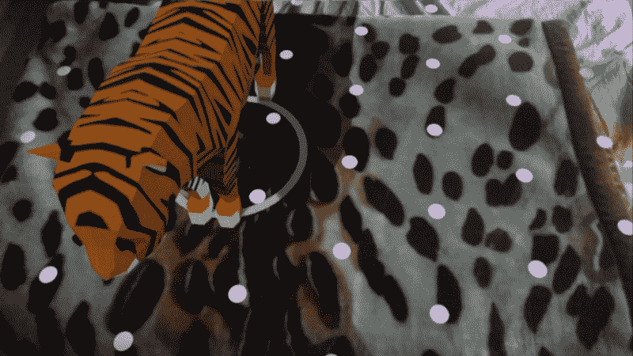

# 如何使用 ARCore 构建增强图像应用程序

> 原文：<https://www.freecodecamp.org/news/how-to-build-an-augmented-images-application-with-arcore-93e417b8579d/>

作者:阿尤施·贾恩

# 如何使用 ARCore 构建增强图像应用程序


> 本文原帖[此处](https://ayusch.com/arcore-building-augmented-images-application)。

在本教程中，您将学习如何通过将锚点设置为特定场景而不是常规平面，在现实世界中放置 3D 模型。通过谷歌的 ARCore ,你可以增强 ARCore 能够识别的 2D 图像，然后在其上放置 3D 模型。

您提供一些参考图像，ARCore 跟踪确定这些图像在环境中的物理位置。增强图像已经广泛应用于书籍、报纸、杂志等。

但是在你更深入地钻研这个教程之前，你必须先看看下面的文章，作为这个教程的先决条件:

*   [**什么是 ARCore 被 Google？**](https://ayusch.com/what-is-arcore/)
*   [**使用 ARCore 构建增强现实 app。**](https://ayusch.com/building-arcore-app-android-studio/)

一旦你完成了这两个，你就会对 ARCore 和 Sceneform 中的一些术语有一个基本的了解，比如场景、锚点、节点、TransformableNode 等等。

### 什么是增强图像？

[根据开发者文档](https://developers.google.com/ar/develop/c/augmented-images/)显示，ARCore 中的**增强图像**可以让你在用户环境中构建可以响应 2D 图像的 AR 应用，如海报或产品包装。您提供一组参考图像，一旦在摄像机视图中检测到这些图像，ARCore tracking 就会告诉您这些图像在 AR 会话中的物理位置。

基本上，使用增强图像，你可以把一个简单的 2D 图像变成一个增强图像，它可以被你的应用程序识别，然后用来在它上面放置一个 3D 模型。

### 当您可能想要使用增强图像时

在使用增强图像之前，您可能需要考虑以下限制:

*   您的用例不得涉及同时扫描 20 张以上的图像(因为 ARCore 一次最多只能跟踪 20 张图像)。
*   现实世界中的实物尺寸必须大于 15 厘米 X 15cm 厘米，并且是平的。
*   你不想追踪移动的物体。ARCore 无法跟踪移动图像，尽管它可以在图像停止时开始跟踪。
*   ARCore 使用参考影像中的特征点，可以存储多达 1000 幅影像的特征点信息。

### 选择好的参考图像

以下是选择好的参考图像以提高 ARCore 检测能力的一些技巧:

*   增强图像支持 PNG、JPEG 和 JPG 格式。
*   检测是基于高对比度的点，因此彩色和黑/白图像都被检测到，而不管使用的是彩色还是黑/白参考图像。
*   图像的分辨率必须至少为 300 X 300 像素。
*   使用高分辨率图像并不意味着性能提高。
*   必须避免带有重复特征的图像，如图案和圆点。
*   使用 **arcoreimg** 工具评估您的参考图像的质量。建议至少 75 分。

### 如何使用 arcoreimg 工具:

*   从以下链接下载适用于 Android 的 ARCore SDK:
*   将 zip 文件的内容解压到你喜欢的任何地方。
*   导航到提取的文件夹，然后进入工具-> arcore img-> windows(Linux/MAC OS，无论您使用什么)
*   在此位置打开命令提示符。
*   现在输入这个命令:

```
arcoreimg.exe eval-img --input_image_path=dog.png
```

用您的映像的完整路径替换**dog.png**。

### 增强图像应用程序入门

既然您已经熟悉了 ARCore 和 Sceneform，并且选择了一个**分数为 75+** 的好的参考图片，那么是时候开始编写应用程序了！！

#### 创建自定义片段

我们将创建一个自定义片段来添加到我们的活动中。我们需要一个自定义片段，因为我们将改变默认片段的一些属性。

创建一个名为**“custom fragment”**的类，并从 **ArFragment** 扩展而来。以下是习惯片段的代码:

```
package com.ayusch.augmentedimages;
```

```
import android.util.Log;
```

```
import com.google.ar.core.Config;import com.google.ar.core.Session;import com.google.ar.sceneform.ux.ArFragment;
```

```
public class CustomArFragment extends ArFragment {
```

```
 @Override    protected Config getSessionConfiguration(Session session) {        getPlaneDiscoveryController().setInstructionView(null);        Config config = new Config(session);        config.setUpdateMode(Config.UpdateMode.LATEST_CAMERA_IMAGE);        session.configure(config);        getArSceneView().setupSession(session);
```

```
 return config;    }
```

```
}
```

**首先**，我们将平面发现指令设置为**空**。通过这样做，我们关闭了在片段初始化后出现的指示用户移动手机的手形图标。我们不再需要它，因为我们检测的不是随机平面，而是特定的图像。

接下来，我们将会话的更新模式设置为 **LATEST_CAMERA_IMAGE。**这确保了每当摄像机画面更新时，您的更新监听器被调用。它配置更新方法的行为。

#### 建立增强图像数据库

在**资产**文件夹中添加您选择的参考图像(您想要在现实世界中检测的图像)。如果您的资产文件夹不存在，请创建一个。现在我们将把增强图像添加到我们的数据库中，这些图像将在现实世界中被检测到。

一旦**片段(场景)**被创建，我们将建立这个**数据库**。然后，我们检查该调用的成功和失败，并相应地设置日志。将以下代码添加到您的自定义片段中:

```
if ((((MainActivity) getActivity()).setupAugmentedImagesDb(config, session))) {    Log.d("SetupAugImgDb", "Success");} else {    Log.e("SetupAugImgDb","Faliure setting up db");}
```

这是**习惯片段**的样子:

```
package com.ayusch.augmentedimages;
```

```
import android.util.Log;
```

```
import com.google.ar.core.Config;import com.google.ar.core.Session;import com.google.ar.sceneform.ux.ArFragment;
```

```
public class CustomArFragment extends ArFragment {
```

```
 @Override    protected Config getSessionConfiguration(Session session) {        getPlaneDiscoveryController().setInstructionView(null);        Config config = new Config(session);        config.setUpdateMode(Config.UpdateMode.LATEST_CAMERA_IMAGE);        session.configure(config);        getArSceneView().setupSession(session);
```

```
 if ((((MainActivity) getActivity()).setupAugmentedImagesDb(config, session))) {            Log.d("SetupAugImgDb", "Success");        } else {            Log.e("SetupAugImgDb","Faliure setting up db");        }
```

```
 return config;    }
```

```
}
```

我们将很快在 MainActivity 中创建 **setupAugmentedImagesDb** 方法。现在已经创建了习惯片段，让我们将它添加到 activity_main.xml 中，下面是 activity_main.xml 的代码:

```
<?xml version="1.0" encoding="utf-8"?><android.support.constraint.ConstraintLayout xmlns:android="http://schemas.android.com/apk/res/android"    xmlns:app="http://schemas.android.com/apk/res-auto"    xmlns:tools="http://schemas.android.com/tools"    android:layout_width="match_parent"    android:layout_height="match_parent"    tools:context=".MainActivity">
```

```
 <fragment        android:id="@+id/sceneform_fragment"        android:name="com.ayusch.augmentedimages.CustomArFragment"        android:layout_width="match_parent"        android:layout_height="match_parent" />
```

```
</android.support.constraint.ConstraintLayout>
```

**注意**我们将这个片段的名称设置为我们的**习惯片段**。这对于确保添加的片段是我们的定制片段是必要的。这将确保权限处理和会话初始化得到处理。

#### 将图像添加到增强图像数据库

在这里，我们将建立我们的图像数据库。找到现实世界中的参考图像，然后相应地添加 3D 模型。

让我们从建立数据库开始。在**MainActivity.java**类中创建一个公共函数 **setupAugmentedImagesDb** :

```
public boolean setupAugmentedImagesDb(Config config, Session session) {    AugmentedImageDatabase augmentedImageDatabase;    Bitmap bitmap = loadAugmentedImage();    if (bitmap == null) {        return false;    }
```

```
 augmentedImageDatabase = new AugmentedImageDatabase(session);    augmentedImageDatabase.addImage("tiger", bitmap);    config.setAugmentedImageDatabase(augmentedImageDatabase);    return true;}
```

```
private Bitmap loadAugmentedImage() {
```

```
try (InputStream is = getAssets().open("blanket.jpeg")) {        return BitmapFactory.decodeStream(is);    } catch (IOException e) {        Log.e("ImageLoad", "IO Exception", e);    }
```

```
 return null;}
```

我们还有 loadAugmentedImage 方法，它从 assets 文件夹加载图像并返回位图。

在 **setupAugmentedImagesDb** 中，我们首先为这个会话初始化我们的数据库，然后向这个数据库添加一个图像。我们将命名我们的形象为“老虎”。然后，我们为这个会话配置设置数据库，并返回 true，表明映像添加成功。

#### 检测真实世界中的参考图像

现在我们将开始在现实世界中检测我们的参考图像。为了做到这一点，我们将添加一个监听器到我们的场景中，每次创建一个帧时都会调用这个监听器，并且这个帧会被分析以找到我们的参考图像。

将这一行添加到 MainActivity.java 的 **onCreate** 方法中:

```
arFragment.getArSceneView().getScene().addOnUpdateListener(this::onUpdateFrame);
```

现在将 **onUpdateFrame** 方法添加到 MainActivity:

```
@RequiresApi(api = Build.VERSION_CODES.N)private void onUpdateFrame(FrameTime frameTime) {    Frame frame = arFragment.getArSceneView().getArFrame();
```

```
 Collection<AugmentedImage> augmentedImages = frame.getUpdatedTrackables(AugmentedImage.class);    for (AugmentedImage augmentedImage : augmentedImages) {        if (augmentedImage.getTrackingState() == TrackingState.TRACKING) {            if (augmentedImage.getName().equals("tiger") && shouldAddModel) {                placeObject(arFragment, augmentedImage.createAnchor(augmentedImage.getCenterPose()), Uri.parse("Mesh_BengalTiger.sfb"));                shouldAddModel = false;            }        }    }}
```

在第一行中，我们从场景中获取帧。一个**帧**可以想象成一个视频中间的快照。如果你熟悉视频是如何工作的，你可能知道它们是一系列静止的图片，一个接一个地快速翻转，给人以电影的印象。我们正在提取其中一张照片。

一旦我们有了框架，我们分析我们的参考图像。我们使用 **frame.getUpdatedTrackables 提取 ARCore 跟踪的所有项目的列表。**这是所有检测到的图像的集合。然后，我们循环遍历集合，检查我们的图像“tiger”是否出现在帧中。

如果我们找到一个匹配，那么我们继续前进，并在检测到的图像上放置一个 3D 模型。

> *注意:我已经添加了， **shouldAddModel*** *来确保我们只添加模型一次。*

#### 在参考图像上放置 3D 模型

现在我们已经在现实世界中检测到了我们的图像，我们可以开始在它上面添加 3D 模型了。我们将从我们之前的项目 **，**中复制 placeObject 和 addNodeToScene 方法，并将它们添加到这里。

虽然我已经在之前的[中一行一行地解释了这些方法的作用，但是这里有一个概述:](https://ayusch.com/building-arcore-app-android-studio/)

*   **PlaceObject** :这个方法用于从提供的 Uri 构建一个可呈现的。一旦构建了可渲染对象，就将其传递给 addNodeToScene 方法，在该方法中，可渲染对象被附加到一个节点，该节点被放置到场景中。
*   **AddNodeToScene** :该方法从接收到的锚点创建一个 AnchorNode，创建另一个附加了可渲染的节点，然后将该节点添加到 AnchorNode，并将 AnchorNode 添加到场景中。

这是我们最后的**MainActivity.java**班:

```
package com.ayusch.augmentedimages;
```

```
import android.graphics.Bitmap;import android.graphics.BitmapFactory;import android.net.Uri;import android.os.Build;import android.support.annotation.RequiresApi;import android.support.v7.app.AppCompatActivity;import android.os.Bundle;import android.util.Log;import android.widget.Toast;
```

```
import com.google.ar.core.Anchor;import com.google.ar.core.AugmentedImage;import com.google.ar.core.AugmentedImageDatabase;import com.google.ar.core.Config;import com.google.ar.core.Frame;import com.google.ar.core.Session;import com.google.ar.core.TrackingState;import com.google.ar.sceneform.AnchorNode;import com.google.ar.sceneform.FrameTime;import com.google.ar.sceneform.rendering.ModelRenderable;import com.google.ar.sceneform.rendering.Renderable;import com.google.ar.sceneform.ux.ArFragment;import com.google.ar.sceneform.ux.TransformableNode;
```

```
import java.io.IOException;import java.io.InputStream;import java.util.Collection;
```

```
public class MainActivity extends AppCompatActivity {    ArFragment arFragment;    boolean shouldAddModel = true;
```

```
 @Override    protected void onCreate(Bundle savedInstanceState) {        super.onCreate(savedInstanceState);        setContentView(R.layout.activity_main);        arFragment = (CustomArFragment) getSupportFragmentManager().findFragmentById(R.id.sceneform_fragment);        arFragment.getPlaneDiscoveryController().hide();        arFragment.getArSceneView().getScene().addOnUpdateListener(this::onUpdateFrame);    }
```

```
 @RequiresApi(api = Build.VERSION_CODES.N)    private void placeObject(ArFragment arFragment, Anchor anchor, Uri uri) {        ModelRenderable.builder()                .setSource(arFragment.getContext(), uri)                .build()                .thenAccept(modelRenderable -> addNodeToScene(arFragment, anchor, modelRenderable))                .exceptionally(throwable -> {                            Toast.makeText(arFragment.getContext(), "Error:" + throwable.getMessage(), Toast.LENGTH_LONG).show();                            return null;                        }
```

```
 );    }
```

```
 @RequiresApi(api = Build.VERSION_CODES.N)    private void onUpdateFrame(FrameTime frameTime) {        Frame frame = arFragment.getArSceneView().getArFrame();
```

```
 Collection<AugmentedImage> augmentedImages = frame.getUpdatedTrackables(AugmentedImage.class);        for (AugmentedImage augmentedImage : augmentedImages) {            if (augmentedImage.getTrackingState() == TrackingState.TRACKING) {                if (augmentedImage.getName().equals("tiger") && shouldAddModel) {                    placeObject(arFragment, augmentedImage.createAnchor(augmentedImage.getCenterPose()), Uri.parse("Mesh_BengalTiger.sfb"));                    shouldAddModel = false;                }            }        }    }
```

```
 public boolean setupAugmentedImagesDb(Config config, Session session) {        AugmentedImageDatabase augmentedImageDatabase;        Bitmap bitmap = loadAugmentedImage();        if (bitmap == null) {            return false;        }
```

```
 augmentedImageDatabase = new AugmentedImageDatabase(session);        augmentedImageDatabase.addImage("tiger", bitmap);        config.setAugmentedImageDatabase(augmentedImageDatabase);        return true;    }
```

```
 private Bitmap loadAugmentedImage() {        try (InputStream is = getAssets().open("blanket.jpeg")) {            return BitmapFactory.decodeStream(is);        } catch (IOException e) {            Log.e("ImageLoad", "IO Exception", e);        }
```

```
 return null;    }
```

```
 private void addNodeToScene(ArFragment arFragment, Anchor anchor, Renderable renderable) {        AnchorNode anchorNode = new AnchorNode(anchor);        TransformableNode node = new TransformableNode(arFragment.getTransformationSystem());        node.setRenderable(renderable);        node.setParent(anchorNode);        arFragment.getArSceneView().getScene().addChild(anchorNode);        node.select();    }
```

```
}
```

现在运行你的应用程序。您应该会看到如下所示的屏幕。在参考物体上移动你的手机。ARCore 将检测特征点，一旦检测到现实世界中的参考图像，它会将您的 3D 模型添加到其上。

[caption id = " attachment _ 1000 " align = " align center " width = " 1280 "]



I used my blanket as a reference

有了这个，我们使用 ARCore 和 Sceneform SDK 创建了我们的第一个增强图像应用程序！！

如果您想了解所有最新文章，请在本页右上角的表格中输入您的电子邮件地址，订阅每周简讯。

喜欢你读的书吗？别忘了在[](https://www.facebook.com/AndroidVille)****Whatsapp**和 **LinkedIn** 上分享这个帖子。**

***你可以在 [LinkedIn](https://www.linkedin.com/in/ayuschjain) 、 [Quora](https://www.quora.com/profile/Ayusch-Jain) 、 [Twitter](https://twitter.com/ayuschjain) 和 [Instagram](https://www.instagram.com/androidville/) 上关注我，在那里我**回答与**移动开发相关的**问题，尤其是 Android 和 Flutter** 。***