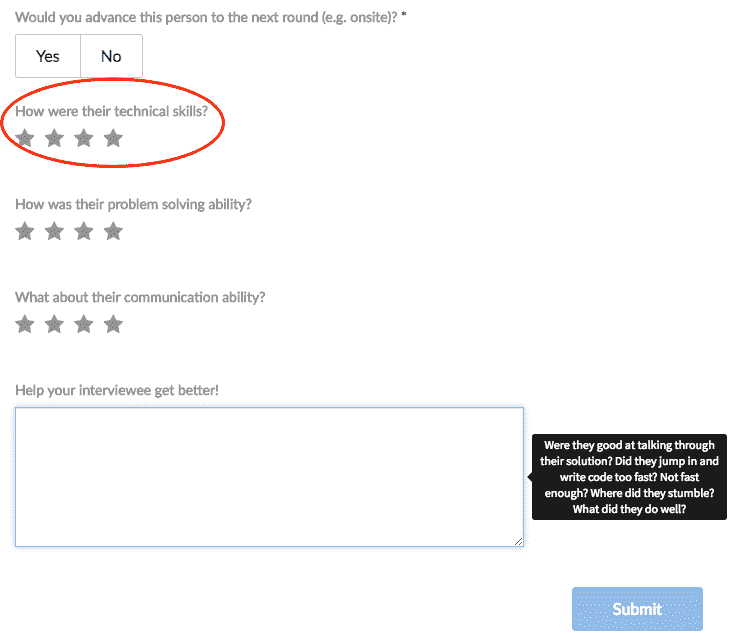
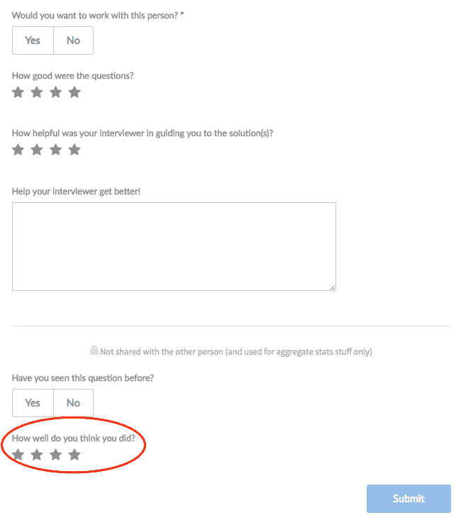
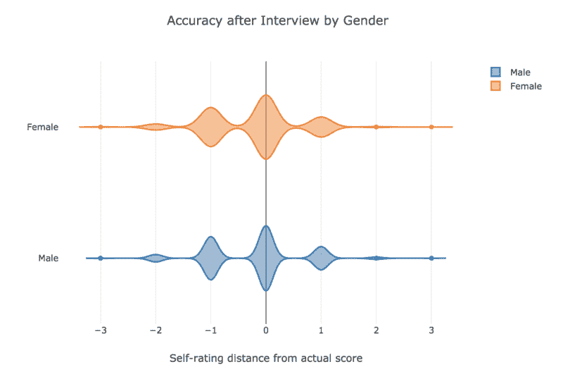
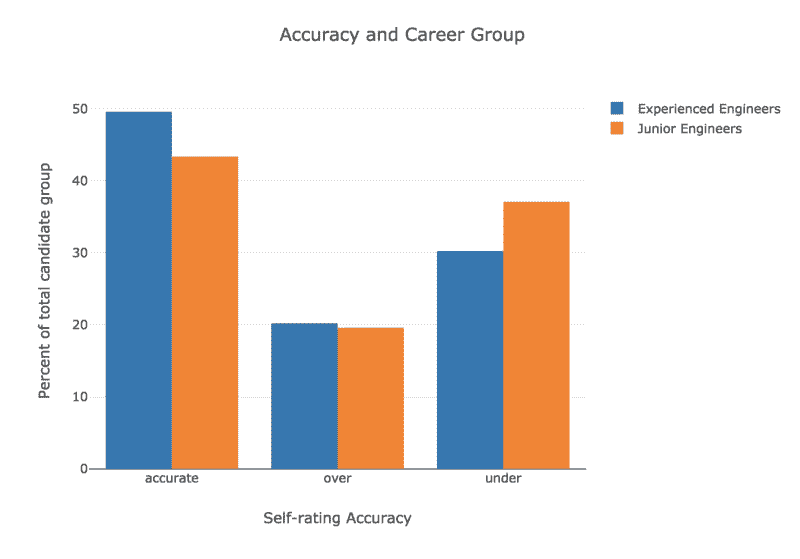

# 冒名顶替综合征对男性和女性的打击一样大……以及来自数千人的其他发现……

> 原文：<https://www.freecodecamp.org/news/impostor-syndrome-strikes-men-just-as-hard-as-women-and-other-findings-from-thousands-of-d9af80a58a5a/>

由猫希克斯

# “冒名顶替综合症”对男性和女性的打击一样大……以及来自成千上万次技术采访的其他发现

现代技术面试是软件工程师的必经之路(希望如此！)伟大工作的先驱。但对于新的候选人来说，这也是巨大的压力和无尽问题的来源。只要搜索“我该如何准备技术面试”，就会出现数百万个中型职位、bootcamp 博客代码、Quora 讨论和整本书。

尽管有这些对话，人们还是很难知道他们在面试中表现如何。[在之前的一篇文章](http://blog.interviewing.io/people-are-still-bad-at-gauging-their-own-interview-performance-heres-the-data/)中，我们发现数量惊人的 interviewing.io 用户一直低估他们的表现，这使得他们更有可能被淘汰，最终更难被聘用。

现在，有了更多的数据(由真正的软件工程师领导的超过 10，000 次采访！)，我们想更深入:**是什么让候选人在评估自己的表现时表现不佳？**

我们知道一些使准确性成为挑战的一般事实:人们并不总是擅长评估甚至记住他们在编写代码等困难的认知任务中的表现。如果候选人没有太多处理没有单一正确答案的问题的经验，技术面试可能会特别难判断。

由于责任原因，许多公司不会与候选人分享任何详细的面试后反馈(除了是/否)，许多人永远不会知道他们做得如何，他们做得好，或者还有什么可以做得更好。事实上，拉开面试的帷幕，*在整个行业中，*是建立面试的主要动力之一。

但据我们所知，很少有数据专门研究人们在不同公司进行这种规模的真实面试后的感受——所以我们收集了这些数据，让我们能够测试关于工程师和编码信心的有趣行业假设。

我们感兴趣的一个重要因素是冒名顶替综合症。冒名顶替综合症引起了许多工程师的共鸣，这表明许多人怀疑他们是否真的能与同事相匹配，甚至把能力的有力证据当作侥幸而不予理会。冒名顶替综合症会让我们怀疑我们是否能指望得到积极的绩效反馈，以及我们的机会有多少来自我们自己的努力，而不是运气。

我们特别感兴趣的是，这是否会出现在我们平台上的女性身上。许多研究证据表明，来自代表性不足的背景的候选人更缺乏归属感，这助长了冒名顶替综合症，这可能表现为对他们自己面试表现的判断不准确。

### **设置**

interviewing.io 是一个平台，人们可以匿名练习技术面试，如果事情进展顺利，在这个过程中获得顶级公司的工作。我们开始这样做是因为简历很烂，因为我们相信任何人，不管他们在纸上看起来如何，都应该有机会证明自己的勇气。

当采访者和被采访者在 interviewing.io 上匹配时，他们在一个协作编码环境中见面，有语音、文本聊天和白板，并直接进入一个技术问题(在我们的采访记录页面上随意[观看这一过程)。每次面试后，人们会互相留下反馈，一旦双方都提交了自己的评论，双方就可以看到对方对自己的评价。](https://interviewing.io/recordings/)

下面是一个面试官反馈表的例子:

*Feedback form for interviewers*

面试结束后，候选人立即回答了一个问题，即他们认为自己在相同的 1-4 分制下表现如何:

*Feedback form for interviewees*

在这篇文章中，我们看了由顶尖公司真正的软件工程师主持的超过 1 万次的技术面试。在每一次面试中，面试官会根据应聘者解决问题的能力、技术能力和沟通技巧，以及面试官是否会让他们进入下一轮进行评估。这给了我们一个衡量某人的自我评价与面试官实际给他们的评价有多大的不同，以及不同的方向。换句话说，他们对真实表现的估计有多偏差？

进去的时候，我们对可能重要的事情有一些预感:

*   **性别**。女性会比男性在编码性能上更努力吗？
*   **在**之前做过面试官。站在另一边会拉开采访的帷幕，这似乎是合理的。
*   **受雇于顶级公司**。类似上面。
*   **成为面试中表现最好的受访者**io——总体而言，面试表现更好的人可能更有信心，也更清楚自己什么时候做对了(或做错了！)
*   **是否在湾区**。由于技术在地理上仍然集中在湾区，我们认为生活在一个更加工程化的文化中的人们可能对面试的专业规范更加熟悉。
*   在面试本身中，**提问质量**和**面试官质量**。据推测，一个更好的面试官也是一个更好的沟通者，而一个令人困惑的面试官可能会打乱应聘者对其表现的整体评估。我们还考察了这是一次实习面试，还是针对某个特定的公司职位。
*   对于一些候选人，我们也可以看看他们在行业内的个人品牌的一些指标，比如他们在 GitHub 和 Twitter 上的粉丝数量。可能网上存在感强的人面试的时候对自己更有把握？

### 我们发现了什么？

#### 在评估自己的技能方面，女性和男性一样准确

与性别和信心方面的预期相反，我们*没有*在准确性方面找到可靠的统计上显著的性别差异。起初，看起来女性候选人更有可能低估自己的表现，但当我们控制其他变量，如经验和评估的技术能力时，结果是****的关键区别在于经验**。越有经验的工程师对自己的面试表现越准确，男性更容易成为有经验的工程师。但有经验的女工程师对自己的技术能力也同样准确。**

**基于之前的研究，我们假设冒名顶替综合症和更严重的归属感缺失会导致女性候选人在面试中表现不佳，但我们没有发现这种模式。**

**然而，我们的发现呼应了斯坦福大学克莱曼性别研究所的一个研究项目，该项目调查了 1795 名来自高科技公司的中层技术人员。他们发现，科技行业的女性在评估自己的能力时并不一定不准确，但对成功需要什么有着明显不同的想法(例如，长时间的工作和冒险)。换句话说，**科技行业的女性可能不会怀疑自己的能力，但可能对自己的期望有不同的想法**。**

**《哈佛商业评论》的一项调查也表明了这一点，该调查询问了 1000 多名专业人士的求职决定。他们的结果强调，评估场景中的性别差距可能更多的是关于**对如何判断面试等场景的不同期望**。**

**也就是说，我们确实发现了一个有趣的差异:总体而言，女性参加的面试比男性少。这种差异很小，但具有统计学意义，这又回到了我们之前的发现，在一次糟糕的面试后，女性离开面试的频率大约是男性的 7 倍。**

**但是在同一篇较早的文章中，我们还发现掩盖声音并不会影响面试结果。这一系列的发现证实了我们的怀疑，也证实了人们对科技领域的性别进行深入研究后发现的东西:T2，这很复杂。女性在面试中缺乏毅力不能仅仅用关于她们自己的*能力的骗子综合症来解释，但仍然有可能她们更严厉地解读负面反馈，并对面试做出不同的假设。***

**这是我们平台上男女候选人的准确率距离分布(零表示评分与面试官的分数匹配，负值表示低估的分数，正值表示高估的分数)。这两组看起来非常相似:**

****

#### **还有什么不重要的？**

**另一个惊喜:**做过面试官对**没有帮助。即使是曾经做过面试官的人似乎也没有因此而提高准确度。**

**个人品牌是另一个没有发现的。GitHub 粉丝多的人并不比 GitHub 粉丝少或没有的人更准确。**

**面试官的评分也不重要(即应聘者对面试官的评价如何)，尽管公平地说，面试官在网站上的评分通常很高。**

#### **那么，对于面试表现的准确判断，什么是统计上的显著提升呢？主要是经验。**

**与职业生涯早期的工程师相比，有经验的工程师对自己在面试中的表现有更好的感觉。但是似乎*不仅仅是*你更擅长评估你的面试表现，因为你更擅长写代码；虽然这有一个小的提升，与更高评级的工程师更准确。但是当你看初级工程师时，**即使是表现最好的初级候选人也很难准确评估他们的表现。** [ [8](http://blog.interviewing.io/#imposter-fn8) ]**

****

**我们的数据反映了在 [Stack Overflow 的 2018 年开发者调查](https://insights.stackoverflow.com/survey/2018#connection-and-competition)中看到的趋势。他们问了回答者几个关于自信和与其他开发人员竞争的问题，并指出更有经验的工程师感觉竞争力更弱，更自信。**

**这并不奇怪:毕竟，经验与技能水平相关，高技能的人可能更自信。但是我们的分析让我们能够控制职业群体中的表现和编码技能，我们仍然发现有经验的工程师更擅长预测他们的面试分数。**

**这里大概有多重因素:有经验的工程师经历过更多面试，自己主导过面试，归属感更强，这些都可能对抗冒名顶替综合症。**

#### **内部知识和背景似乎也有所帮助。**

**身处旧金山湾区和顶级公司都让人们变得更加准确。与经验丰富的职业群体一样，工程师似乎更有可能拥有*相关行业知识*也更准确。我们发现，位于旧金山湾区和在一家顶级公司工作等因素带来了微小但具有统计意义的提升。然而，在顶级公司工作的提升似乎主要是衡量整体技术能力的提升:在顶级公司工作本质上是一个更有经验、更高质量的工程师的替代衡量标准。**

#### **最后，随着你越来越擅长面试，进入公司面试，你会变得更加准确。**

**与实践面试相比，人们对自己在公司面试中的表现更加准确，他们在 intervaling . io 网站上的总体排名也预示着准确性的提高:intervaling . io 还根据用户在多次面试中的表现给用户一个总体排名，并根据最近的指标进行加权。得分在前 25%的人更有可能对他们的面试表现准确。**

**总的来说，人们如何衡量他们的面试表现？我们在之前已经研究过这个问题，大约有一千次采访，现在有一万次，这个发现仍然成立。只有 46%的面试中，候选人对自己的表现判断准确，35%的面试中，他们低估了自己(当然，剩下的 19%是高估者)。**

**尽管如此，候选人通常都在正确的轨道上——这并不像那些得了 4 分的人总是给自己打 1 分。自我评分*在统计上对实际面试分数有显著的预测作用(并呈正相关)，但这种关系是有争议的。***

### **暗示**

**准确判断自己的面试表现本身就是一项技能，工程师需要从科技行业的经验和背景中学习。但是我们也了解到**我们对绩效准确性所做的许多假设都经不起推敲**——女性工程师对自己技能的看法和男性工程师一样准确，主持过更多面试或在 GitHub 上很出名的工程师并不特别擅长评估自己的绩效。**

**这对整个行业意味着什么？首先，冒名顶替综合征似乎是不分性别和能力的睡眼惺忪的怪物，你有多优秀，你在哪里，或者你有多出名并不重要。资历确实有助于减轻一些痛苦，但冒名顶替综合症会影响每个人，不管他们是谁，来自哪里。**

**所以，也许是时候建立一种更友善、更有同情心的面试文化了。还有一种对每个人都更友好的文化，因为尽管在技术面试中没有被社会化的边缘群体受到面试过程中缺点的打击最大，但没有人能免于自我怀疑。**

**我们之前讨论过是什么让一个人成为优秀的面试官，而[同理心扮演了一个不成比例的重要角色](http://blog.interviewing.io/what-do-the-best-interviewers-have-in-common-we-looked-at-thousands-of-real-interviews-to-find-out/)。我们已经看到[提供即时的面试后反馈对于防止候选人退出非常重要](http://blog.interviewing.io/people-are-still-bad-at-gauging-their-own-interview-performance-heres-the-data/)。因此，无论你是出于善意和意识形态，还是冷酷、强硬的实用主义，对你的候选人多一点善意和理解是有必要的。**

**[*猫希克斯*](https://www.drcathicks.com/) *，本帖作者，是一位专注于学习的研究员和数据科学家。她发表了关于学习环境的实证研究，并领导了谷歌和 Travr.se 工程团队的认知工作研究。她拥有加州大学圣地亚哥分校的心理学博士学位。***