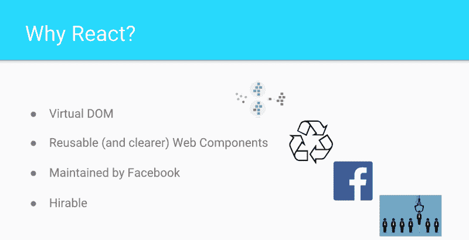

# 学习由顶级技术学校创建的 48 部分课程

> 原文：<https://www.freecodecamp.org/news/want-to-become-a-react-developer-947c9a6dbb76/>

[Click here to get to the course.](https://scrimba.com/g/glearnreact?utm_source=freecodecamp.org&utm_medium=referral&utm_campaign=glearnreact_launch_article)

自从我们开始在 Scrimba 上创建课程，我们的用户就要求我们在 React 上开设一门适当的入门课程。所以，当我们最终找到它时，我们决定让它成为我们有史以来最全面的课程。

它叫做 [Learn React](https://scrimba.com/g/glearnreact?utm_source=freecodecamp.org&utm_medium=referral&utm_campaign=glearnreact_launch_article) ，总共包含 48 个章节——混合了讲座和互动作业。

> 课程启动？
> 
> 我们在 [@VSCHOOLHQ](https://twitter.com/VSCHOOLHQ?ref_src=twsrc%5Etfw) 与 [@bobziroll](https://twitter.com/bobziroll?ref_src=twsrc%5Etfw) 合作，创建了一个？React 课程，网址为@scrimba_com。它很大，总共有 48 章，并且充满了互动的挑战。如果你认为你的追随者会喜欢，请回复！[https://t.co/7pVHxPGkaz](https://t.co/7pVHxPGkaz)
> 
> — Per Harald Borgen (@perborgen) [November 28, 2018](https://twitter.com/perborgen/status/1067832208889651202?ref_src=twsrc%5Etfw)