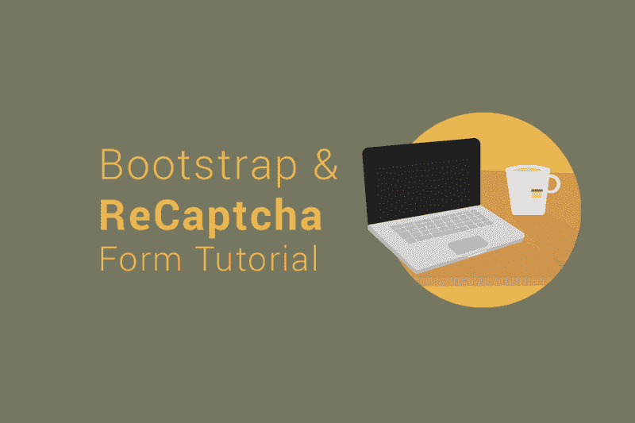
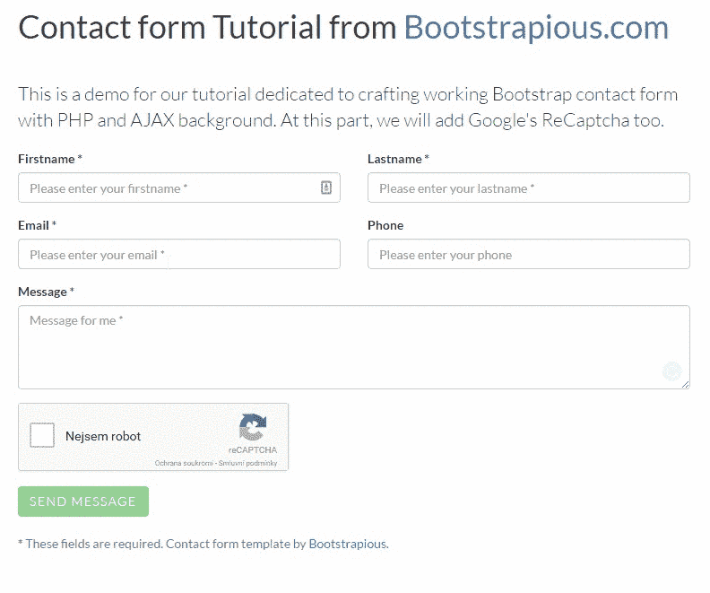
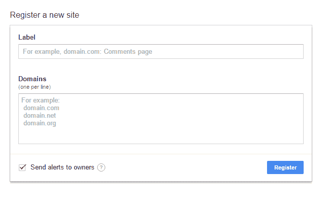
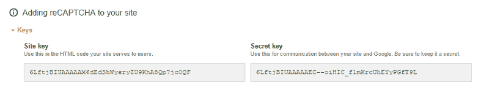

# 如何在 30 分钟内用 ReCaptcha 和 PHP 创建一个自举电子邮件表单

> 原文：<https://www.freecodecamp.org/news/build-a-bootstrap-form-with-recaptcha-and-php-backend-for-emails-in-30-minutes-17964a374819/>

by Ondrej Svestka

# 如何在 30 分钟内用 ReCaptcha 和 PHP 创建一个自举电子邮件表单

在本教程中，我将向你展示如何简单快速地**在你的引导表单中添加验证码以防止垃圾邮件**。我们将使用谷歌的 **ReCaptcha，**当今最流行的验证码解决方案。

作为一个基础，我将使用我以前的教程中的一个 HTML 联系表单 和 PHP 后端**。Y** 你可以将它与你拥有的任何其他自举形式一起使用。

我们的表单将使用 **HTML5** 语法，附带一些**引导脚手架**和一个 **JavaScript 验证器**。

**我们将通过 AJAX** 提交(页面不会重新加载)，然后用 PHP 处理表单值。

最后，我们将使用 PHP 发送一封电子邮件，并返回对原始页面的响应，该响应将显示在表单上方的状态消息中。

This will be the result. See it also live [in the demo](https://bootstrapious.com/tutorial/recaptcha/).

正如我之前提到的，今天我将主要关注与 ReCaptcha 的合作，而不是 Bootstrap 表单本身。所以，如果你错过了，至少可以[快速浏览一下我的自举表单教程](https://bootstrapious.com/p/how-to-build-a-working-bootstrap-contact-form)。

#### 演示和链接

*   [参见演示](https://bootstrapious.com/tutorial/recaptcha/)
*   或者[下载教程文件](https://bootstrapious.com/p/bootstrap-recaptcha#demo-and-links)

好，我们开始吧！

### 1.注册您的网站

为了能够使用 ReCaptcha，你需要先在 [ReCaptcha 的网站](https://www.google.com/recaptcha/admin)上**注册你的网站**。

注册成功后，您将获得**一对密钥**用于您的 ReCaptcha。保持页面打开，或者将密钥复制到文本文件中，我们很快就会用到它们。

### 2.超文本标记语言

我们将使用来自[之前教程](https://bootstrapious.com/p/how-to-build-a-working-bootstrap-contact-form)的联系人表单模板+我们将添加一个 reCAPTCHA 元素和一个隐藏的输入，以帮助我们进行 JavaScript 验证。

**我们来稍微解释一下 HTML 代码:**

*   我们已经用引导标记写好了一个 HTML 联系表单
*   将使用的主要第三方脚本和样式表是:jQuery、Bootstrap 4、CSS 和 JavaScript

**要给你的表单添加一个 ReCaptcha，你只需要:**

*   要在表单中需要的地方包含`
` < /div >(在的第一步中，用您自己的密钥替换站点密钥)
*   在页面上包含 ReCaptcha JS 来初始化 ReCaptcha—`<script src='https://www.google.com/recaptcha/api.js'><`；/script >
*   我还在`g-recaptcha` div 上使用了`data-callback`和`data-expired-callback`属性——这些是可选的，我将使用它们使 ReCaptcha 与验证器合作

**这是表单的完整代码**

### 3.服务器端编程语言（Professional Hypertext Preprocessor 的缩写）

在 PHP 中，我们将使用 [Google 的客户端库](https://github.com/google/recaptcha)来负责验证。

你可以使用 Composer 将它安装到你的项目中，从 GitHub 下载或者简单地使用我在[下载包](https://bootstrapious.com/tutorial/files/recaptcha.zip)中包含的版本。

代码的主要部分也来自我以前的教程，所以我将尝试简单重述一下。

**我们把这个文件命名为** `contact.php` **，看看我们会在里面做什么:**

*   一开始，我们需要 ReCaptcha PHP 库— `require('recaptcha-master/src/autoload.php');`
*   并做一些配置工作，例如输入您的密钥— `$recaptchaSecret = 'YOUR_SECRET_KEY';`
*   我们还设置了额外的变量，如发送电子邮件的电子邮件，主题和成功/错误消息
*   然后，您需要用您的密钥- `$recaptcha = new \ReCaptcha\ReCaptcha($recaptchaSecret)`初始化这个类；
*   发送调用以验证 ReCaptcha—`$response = $recaptcha->verify($_POST['g-recaptcha-response'], $_SERVER['REMOTE_ADDR'`)；
*   如果验证失败，抛出异常— `if (!$response->isSuccess()) {.`..}
*   然后，脚本编写电子邮件消息，发送它，并返回一个 JSON 响应。*(表单默认由 AJAX 提交。)*

### 4.Java Script 语言

我们的 JavaScript 文件`contact.js`将负责:

*   **用[引导验证器](http://1000hz.github.io/bootstrap-validator/)验证输入**
*   处理来自 ReCaptcha *的 **JS 回调(我们将根据 ReCaptcha 的响应填充隐藏的*** `input[data-recaptcha]` *)。如果成功，我们将这个输入填入=验证器将认为表单是有效的。)*
*   **AJAX 发送表单**
*   最后，**显示成功或错误消息**并清空表单。

代码如下:

### 5.结果

就是这个！

你现在应该有一个 ReCaptcha 和 PHP 背景的工作联系自举联系形式。

#### 谢谢你 50 英镑的掌声？如果你喜欢这篇文章！A **同样，检查我的其他 B [ootstrap 教程](https://bootstrapious.com/tutorials)或我的 B [ootstrap 模板。](https://bootstrapious.com/free-templates)**

*最初发表于[bootstradability 博客](https://bootstrapious.com/p/bootstrap-recaptcha)。*

### 关于作者

Ondrej Svestka 是 Bootstrap 和前端爱好者，也是 Boostrapious T1 的创始人。