# 如何使用 Vue.js、Vuex、Vuetify 和 Firebase 构建 SPA:使用 Firebase 添加身份验证

> 原文：<https://www.freecodecamp.org/news/how-to-build-a-spa-using-vue-js-vuex-vuetify-and-firebase-adding-authentication-with-firebase-d9932d1e4365/>

#### 第 4 部分:了解如何使用 Firebase 添加身份验证和购物车


Meal Prep application

了解如何使用 Vue.js、Vuex、Vue Router 和 Firebase 创建送餐网站。

这是我的构建 Vue 应用程序系列的第四部分。以下是所有零件的清单:

[第 1 部分:安装 Vue 并使用 Vue 化和 Vue 路由器构建 SPA](https://medium.com/p/838b40721a07)

[第二部分:使用 Vue 路由器](https://medium.com/p/fc5bd065fe18)

[第三部分:使用 Vuex 和访问 API](https://medium.com/p/f8036aa464ad)

[第 4 部分:使用 Firebase 进行认证&推车](https://medium.com/p/d9932d1e4365)

### 概述

在本系列的第一部分中，我们使用 Vue CLI 创建了 Vue 应用程序。此外，我们在应用程序中添加了 Vuetify。我们使用 Vuetify 来设计我们的主页。

在第二部分中，我们使用 Vue Router 在应用程序的不同页面之间添加导航。我们为应用程序中的所有页面添加了组件。

在第三部分，我们被介绍到 Vuex。我们注册了一个 API 来提供食谱，并使用 axios 来检索它们。这些数据存储在 Vuex 存储中，应用程序中的每个组件都可以访问这些数据。

### 什么是 Firebase？

Firebase 是一个面向客户端应用的实时云基础设施。Firebase 可以将任何*前端*应用程序转变为能够在云中无限扩展的全栈产品。它抽象化了大多数复杂的服务器端功能，如用户身份验证、数据持久化、文件存储和微服务，因此您可以专注于为最终用户构建出色的体验。

第一步是转到 [firebase 并创建一个新帐户](https://firebase.google.com)。登录到您创建的帐户。您将看到这个仪表板:

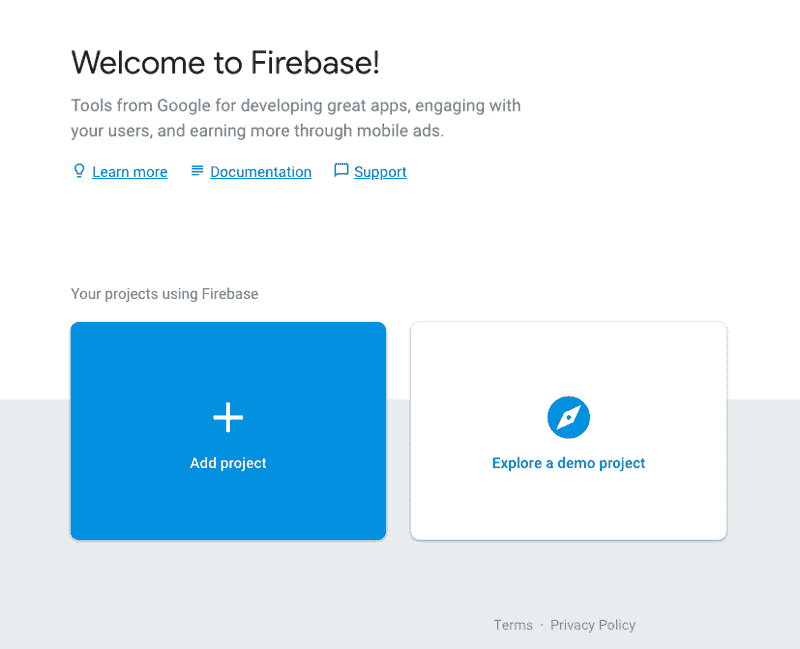

Firebase Demo

点击`Add Project`按钮。输入项目的名称。我输入“膳食准备”作为我的项目名称。选中所有复选框。然后点击`create project`按钮。

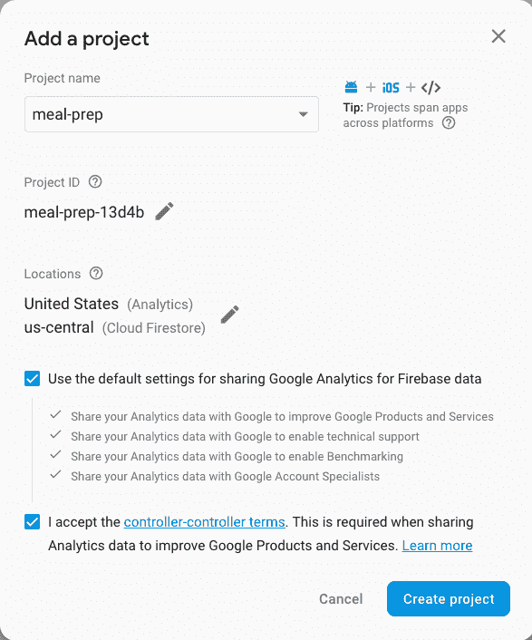

Add new project dialog on Firebase

一旦你的项目被创建，Firebase 将带你到你的项目的主页。

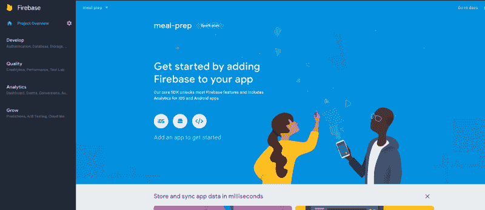

Project Home Page

我们需要将项目的配置集成到我们的膳食准备应用程序中。单击 web 按钮，将 Firebase 添加到您的应用程序中。(注:如果你不确定那是哪个按钮，就是带`<`的按钮；/ >。在上图中，按钮就在“开始”字样的正上方单击“复制”按钮将代码片段复制到剪贴板。

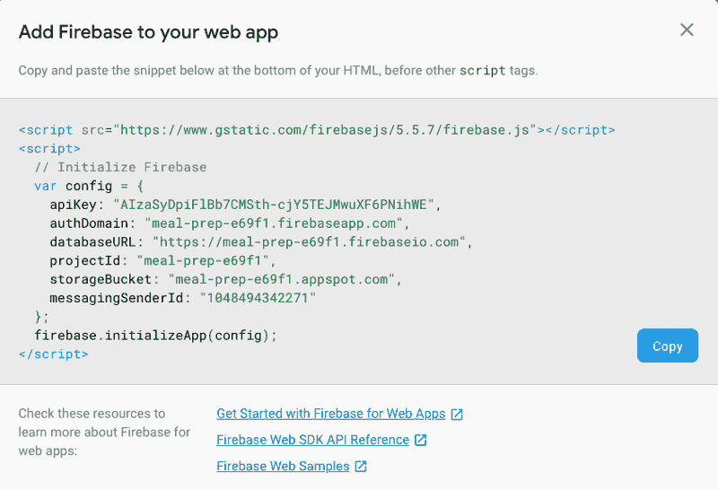

Firebase config snippet

接下来，我们需要将这个片段合并到我们的膳食准备应用程序中。您可以在`main.js`文件中初始化 firebase 应用程序。可以在`App.vue`文件里做。

相反，我们将在 src 文件夹中创建一个名为 firebase 的新目录。在这个新目录中创建一个名为`index.js`的文件。将剪贴板的内容粘贴到该文件中。移除带有`script`标签的两条线。在文件的第一行导入 firebase。在最后一行初始化 firebase。您的文件应该如下所示:

```
import firebase from 'firebase';const config = {    apiKey: "<youKeyHere>",    authDomain: "<youKeyHere>",    databaseURL: "<youKeyHere>",    projectId: "<youKeyHere>",    storageBucket: "<youKeyHere>",    messagingSenderId: "<youKeyHere>"};firebase.initializeApp(config);
```

我们正在从尚未安装的 npm 包中导入 firebase。让我们现在安装它。在您的终端中，使用以下命令安装 firebase:

```
npm install firebase --save
```

现在我们已经安装了 firebase 并创建了一个配置文件，我们需要将这个文件添加到我们的应用程序中，这样 Vue 就知道了。打开`main.js`文件，导入我们创建的配置文件。下面是我的`main.js`文件的样子:

```
import '@babel/polyfill';import Vue from 'vue';import './plugins/vuetify';import App from './App.vue';import router from './router';import store from './store';import '@/firebase/';Vue.config.productionTip = false;new Vue({    router,    store,    render: h => h(App)}).$mount('#app');
```

在浏览器中返回到 firebase 控制台。点击`Authentication`。点击`set up sign-in method`按钮。

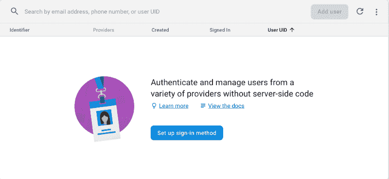

Setting up authentication in firebase

在登录提供商列表中，单击电子邮件/密码:

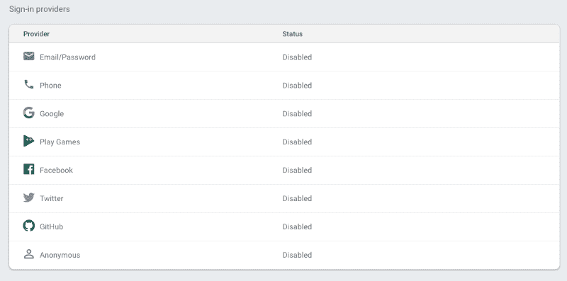

List of sign-in providers

允许所有用户使用他们的电子邮件地址和密码注册。然后点击`save`按钮。

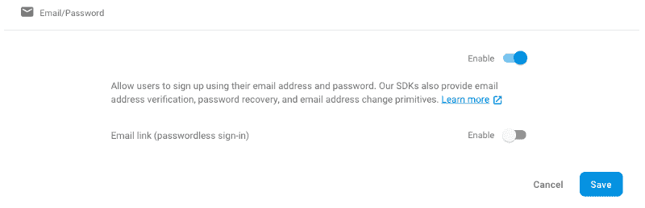

Enable sign up using email and password

#### 创建注册表单

在之前的帖子中，我们剔除了 Join.vue 和 Signin.vue 文件。这两个文件的代码几乎相同。我们将首先创建连接表单。完成后，我们会将其复制/粘贴到登录表单中。

打开 Join.vue 组件。您可以删除模板中的所有内容。Vuetify 有一个默认的组件布局结构。它是这样流动的:

*   v 型容器
*   垂直布局
*   v-flex

现在让我们在组件中创建布局。我们文件的开头看起来像这样:

```
<template>    <v-container fill-height>        <v-layout align-center justify-center>            &lt;v-flex xs12 sm8 md4>            </v-flex>        </v-layout>    </v-container></template>
```

对于`v-container`，我们添加了`fill-height`。我们添加它是为了使窗体在窗口中垂直居中。对于`v-flex`，我们添加`xs12` `sm8`和`md4`值。这类似于 Bootstrap 的列宽定义。在超小型设备上，表单将占据整个屏幕的全部 12 列。在小型设备上，窗体将是屏幕宽度的 3/4。在中型和大型屏幕上，表单将是屏幕的 1/3。

在`v-flex`中，我们将使用一个`v-card`。我们将`class=”elevation-12"`添加到`v-card`中，使其看起来悬浮在页面上方。对于表单的顶部，我们将使用一个`v-toolbar`。我们给它一个颜色`primary`。对于 Vuetify 的默认安装，主要颜色是蓝色。我们希望工具栏中的文本是白色文本，而不是默认的黑色。为了将文本变白，我们将`dark`添加到`v-toolbar`中。

接下来，我们有一个`v-card-text`。在它里面，我们有一个`v-form`。对于表格，我们给它一个名为`form`的参考。我们将它赋给值为`valid`的`v-model`。

我们最后加的是`lazy-validation`。我们的表单需要捕获用户的电子邮件和密码。我们将使用两个`v-text-field`来捕捉这些值。为了让事情看起来更好，我为每个字段预先添加了一个图标。每个字段都有一个`v-model`和`rules`。

在提交表单之前，将根据定义的所有规则验证该字段。如果他们通过了，你就可以提交表格了。当用户点击加入按钮时，我们将利用这一点。

添加到表单的最后一项是按钮。我们加一个`v-card-actions`加一个按钮。下面是我们组件的模板外观:

```
<template>    <v-container fill-height>        <v-layout align-center justify-center>            &lt;v-flex xs12 sm8 md4>                <v-card class="elevation-12">                    <v-toolbar dark color="primary">                        <v-toolbar-title>Join Form</v-toolbar-title>                    </v-toolbar>                    <;v-card-text>                        <v-form ref="form" v-model="valid" lazy-validation>;                            &lt;v-text-field prepend-icon="person" name="email" label="Email" type="email"                                          v-model="email" :rules="emailRules" required>                            </v-text-field>                            <v-text-field prepend-icon="lock" name="password" label="Password" id="password"                                          type="password" required v-model="password" :rules="passwordRules">                            </v-text-field>                        </v-form>                    </v-card-text>                    <v-card-actions>                        <v-spacer></v-spacer>                        <v-btn color="primary" :disabled="!valid" @click="submit">Join</v-btn>                    </v-card-actions>                </v-card>            </v-flex>        </v-layout>    </v-container></template>
```

我们在模板中定义了几个模型。我们需要将它们添加到脚本的`data`部分。在脚本中添加一个数据对象。我们将添加有效的，电子邮件，密码，电子邮件规则和密码规则。

电子邮件和密码将包含用户在两个文本字段中输入的值。Valid 将判断我们的表单是否通过了我们创建的所有规则。对于电子邮件，我们检查以确保该字段不为空。我们还检查内容是否与基本的 RegExp 匹配，以验证电子邮件地址。对于密码，我们检查以确保该字段不为空。我们还检查以确保密码长度至少为 6 个字符。

下面是数据对象现在的样子:

```
data() {    return {        valid: false,        email: '',        password: '',        emailRules: [            v => !!v || 'E-mail is required',            v => /.+@.+/.test(v) || 'E-mail must be valid'        ],        passwordRules: [            v => !!v || 'Password is required',            v =>                v.length >= 6 ||                'Password must be greater than 6 characters'        ]    };},
```

我们需要添加的最后一件事是方法。在方法中，我们有`submit()`。这个方法将首先验证我们的表单。如果它通过了验证，那么它将调用我们的 Vuex 存储中的一个动作`userJoin`。我们将用户在表单中输入的电子邮件和密码传递给它。

下面是这些方法的样子:

```
methods: {    submit() {        if (this.$refs.form.validate()) {            this.$store.dispatch('userJoin', {                email: this.email,                password: this.password            });        }    }}
```

#### 在 Vuex 中创建用户加入操作

打开`store.js`文件。我们将创建一个名为`userJoin`的新动作。默认情况下，传递给这个动作的第一个参数是`context`。我将使用对象析构来从`context`中获取`commit`。提交是我如何称呼我的突变。

我将使用 firebase 在 firebase 数据库中创建新用户。为了能够在商店中使用 firebase，我需要导入它。在文件的顶部用这个命令导入 firebase:

```
import firebase from 'firebase';
```

Firebase 认证提供了一种叫做`createUserWithEmailAndPassword`的方法。我们将把用户的电子邮件和密码传递到这个方法中。如果成功注册了用户，它将返回一个用户对象。当它成功时，我们将调用两个突变:`setUser`和`setIsAuthenticated`。下面是这个动作的样子:

```
userJoin({ commit }, { email, password }) {    firebase        .auth()        .createUserWithEmailAndPassword(email, password)        .then(user => {            commit('setUser', user);            commit('setIsAuthenticated', true);        })        .catch(() => {            commit('setUser', null);            commit('setIsAuthenticated', false);        });}
```

这个动作调用两个突变。所以让我们现在就开始创造吧。在突变中增加一个新的突变叫做`setUser`。将用户的状态值设置为有效负载。接下来，创建名为`setIsAuthenticated`的第二个突变。将 isAuthenticated 的状态值设置为有效负载。这两种突变看起来是这样的:

```
setUser(state, payload) {    state.user = payload;},setIsAuthenticated(state, payload) {    state.isAuthenticated = payload;}
```

在 state 中，我们需要添加两个新值:`user`和`isAuthenticated`。这是国家现在的样子:

```
state: {    recipes: [],    apiUrl: 'https://api.edamam.com/search',    user: null,    isAuthenticated: false},
```

#### 测试添加新用户

用命令`npm run serve`启动您的服务器。点击导航中的`Join`按钮。输入您的电子邮件和密码，然后单击加入按钮。当你点击这个按钮时，什么也看不见。要验证用户是否已注册，请在浏览器中进入 firebase 控制台。点击`Authentication`。您应该会看到已经为您的应用程序注册的用户列表。在这里，您可以看到我刚刚注册的用户已经创建。

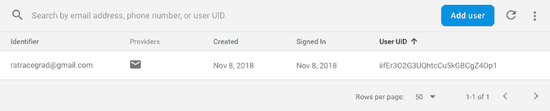

User has been registered

我们需要通知用户它们已经被成功创建。我们稍后会这样做。首先，我们将把 Join.vue 组件的内容复制并粘贴到`Signin.vue`组件中。您只需要对模板进行两处修改。将标题更改为“登录表单”对于按钮，让文本显示“登录”在提交方法中让它分派给`userLogin`。为了确保您的理解正确，我的整个 Signin.vue 文件如下所示:

```
<template>    <v-container fill-height>        <v-layout align-center justify-center>            &lt;v-flex xs12 sm8 md4>                <v-card class="elevation-12">                    <v-toolbar dark color="primary">                        <v-toolbar-title>Login Form</v-toolbar-title>                    </v-toolbar>                    <;v-card-text>                        <v-form ref="form" v-model="valid" lazy-validation>;                            &lt;v-text-field prepend-icon="person" name="email" label="Email" type="email"                                          v-model="email" :rules="emailRules" required>                            </v-text-field>                            <v-text-field prepend-icon="lock" name="password" label="Password" id="password"                                          type="password" required v-model="password" :rules="passwordRules">                            </v-text-field>                        </v-form>                    </v-card-text>                    <v-card-actions>                        <v-spacer></v-spacer>                        <v-btn color="primary" :disabled="!valid" @click="submit">Login</v-btn>                    </v-card-actions>                </v-card&gt;            </v-flex&gt;        </v-layout>    </v-container></template><script>export default {    name: 'Signin',    data() {        return {            valid: false,            email: '',            password: '',            emailRules: [                v => !!v || 'E-mail is required',                v => /.+@.+/.test(v) || 'E-mail must be valid'            ],            passwordRules: [                v => !!v || 'Password is required',                v =&gt;                    v.length >= 6 ||                    'Password must be greater than 6 characters'            ]        };    },    methods: {        submit() {            if (this.$refs.form.validate()) {                this.$store.dispatch('userLogin', {                    email: this.email,                    password: this.password                });            }        }    }};</script><style scoped></style>
```

就是这样。现在，您已经创建了加入和登录表单。

我们需要为登录创建动作。打开`store.js`文件。创建一个名为 userLogin 的新操作。我们将使用 firebase 登录用户。Firebase 提供了一个叫做`signInWithEmailAndPassword`的方法。我们将调用这个方法，并传递用户在表单中输入的电子邮件和密码。如果用户正确地输入了他们的电子邮件和密码，那么我们将把这两个变异称为`setUser`和`setIsAuthenticated`。下面是`userLogin`的动作:

```
userLogin({ commit }, { email, password }) {    firebase        .auth()        .signInWithEmailAndPassword(email, password)        .then(user => {            commit('setUser', user);            commit('setIsAuthenticated', true);        })        .catch(() => {            commit('setUser', null);            commit('setIsAuthenticated', false);        });},
```

#### 重定向到配置文件

当用户成功注册或登录时，我们希望将他们重定向到他们的个人资料。当我们最初创建我们的应用程序 Vue CLI 3 时，它为我们创建了两条路线。这些路线是`/`和`/about`。最终，该配置文件将包含用户从`menu`页面订购的所有食谱的列表。还记得我们放在每个食谱底部的按钮吗？该按钮会将食谱添加到用户的个人资料中，并将其存储在 firebase 的数据库中。

为了将用户重定向到配置文件，我们将首先在 store.js 文件的顶部导入 router。使用以下命令导入路由器:

```
import router from '@/router';
```

接下来，在这两个操作中，我们将用户重定向到/关于他们是否成功注册或登录。您可以使用以下命令进行重定向:

```
router.push('/about');
```

如果用户未能成功注册帐户或登录，我们会将用户重定向到主页。(注意:在一个完美的场景中，我们将向用户提供一些通知，说明注册或登录失败的原因)。您可以使用以下命令将它们重定向到主页:

```
router.push('/');
```

要测试重定向，启动您的服务器并单击登录按钮。输入您创建用户帐户时使用的电子邮件和密码。单击加入按钮。如果一切顺利，您应该会被重定向到“关于”页面。

#### 更新导航

导航有`Sign In`和`Join`按钮。当用户成功注册或登录时，我们希望隐藏这两个按钮。在它们的位置，我们想要显示一个`Logout`按钮。

打开`AppNavigation`组件。我们将把当前的两个按钮组合在一个 div 中。我们将删除这个类来隐藏小型和超小型设备上的按钮。相反，我们将把这个类放在 div 上。我们向 div 添加了一个`v-if`,仅显示用户当前是否未通过身份验证。在`div`下面，我们将添加一个新的注销按钮。这个新按钮的轮廓样式为白色。当你点击这个按钮时，它将调用方法`logout`。我们在这个按钮上添加了一个 v-else 来显示用户何时通过了身份验证。

接下来，添加一个名为`logout`的方法。这个方法将调用我们商店中一个名为`userSignOut`的动作。

我们还需要添加一个名为`isAuthenticated`的新计算属性。该属性返回存储状态下 isAuthenticated 的值。

你的应用导航应该是这样的:

```
<template>    <span>        <v-navigation-drawer app v-model="drawer" class="brown lighten-2" dark disable-resize-watcher>            <v-list>                <template v-for="(item, index) in items">                    <v-list-tile :key="index">                        <v-list-tile-content>                            {{item.title}}                        </v-list-tile-content>                    <;/v-list-tile>                    <v-divider :key="`divider-${index}`"></v-divider>                </template>            </v-list>        </v-navigation-drawer>        <v-toolbar app color="brown darken-4" dark>            <v-toolbar-side-icon class="hidden-md-and-up" @click="drawer = !drawer"></v-toolbar-side-icon>            <v-spacer class="hidden-md-and-up"></v-spacer>            <router-link to="/"&gt;                <v-toolbar-title to="/">{{appTitle}}</v-toolbar-title>;            </router-link>            <;v-btn flat class="hidden-sm-and-down" to="/menu">Menu</v-btn>            <v-spacer class="hidden-sm-and-down"></v-spacer>            <;div v-if="!isAuthenticated" class="hidden-sm-and-down">                <v-btn flat to="/sign-in">SIGN IN</v-btn>                <v-btn color="brown lighten-3" to="/join">JOIN</v-btn>            </div>            <v-btn v-else outline color="white" @click="logout">Logout</v-btn>        </v-toolbar>    </span></template><script>export default {    name: 'AppNavigation',    data() {        return {            appTitle: 'Meal Prep',            drawer: false,            items: [{ title: 'Menu' }, { title: 'Sign In' }, { title: 'Join' }]        };    },    computed: {        isAuthenticated() {            return this.$store.getters.isAuthenticated;        }    },    methods: {        logout() {            this.$store.dispatch('userSignOut');        }    }};</script><style scoped>a {    color: white;    text-decoration: none;}</style>
```

我们需要添加刚刚定义的 getter 和 action。打开`store.js`文件。创建一个名为`userSignout`的新动作。该操作将使用 firebase.auth()注销用户。在用户退出后，它将状态变量`user`设置为空，将`isAuthenticated`设置为假。下面是店里的`userSignout`方法:

```
userSignOut({ commit }) {    firebase        .auth()        .signOut()        .then(() => {            commit('setUser', null);            commit('setIsAuthenticated', false);            router.push('/');        })        .catch(() => {            commit('setUser', null);            commit('setIsAuthenticated', false);            router.push('/');        });}
```

接下来，我们需要向 store 对象添加一个`getters`部分。`isAuthenticated` getters 方法将根据用户认证返回 true 或 false。以下是商店的`getters`部分:

```
getters: {    isAuthenticated(state) {        return state.user !== null && state.user !== undefined;    }}
```

### 向数据库添加配方

一旦用户登录，他们可以点击任何食谱添加到他们的帐户。他们的食谱将显示在他们的个人资料中，也就是`/about`路线。我们需要一个数据库来存储这些食谱。在浏览器中转到 firebase 控制台。点击左侧导航面板中的`database`。在下一个屏幕上，您将看到创建实时数据库或云 firestore 数据库的按钮。确保创建一个新的实时数据库。在对话框中确保你选择了`start in test mode`。然后点击`enable`按钮。

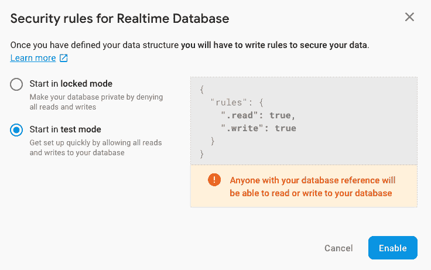

Start database in test mode

现在，我们希望将用户的食谱存储在数据库中。打开 MealRecipes 组件。如果用户试图订购一个食谱，但他们没有登录，那么我们应该将他们重定向到登录页面。所以让我们现在就解决这个问题。在`Order`按钮上添加一个@click 来调用 orderRecipe 方法。确保将`item`作为参数传递给该方法。您的按钮应该是这样的:

```
<v-card-actions>    &lt;v-btn color="green" dark @click="orderRecipe(item)">Order</v-btn></v-card-actions>
```

在创建方法之前，我们将为 isAuthenticated 创建一个计算值。这与我们在前面的`AppNavigation`中使用的正确显示和隐藏登录和注销按钮的代码完全相同。添加一个计算的 isAuthenticated。它应该是这样的:

```
export default {    name: 'MealRecipes',    computed: {        recipes() {            return this.$store.state.recipes;        },        isAuthenticated() {            return this.$store.getters.isAuthenticated;        }    }};
```

现在我们准备创建 orderRecipe 方法。添加此方法及其参数。在这个方法中，我们想首先检查用户是否登录。如果不是，我们希望将它们重定向到`/sign-in`。如果他们已经登录，那么我们希望在 Vuex 商店中调用一个动作，将配方添加到数据库中的用户帐户。下面是我们的方法:

```
methods: {    orderRecipe(item) {        if (this.isAuthenticated) {            this.$store.dispatch('addRecipe', item);        } else {            this.$router.push('/sign-in');        }    }}
```

打开 store.js 文件。我们需要创建一个新的动作来添加食谱。在这个操作中，我们将使用 firebase 将配方添加到名为`users`的数据库中。当用户在 firebase 中注册时，他们会被分配一个唯一的 userid。我们将使用这个`uid`在数据库中存储配方的名称。

在这个操作中，我们将使用`state`来获取当前所选用户的值。`state`中的`user`是一个物体。该对象有一个名为 user 的键。在那个物体中，我们会发现`uid`。我们用它将所选食谱的标题推入数据库。下面是行动:

```
addRecipe({ state }, payload) {    firebase        .database()        .ref('users')        .child(state.user.user.uid)        .push(payload.recipe.label);}
```

现在启动您的服务器并登录。从菜单页面中选择一种饮食。然后点几个菜谱。你点的食谱应该会显示在 firebase 的数据库中。

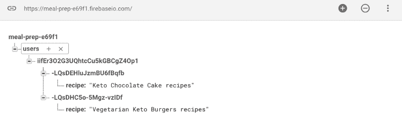

Recipes added to the database

既然我们已经将食谱添加到数据库中，我们实际上需要在用户的个人资料页面上显示它们。打开`About.vue`文件。每当这个页面被加载，它应该获取所有用户的食谱。为此，我们在脚本中添加了`mounted()`。这将调用一个叫做`getRecipes`的方法。

现在让我们创建这个方法。在该方法中，我们将调用 Vuex 商店中的一个动作，该动作将获取所有用户的食谱。我们还没有在商店中创建这个动作，但简单来说，这个动作将获得用户的食谱。然后，它会将它们存储在名为`userRecipes`的变量`state`中。

在我们离开 About.vue 之前，为`userRecipes`添加一个计算属性。这将返回我们商店中来自`state`的`userRecipes`。About.vue 脚本应该是这样的:

```
export default {    name: 'About',    computed: {        userRecipes() {            return this.$store.state.userRecipes;        }    },    mounted() {        this.getRecipes();    },    methods: {        getRecipes() {            this.$store.dispatch('getUserRecipes');        }    }};
```

接下来，打开您的`store.js`文件。我们需要创建`getUserRecipes`动作。当用户登录时，我们在`state`中存储一个名为 user 的变量。该变量将拥有在 firebase 中注册时分配给该用户的唯一用户 ID。我们希望获得用户数据库中具有该用户 ID 的所有食谱。一旦我们得到所有的食谱，我们希望设置用户食谱来包含它们。以下是 getUserRecipes 操作:

```
getUserRecipes({ state, commit }) {    return firebase        .database()        .ref('users/' + state.user.user.uid)        .once('value', snapshot => {            commit('setUserRecipes', snapshot.val());        });}
```

在我们的突变中，我们需要添加一个`setUserRecipes`。看起来是这样的:

```
setUserRecipes(state, payload) {    state.userRecipes = payload;}
```

我们还需要在`state`中添加一个`userRecipes`。我们将其初始值设置为空数组。这是我的整个状态对象:

```
state: {    recipes: [],    apiUrl: 'https://api.edamam.com/search',    user: null,    isAuthenticated: false,    userRecipes: []},
```

现在我们得到了食谱，我们需要在页面上向用户显示它们。所以回到你的`About.vue`文件。在模板中，我们将遍历所有用户的食谱并显示它们。我将首先向您展示我的模板代码，然后解释我做了什么:

```
<template>    <v-container >        <v-layout column>;            <h1 class="title my-3">My Recipes</h1>            <div v-for="(item, idx) in userRecipes" class="subheading mb-2" :key="idx">                {{item}}            </div>        </v-layout>    </v-container></template>
```

我已经将布局设置为`column`。我这样做是因为我希望每个食谱都列在页面上。为了让事情看起来更清楚，我添加了一个标题。我添加了 my-3 来添加上边距和下边距，这样标题和食谱列表之间就有了间隔。接下来，我循环浏览每个食谱并显示出来。如果用户有食谱，他们会看到以下内容:

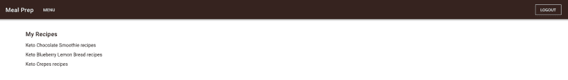

List of my recipes

这很好，但是如果用户登录后没有任何食谱呢？他们看到标题“我的食谱”和一个空白页。这不是一个用户友好的设计。所以让我们改变它来展示一些更友好的东西。

我们将显示一个按钮，将用户带到`menu`页面。在我们的模板中，我们将添加这个按钮。为了让按钮重定向到菜单页面，我们可以给按钮添加`to=”/menu”`。这是我的`About.vue`组件的最终模板。

```
<template>    <v-container >        <v-layout column>;            <h1 class="title my-3">My Recipes</h1>            <div v-for="(item, idx) in userRecipes" class="subheading mb-2" :key="idx">                {{item}}            </div>            &lt;v-flex mt-4>                <v-btn color="primary" to="/menu">Go To Menu</v-btn>            </v-flex>        </v-layout>    </v-container></template>
```

#### 在导航中显示个人资料

我们需要添加的最后一件事是能够在导航中显示到概要文件的链接。就像注销按钮一样，这应该只在用户通过身份验证时显示。

打开 AppNavigation 组件。我们将配置文件按钮和注销按钮组合在一个 div 中。这与我们之前对`Sign In`和`Join`按钮所做的是一样的。添加一个 div 并将注销按钮移动到这个 div 中。为`profile`再加一个按钮。该按钮将与`Sign In`按钮一样扁平。

下面是我的 AppNavigation 现在的样子:

```
<template>    <span>        <v-navigation-drawer app v-model="drawer" class="brown lighten-2" dark disable-resize-watcher>            <v-list>                <template v-for="(item, index) in items">                    <v-list-tile :key="index">                        <v-list-tile-content>                            {{item.title}}                        </v-list-tile-content>                    <;/v-list-tile>                    <v-divider :key="`divider-${index}`"></v-divider>                </template>            </v-list>        </v-navigation-drawer>        <v-toolbar app color="brown darken-4" dark>            <v-toolbar-side-icon class="hidden-md-and-up" @click="drawer = !drawer"></v-toolbar-side-icon>            <v-spacer class="hidden-md-and-up"></v-spacer>            <router-link to="/"&gt;                <v-toolbar-title to="/">{{appTitle}}</v-toolbar-title>;            </router-link>            <;v-btn flat class="hidden-sm-and-down" to="/menu">Menu</v-btn>            <v-spacer class="hidden-sm-and-down"></v-spacer>            <;div v-if="!isAuthenticated" class="hidden-sm-and-down"&gt;                <v-btn flat to="/sign-in">SIGN IN</v-btn>                <v-btn color="brown lighten-3" to="/join">JOIN</v-btn>            </div>            <div v-else>                <v-btn flat to="/about">PROFILE</v-btn>                <v-btn outline color="white" @click="logout">Logout</v-btn>            </div>        </v-toolbar>    </span></template>
```

### 添加路线防护

目前，用户可以通过输入浏览器的 URL 导航到个人资料页面，如果用户没有登录，我们不想让他们这样做。Vue 路由器提供了在导航到 URL 之前添加路由保护的能力。我们想在允许用户重定向到`/about`页面之前测试他们是否通过了身份验证。

打开`router.js`文件。路由保护与元标签协同工作。找到`/about`路线。我们将添加一个`authRequired`元标签。路线应该是这样的:

```
{    path: '/about',    name: 'about',    component: () =&gt; import('./views/About.vue'),    meta: {        authRequired: true    }},
```

作为 Vue 路由器的一部分，路由防护通过名为 beforeEach 的方法进行检查。此方法传递了三个参数:

*   你要去的路线
*   你来的路线
*   继续当前路线的下一个方法

我们的 beforeEach 方法将检查我们要去的每条路由，看它是否包含 authRequired 的 meta 标记。如果是，它将检查用户是否通过了身份验证。如果用户没有通过认证，它会将他们重定向到`/sign-in`页面。如果用户登录，那么它将允许路线继续。如果用户路由到任何没有 authRequired meta 标签的页面，那么路由将继续。

下面是我添加到路由器中进行检查的方法:

```
router.beforeEach((to, from, next) => {    if (to.matched.some(record => record.meta.authRequired)) {        if (!store.state.user) {            next({                path: '/sign-in'            });        } else {            next();        }    } else {        next();    }});
```

### 获取代码

尽管这是一个由 4 部分组成的系列，但你可以在我的 GitHub 帐户中获得[完成的代码。](https://github.com/ratracegrad/meal-prep)请帮帮我，**拿到代码后开始回购**。

### 摘要

在本系列的这一部分中，您已经学习了:

*   什么是 firebase
*   使用 firebase 验证使用电子邮件和密码登录的用户
*   使用 firebase 存储用户订购的食谱
*   如果用户没有通过身份验证，使用路由保护禁止用户访问页面
*   在 firebase 上显示数据库中的用户食谱列表

如果你喜欢这篇文章，请为它鼓掌。如果你认为其他人会从这篇文章中受益，请与他们分享。

如果您有任何问题或发现代码有任何错误，请留下评论。如果你有其他话题想让我写，请留下评论。

#### 其他文章

这里是我写的其他文章，你可能想看看。

[**如何给一个 Vue 应用添加国际化**](https://medium.freecodecamp.org/how-to-add-internationalization-to-a-vue-application-d9cfdcabb03b)
[*Hola！你好。再见。你好。以下是如何将国际化添加到 Vue 中。*medium.freecodecamp.org](https://medium.freecodecamp.org/how-to-add-internationalization-to-a-vue-application-d9cfdcabb03b)[**JavaScript 中的实例化模式**](https://medium.com/dailyjs/instantiation-patterns-in-javascript-8fdcf69e8f9b)
[*实例化模式是在 JavaScript 中创建东西的方式。JavaScript 提供了四种不同的方法来创建…*medium.com](https://medium.com/dailyjs/instantiation-patterns-in-javascript-8fdcf69e8f9b)[**这里是你可以用 FlexBox 做出的 5 种布局**](https://hackernoon.com/here-are-5-layouts-that-you-can-make-with-flexbox-6ca1e941f33d)
[*CSS 灵活的盒子布局——FlexBox——为设计者和…*hackernoon.com](https://hackernoon.com/here-are-5-layouts-that-you-can-make-with-flexbox-6ca1e941f33d)提供了设计和布局问题的简单解决方案

[**在 Twitter 上关注我！**](https://twitter.com/ratracegrad)