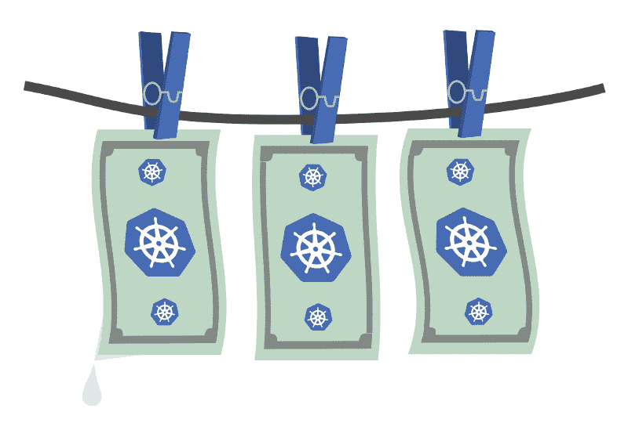
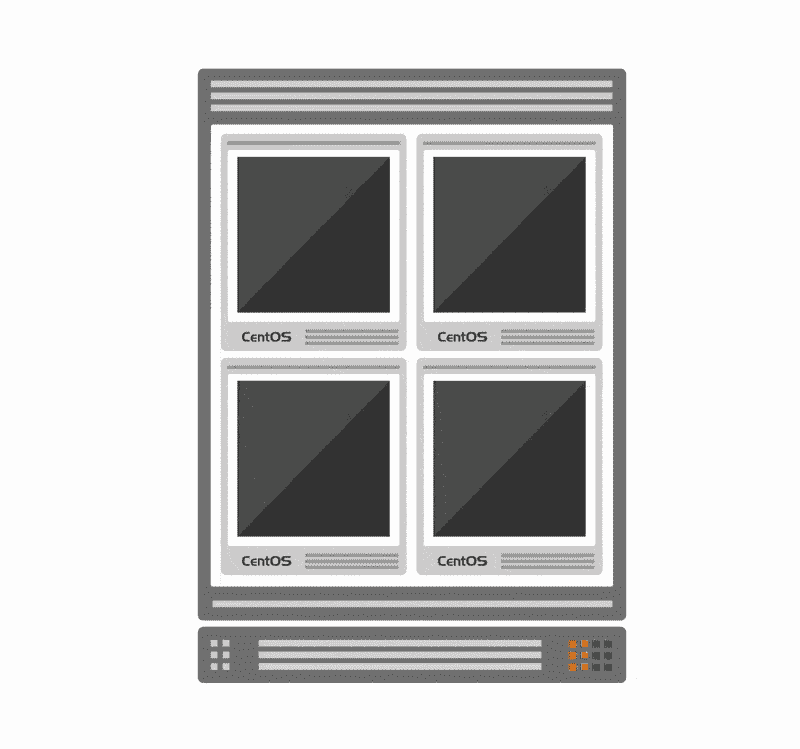
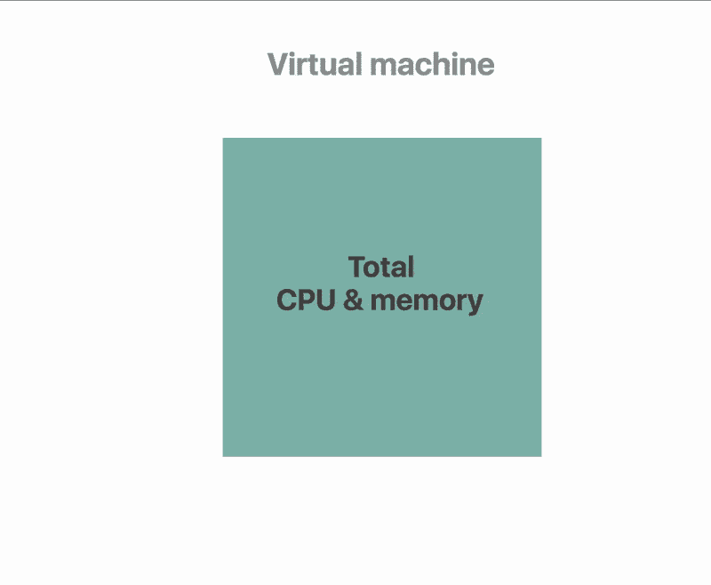
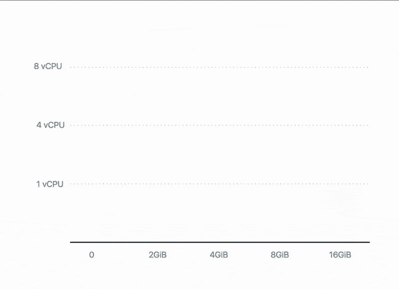
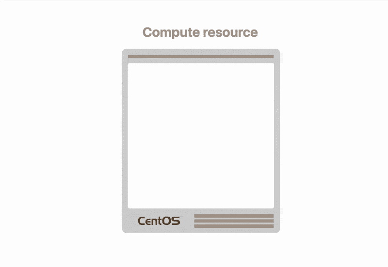
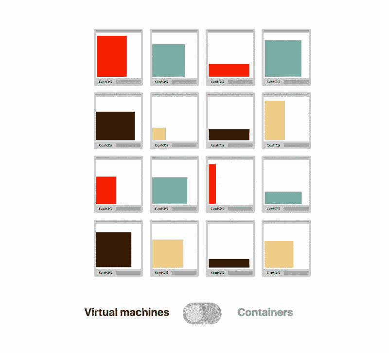
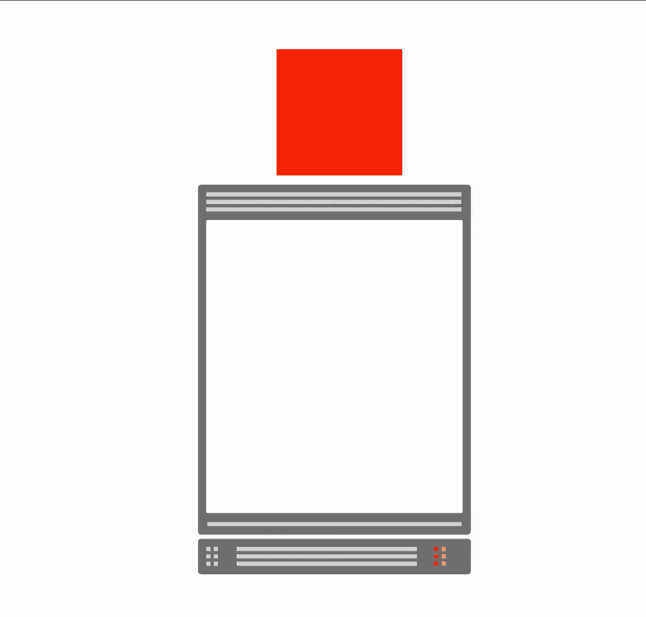

# 如何利用 Kubernetes 的力量来优化您的托管成本

> 原文：<https://www.freecodecamp.org/news/how-to-leverage-the-power-of-kubernetes-to-optimise-your-hosting-costs-c2e168a232a2/>

丹尼尔·波伦西奇

# 如何利用 Kubernetes 的力量来优化您的托管成本



在过去的几年中，行业经历了向开发更小和更集中的应用程序的转变。

越来越多的公司将他们庞大而静态的铁板一块分割成一套分离而独立的组件，这并不奇怪。

理应如此。

小型服务包括:

*   **更快部署**——因为您以更小的块创建和发布它们
*   **更容易迭代**——因为添加特性是独立发生的
*   **弹性** —尽管其中一个组件不可用，整体服务仍然可以运行

从产品和开发的角度来看，较小的服务是非常好的。

但是，这种文化转变对基础设施有什么影响呢？

### 大规模管理基础设施

事实证明，当您处理一些稀疏的应用程序时，事情相当简单。

你可以用手去数，你有大把的时间去奉献支持和释放。

在大型组织中，管理数百个应用程序要求很高，但仍然可行。您有几个团队致力于开发、打包和发布应用程序。

另一方面，用更小的组件开发服务带来了不同的挑战。

对于每一个应用程序，当你可以在四个组件的集合中重构相同的应用程序时，你至少有四倍多的应用程序需要开发、打包和发布。


一个小型服务由十几个组件组成并不罕见，例如前端应用程序、后端 API、授权服务器、管理应用程序等。

事实上，当您开发相互交互的服务时，您会看到部署在基础设施上的组件激增。



不过，这变得更难了。

### 你很可能在计算资源上浪费金钱

大部分服务部署到虚拟机，如亚马逊 EC2、数字海洋水滴或 Azure 虚拟机。

每个虚拟机都带有一个操作系统，该操作系统会消耗分配给它的部分内存和 CPU 资源。

当您在 Digital Ocean 上创建 1GB 内存和 1 个 vCPU droplet 时，在除去操作系统的开销后，您最终会使用 700MB 内存和 0.8 个 vCPU。



换句话说，对于每五个虚拟机，开销加起来就是一个完整的虚拟机。

你买了五个，但只能用四个。

你不能逃避它，即使你在裸机上。

您仍然需要从基本操作系统运行您的服务。

没关系，每个人都需要运行一个操作系统。

你是对的。

然而，浪费在操作系统上的现金只是冰山一角。

### 你也在资源利用上浪费了很多钱

您可能已经意识到，当您将服务分解成更小的组件时，每个组件都有不同的资源需求。

一些组件，如数据处理和数据挖掘应用程序是 CPU 密集型的。其他应用程序，如实时应用程序的服务器，可能会使用比 CPU 更多的内存。



亚马逊网络服务和其他云提供商确实有一长串满足各种需求的计算资源:通用、CPU 优化、内存优化、存储优化和 GPU 计算。

您应该努力为您的组件使用正确的虚拟机。理想情况下，它应该与内存消耗和 CPU 利用率相匹配。

你正在开发一个用 Java 编写的关键 web 组件吗？

也许您应该使用针对计算密集型工作负载进行优化的 c5.4x 大内存。

你越符合要求，你就越能更好地利用你的资源。

然而在实践中，这种情况并不常见。

*应该用 c 5.2 倍大还是 c 5.4 倍大？*

*下一层(8 个 vCPU 和 16GB 内存)有什么不同吗？*

选择几个在 80%的情况下足够好的计算配置文件并将其用于所有组件要容易得多。

*事实上，为每个工作负载使用几乎相同的虚拟机有什么问题？*

如果您乐于将每个组件都封装到 2GB 的内存和 vCPU 计算能力中，那就什么都不是。

即使您的组件可以在只有 1GB 内存的情况下运行。

是的，你可以在未来进行优化。

不过实话实说:**就像开车的时候换轮胎**。

你花了很多精力来调整系统，却发现应用程序又变了，你不得不从头开始。

因此，您最终采取了唯一明智的选择:为虚拟机选择小型、中型和大型配置文件，并将其用于所有工作负载。

你知道你必须忍受浪费数百兆的内存和大量的 CPU 周期。



如果这能让你感觉好点的话，有很多公司都遭受着类似的低效率。

一些公司只利用了分配资源的 10%。

你在亚马逊的 EC2 实例中支付了 1000 美元，但实际上你只用了其中的 100 美元。

这听起来不像是花费预算的最佳方式。

你应该在你没有使用的资源上收回你的钱。

但是为什么这些需求如此不同呢？！

### 当选择正确的工具弊大于利时

当开发人员可以自由地使用合适的工具时，他们通常会变得疯狂。

前端的 Node.js，后端 API 的 Spring Boot，处理后台作业的 Flask 和 Celery，客户端的 React.js，应有尽有。

基础设施变成了一个主题公园，数百个应用程序在完全不同的运行时上运行。

拥有合适的技术可以提高迭代速度，但通常会带来管理多一种编程语言的额外负担。

虽然您可以减少工具和语言的扩散，但在实践中，事情要比这复杂得多。

共享同一个 JVM 运行时的两个应用程序可能依赖不同的依赖项和库。

也许人们依靠 ImageMagick 来调整图像的大小。

另一个依赖于一个二进制文件，比如 PhantomJS 或 ZeroMQ。

您应该将这些依赖项与其应用程序一起打包。

因此，你最终会处理几十种相同的配置，但以其独特的方式不同。

你不应该把基础设施当作事后的想法。您应该在开发应用程序时，从一开始就关注您的依赖项并打包它们。

理想情况下，您应该将运行组件所需的所有部分作为一个包进行归档。

在发布之前，不要再迷失在依赖中。

是的，说起来容易做起来难。

也可能不是。

### 从航运业借用集装箱

信息技术并不是唯一存在同样问题的行业。

当你需要单独存放物品时，在全球范围内运输货物是很困难的。

想象一下，在货舱中存放成千上万个各种形状和大小的箱子。你应该特别注意如何包装这些物品，因为你不想在卸货的时候漏掉一件。

货运业提出了一个解决方案:集装箱。

货运公司不承运货物；它运送集装箱。

你想安全地运送你所有的货物吗？将它们放入容器中。当集装箱卸下来的时候，你保证所有的东西都在那里。

您可以将同样的原则应用到您的应用程序中。

您想安全地部署您的应用程序及其所有依赖项吗？

将它们包装到 Linux 容器中。

Linux 容器类似于货物容器，但是它封装了运行您的流程所需的所有文件、二进制文件和库。

这听起来是不是很像虚拟机？

### 节食中的虚拟机

事实上，如果你眯着眼睛从远处看虚拟机，它们就像容器。

它们像容器一样封装了应用程序及其依赖项。

然而，虚拟机启动缓慢，通常较大，而且——如你所知——浪费资源。

事实上，您必须分配固定数量的 CPU 和内存来运行您的应用程序。

它们还必须模拟硬件，并带有操作系统的额外负担。

另一方面，Linux 容器仅仅是在您的主机上运行的进程。



事实上，对于同一个操作系统和服务器，您可以在该主机上运行几十个容器。

尽管生活在同一台计算机上，运行在容器中的进程看不到彼此。

在容器内运行的应用程序是完全隔离的，无法区分虚拟机和容器。

这是个好消息！

Linux 容器类似于虚拟机，但是更高效。

但是这些 Linux 容器是由什么制成的呢？

### Linux 容器是有好处的独立进程

容器的魅力来自 Linux 内核中的两个特性:控件组和名称空间。

控制组是限制特定进程可以使用的 CPU 或内存的一种便捷方式。

例如，您可以说您的组件应该只使用 2GB 内存和四个 CPU 核心中的一个。

另一方面，名称空间负责隔离进程并限制它可以看到的内容。

该组件只能看到与其直接相关的网络数据包。它将无法看到流经网络适配器的所有网络数据包。控件组和名称空间是低级原语。

随着时间的推移，开发人员创建了越来越多的抽象层，使得控制这些内核特性变得更加容易。

第一个抽象是 LXC，但真正的交易是 2013 年发布的 Docker。

Docker 不仅抽象了上述内核特性，而且使用起来也很愉快。

运行 Docker 容器非常简单:

```
docker run <my-container>
```

由于所有容器都实现了一个标准接口，所以您可以使用相同的命令运行任何其他容器:

```
docker run mysql
```

你有一个 MySQL 数据库。

应用程序的可移植性以及创建和运行流程的标准接口使得容器如此受欢迎。

集装箱太棒了！

*   你在运行几十个操作系统上节省了钱，✅
*   您将应用程序打包成便携式设备✅
*   你有一个扩散的集装箱❌

听起来容器终究没有解决所有问题。

您需要一种管理容器的方法。

### 规模化管理容器

当您有数百个甚至数千个容器时，您应该找到一种方法在同一个服务器上运行多个容器。您还应该计划将容器分布在多台服务器上。

因此，您可以将负载分布在几个节点上，防止单个故障导致整个服务瘫痪。

跟踪每个容器在基础设施中的部署位置听起来并不是对时间的最佳利用。

也许有一种自动化的方法？

如果你能有一个算法来决定在哪里放置这些容器呢？

或许高效打包容器以最大化服务器密度是明智之举。甚至可以保留一个已部署容器及其主机的列表。

事实证明，有人恰恰有这样的想法，并提出了解决方案。

### Kubernetes，强大的容器管弦乐队

Kubernetes 最初是谷歌创造的。

Google 正在运行一种类似于容器的技术，必须找到一种有效的方法来安排工作负载。

他们不想保留和手动更新一长串容器和服务器。因此，他们决定编写一个平台，可以自动分析资源利用，调度和部署容器。

但它是封闭的源代码。

一些谷歌人决定重写这个平台，作为开源的努力。剩下的就是历史了。

*那么什么是 Kubernetes 呢？*

你可以把 Kubernetes 想象成一个调度程序。

Kubernetes 检查您的基础设施(裸机或云、公共或私有)，并测量每台计算机的 CPU 和内存。

当您请求部署一个容器时，Kubernetes 会识别您的容器的内存需求，并找到满足您的请求的最佳服务器。

您不需要决定应用程序的部署位置。数据中心从你那里抽象出来。

换句话说，Kubernetes 会用你的基础设施玩俄罗斯方块。

Docker 容器是块，服务器是板，Kubernetes 是播放器。



让 Kubernetes 高效地打包您的基础设施意味着您可以获得更高的计算效率。你可以用更少的资源做更多的事情。

你的总账单使用量会因此减少。

还记得那些只使用了 10%分配资源的公司吗？

好吧，库伯内特刚刚救了你一命。

但是还有更多。

Kubernetes 有一个通常被遗忘或忽略的杀手特征。

### Kubernetes 作为数据中心的 API 层

您在 Kubernetes 中所做的一切离您只有一个 API 调用的距离。

*您需要部署容器吗？*这有一个 REST 端点。

*也许你希望提供一个负载平衡器？没问题。就叫这个 API 吧。*

您是否希望调配存储？请向该 URL 发送发布请求。

你在 Kubernetes 做的一切都是调用 API。

有很多好的理由对此感到兴奋:

*   您可以创建以编程方式与 API 交互的脚本和守护程序
*   API 已版本化；当您升级集群时，您可以继续使用旧的 API 并逐渐迁移
*   您可以在任何云提供商或数据中心安装 Kubernetes，并且可以利用相同的 API

您可以将 Kubernetes 视为基础设施之上的一层。

由于这一层是通用的，可以安装在任何地方，您可以随时随身携带。

亚马逊网络服务太贵？

**没问题。**

你可以在谷歌云平台上安装 Kubernetes，把你的工作负载迁移到那里。

或者您可以两者都保留，因为拥有高可用性策略总是很方便的。

但也许你不相信我。

好得不像真的，我在卖烟雾弹和镜子。

让我展示给你看。

### 使用 Kubernetes 节省您的云账单

Netlify 是一个用于构建、部署和管理静态网站的平台。

它有自己的 CI 管道，所以每次您将更改推送到存储库时，您的网站都会重建。

Netlify 设法迁移到 Kubernetes，使他们的用户基础翻了一番，但仍然保持成本不变。

这是个好消息！

想象一下节省 50%的谷歌云平台费用！

但是 Netlify 不是唯一的一个。

Qbox 是一家专注于托管弹性搜索的公司，每月在 AWS 账单上又节省了 50%!

在这个过程中，他们还[开源了他们在多云运营方面的努力](https://github.com/supergiant/supergiant)。

如果你仍然没有印象，你应该看看 OpenAI 制作的新闻。

OpenAI 是一家专注于人工智能和机器学习的非营利性研究公司。他们编写了一个算法，像任何人类玩家一样玩多人在线游戏 Dota。

但是他们更进一步，训练了一队机器一起玩。

他们使用 Kubernetes 在云中扩展他们的机器学习模型。

想知道他们集群的细节吗？

*128000 vcpu*

也就是 16000 左右的 MacBook Pros。

*256 英伟达特斯拉 P100*

那就是 2100 Teraflops 16 位浮点性能。

就像你运行 525 台 PlayStation 4s 一样。

你能猜出每小时的费用吗？

*没有？*

128000 vCPU 每小时仅需 1280 美元，256 Nvidia P100 每小时仅需 400 美元。

考虑到赢得 Dota 锦标赛可以为你赢得数百万美元的奖金，这并不是很多。

那么，你还在等什么？

准备好采用 Kubernetes，节省您的云账单！

### 最终注释

Kubernetes 和集装箱在这里停留。

有了谷歌、微软、红帽、Pivotal、甲骨文、IBM 等公司的支持，很难相信它不会流行起来。

许多公司在 Kubernetes 上领先一步，加入了这场革命。

不仅仅是初创公司和中小企业，银行、金融机构和保险公司等大企业也在赌 containers 和 Kubernetes 会成为未来。

甚至有公司投资了物联网和嵌入式系统。

现在还为时尚早，社区还有时间成熟，但是你应该密切关注这个领域的创新。

### 那都是乡亲们！

非常感谢[安迪·格里菲斯](https://andrewgriffithsonline.com/)、[约翰·托普利](http://johntopley.com/)和[沃尔特·米亚尼](https://www.linkedin.com/in/waltermiani/)阅读了这篇文章的草稿并提供了一些宝贵的建议。

如果你喜欢这篇文章，你可能会发现有趣的阅读:

*   [Windows 10 上的 Docker 和 Kubernetes 入门](https://learnk8s.io/blog/installing-docker-and-kubernetes-on-windows)在这里，您将亲自动手，在您的 Windows 环境中安装 Docker 和 Kubernetes。
*   [3 个小 Docker 图片的简单窍门](https://learnk8s.io/blog/smaller-docker-images)。Docker 图像不必很大。学习如何把你的 Docker 图片节食！

### 成为 Kubernetes 中部署和扩展应用程序的专家

从我们的实践课程开始，了解如何掌握云中的可扩展性。

了解如何:

*   轻松处理最繁忙的流量网站
*   将您的作业扩展到数千台服务器，并将等待时间从几天缩短到几分钟
*   了解您的应用在多云设置下高度可用，让您高枕无忧
*   通过仅使用您需要的资源，在您的云账单上节省大量现金
*   增强您的交付渠道，全天候部署应用程序

[成为 Kubernetes 的专家](https://learnk8s.io/training) →

*文章原载于[learn k8s . io](https://learnk8s.io/blog/what-is-kubernetes)*