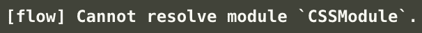
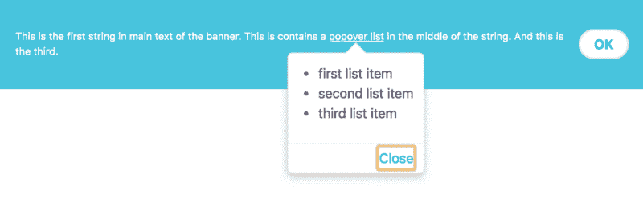
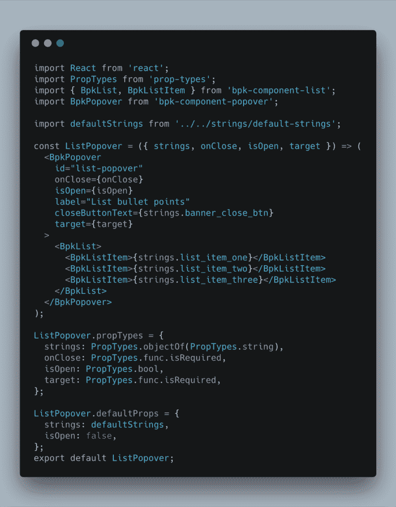
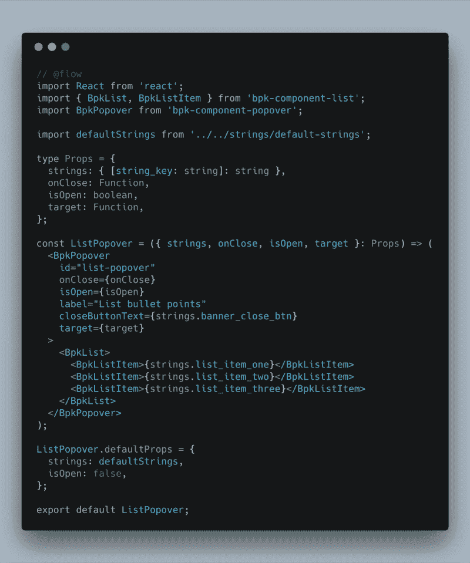

# 如何在现有的 React 应用中增加流量

> 原文：<https://www.freecodecamp.org/news/incrementally-add-flow-type-checking-react-261fee015f80/>

[Flow](https://flow.org/) 是 Javascript 的静态类型检查器。这篇文章是为那些*听说过*Flow，但还没有尝试在 React 应用中使用它的人准备的。如果这是你第一次听说心流，那么我可以推荐 Preethi Kasireddy 的[这四篇文章](https://medium.freecodecamp.org/why-use-static-types-in-javascript-part-1-8382da1e0adb)作为很好的介绍。

关于心流的一个伟大的事情是，它可以被增量地使用。您不必完全重构现有项目就可以开始使用它。它可以只添加到新文件中，或者在完全提交之前，在现有文件中慢慢尝试，看看它是否对您的特定项目有好处。

由于新工具的设置往往是最具挑战性的，在这篇文章中，我们将采用一个现有的项目，并通过添加流程的设置。Preethi 的第二篇文章中包含了对语法的一般性介绍，并且[流文档](https://flow.org/en/docs/)也非常易读。

我们将使用这个[示例回购](https://github.com/dominicfraser/FlowExamples)，其中有两个目录用于预流和后流。它使用 [Skyscanner 的](https://github.com/Skyscanner/backpack-react-scripts)定制 Create React 应用程序脚本`backpack-react-scripts`，与他们的定制[背包组件](https://backpack.github.io/)配对。这是为了创建比单个片段更复杂的例子，即使你不熟悉它们，也仍然可读。

与看到没有的[和有](https://github.com/dominicfraser/FlowExamples/tree/master/without_flow)流程的[之间的差异相比，应用的确切性质并不重要。这里很少有文件改变，但它们通常是最令人沮丧的！](https://github.com/dominicfraser/FlowExamples/tree/master/with_flow)

让我们走完每一步，然后看一下转换示例组件。

### 安装主要依赖项

除了 Flow 本身，还安装了 babel-cli 和 babel-preset-flow，以便 babel 可以在编译时删除类型注释。

```
npm install flow-bin babel-cli babel-preset-flow --save-dev
```

#### 设置巴别塔

为了使这些生效，创建一个`.babelrc`文件，或者将下面的[配置](https://github.com/dominicfraser/FlowExamples/blob/master/with_flow/.babelrc)添加到现有的`.babelrc`中:

```
{
  "presets": ["flow"]
}
```

#### 安装脚本

如果您使用任何钩子，比如预测试脚本，您可能希望更新这些钩子，并且将基本流[脚本](https://github.com/dominicfraser/FlowExamples/blob/master/with_flow/package.json#L11)添加到您的`package.json`:

```
"scripts": {
  "flow": "flow",
  "pretest": "npm run flow && npm run lint"
}
```

### 生成流配置

如果您第一次运行 flow，您可以通过运行`npm run flow init`来生成一个模板`.flowconfig`。在我们的示例中，我们可以看到我们[扩展了它](https://github.com/dominicfraser/FlowExamples/blob/master/with_flow/.flowconfig)，添加了以下内容:

#### 忽略模式

为了避免流解析您的节点模块和构建输出，这些很容易被忽略。

```
[ignore].*/node_modules/*.*/build/*
```

#### 添加 CSS 模块支持

如果您正在使用 CSS 模块，则需要指定它们的类型，以便 Flow 能够理解它们，否则您将收到以下错误:



Error: [flow] Cannot resolve module `CSSModule`.

这分两步完成。首先将以下内容添加到您的`.flowconfig`:

```
[libs]
./src/types/global.js  // this can be any path and filename you wish
[options]
module.name_mapper='^\(.*\)\.scss$' -> 'CSSModule'
module.system=haste
```

其次在[中创建一个 CSS 模块类型，在`[libs]`中引用](https://github.com/dominicfraser/FlowExamples/blob/master/with_flow/src/types/global.js)的文件。

```
// @flow
declare module CSSModule {
  declare var exports: { [key: string]: string };
  declare export default typeof exports;
}
```

### 与正在使用的其他棉绒同步

在示例项目中，ESLint 已经用于提供标准林挺。要让 ESLint 很好地使用 Flow，需要一些初始配置步骤，由于本项目中使用的特定类型，还需要一些后续步骤。

对于一般设置，以下是添加到`.eslintrc`中的:

```
"extends": [
  "plugin:flowtype/recommended"
],
"plugins": [
  "flowtype"
]
```

针对这个例子的扩展，以及它们所避免的错误，将在这篇文章的末尾讨论。

### 流动型 libdes

设置的最后一步是为使用`flow-typed` NPM 包创建的`libdefs`做准备。这用于为已安装的节点模块创建定义，默认情况下，在`flow-typed/`目录下创建这些文件。

我们**确实**想要提交这个文件，但是不希望 ESLint 处理它。这就产生了一个问题，因为之前我们的林挺脚本在我们的`package.json`中被设置为使用我们的`.gitignore`来知道同时文件 ESLint 也应该忽略:

```
"lint:js": "eslint . --ignore-path .gitignore --ext .js,.jsx",
```

我们现在想改变这一点，因为我们希望 ESLint 也忽略将要创建的`flow-typed/`目录。我们可以将脚本修改为:

```
"lint:js": "eslint . --ext .js,.jsx",
```

这意味着它现在将退回到使用一个`.eslintignore`文件，所以我们必须创建它，复制我们的`.gitignore`中的内容，并且[添加额外的目录来忽略其中的](https://github.com/dominicfraser/FlowExamples/blob/master/with_flow/.eslintignore)。

最后我们需要安装`flow-types`。我们在全球范围内开展这项工作。

```
npm install flow-typed -g
```

可以是完整的定义，也可以是接受任何类型的存根。维护了一个[完整定义](https://github.com/flow-typed/flow-typed/tree/master/definitions/npm)的列表。要查看您正在使用的软件包是否有可用的版本，请使用

```
flow-typed install my-dependency@<version.being.used>
```

这将把它添加到您的`flow-typed`目录中，或者提示您使用

```
flow-typed create-stub my-dependency@<version.being.used>
```

如果您想要创建一个完整的定义，您可以这样做，并且还可以将它提交给存储库，以便其他开发人员可以使用它。

要遵循的一个简单过程是只在需要时创建`libdefs`。对于要转换为使用 Flow 的每个组件，此时使用`flow-typed`添加其导入，如果它们不在使用 Flow 的文件中使用，则没有必要为所有依赖项添加类型。

### 转换现有组件

这是所有的一般设置完成，现在我们可以看看转换我们的示例组件！

我们有两个，有状态组件和功能组件。总的来说，这些创建了一个横幅，有一些文本和一个按钮。可以单击横幅上的文本来打开一个弹出窗口，其中包含一个项目符号列表。



Banner with a close button and an information popover

#### 添加流类型定义

对于任何组件，第一步是为我们正在工作的组件中的任何导入创建`flow-typed`定义。

例如，如果我们只有

```
import React from 'react';
import BpkButton from 'bpk-component-button';
```

然后我们会尝试:

`flow-typed install bpk-component-button@<its.installed.versi`开>

如果它不可用，并且当前也不可用，那么我们将存根它的定义:

`flow-typed create-stub bpk-component-button@latest`

在示例 repo 中，我们可以看到使用 Flow 迁移到的组件的所有已创建定义的[列表。这些是一次添加一个，因为每个组件都集成了流。](https://github.com/dominicfraser/FlowExamples/tree/master/with_flow/flow-typed/npm)

#### 功能组件

在我们没有流程的例子[中，我们使用`PropTypes`进行一些有限的类型检查，以及它们定义`defaultProps`用于开发的能力。](https://github.com/dominicfraser/FlowExamples/blob/master/without_flow/src/components/ListPopover/ListPopover.jsx)

乍一看，它可能看起来有点复杂，但是为了增加流动，我们需要改变的相对较少。



Component before adding Flow

要将其转换为使用 Flow，我们可以首先删除`PropTypes`导入和定义。然后可以将`// @flow`注释添加到第一行。

对于这个组件，我们只对传入的属性进行类型检查。为此，我们将首先创建一个 Props 类型，这比单独内联定义每个 Props 要简洁得多。

```
type Props = {
  strings: { [string_key: string]: string },
  onClose: Function,
  isOpen: boolean,
  target: Function,
};
```

这里后三种类型是不言自明的。由于`strings`是一个字符串对象，所以使用了一个作为映射的[对象，检查接收到的对象中的每个键和值，以检查它们的类型是否匹配，而不必指定它们确切的字符串键。](https://flow.org/en/docs/types/objects/#toc-objects-as-maps)

然后，可以将 prop-types 定义与其导入一起删除。由于 defaultProps 与此导入无关，因此它们可以也应该保留。关于此时报告的任何错误，请参见 ESLint 结束注释。

该组件现在应该如下所示:



Component after adding Flow

#### 有状态组件

有状态组件遵循一些稍微不同的声明。由于这个组件更复杂，我们还将研究一些附加方面的声明类型。

和以前一样，在添加流之前，先看一下[组件。](https://github.com/dominicfraser/FlowExamples/blob/master/without_flow/src/components/Banner/Banner.jsx)

**道具和状态**

与在函数组件中一样，我们首先删除了`propTypes`定义和导入，并添加了`// @flow`注释。

首先，我们将看看如何添加道具和状态的类型。同样，我们将为这些创建类型:

```
type Props = {
  strings: { [string_key: string]: string },
  hideBannerClick: Function,
}; 
type State = {
  popoverIsOpen: boolean,
};
```

并指定组件将使用它们:

```
class Banner extends Component<Props, State> {
  constructor(props: Props) {
    super(props);    
    this.state = {
      popoverIsOpen: false,
    };
  ...
  };
...
};
```

接下来，我们讨论函数和有状态组件的第一个区别。在函数组件中，我们习惯于声明这些，在有状态组件中，外部的`Banner.defaultProps`语法被移除，取而代之的是在类中声明默认值:

```
class Banner extends Component<Props, State> {
  static defaultProps = {
    strings: defaultStrings,
  };
constructor(props: Props) {
...
// the below is removed
// Banner.defaultProps = {
//  strings: defaultStrings,
// };
```

**构造函数声明**

`stringWithPlaceholder`是在构造函数内声明的。这里我们不看*为什么在那里声明*(我们将假设有充分的理由)，而是看是否可以在不改变现有代码的情况下添加流。

如果在现有状态下运行，我们会遇到错误`Cannot get this.stringWithPlaceholder because property stringWithPlaceholder is missing in Banner [1]`。

要解决这个问题，我们必须在 Banner 类块中添加一行代码，就在构造函数的下面和外面:

```
class Banner extends Component<Props, State> {
  constructor(props: Props) {
    super(props);    
    this.state = {
      popoverIsOpen: false,
    };
    this.stringWithPlaceholder = ...
  };
  stringWithPlaceholder: string;
...
};
```

这个变量是在构造函数中创建的，但不是作为 props 传入的。因为我们使用 Flow 对传入构造函数的属性进行类型检查，所以需要对构造函数中的所有内容进行类型检查。众所周知流需要这样做，这可以通过在类块中指定它们的类型来实现。

此时道具和状态都完成了。让我们看看这个组件中类型检查的一些快速的附加例子。关于此时报告的任何错误，请参见 ESLint 结束注释。

**返回、事件和节点类型**

`togglePopover`没有参数，因此可以看到一个指定没有返回值的简单示例:

```
togglePopover = (): void => {
  ...
};
```

`keyboardOnlyTogglePopover`不返回任何内容，但只有一个参数。这是一个事件，特别是按键事件。`SyntheticKeyboardEvent`被用作[作为](https://flow.org/en/docs/react/events/)

> React 使用自己的事件系统，因此使用合成事件类型而不是 DOM 类型(如 event、KeyboardEvent 和 MouseEvent)非常重要。

```
keyboardOnlyTogglePopover = (e: SyntheticKeyboardEvent<>): void => {
  ...
};
```

`Popover`在`render()`中被定义，并返回我们之前看过的`ListPopover`函数组件的一个实例。我们可以将其返回类型指定为 React `Node`。然而，为了能够这样做，我们必须首先导入它，因为它在默认情况下不可访问[。有多种方法可以导入它，其中一种如下所示:](https://flow.org/en/docs/react/types/)

```
import React, { Component } from 'react';
import type { Node } from 'react';
...
const Popover: Node = (
  <ListPopover
    onClose={this.togglePopover}
    isOpen={this.state.popoverIsOpen}
    strings={this.props.strings}
    target={() => document.getElementById('ListPopoverLink')}
  />
);
```

### **型式检查进口 React 组件**

当在一个组件中声明了适当类型时，就可以在另一个组件中使用该组件时使用它们。然而，如果您使用一个`index.js`来导出第一个组件，那么流`// @flow`将需要被添加到索引中。

[例如](https://github.com/dominicfraser/FlowExamples/blob/master/with_flow/src/components/ListPopover/index.js):

```
// @flow
import ListPopover from './ListPopover';
export default ListPopover;
```

### 将道具标记为可选

可以使用`prop?: type`语法将属性标记为可选的，例如:

```
type Props = {  
  strings: { [string_key: string]: string },  
  hideBannerClick?: Function,
};
```

这是受支持的，但不再被 Flow 推荐。相反，所有的道具都应该按照要求保留，没有`?`，即使是可选的，因为流[自动检测](https://github.com/facebook/flow/issues/1660#issuecomment-434549520)默认道具，并在内部将带有默认值的道具标记为可选。

在下一节中，我们可以看到手动将道具标记为可选在某些情况下会导致与其他工具的冲突。

### ESLint 扩展、默认属性和属性验证错误解决方案

我们的`.eslintrc`增加了两项内容。对于这个项目，您可以简单地接受它们的使用，或者如果您看到以下三个错误中的任何一个，请阅读下面的详细信息:

*   `x missing in props validation`
*   `error defaultProp "x" defined for isRequired propType`
*   `Cannot get strings.xxx because property xxx is missing in undefined`

通过推理，添加的规则是:

```
"react/default-props-match-prop-types": [
  "error", { "allowRequiredDefaults": true }
]
```

当使用对象作为贴图时(在本例中为“字符串”属性),会出现一个`missing in props validation`错误。这是[的一个 bug](https://github.com/yannickcr/eslint-plugin-react/issues/1280) ，所以这里明确[忽略了](https://github.com/yannickcr/eslint-plugin-react/blob/master/docs/rules/prop-types.md)。

```
"react/default-props-match-prop-types": [  "error", { "allowRequiredDefaults": true }]
```

当使用对象作为贴图时，ESLint、flow 和 prop 类型之间的复杂性开始发挥作用。

`strings`是必需的道具，作为字符串的对象传递。流类型检查对象中的每个条目的字符串键是一个字符串，值是一个字符串。这比必须列出每个特定键的正确类型更容易维护。

如果 prop 在 Flow 中被标记为 required，那么 ESLint 将错误声明:`error defaultProp "strings" defined for isRequired propType`。

如果道具被手动标记为可选，那么流程将出现错误`Cannot get strings.xxx because property xxx is missing in undefined [1]`。

这是[已知的](https://github.com/facebook/flow/issues/6350)，是由于[精化失效](https://flow.org/en/docs/lang/refinements/#toc-refinement-invalidations)导致的，因为 JSX 可以转换方法调用，所以流不能确定 xxx 没有被重定义。

这留给我们修复 ESLint 错误。上述规则允许在流类型为*而非*标记为可选时定义 defaultProps。Flow 将理解这一点并将其转换为可选的。ESLint 被标记为`"allowRequiredDefaults": true`，这意味着尽管 ESLint 认为 prop 是必需的，但它不会出错。

### 最后的想法

一旦越过了安装的最初障碍，Flow 的使用就相当简单了。增量添加它的能力肯定会有所帮助，而不是必须一次重构整个项目。

希望这里的设置说明和例子证明是有用的，如果你想尝试自己流出。

感谢阅读？

您还可以享受:

*   [测试与 Jest 和酶 I 的反应](https://medium.com/@dfrase/testing-react-with-jest-and-enzyme-20505fec4675)
*   [亚马逊弹性容器服务入门指南](https://medium.com/p/807d8c4960fd?source=user_profile---------11------------------)
*   [使用 Pa11y CI 和 Drone 作为可访问性测试的把关者](https://medium.com/p/a8b5a3415227?source=user_profile---------7------------------)