# 如何使用维基百科的搜索 API 用 RamdaJS 构建用户界面

> 原文：<https://www.freecodecamp.org/news/how-to-build-wikipedias-api-search-with-ramdajs-b3c1a069d7af/>

在本教程中，我们将使用维基百科的公共搜索 API 和一些 JavaScript + RamdaJS 构建一个 UI。

### 入门指南

下面是 [GitHub 链接](https://github.com/yazeedb/ramda-wikipedia-search)和 [Codesandbox 链接](https://codesandbox.io/s/y2zpq2xw39)。打开您的终端并选择一个目录来克隆它。

```
git clone [https://github.com/yazeedb/ramda-wikipedia-search](https://github.com/yazeedb/ramda-wikipedia-search)
cd ramda-wikipedia-search
yarn install (or npm install) 
```

`master`分支已经完成了项目，所以如果您想继续编码，请查看`start`分支。

`git checkout start`

并启动项目！

`npm start`

你的浏览器应该会自动打开 [localhost:1234](http://localhost:1234/) 。

### **获取输入值**

这是初始应用程序。

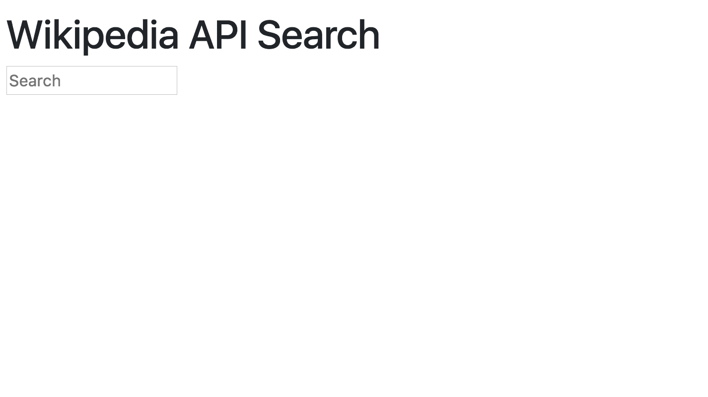

为了捕捉用户的输入，我们的`input`元素需要一个事件监听器。

您的`src/index.js`文件已经连接好并准备好了。你会注意到我们导入了 Bootstrap 进行造型。

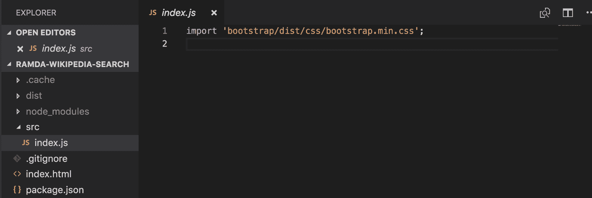

让我们添加一个虚拟事件侦听器来让事情继续进行。

```
import 'bootstrap/dist/css/bootstrap.min.css';

const inputElement = document.querySelector('input');

inputElement.addEventListener('keyup', (event) => {
  console.log('value:', event.target.value);
}); 
```

我们知道`event.target.value`是访问输入值的标准方式。现在它显示了价值。

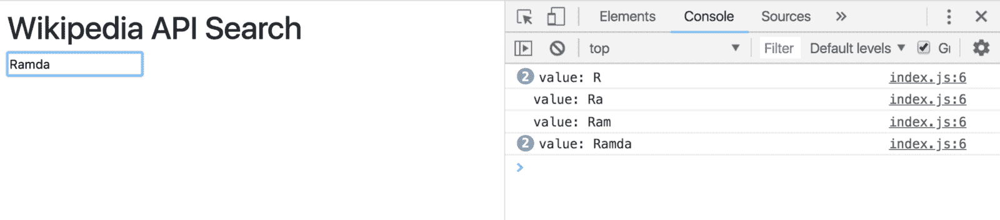

拉姆达如何帮助我们实现以下目标？

*   抓取`event.target.value`
*   修剪输出(去除前导/尾随空白)
*   如果`undefined`，则默认为空字符串

`pathOr`函数实际上可以处理第一个和第三个要点。它有三个参数:默认值、路径和数据。

所以下面的工作很完美

```
import { pathOr } from 'ramda';

const getInputValue = pathOr('', ['target', 'value']); 
```

如果`event.target.value`是`undefined`，我们将得到一个空字符串！

Ramda 还有一个`trim`函数，这样就解决了我们的空白问题。

```
import { pathOr, trim } from 'ramda';

const getInputValue = (event) => trim(pathOr('', ['target', 'value'], event)); 
```

让我们使用`pipe`，而不是嵌套那些函数。如果你对管道不熟悉，可以看看我的文章。

```
import { pathOr, pipe, trim } from 'ramda';

const getInputValue = pipe(
  pathOr('', ['target', 'value']),
  trim
); 
```

我们现在有一个复合函数，它接受一个`event`对象，获取它的`target.value`，默认为`''`，并对其进行裁剪。

太美了。

我建议将它存储在一个单独的文件中。也许可以称之为`getInputValue.js`并使用默认的导出语法。

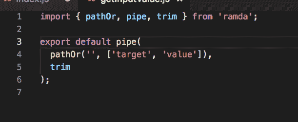

### 获取维基百科的网址

截至本文撰写时，维基百科的 API 搜索 URL 为[https://en.wikipedia.org/w/api.php?origin=*&action = open search&search =](https://en.wikipedia.org/w/api.php?origin=*&action=opensearch&search=)

对于实际的搜索，只需添加一个主题。例如，如果您需要熊，URL 如下所示:

[https://en.wikipedia.org/w/api.php?origin=*&action = open search&search = bears](https://en.wikipedia.org/w/api.php?origin=*&action=opensearch&search=bears)

我们想要一个函数，以一个主题，并返回完整的维基百科搜索网址。当用户输入时，我们根据他们的输入建立 URL。

拉姆达的`concat`在这里很好用。

```
import { concat } from 'ramda';

const getWikipediaSearchUrlFor = concat(
  'https://en.wikipedia.org/w/api.php?origin=*&action=opensearch&search='
); 
```

`concat`，顾名思义，连接字符串和数组。这是被简化了的，所以提供 URL 作为一个参数会返回一个需要第二个字符串的函数。如果是新的，请看[我关于奉承](https://medium.com/front-end-hacking/how-does-javascripts-curry-actually-work-8d5a6f891499)的文章！

将代码放入一个名为`getUrl.js`的模块中。


现在来更新一下`index.js`。导入我们的两个新模块，以及来自 Ramda 的`pipe`和`tap`。

```
import 'bootstrap/dist/css/bootstrap.min.css';
import { pipe, tap } from 'ramda';
import getInputValue from './getInputValue';
import getUrl from './getUrl';

const makeUrlFromInput = pipe(
  getInputValue,
  getUrl,
  tap(console.warn)
);

const inputElement = document.querySelector('input');

inputElement.addEventListener('keyup', makeUrlFromInput); 
```

这个新代码从用户的输入中构造我们的请求 URL，并通过`tap`记录它。

看看这个。

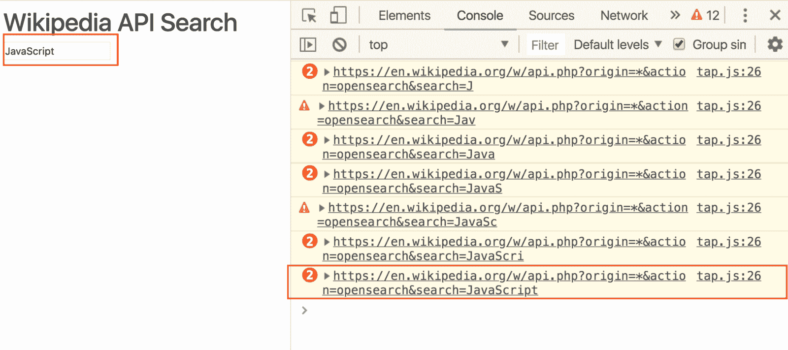

### **发出 AJAX 请求**

下一步是将 URL 映射到 AJAX 请求并收集 JSON 响应。

用新功能`searchAndRenderResults`替换`makeUrlFromInput`。

```
const searchAndRenderResults = pipe(
  getInputValue,
  getUrl,
  (url) =>
    fetch(url)
      .then((res) => res.json())
      .then(console.warn)
); 
```

不要忘记改变你的事件监听器！

```
inputElement.addEventListener('keyup', searchAndRenderResults); 
```

这是我们的结果。

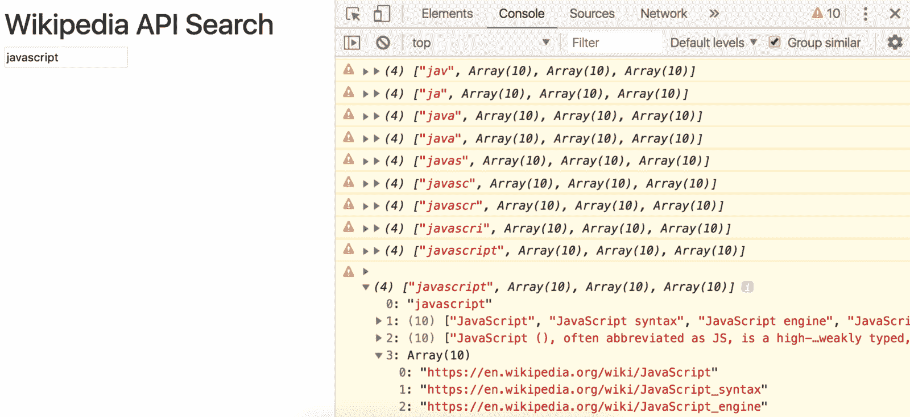

### **制作结果组件**

现在我们有了 JSON，让我们创建一个组件来美化它。

将`Results.js`添加到您的目录中。

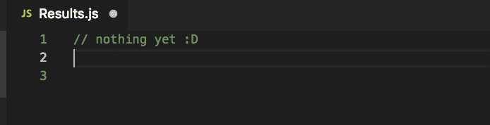

回头看看我们维基百科搜索 JSON 的回复。注意它的形状。这是一个包含以下索引的数组:

1.  查询(您搜索的内容)
2.  结果名称数组
3.  汇总数组
4.  指向结果的链接数组

我们的组件可以接受这个形状的数组，并返回一个格式良好的列表。通过 ES6 数组析构，我们可以使用它作为我们的函数签名。

编辑`Results.js`

```
export default ([query, names, summaries, links]) => `
  <h2>Searching for "${query}"</h2>
  <ul class="list-group">
    ${names.map(
      (name, index) => `
        <li class="list-group-item">
          <a href=${links[index]} target="_blank">
            <h4>${name}</h4>
          </a>
          <p>${summaries[index]}</p>
        </li>
      `
    )}
  </ul>
`; 
```

我们一步一步来。

*   它是一个函数，接受我们期望的元素的数组:`query`、`names`、`summaries`和`links`。
*   使用 [ES6 模板文字](https://developer.mozilla.org/en-US/docs/Web/JavaScript/Reference/Template_literals)，它返回一个带有标题和列表的 HTML 字符串。
*   在`<ul>`中，我们将`names`映射到`<li>`标签，所以每个标签对应一个标签。
*   里面是指向每个结果链接的`<a>`标签。每个链接都在一个新的选项卡中打开。
*   链接下面是一段摘要。

在`index.js`中导入它，并像这样使用它:

```
// ...

import Results from './Results';

// ...

const searchAndRenderResults = pipe(
  getInputValue,
  getUrl,
  (url) =>
    fetch(url)
      .then((res) => res.json())
      .then(Results)
      .then(console.warn)
); 
```

这会将 Wikipedia JSON 传递给`Results`并记录结果。您应该会在 DevTools 控制台中看到一堆 HTML！

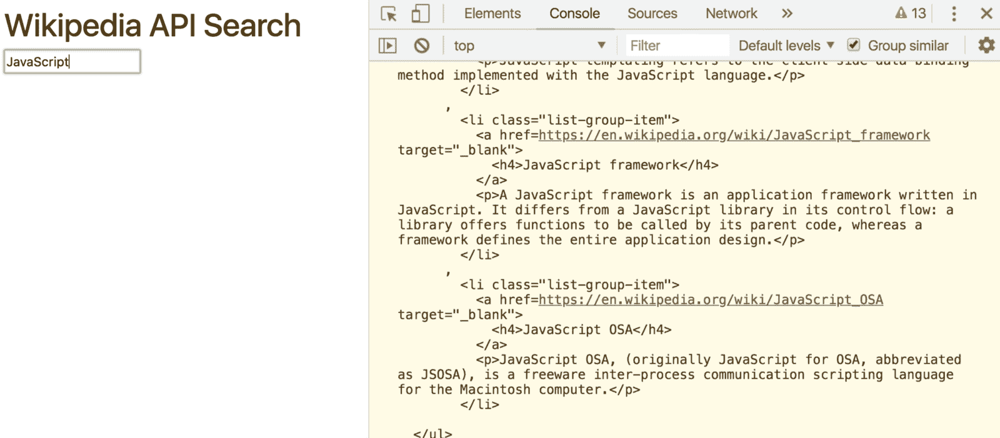

剩下的工作就是将它呈现给 DOM。一个简单的`render`函数应该就可以了。

```
const render = (markup) => {
  const resultsElement = document.getElementById('results');

  resultsElement.innerHTML = markup;
}; 
```

将`console.warn`替换为`render`功能。

```
const searchAndRenderResults = pipe(
  getInputValue,
  getUrl,
  (url) =>
    fetch(url)
      .then((res) => res.json())
      .then(Results)
      .then(render)
); 
```

去看看吧！

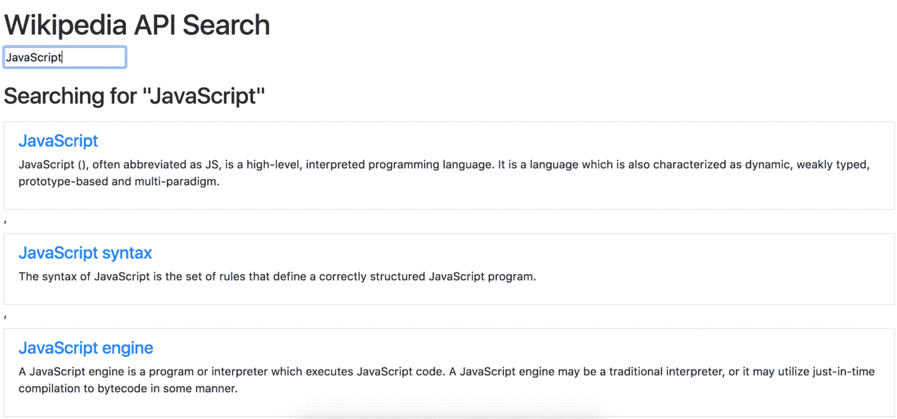

每个链接应该在一个新的选项卡中打开。

### **去掉那些奇怪的逗号**

你可能已经注意到了我们新的用户界面的一些问题。

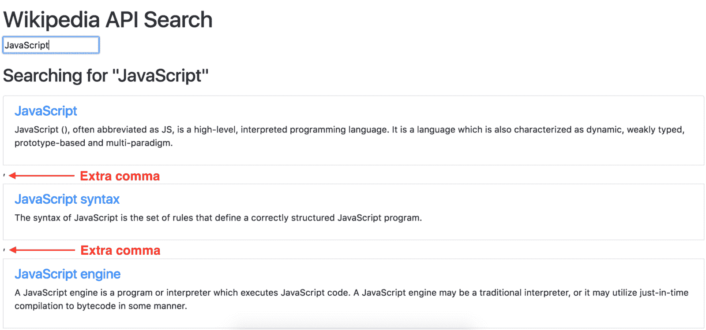

它有多余的逗号！为什么？？

### 模板文字

这都是关于模板文字如何连接东西。如果你坚持一个数组，它会使用`toString()`方法加入它。

看到这是如何连接的了吗？

```
const joined = [1, 2, 3].toString();

console.log(joined);
// 1,2,3

console.log(typeof joined);
// string 
```

如果在模板中放入数组，模板文字就会这样做。

```
const nums = [1, 2, 3];
const msg = `My favorite nums are ${nums}`;

console.log(msg);
// My favorite nums are 1,2,3 
```

您可以通过不使用逗号连接数组来解决这个问题。只需使用空字符串。

```
const nums = [1, 2, 3];
const msg = `My favorite nums are ${nums.join('')}`;

console.log(msg);
// My favorite nums are 123 
```

编辑`Results.js`以使用`join`方法。

```
export default ([query, names, summaries, links]) => `
  <h2>Searching for "${query}"</h2>
  <ul class="list-group">
    ${names
      .map(
        (name, index) => `
        <li class="list-group-item">
          <a href=${links[index]} target="_blank">
            <h4>${name}</h4>
          </a>
          <p>${summaries[index]}</p>
        </li>
      `
      )
      .join('')}
  </ul>
`; 
```

现在你的用户界面干净多了。


### **修复一个小 Bug**

我在建造这个的时候发现了一个小错误。你注意到了吗？

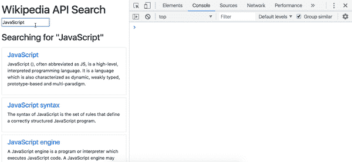

清空`input`会引发此错误。

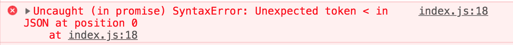

这是因为我们发送了一个没有搜索主题的 AJAX 请求。查看网络选项卡中的 URL。

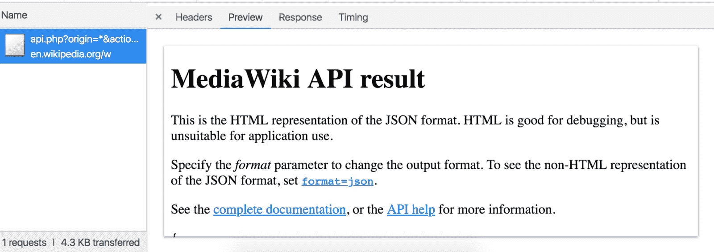

该链接指向一个默认的 HTML 页面。我们没有取回 JSON，因为我们没有指定搜索主题。

为了防止这种情况发生，如果`input`为空，我们可以避免发送请求。

我们需要一个函数，如果`input`为空，那么**什么都不做**，如果`input`为空，那么**会搜索**。

让我们首先创建一个名为`doNothing`的函数。你可以猜猜它长什么样。

```
const doNothing = () => {}; 
```

这更好地被称为`noOp`，但是我在这个上下文中喜欢`doNothing`。

接下来从你的`searchAndRenderResults`函数中删除`getInputValue`。在使用它之前，我们需要多一点安全性。

```
const searchAndRenderResults = pipe(
  getUrl,
  (url) =>
    fetch(url)
      .then((res) => res.json())
      .then(Results)
      .then(render)
); 
```

从 Ramda 导入`ifElse`和`isEmpty`。

```
import { ifElse, isEmpty, pipe, tap } from 'ramda'; 
```

添加另一个功能，`makeSearchRequestIfValid`。

```
const makeSearchRequestIfValid = pipe(
  getInputValue,
  ifElse(isEmpty, doNothing, searchAndRenderResults)
); 
```

花一分钟去理解它。

如果输入值为空，什么也不做。否则，搜索并呈现结果。

您可以通过读取函数来收集这些信息。*那是*富有表现力。

Ramda 的 [isEmpty](https://ramdajs.com/docs/#isEmpty) 函数可以处理字符串、数组和对象。

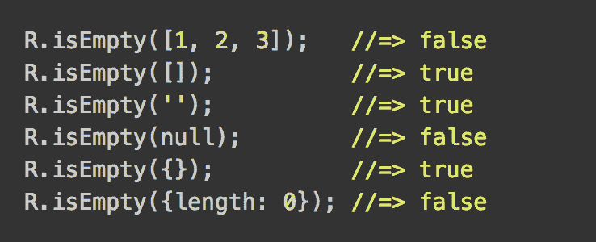

这使得测试我们的输入值非常完美。

`ifElse`适合这里，因为当`isEmpty`返回 true 时，`doNothing`运行。否则`searchAndRenderResults`运行。

最后，更新您的事件处理程序。

```
inputElement.addEventListener('keyup', makeSearchRequestIfValid); 
```

并检查结果。清除`input`时不再出错！

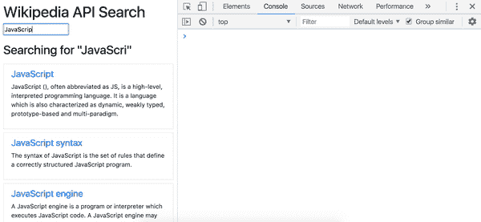

本教程来自于**我的** **完全免费的** **课程**关于 Educative.io，[关于 RamdaJS 的函数式编程模式](https://www.educative.io/collection/5070627052453888/5738600293466112?authorName=Yazeed%20Bzadough)！

如果你喜欢这个内容，请考虑接受/分享它。

它充满了课程、图形、练习和可运行的代码示例，使用 RamdaJS 教你一个基本的函数式编程风格。

感谢你阅读❤️