# 当 170 多名软件开发人员参加尼日利亚瓦里最大的开发者大会时，发生了什么

> 原文：<https://www.freecodecamp.org/news/what-happened-when-170-software-developers-attended-the-largest-tech-fest-in-warri-nigeria-23085b378a2a/>

#### GDG 瓦里通过举办该市最大的谷歌开发者节创造了历史。

2018 年 10 月 6 日，176 名软件开发人员和有抱负的开发人员、技术爱好者、学生、企业家和初创公司创始人参加了[GDG 瓦里尼日利亚](https://www.meetup.com/GDG-Warri)处女开发者节— #DevFest18。这将作为该市最大的开发者技术会议而载入史册。

当讲述席卷尼日利亚南部三角洲州瓦里市的技术革命时，[GDG 瓦里](https://www.meetup.com/GDG-Warri/)社区将被视为通过技术帮助改变尼日尔三角洲地区叙事的技术社区之一。因为这无疑是一个历史性的时刻，因为超过 170 名开发人员在那个周六聚集在一起参加#DevFestWarri。

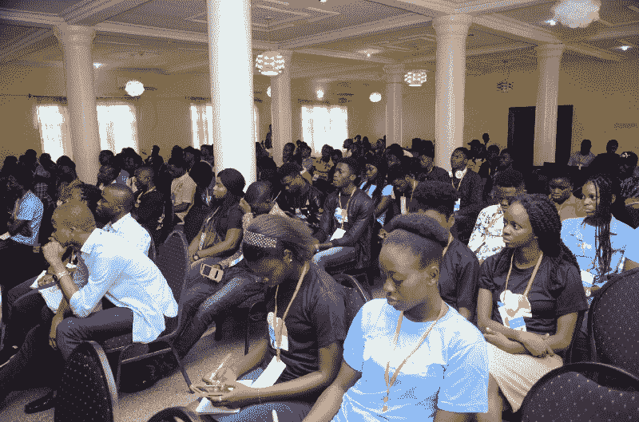

Cross section of GDG Warri #DevFest18 attendees

### dev fests——多种技术路线之母

> DevFests 是社区主导的开发者活动，由全球各地的 GDG 分会主办，专注于社区建设和学习谷歌的技术。— [DevFest 官网](https://devfest.withgoogle.com/)

大多数聚会通常围绕某个特定的技术领域，比如 Web 开发(或者像 Flutter study jam 这样的学习项目)，并专注于例如 JavaScript。

但对于 DevFests 来说，目标之一是覆盖广泛的技术领域，并有一个共同的信念，即当开发人员聚集在一起交流想法时，惊人的事情可能会发生。

### 奔向第一个 DevFest Warri:团队，支持，出席

对于今年早些时候[开始的 GDG 分会](https://medium.freecodecamp.org/how-i-started-a-google-developers-group-gdg-chapter-in-warri-nigeria-and-reached-100-members-22cbd622d070)，我们不得不竭尽全力在这座城市举办我们的第一次(也将成为最大的一次)开发者大会。

这是帮助我们实现活动目标的三个关键因素。

#### 组

作为 GDG 瓦里的社区经理/建设者，我意识到在我们开发人员社区的早期阶段，我们必须为人们创造空间，通过志愿举办令人惊叹的活动来贡献他们的时间、资源和专业知识。我很荣幸有一些人自愿保证#DevFestWarri 是正确的并且是成功的。

志愿者团队通过设计传单、在高等院校开展现场活动、创建社交媒体推送和安排场地，帮助确保我们举办了一场精彩的活动。

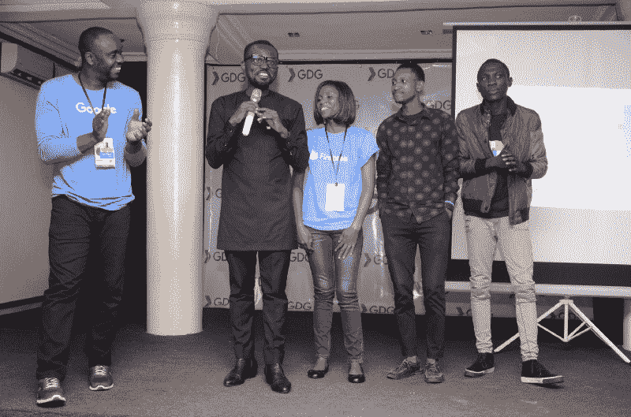

Charles Freeborn, acknowledging and introducing some members of the volunteering team for #DevFestWarri to Aniedi Udo-Obong

#### 支持(合作伙伴)

举办如此规模的开发者节是一项事业，但我们能够支持免费入场！我们还提供食物和礼品，并确保每个参加的人都度过了一段美好的时光。

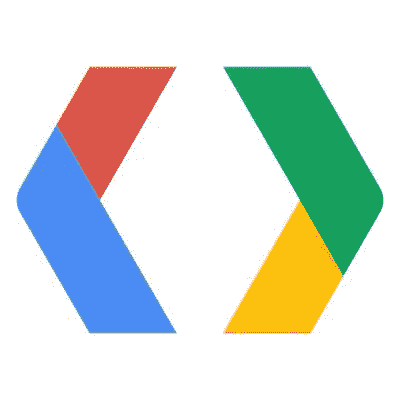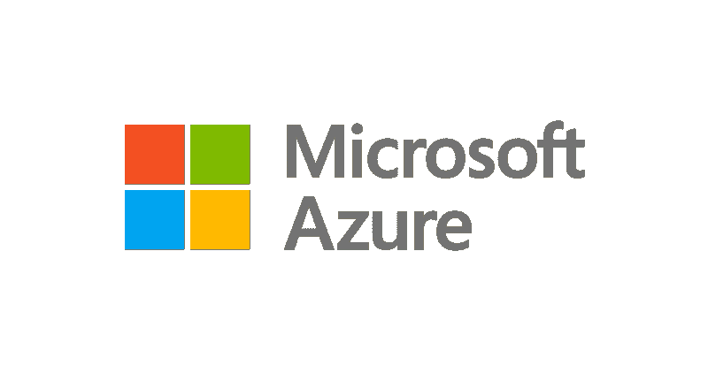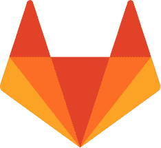

Special thanks to our sponsors — [Google Developers](https://developers.google.com/), [Microsoft Cloud Advocates](https://developer.microsoft.com/en-us/advocates/), [GitLab](https://about.gitlab.com/)

多亏了赞助商的支持，这才成为可能。

我们最感谢[谷歌开发者](https://www.freecodecamp.org/news/what-happened-when-170-software-developers-attended-the-largest-tech-fest-in-warri-nigeria-23085b378a2a/undefined)、[微软云倡导者](https://twitter.com/azureadvocates)、[莎拉·德拉斯纳](https://twitter.com/sarah_edo)、 [GitLab](https://www.freecodecamp.org/news/what-happened-when-170-software-developers-attended-the-largest-tech-fest-in-warri-nigeria-23085b378a2a/undefined) 、 [JetBrains](https://www.jetbrains.com/) 、 [GatsbyJS](https://www.gatsbyjs.org/) 以及[尼日利亚瓦里的 Skysenx Hub](https://skysenx.com/)。

#### 我们如何吸引人们前来(社交媒体、现场活动、邀请)

所以，如果你做了所有的计划，但人们没有出现在活动中，那该怎么办呢？为了实现在城市内外为#DevFestWarri 记录大量开发者的目标，我们必须采取更全面的活动策略。我们通过社交媒体、电子邮件列表和使用传单的现场活动(在高等院校和编码学校)开展了一场大规模的活动。

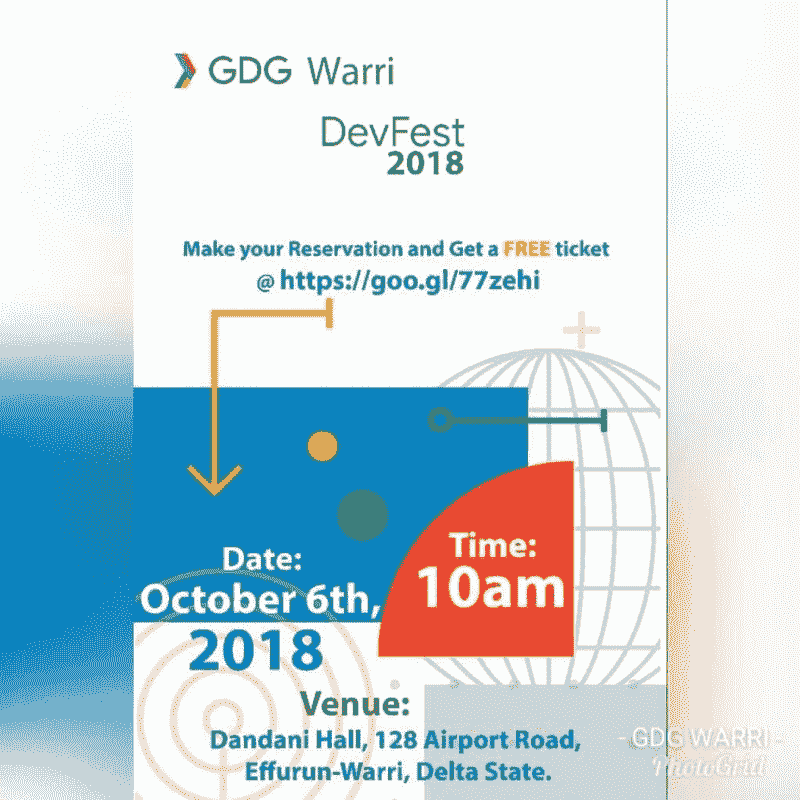

Official flyer for the #DevFest campaign

### 会议——吸取的教训和前进的道路

作为 GDG Warri 的主要组织者，我有幸做了开幕主题演讲，并欢迎这些开发者来到#DevFestWarri。

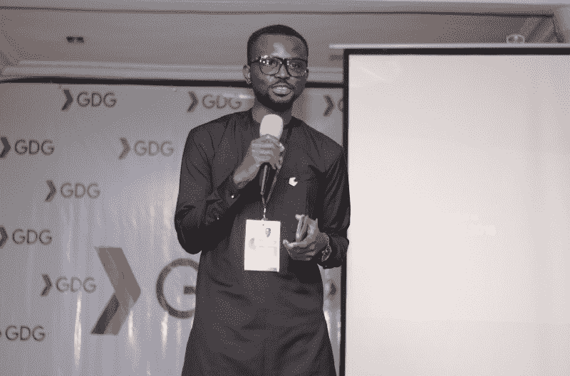

Charles Freeborn, lead GDG Warri, gives the opening keynote for #DevFest18 #DevFestWarri

#DevFestWarri 的会议旨在包罗万象。我们的演讲者阵容强大，涵盖了多个技术领域。

自由代码营的创始人昆西·拉森谈到了技术写作。他远程加入我们，讨论如何围绕软件开发创建引人注目的内容。

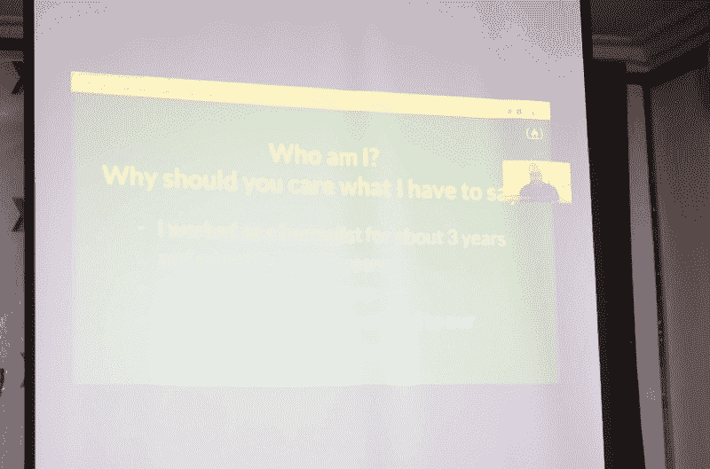

Quincy Larson speaking on technical writing and creating compelling content around software development

Quincy 分享了他撰写和编辑技术文章的经验，强调了围绕软件开发撰写优秀内容的 3 个关键点。它们是:

*   物质
*   包装
*   宣传

对于 web 开发，我们有两次会议。首先，Andela Nigeria 的软件开发人员 Matthew Igho 做了一个关于渐进式网络应用(PWAs)的演讲。微软云开发者倡导者[新美乐股份公司·科廷](https://www.freecodecamp.org/news/what-happened-when-170-software-developers-attended-the-largest-tech-fest-in-warri-nigeria-23085b378a2a/undefined)远程加入我们，谈论使用 GraphQL 和无服务器构建可扩展的 API。

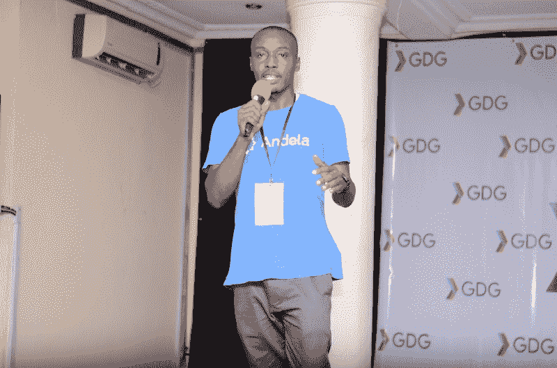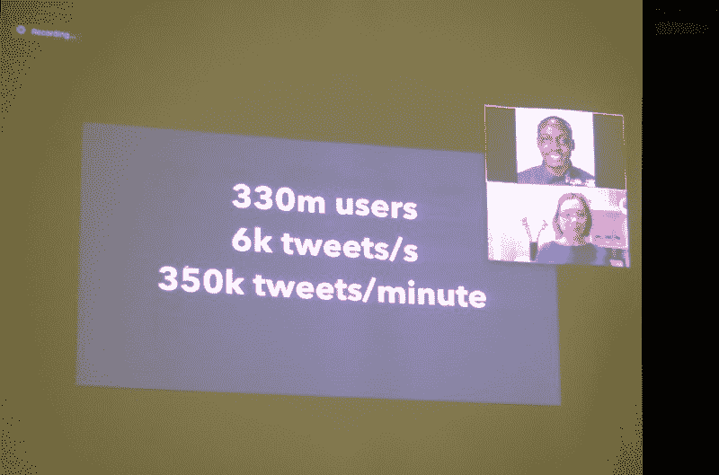

Left — Mathew Igho speaking on PWAs. Right — Simona Cotin speaking on Building Scalable APIs using GraphQL and Serverless

Peace Ojemeh 发表了关于 UI/UX 设计的演讲，而 Touchabl Pictures 的[提奥多拉·伊索拉](https://www.freecodecamp.org/news/what-happened-when-170-software-developers-attended-the-largest-tech-fest-in-warri-nigeria-23085b378a2a/undefined)发表了关于技术多样性和包容性的演讲。她强调了创业公司/科技组织中多样性的必要性，因为这将导致构建跨越国界的产品，并创造一个每个人都愿意作为团队工作的环境。

EluComputing 创始人兼网站开发者 Odumah Benjamin 讲述了他的科技之旅。

谷歌云开发者社区 Ado Ekiti 的软件开发人员和社区经理奥拉因卡·彼得·奥卢瓦费米(Olayinka Peter Barbara)发表了关于使用谷歌视觉 API 探索机器学习的演讲。

最后，我们很荣幸地邀请到了谷歌开发者生态系统项目经理 Aniedi Udo-Obong 和我们一起致闭幕词。他分享了 GDG 计划的历程/演变——该计划在其存在的 11 年中的目标、愿景和影响。

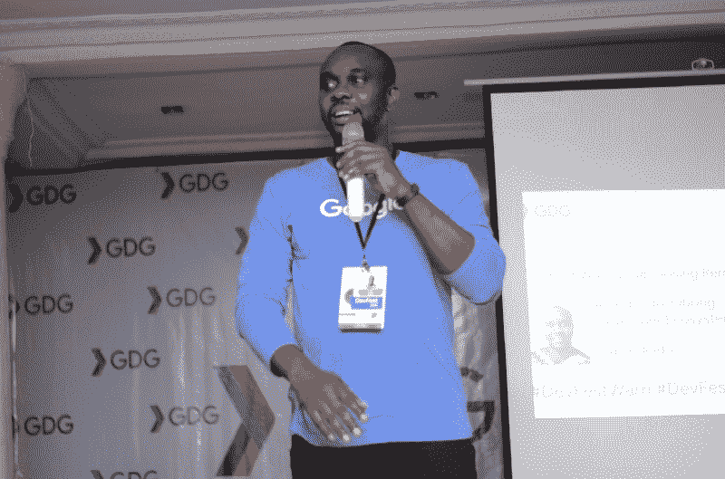

Aniedi Udo-Obong, Developer Ecosystem, Google giving the closing keynote for #DevFest18 #DevFestWarri

### 我最喜欢的部分——女性出席者和演讲者

#DevFest18 的目标之一是让 35%的与会者是女性。

根据这一目标，我们着手确保我们有一个平衡的女性演讲者阵容——例如，我们活动的主持人/节目总监是一位女士(也是 GDG 瓦里的共同领导)。我们有四位女性演讲者。

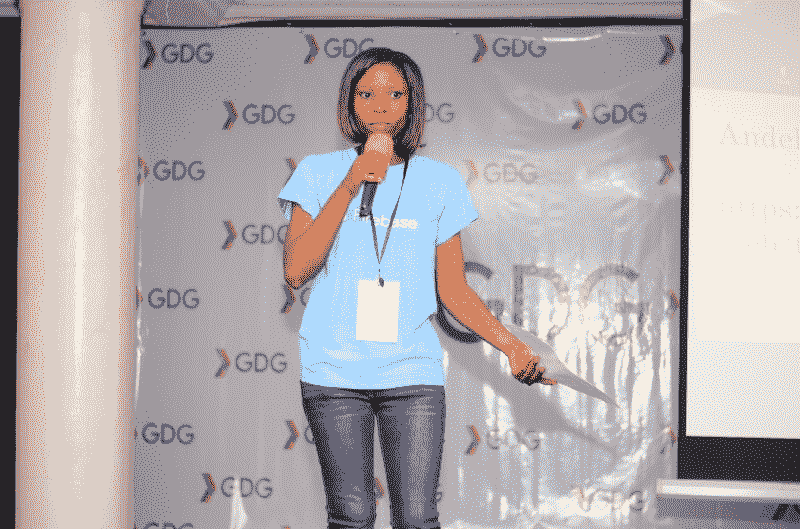

Martha Freeborn, Women in Tech Maker, co-lead, GDG Warri, anchors #DevFestWarri

30%的女性出席率创下纪录，这是活动的高潮之一——我们在 DevFest 之前的聚会记录了女性出席率较低的情况。

### 你应该和我们一起去 GDG-瓦利——原因如下

GDG 无疑是撒哈拉以南非洲最大的开发者社区。我非常感激自己不仅是全球开发者社区的一员，还领导着尼日利亚最活跃、最有活力的开发者社区之一——[GDG 瓦里](https://www.meetup.com)。

只是把事情放在背景中:GDG 瓦里在 2018 年 4 月 14 日举行了第一次聚会，我们有 41 人出席(女性不到 5 人)。

截至 2018 年 10 月 6 日，当我们举办 DevFest 2018 Warri 时，我们已经发展到 500 多名活跃会员(目前在我们的官方 meetup 页面上有 529 名)，平均每次 meetup 有 70 人参加。我们也看到越来越多的女性参与进来，现在我们有一位女性共同领导 GDG 瓦里社区。

一些社区成员有机会参加[谷歌-Udacity 非洲奖学金](https://www.udacity.com/google-africa-scholarships)——其中一些人获得了 Udacity 纳米学位奖学金，而其他人目前正在参加正在进行的[谷歌 Pluralsight 10000 开发者奖学金](https://africa.googleblog.com/2018/10/announcing-10000-grow-with-google.html)。

所有这些事情都发生在 8 个月的时间里——你可以在这里读到我们是如何达到 100 名成员的。最重要的是，我们的社区成员——他们从未在会议上发言——分享/处理 codelabs，为会议提供便利，并在我们的活动中进行他们的第一次技术演讲。这些是我在我们分会发展的早期阶段曾经扮演的角色。

如果你在瓦里市，并且你是一名开发者(或技术爱好者)，那么你应该通过使用这个[链接](https://www.meetup.com/GDG-Warri)加入我们。

是的，我们在 2019 年为瓦里的开发者社区制定了一些惊人的计划——我将在未来几周内公布这些计划。

这是本次活动的官方相册。

你可以发邮件到 Charles[dot]eteure[at]Gmail[dot]com 来联系我。感谢您的阅读！