# 第一个十亿分钟:教世界编码的微型非营利组织背后的数字

> 原文：<https://www.freecodecamp.org/news/the-first-billion-minutes-the-numbers-behind-freecodecamp-the-tiny-nonprofit-thats-teaching-9c2ee9f8102c/>

人们现在已经花了超过 10 亿分钟使用 freeCodeCamp。

这相当于将近 2000 年。

换句话说——如果 freeCodeCamp 的用法是一个人，那么他应该已经老到可以和耶稣一起进餐了。

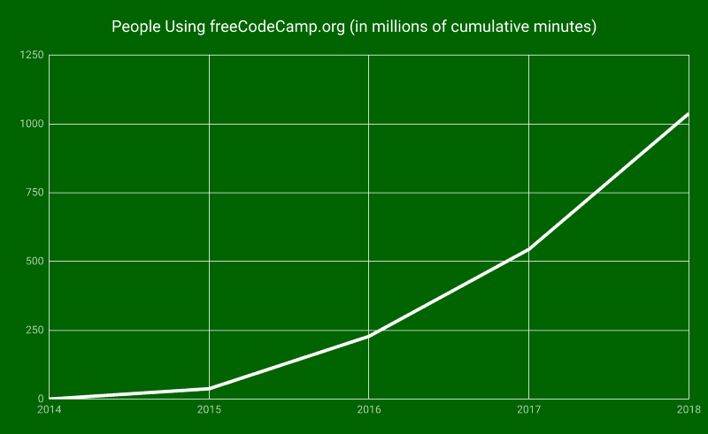

过去的 4 年对我们这个小小的非营利组织和我们周围涌现的大规模开发者社区来说是一场旋风。

我们现在正在帮助数百万人学习编码——其中数千人已经找到了他们的第一份工作，成为软件开发人员。

几周前我参加了一个会议，在那里我见到了一些我心目中的英雄，包括开发者传奇人物，如[韦斯·博斯](https://www.freecodecamp.org/news/the-first-billion-minutes-the-numbers-behind-freecodecamp-the-tiny-nonprofit-thats-teaching-9c2ee9f8102c/undefined)、[斯科特·托林斯基](https://www.freecodecamp.org/news/the-first-billion-minutes-the-numbers-behind-freecodecamp-the-tiny-nonprofit-thats-teaching-9c2ee9f8102c/undefined)、[杰西卡·洛德](https://www.freecodecamp.org/news/the-first-billion-minutes-the-numbers-behind-freecodecamp-the-tiny-nonprofit-thats-teaching-9c2ee9f8102c/undefined)和[克里斯·科伊尔](https://www.freecodecamp.org/news/the-first-billion-minutes-the-numbers-behind-freecodecamp-the-tiny-nonprofit-thats-teaching-9c2ee9f8102c/undefined)。

他们都很惊讶地得知 freeCodeCamp 的范围。他们说，他们不知道我们已经成为一个如此庞大的社区，并认为我们“只是一个博客”或“只是一个 YouTube 频道。”

显然，我很不擅长宣传 freeCodeCamp 的规模，所以我写这篇文章试图弥补这一点。

首先，你知道 freeCodeCamp.org 的访问量比 Codecademy 还多吗？Codecademy 是一家已经筹集了 4700 万美元的编程教育初创公司。

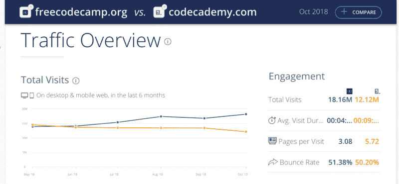

Similarweb’s traffic analysis comparing freeCodeCamp.org with Codecademy.com

我们的访问量也超过了估值 10 亿美元的 Udacity 公司。

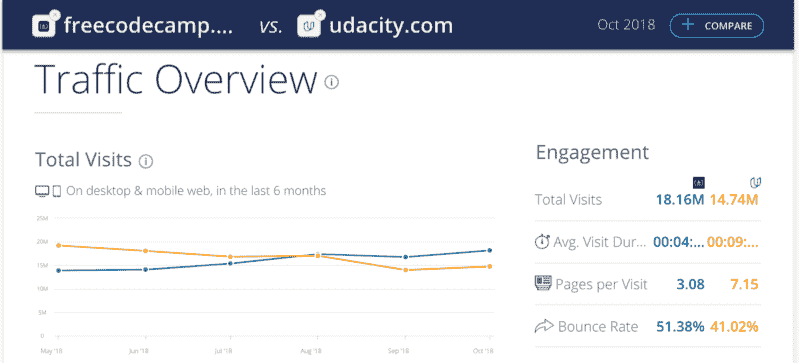

Similarweb’s traffic analysis comparing freeCodeCamp.org with Udacity.com

请记住，freeCodeCamp 的整个 2018 年预算只有 20 万美元——与其他大型教育网站运营的数千万美元相比，这只是很小的一部分。

在本文中，我将分享 freeCodeCamp 全球影响力背后的数字。我将深入探讨我们是如何在志愿者团体的帮助下，以及在成千上万像你这样的人的捐助下完成这一切的。

我想让你们想象一下，如果有更多的预算，freeCodeCamp 可以完成更多的工作。

而且——我不会在这里拐弯抹角——我希望你成为自由代码营的支持者。

不到一个三明治的价格，你就可以帮助自己和数百万人学习编码。

“Donate to freeCodeCamp.” “What? Donate to them yourself.” “*Sudo* donate to freeCodeCamp.” [“Okay.”](https://donate.freecodecamp.org) (Obligatory sandwich comic by XKCD)

## 我们如何达到十亿分钟

freeCodeCamp 社区分布在几个平台上:我们的课程、我们的论坛、我们的指南、YouTube 和 Medium。

我没有试图混合像 YouTube 浏览量、编码挑战完成量或文章浏览量这样的指标，而是根据人们使用这些资源的分钟数来标准化一切。

所有这些都可以使用谷歌分析进行精确测量。

但是这种方法有两个问题:

1.很多人使用广告拦截器，这也阻止了谷歌分析。所以这些人的使用情况没有包括在这些数字中。

2.项目是 freeCodeCamp 最耗时的部分，人们不会在 freeCodeCamp 本身上构建项目。人们通常在 Glitch、CodePen 或他们自己的本地计算机上构建他们的项目。所以这些数字中不包括花在建设项目上的时间。

所以人们使用 freeCodeCamp 的总时间比下面的数字要大得多。但是我想保守一点。

## 以下是过去 4 年中人们使用 freeCodeCamp 的次数

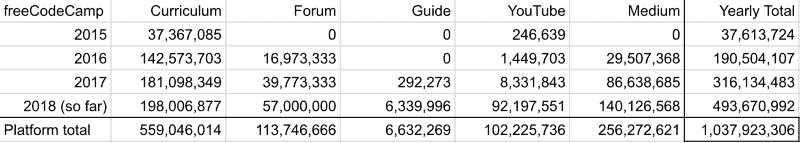

Usage of freeCodeCamp.org platforms since its founding, in minutes

现在让我们回顾一下过去几年的情况，这样我们就可以了解这些数字的背景。

### 2015 年:我们推出免费在线编码课程

当我在 2014 年末从我的衣柜里推出 freeCodeCamp 时，它只是我们一起完成的哈佛和斯坦福课程的列表，还有一个聊天室，我们在那里闲逛，互相问问题。

这在 2015 年发生了变化。我们建立了长达 1800 小时的免费全栈开发人员课程。

当时已经有大量免费的初学者编码资源。但是 freeCodeCamp 的课程有两个重要的优势:

1.  我们的课程是完全交互式的，通过在您的浏览器中一步一步的编码挑战来教您编程基础。
2.  我们的课程是开源的——这意味着任何人都可以帮助改进它。成千上万的人就这样做了。

通过开源软件的贡献，课程的广度和功能都得到了极大的扩展。

如今，课程涵盖了从基本的 HTML、CSS 和 JavaScript 到更高级的工具，如 Node.js、React 和数据库。它甚至涵盖了高级主题，如可访问性、信息安全和测试框架。

因此，越来越多的人使用它来学习编码，并为他们的第一份开发工作做准备。截至 2018 年，数千名校友现在拥有 freeCodeCamp 认证，并正在从事软件开发工作。

A screenshot from [our LinkedIn Alumni page](https://www.linkedin.com/school/free-code-camp/).

> ***穿越时间旅行****:2015 年，人们使用 freeCodeCamp 的时间为 3700 万分钟。这相当于大约 70 年，或者 1 个人的一生。70 年前，联合国通过了《世界人权宣言》。*

### 2016:freeCodeCamp 社区媒体出版物和论坛的诞生

freeCodeCamp 早期的博文大部分都是我写的。但是 freeCodeCamp 社区中的许多其他人都在写值得一读的东西。Medium 让我们可以很容易地在一个地方交叉发布他们的文章。

数百名作者提交了编程教程、计算机科学概念的解释以及他们自己的编码之旅。

最初，我自己编辑了所有提交的内容。但是在编辑了一千篇左右的文章后，我向自己承认我需要帮助。

我们组建了媒体编辑团队，十几名志愿者帮助提高文章的可读性。

我们仍然有选择地发表文章，但是我们能够在保持高质量的同时发表更多的文章。

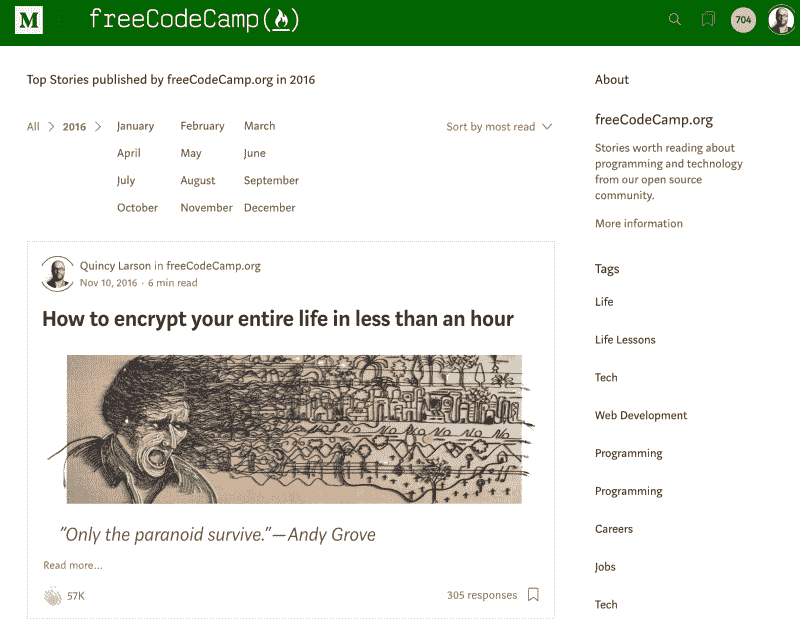

You can explore freeCodeCamp’s top articles by topic, month, and year in [our archive](https://medium.freecodecamp.org/archive).

freeCodeCamp 的媒体出版物上的许多作者基于他们的文章建立的声誉获得了工作或自由客户。

由于数百名熟练的作者和编辑，我们的出版物最近成为最大的媒体出版物，有超过 50 万人关注。

### 自由代码营社区论坛

我们还在 2016 年推出了 freeCodeCamp 论坛。这使得人们在遇到困难时更容易寻求帮助。

多亏了一群友好的论坛常客，大多数问题在一两个小时内就能得到解答。所以这几乎和在我们的聊天室系统中提问一样快。

这个论坛也成为了一个地方，在这里人们可以可靠地获得关于他们正在构建的项目的建设性反馈。

该论坛最受欢迎的领域之一是[获得一份开发者工作](https://forum.freecodecamp.org/c/getting-a-developer-job?order=views)，在这里人们谈论他们的求职，分享技巧和鼓励。

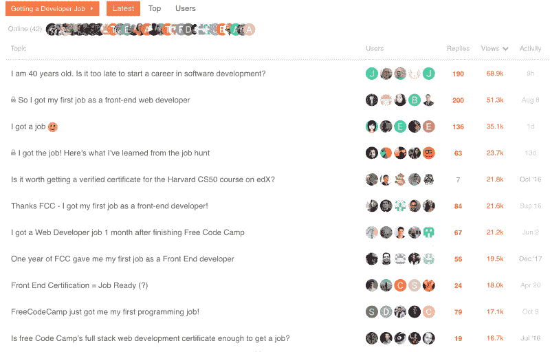

A screenshot of our forum’s Getting a Developer Job section

这个论坛是可以搜索的。大约 80%访问论坛的人甚至懒得登录。他们只是找到了摆脱困境所需的答案，然后继续埋头编码。

> ***穿越时间:****2016 年，人们使用 freeCodeCamp 长达 1.9 亿分钟——相当于大约 310 年——大约相当于列支敦士登成为一个国家的时间长度。*

### 2017 年:我们发布免费代码营指南

到 2017 年，成千上万的人已经完成了 freeCodeCamp 的大部分课程，并找到了开发人员的工作。现在他们与其他开发人员一起工作，他们会经常遇到他们不熟悉的概念和术语。

他们不想花一个下午在维基百科的脚注中搜寻，而是想要快速、足够好的答案。所以我们创建了免费代码营指南。

该指南是一个可搜索的参考，旨在涵盖所有与软件开发相关的概念。

这些文章非常简单，非英语母语者也能理解。它们很短，足够忙碌的人喝几口咖啡的时候阅读。

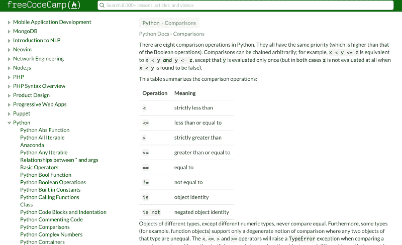

A screenshot of the freeCodeCamp Guide’s article on the 8 Python comparison operations.

而且——像 freeCodeCamp 的其他东西一样——该指南是开源的。开发者在不断地扩展它。

该指南已经连续两届成为最受欢迎的开源项目。

它现在包括近 5000 篇关于各种技术和计算机科学概念的文章。

> ***Trippin ' through time:****2017 年，人们使用 freeCodeCamp 的时间为 3.16 亿分钟——相当于大约 600 年。为了了解它有多长，北京的紫禁城建于 600 年前。*

### 2018 年:经过 4 年的努力，我们的 YouTube 频道终于起飞了

freeCodeCamp 从一开始就在 YouTube 上发布视频和流媒体。但 YouTube 从未真正向任何人推荐过我们的视频。

我们怀疑这可能是因为我们拒绝在我们的频道上显示广告，所以 YouTube 没有从我们身上赚钱。

不管怎样，我们很高兴 YouTube 给了我们一个免费存放视频的地方。(托管高清视频贵！)

但这一切都在今年发生了变化，freeCodeCamp 成为 YouTube 上增长最快的节目频道。

今年到目前为止，我们的频道观看时间增长了 1，100%。

YouTube 的算法是一个黑盒，所以我们只能猜测为什么 YouTube 突然开始把每个人都发送到我们社区的频道。

可能是因为我们发布了一些关于 Python、数据库设计、SQL 和 Java 等主题的冗长、深入的教程。

可能是因为过去四年我们几乎每天都在发视频。

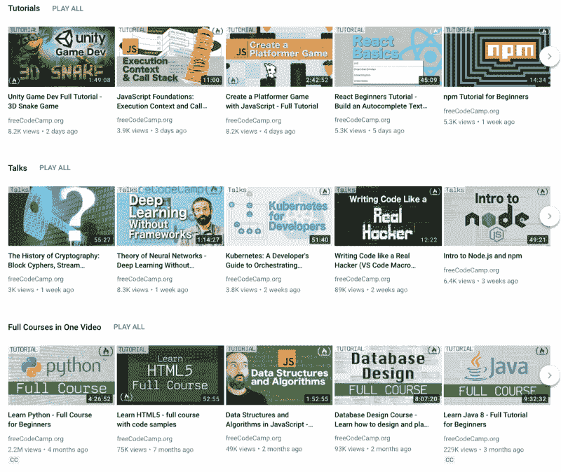

A screenshot of some of freeCodeCamp’s YouTube playlists

不管发生了什么，人们似乎从我们的 YouTube 频道中学到了很多。因此，我们将继续做我们正在做的事情，发布高质量的教程、讲座和编码直播。

> ***Trippin ' through time:****2018 年到目前为止，人们使用 freeCodeCamp 的时间为 4.93 亿分钟——相当于大约 937 年。如果我们能回到那么久以前，我们就能听到英国牛津大学的第一次演讲。*

### 我们 2019 年的计划:更多的世界语言，课堂模式，以及为当地学习小组提供更好的工具

我们有 2019 年的大计划。我们认为我们能够实现这些目标。如果我们有预算的话。

我们的目标是将支持者人数增加到 10，000 人。这将把我们的年度预算从微薄的 20 万美元扩大到更容易管理的 50 万美元。

以全球非政府组织的标准来看，这仍然是非常适度的，但这将使我们能够帮助更多的人，并更快地扩大我们的学习资源。

以下是我们希望在 2019 年实现的目标。

#### 倡议#1:多语言免费代码营

我们已经将 freeCodeCamp 的课程和指南翻译成了五种主要的世界语言:

*   阿拉伯语
*   中国人
*   葡萄牙语
*   俄语
*   西班牙语

我们希望为这些语言社区部署并行的 freeCodeCamp 前端，所有这些前端都连接到相同的共享数据库。我们还希望为每种语言举办单独的论坛。

我们已经有了每种语言的版主团队，以及数百名贡献者，他们正在完善和扩展这些翻译。

一旦这些语言投入使用，地球上大约 80%的人将能够免费学习用他们的母语编写代码。

这些人也不必忍受尴尬的机器翻译，因为所有这些资源都将由理解每种语言背后的怪癖和文化的母语人士监管。

但是做好这件事将会导致服务器成本和维护的大幅增加。支持者的更多捐款将大大有助于抵消这些费用。

#### 倡议#2:课堂模式

freeCodeCamp 是为成人学习者设计的。我们社区人口的平均年龄是 30 岁。

尽管如此，我们还是收到了来自世界各地的教师的大量请求，他们希望在课堂上使用 freeCodeCamp。

已经有数百名高中、大学、职业培训项目甚至监狱的教师将 freeCodeCamp 作为他们课程的一部分。

但是对于老师来说还是有点繁琐的过程。他们必须告诉他们的学生将他们的 freeCodeCamp 档案设置为公开的(默认情况下是私有的)。然后，教师必须手动检查学生在 freeCodeCamp 课程中的进度。

我们希望让教师能够更轻松地使用 freeCodeCamp。我们希望构建课堂工具，让教师能够分配部分 freeCodeCamp 课程，并轻松可视化学生的进度。

有了更大的预算，我们可以分配更多资源在 2019 年实现课堂模式。

#### 倡议#3:学习小组的更好工具

freeCodeCamp 社区在世界各地的城市拥有超过 2000 个本地学习小组。许多这样的学习小组每周都聚在一起编码。其中一些甚至举办黑客马拉松和会议。

这些学习小组以分散的方式运行。他们中的大多数都有学习小组负责人，负责策划活动，并寻找当地赞助商提供场地。

我们想更好地支持这些研究小组的领导者、他们的成员和他们的赞助者。

目前，我们通过脸书小组组织这些小组，因为它是免费的。但是脸书的功能有限，透明度有限，并且缺乏联系群体成员的可靠方式。

一些研究小组使用 Meetup.com，这是一个比脸书更专业的工具，但大规模使用每年要花费 10 万美元——即使有非营利组织的折扣。

在过去的 3 年里，我们评估了所有的替代工具，我们发现最好的解决方案仍然是脸书集团。

所以我们决定建立我们自己的开源工具来组织这些学习小组。通过这种方式，学习小组可以完全控制他们的数据，并且我们可以根据他们的需要逐步构建新的功能。

为此建立我们自己的免费开源工具的一个好处是，其他非营利组织将能够部署他们自己的服务器，并使用它来协调他们自己的地方分会和活动。

我们不抱任何幻想——这将需要大量额外的开发时间，并且会有额外的服务器成本。来自支持者的更多捐款将对此有很大帮助。

## 接下来的十亿分钟

我希望这篇文章有助于说明:

1.  freeCodeCamp 正在帮助数百万人
2.  以节省成本的方式
3.  我们也有经过深思熟虑的计划来帮助更多的人
4.  但是[我们需要你的支持](https://donate.freecodecamp.org)

在你的帮助下，我们可以达到 10，000 名支持者的目标。

2019 年可能是 freeCodeCamp 社区有史以来最大的一年。

我不会说:“向 freeCodeCamp 捐款，否则我们将永远陷入黑暗！”或者类似的吓人的东西。

现实是这样的:妖怪已经从瓶子里出来了。我们不会走的。我们是开源的，更糟糕的情况是我可以继续兼职运行 freeCodeCamp 作为一个激情项目。

因此，与其宣扬悲观和厄运，我只想说:

我们有令人难以置信的势头。我们通过帮助数百万人学习编程来改善他们的生活和职业。但是我们可以走得更快。我们可以帮助更多的人。

可以肯定地说，以前从未有过像 freeCodeCamp 这样的社区。我的一些金融界朋友私下告诉我，他们认为 freeCodeCamp 是“现代史上资本效率最高的组织”。

我们有一个 5 人的小团队——所有人要么写代码，要么创建学习资源。用非营利组织的话来说:我们 100%的预算都花在了“项目”上，没有一部分花在了“筹款”或“管理费用”上。

我们一直对我们的财务和运营保持透明，最近我们获得了评估慈善机构的非营利组织 GuideStar.org 的白金认证。

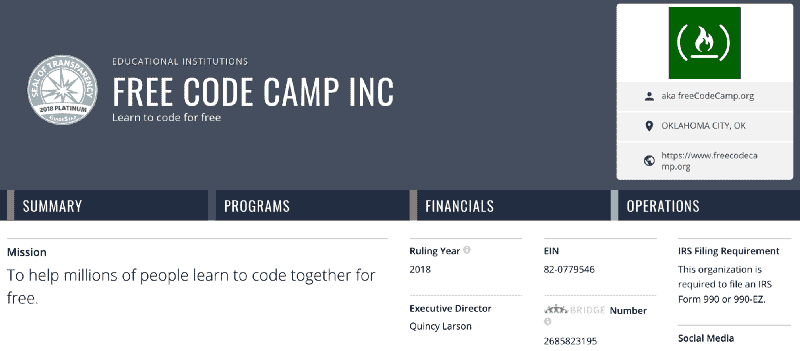

我们有一个由数千名开源贡献者组成的充满活力的社区来帮助我们完成使命。我们所有的 5 名员工都是自由代码营的开源贡献者。

我们不用花钱招聘开发人员，我们可以看到那些已经在空闲时间为 freeCodeCamp 做贡献的人，只需付钱让他们全职为 freeCodeCamp 工作。

我们在服务器方面也非常节俭。我们已经获得了几家服务提供商的实物赞助，并且我们已经围绕尽可能低的成本构建了我们的架构。

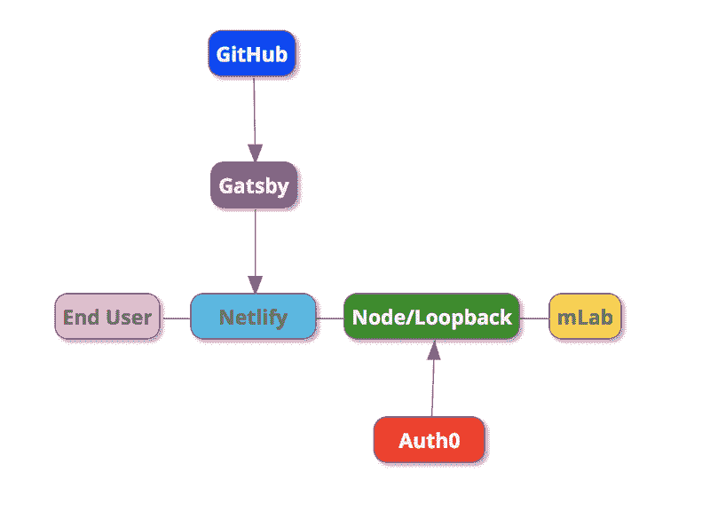

A basic diagram of freeCodeCamp’s architecture, which is optimized for scale using open-source tools and services that have extended in-kind sponsorship of our nonprofit.

freeCodeCamp 可能是下一个维基百科。我们可以让科技教育民主化，就像维基百科让历史参考民主化一样。到目前为止——我们的旅程已经进行了 4 年——我们非常密切地跟踪着维基百科在过去 17 年中的发展。

一个不同之处是，维基百科每年获得 1 亿美元的捐款——是我们获得的 20 万美元的 500 倍。所以让我们改变这一点。即使只有 500，000 美元(维基百科的 1/200)，我们也能极大地改善技术教育。

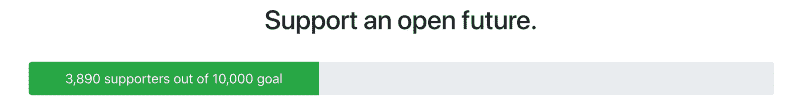

帮助我们达到 10，000 名支持者的目标。成为一名支持者，为 freeCodeCamp.org 设立一笔你能负担得起的免税捐款。

再次感谢你和 freeCodeCamp 社区的每一个人。

祝贺你帮助人们学习编码的第一个十亿分钟。

为下一个十亿干杯。？