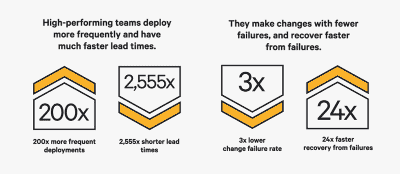
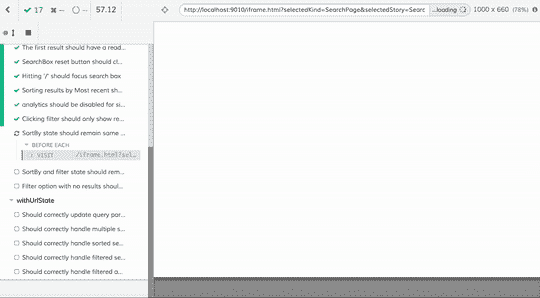

# 如何将交付作为你的焦点来帮助你构建高质量的应用程序

> 原文：<https://www.freecodecamp.org/news/making-delivery-the-focus-techniques-for-delivering-quality-applications-222b79d301d9/>

西蒙·施瓦茨

# 如何将交付作为你的焦点来帮助你构建高质量的应用程序



High-performing teams deploy more frequently and have much faster lead times. They make changes with fewer failures and recover from failures. Image: [Puppet State of DevOps report](https://puppet.com/blog/2016-state-devops-report-has-landed)

我们公司的管理团队最近问我，为什么我们的团队能够如此迅速地改进我们的产品。这篇博客从技术的角度概述了一些关键的指导方针，我们的团队遵循这些方针来快速安全地迭代我们的产品。我尽我最大的努力在这篇文章中保持高水平，同时仍然提供技术细节。我们谈论的技术不是我们发明的。

我和团队中的技术伙伴们把减少摩擦、为用户提供价值视为我们的职责。我们还致力于保持我们负责的应用程序的高质量。我们通过移除、简化和自动化向我们的产品代码库交付更新的过程来完成这一大部分。

请记住，有些项目可能具有内在的复杂性。我们团队使用的一些技术可能不适合您的项目。从我的经验来看，使用遗留软件很难或者不可能真正简化某些过程。

### 将交付作为重点

我们的团队将对产品代码库的频繁改进放在首位。嗯，差不多——我们把精神健康、让生病的人休息一天，以及在分娩前表现友好等放在首位。

生产中的代码是目标。我们确保所有的想法、设计和功能要求都有一条清晰的路径，让我们能够将其投入生产。我们用来加强这一点的一个技术只是在展示中展示工作代码。我们禁止幻灯片和设计模型。我们还发现这使得我们的展示更加吸引人和有趣。

会议是可选的。我们发现，这鼓励召集会议的人清楚地阐述会议的目的和价值。由团队成员决定他们是否应该参加会议。我们想防止开发人员被不必要的打扰。被打断后，一个人可能需要 30 分钟以上才能恢复到高效状态。

花时间解决用户问题，而不是技术问题。我们希望避免花费大量时间讨论使用什么技术或构建我们自己的技术。我们使用了 [AWS Lambda](https://aws.amazon.com/lambda/) ，所以我们不必考虑服务器和扩展。我们使用了 [Create React App](https://github.com/facebook/create-react-app) ，所以我们不必担心前端应用的构建配置。我们做出了早期的技术决策，并坚持执行。

#### ？我们试图避免的事情。

*   当我们可以从其他地方重用工具或框架时，我们避免了花费数周时间来构建我们自己的工具或框架。
*   我们避免给团队增加不必要的复杂流程或仪式。这包括错综复杂的看板或敏捷流程，它们对我们没有好处。
*   我们避免了花费数周时间来设计、构建和支持那些没有证据证明对用户有用的功能。我们的设计团队在根据用户反馈和分析设计功能方面做得很好。

### 使部署成为非事件

拥有一个快速的发布周期意味着我们可以在用户准备好的时候给他们提供新的功能。我们还更快地从错误和中断中恢复过来。高频率部署的一个主要挑战是在不引入错误的情况下保持同步。自动化这一过程至关重要，因为它大大减少了部署更新所需的时间和精力。

自动化部署。快速交付要求部署过程尽可能顺畅。幸运的是，现在我们有许多工具可以自动化整个部署过程。我推荐 [CircleCI](https://circleci.com/) 和 [TravisCI](https://travis-ci.org/) 这样的工具。我们的设置是当新代码被添加到发布分支时，代码由我们的部署工具自动部署。

编写(并自动化)测试。当自动部署代码变更时，理解变更将产生的影响并停止引入错误或退化的部署是至关重要的。这意味着我们需要编写测试来确认代码是否按预期运行。

每当我们将新代码集成到发布分支时，CI 工具会自动运行我们的测试套件。测试套件中的任何失败都将取消部署过程。开发人员还将在本地运行这个测试套件，以在推动更改之前确认一切正常。自动化测试也比手工测试更快，更简单，更不容易出现人为错误。

如果所有的新代码都需要人工测试一个小时，那么快速交付是行不通的。作为一个团队，我们同意为我们编写的所有代码编写测试。对于编写测试不切实际的情况，我们需要给出一个原因。每当我们修复一个 bug 时，我们也会编写一个测试来覆盖这个 bug。我们确保我们有针对普通用户交互和旅程的测试(集成测试)。以及组成我们的应用程序的单个功能的测试(单元测试)。



One of our automated test suits running built with [Cypress](https://www.cypress.io/). We simulate different actions our users may do and verified the correct data and user interface would be displayed. We can automatically run dozens of scenarios very quickly which would otherwise take hours if run manually.

**小频繁更新。**以小增量更新我们的代码库提高了我们向用户交付改进的速度。小的更新更容易集成到代码库中。我们的代码审查过程变得更加严格。对于开发人员来说，审查小的拉取请求更加容易和快捷。识别新代码的问题和影响要容易得多，因为代码的表面积非常小。

我们发现一个有用的技术是将设计质量保证(QA)审计过程转移到拉动请求级别。这使得 QA 过程更加集中和快速，而不是每隔几天就对大量的多项变更进行一次。作为一个团队，我们达成了一个协议，我们将保持公关小。

我们还同意在半天内审查减贫战略。如果我们不能在这个时间框架内进行审查，我们需要让作者知道。

#### ？我们试图避免的事情。

*   我们避免手动执行本来可以自动化的任务。
*   我们避免了与一次性部署大量代码相关的风险。部署的代码中有未被发现的错误或者只有在代码大规模运行时才出现的错误，这种情况并不少见。我们部署的表面积越大，这些问题的影响就越大。

### 让更改代码变得简单而安全

> “对我来说，设计良好的代码只有一个定义。设计良好的代码是易于修改的代码”——迪夫·托马斯

如果更改代码既困难又耗时，那么拥有按需部署代码更改的能力就毫无意义。编写易于理解和更新的代码有助于我们快速迭代。作为一个技术团队，我们在代码审查过程中保持相互负责，以确保我们尽可能清晰简单地编写代码。

编写模块化和可重用的代码。函数是我们应用程序的构建模块。这些功能应该是小的、分离的并且只有一个目的。这使得开发人员更容易理解应用程序的逻辑。重新调整现有函数的用途以减少编写的代码量更容易。改变函数要安全得多，因为函数的表面积很小。这种变化的影响更容易理解。作为一个团队，我们会仔细检查彼此的请求，并给出反馈，帮助彼此写出最好的代码。

**为人类编写代码。我们编写的代码有两个主要用户:运行代码的计算机和阅读并修改代码的人。大多数开发人员都非常擅长为计算机编写代码。如果你的代码运行或符合要求，没有错误——这意味着你在为计算机编写代码方面做得很好。一些开发人员忘记了为人类编写代码。如果代码很难理解，开发人员需要花更长的时间来理解和更新代码。我们着重于阐明每个功能的目的、输出和输入。**

函数的输入和输出通过类型系统变得清晰。我们在使用 Go 时使用内置类型系统，在使用 JavaScript 时使用 Flow。

我们为变量选择了描述性的名称。这使得变量保存什么数据或执行什么功能变得更加清楚。

```
// Both these functions do the same thing
```

```
function a(arr) {  return arr.filter(it => it.age < 30)}
```

```
function getUsersUnder30(userList) {  return userList.filter(user => user.age < 30)}
```

编写可测试的代码。每当我们更改代码时，我们都需要确保我们的更改没有使代码的先前功能倒退。这是进行测试的最大好处之一。它增加了代码更改的安全性。通过以一种使编写测试变得简单的方式编写代码，我们使我们的生活变得更容易。编写易于测试的代码的技巧是使用*纯函数*。

纯函数是给定相同输入，将总是返回相同输出的函数。这些功能测试起来非常简单。如果你有兴趣了解更多关于纯函数的知识，埃里克·埃利奥特和 T2 有一篇描述纯函数的精彩文章。

不幸的是，如果一个函数有*副作用*，你就不能把它写成一个纯函数。副作用是超出其功能范围的东西。这可能是写文件或发送 API 请求之类的操作。在单元级别测试副作用可能很棘手，所以这些从我们的纯函数中分离出来。

#### ？我们试图避免的事情。

*   我们避免浪费时间手动测试我们可以自动化的场景。
*   我们避免为了速度而牺牲代码质量。为了速度而牺牲代码质量是多余的。你不仅更有可能引入 bug，而且你还创建了一个最终很难修改和调试的代码库。这将大大降低您交付新功能和错误修复的能力。

感谢阅读！