# 如何使用渲染道具模式开发你的反应超能力

> 原文：<https://www.freecodecamp.org/news/how-to-develop-your-react-superpowers-with-the-render-props-pattern-b74e68c6d053/>

嘿大家好！这次我要告诉你的是这个伟大的**超能力**叫做**【渲染道具】**。

术语**“渲染道具”**指的是使用一个其值为函数的道具在 React 组件之间共享代码的技术。

所涉及的概念也被称为**、【子功能】、**或**、【子功能】、**。实现这个模式的组件可以称为**“渲染道具组件”**。

这是 React 中的高级模式之一，是程序员在日常生活中必须掌握的。

所以，我希望你的 JavaScript 已经成型，因为这是一个实现起来非常棒、非常酷的模式！

让我们开始吧:

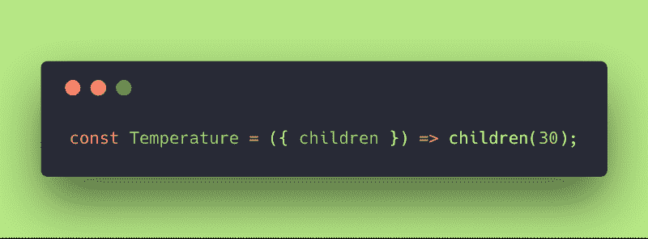

Temperature component

这是什么？？我们来解码吧！

我们有一个组件，它接收孩子作为道具(它从道具中析构它)并将其作为函数返回，带有参数。在这里，返回的子代带有整数 30。

为了确保我们在同一页上，上面的代码与编写的代码相同:

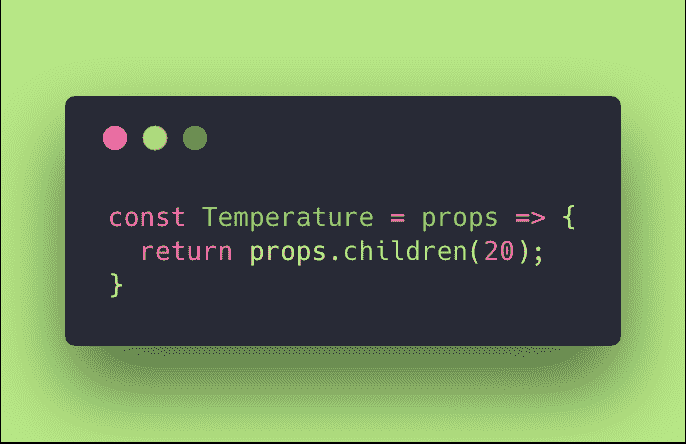

Temperature component receiving generic props

或者在更详细的类组件中:

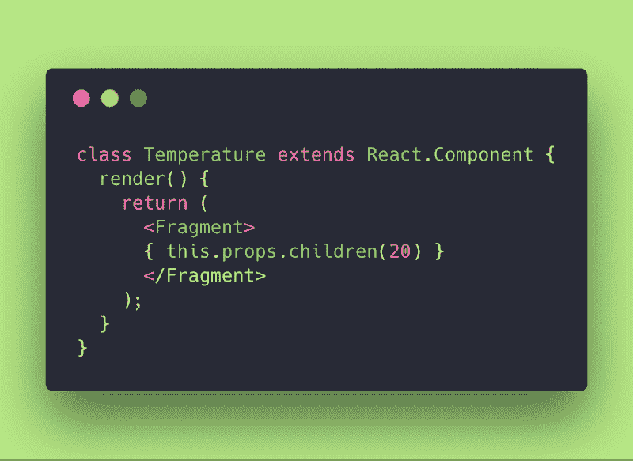

Temperature class component example.

好吧！让我们回到我们来的地方。

为了调用这个组件，我们编写一个函数作为子组件:

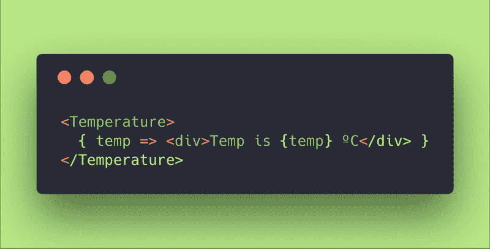

好吧，让我们改进一下代码。

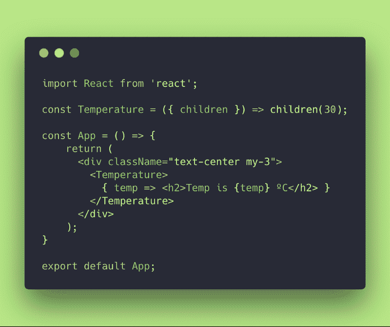

Temperature and main App component

我总是使用一点点的引导样式来使我的例子简单，干净和有点抛光。

请记住，子代是存在于 <temperature></temperature> 调用中的任何东西。

温度组件对于孩子是什么是完全透明的，它只是将他们作为一个整数传递到 30。

因此，我们在浏览器中得到的结果是这样的:

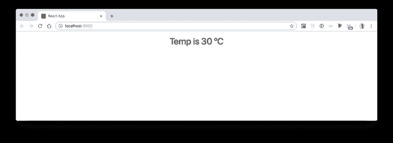

render of the components

我们来说说天气吧！？

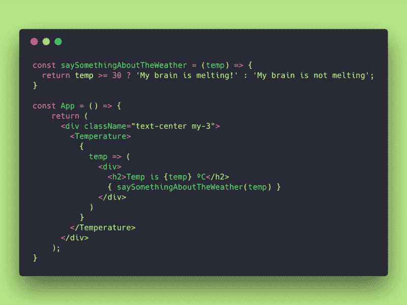

function to say something about the weather

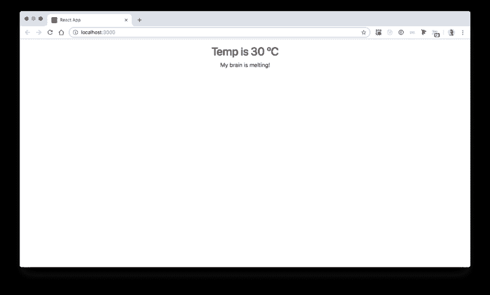

My brain is melting!!!

好吧！你说的特征不错！

但是为什么这是一个很好的特性呢？让我们保持头脑冷静！？

我们已经把控制器和视图分开了！现在，我们有了一个名为 Temperature 的组件，它能够从“很远很远”的 API 接收温度，并呈现其子组件，无论它们是谁，都可以将 temp 值传递给它们。

一定要明白这个巨大的好处和超能力！温度组件事先不知道它的子组件。它只知道独立于子对象，它将渲染它们并传递给它们温度值。

当然，我们可以利用组合并将子逻辑封装到另一个组件中，例如显示摄氏温度。

让我们开始吧。

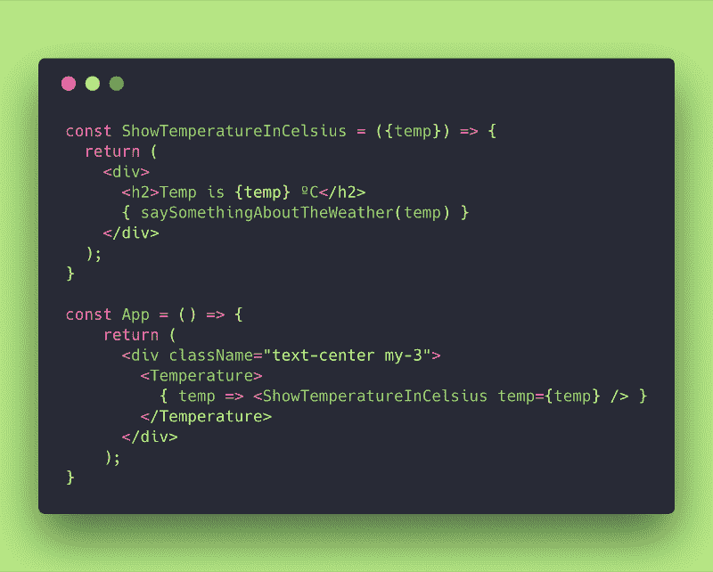

encapsulate ShowTemperatureInCelsius

就是这样！为什么是这个小桶？因为现在我要重复使用同样的东西，做一个温度华氏的节目！

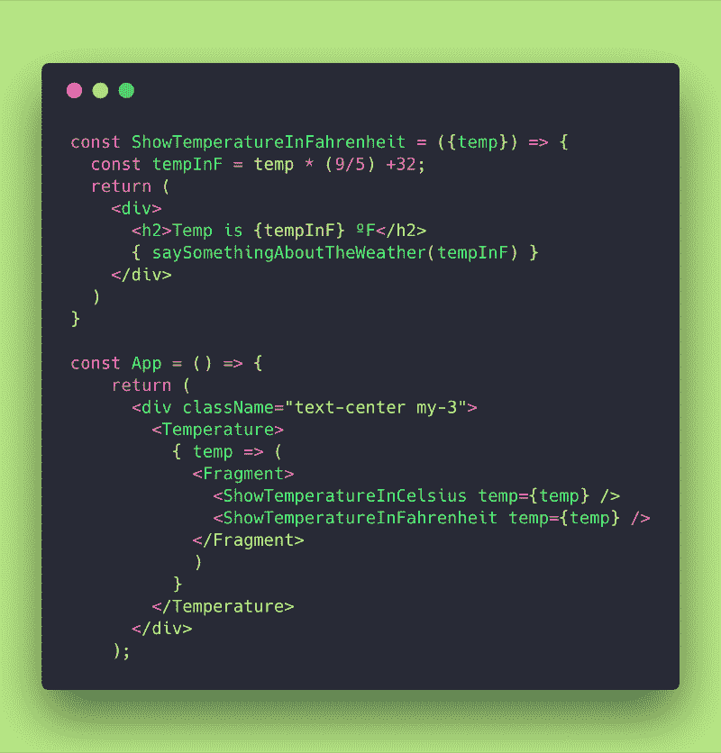

ShowTemperatureInFahrenheit and App Component refactoring

耶！那太好了！我们已经使用组合将渲染内容封装到组件中。我们可以继续制作一个新的 ShowTemperature 组件，在 ShowTemperatureInCelsius 或 ShowTemperatureInFahrenheit 中调用。

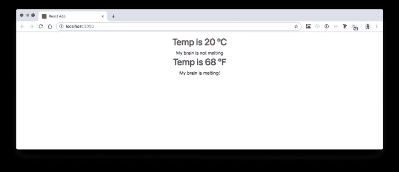

My brain is melting and my brain is not melting at the same time! This is Quantum Physics!

但是如果我们想再次应用渲染道具模式来显示我们从用户偏好中得到的不同颜色，例如？

让我们试一试。

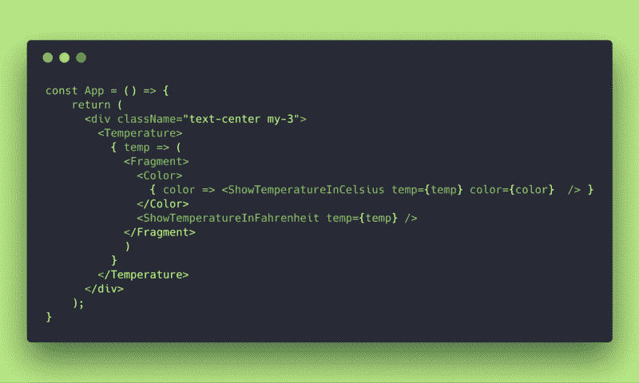

Colors component

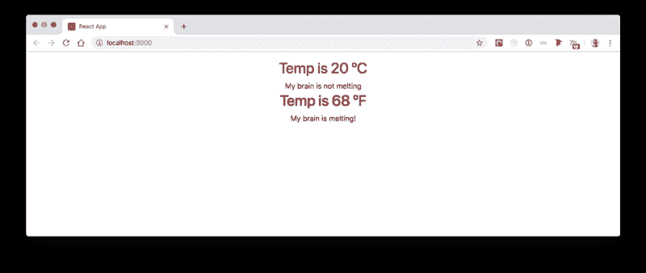

Temps is red or temp is black ?

好吧，伙计们，这是一个很好的工具，但是…“权力越大，责任越大”。

如果我们再做一两个渲染道具组件，我们会比预期更快地陷入回调地狱！

当我们需要在 React cascade 流中提取一些东西或获得一些其他道具时，我们将开始感到困惑，代码将变得混乱，不再明确或声明。

那么…如何才能避免这种情况呢？

嗯…也许你已经想到这一点了。渲染道具在目的上非常类似于 HOC(高阶组件)。

实际上，我们可以使用其中的一个或另一个来达到几乎相同的目的。在这个问题上已经花了很多笔墨。

如果你对 HOCs 一无所知，你可以阅读我关于容器模式的文章[这里](https://medium.freecodecamp.org/react-superpowers-container-pattern-20d664bdae65)我向你展示了如何做一个简单的 HOCs。

我答应在不久的将来写一篇关于 HOCs 的文章，因为它也是一种值得关注的模式。

所以，作为一个测试，让我们把颜色抽象发展成一个特设的:

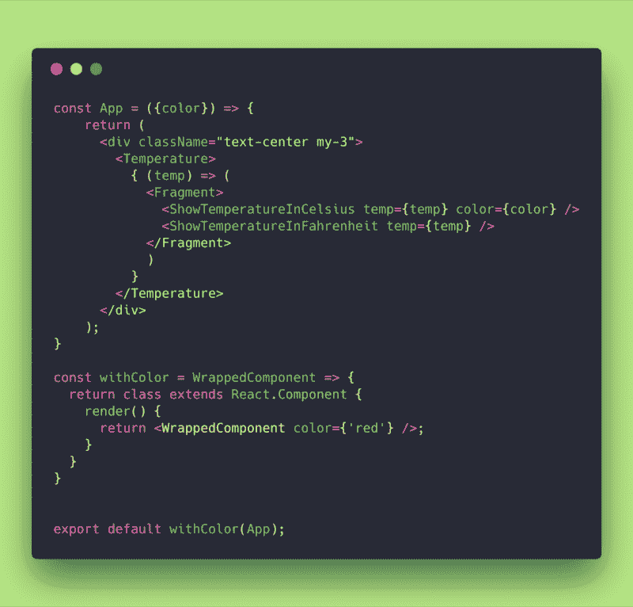

withColor HOC (Higher Order Component)

不错！同样的结果！我们已经完成了一个 Javascript 函数，它接收一个组件并返回一个类，该类使用我们可以从其他地方获得的所需属性来呈现 WrappedComponent！

这是一个愚蠢的例子，但我认为它有助于指出这两种模式之间的区别。

那么…什么时候应该用前者还是后者呢？

嗯，凡事都有代价。我敢说我觉得 HOC 比渲染道具干净多了。

问题是 HOCs 稍微削减了合成流，使得 React 如此之大。此外，在某些情况下，它们的性能不是很好，它们往往会在你的组件中触发更多的渲染——所以要小心这个警告。

根据经验，我通常尝试使用渲染道具，因为这是一个双赢的模式，优先考虑构图。

如果你发现自己陷入了回调地狱，那么第二步就换成 HOC。

例如，如果你知道 React Router，你很容易就会有这样的感觉:为什么带有路由器的**是一个**特设**和 **<开关/ >或<路由器/ >** 是渲染道具组件。这在很大程度上取决于你在什么样的环境下工作，以及你希望代码如何表达和流畅。**

如果你不知道反应路由器，记住我告诉你的一切。然后，当你写一些代码时，尝试这些模式，直到你根据上下文或目标很容易地决定哪个更好。

最后但同样重要的是，你可以在这里用我的 GitHub repo [中的代码玩一会儿。](https://github.com/evedes/renderprops-pattern)

就这样，各位！？？希望你喜欢这个渲染道具的小介绍。更多信息请查看下面的参考书目！

### 文献学

1.  [React 文档](https://reactjs.org/docs/getting-started.html)
2.  [reactpatterns.com](https://reactpatterns.com)

非常感谢！

伊夫德斯，2018 年 11 月