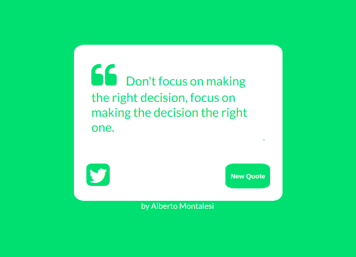
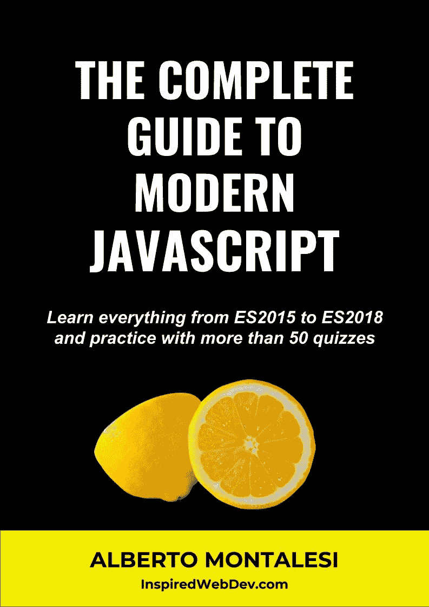
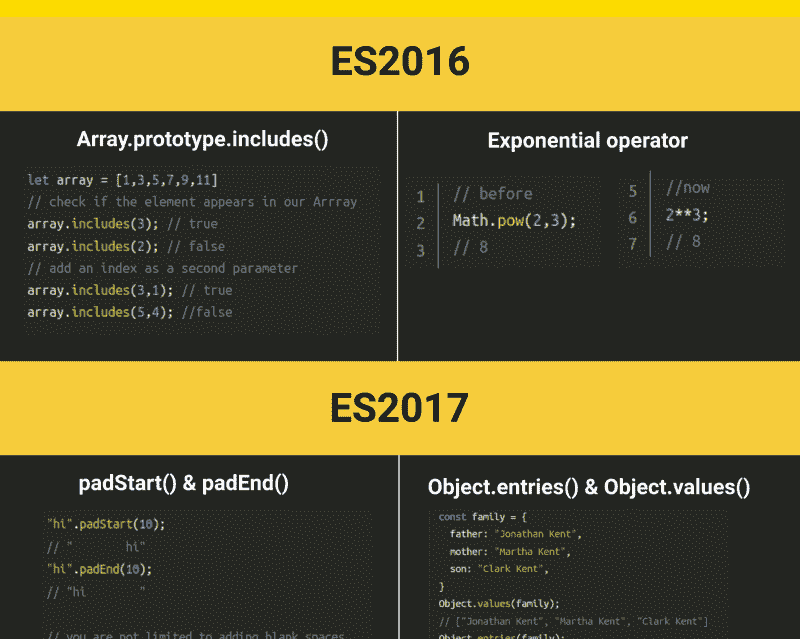
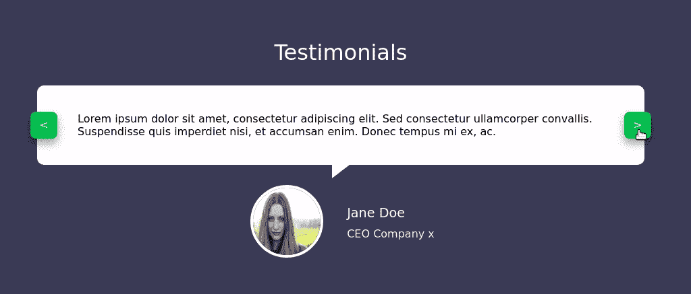

# 我在越南从一名 ESL 教师到软件开发者的旅程

> 原文：<https://www.freecodecamp.org/news/my-journey-from-esl-teacher-to-software-developer-35cc998a6ec0/>

阿尔贝托·蒙塔莱西

# 我在越南从一名 ESL 教师到软件开发者的旅程

Today is the best moment to start your journey

### 介绍

大家好，我叫 Alberto，这是一个关于我如何学习编码、写了一本编程书、开始了自己的博客并成为一名软件开发人员的故事。
我的背景是会计和法律，我从来没有想过我会成为一名软件开发员。但今天我在这里，作为一名全栈 JavaScript 开发人员为一家初创公司工作。

### 我的第一步

一切都是从我在新西兰，女朋友在当地大学读书的时候开始的。她即将到来的考试之一是关于 HTML 的，我很好奇并开始帮助她。

那是我第一次看一段代码。我开始从 Coursera 学习 HTML 和 CSS，我的第一个网站很糟糕，一堆文本放在页面中间，背景是丑陋的彩色。

October 2016 - One of my first attempts at a blog page. it’s all static, the links go nowhere

在我帮助她准备考试后，我继续学习和练习，因为这么长时间以来我第一次做了自己喜欢的事情。

我用来练习的第一批资源是 [Coursera](https://www.coursera.org/) 和 [Codecademy](https://www.codecademy.com/) 。主要是因为这两个是我第一次在网上找到的。

*   Codecademy 非常有助于获得一门新语言的实践经验。你不会学到很多东西，但如果你只是想学习最基本的东西，这就足够了。
*   另一方面，Coursera 向我介绍了 MOOCs 的世界。当时我不知道有免费在线课程这种东西。我记得参加过约翰·霍普斯金大学教授的[这门课](https://www.coursera.org/learn/html-css-javascript-for-web-developers)，尽管我不知道它是否有更新，但我可以向你保证老师非常好。

在发现 MOOCs 之后，我偶然发现其中最受欢迎的一个只是时间问题:[哈佛的 CS50](https://cs50.harvard.edu/2018/fall/)。诚然，我从来没有完成它，但它是一个伟大的课程，向你介绍计算机科学的基础。

在同一时期，大约在 2016 年 10 月/11 月，我发现了 freeCodeCamp，并开始研究他们的课程。到目前为止，我还没有完成证书，但这主要是因为在完成一些项目时有点懒惰。我也更喜欢做自己的项目和想法。

我想推荐的对我有用的其他非常有用的网站和资源有:

*   Lynda (尽管他们的一些课程不是最新的，但通过免费试用，你可以获得许多有用的资料)
*   团队树屋(另一个付费网站，但同样是免费试用，你可以有足够的时间观看一些课程)
*   巨大的课程市场，很难找到你需要的。不要盲目相信评论，因为我发现许多评级高的课程不是我的最爱)
*   [Udacity](https://www.udacity.com/) (免费的优质素材。没有太多的话题，但他们有非常好的，由谷歌和其他科技公司策划)
*   [可汗学院](https://www.khanacademy.org/)(学习数学和算法非常好，我强烈建议你参加他们的[算法课程](https://www.khanacademy.org/computing/computer-science/algorithms)，它将为你提供一个良好的基础)
*   太棒了(Github 上的一个仓库，在这里你可以找到你可能需要的任何东西)
*   [开发人员路线图](https://github.com/kamranahmedse/developer-roadmap)(另一个可以帮助您成为开发人员的资源库)

A pearl of wisdom from the FreeCodeCamp random quote machine project I made in December 2016

关于 Udemy 的一个小贴士:远离那些持续 30 多个小时的“10 个项目合一，从零到英雄”的课程。如果你像我一样，你会中途(甚至更早)放弃它们。每个人都是不同的，所以也许你有不同的经历。让我知道。

### 搬到另一个国家，在训练营学习

在新西兰呆了几个月后，我跟随女友去了越南，在那里我抓住了一个在 Ruby on Rails 参加免费兼职训练营的机会。

那时我几乎不知道 Rails 是什么。我唯一知道的编程语言是 JavaScript，我还是个初学者。

如果你碰巧在越南，请登录 [Coderschool.vn](http://coderschool.vn/) 查看它们。

不管怎样，参加训练营是我能做的最好的决定。我可以给你的另一个建议是:

和与你有相似目标和兴趣的人在一起。追求目标会变得更容易。

我的目标是成为一名更好的程序员。通过花更多的时间和像我一样的人在一起，我感到更有动力，我也能学到很多东西。

我记得的一个例子是学习如何使用命令行。当我自学时，我总是不愿意开始使用它，但在训练营期间，我被迫学习如何使用它。

有时我们只是太懒了，我们需要的是一个小小的推动来做需要改进的额外步骤。

每周有一个完成项目的截止日期，并且能够看到我同学的项目，这激励我鞭策自己做得更多。

最棒的部分是和另外两个人一起完成最后的项目，这让我了解到作为团队的一部分是什么样的。我们必须编写自己的用户故事，用 sprints 创建 MVP，迭代改进产品，修复 bug，最后将其部署到生产中。

我们没有赢，但这是一个很好的体验，可以一瞥真实世界的场景。训练营只持续了 2 个月，在展示日之后，我没有得到任何工作机会。那么接下来呢？

### 训练营结束后

几个星期后，不知道下一步该做什么，我和女朋友决定创建我们自己的应用程序。

我们花了很多时间研究我们的想法和做研究。

不幸的是，当时我的技能还不足以构建一个 MVP，我们的想法被当地的创业加速器拒绝了。回过头来看，我认为这是最好的，因为在开始我自己的努力之前，我更喜欢现在作为团队的一员工作。

这里还有一个建议:**如果你真的想开始自己的创业，做好准备和心理准备，因为这将是一项非常艰难和耗时的任务。**我建议你在 YouTube 上观看来自 [**Y 组合器**](https://www.youtube.com/channel/UCcefcZRL2oaA_uBNeo5UOWg) 的视频，因为它们可以帮助你评估你的想法，看看它是否真的值得你花时间去做。

Another static page I created — June 2017

几个月过去了，我找到了一份工作。但是等等，这不是编程工作。那是一份教学工作。

在越南，最受外国人欢迎的工作之一是教英语。这也是我最终做的事情，尽管我的母语不是英语。

我对编程的热情仍然很高，而且还在增长(此时我已经学习了一年)，但这份新工作带来了新的挑战，让我在几个月的时间里失去了动力，在这几个月里，我几乎没有碰过我的笔记本电脑。

几个月后，我的动力回来了，但我面临着一个决定:继续学习 Ruby on rails 还是回到我的第一语言 JavaScript。

我喜欢在 Rails 上开始构建东西是如此简单和有趣，但我最终决定回到 JavaScript，因为:

*   对我来说，Rails 的受欢迎程度似乎在下降。另一方面，JavaScript 已经确立了自己的强势地位，现在你可以用 JavaScript 构建一个完整的应用程序。
*   我从一开始就喜欢 JavaScript，因为它是我的第一门编程语言，所以我想继续改进它。

做出决定后，我开始早起(4:30/5 AM)学习，然后再去上班。

在那段时间里，我读完了“[你不知道的 JavaScript](https://github.com/getify/You-Dont-Know-JS) ”系列书籍(我在一年前开始阅读)，并开始观看韦斯·博斯的《T2》ES6 for everybody。

### 我自己的项目

在学习 JavaScript 的时候，我做了很多笔记，最终我得到了这么多笔记，以至于我决定可以把它们汇编成一本书。

从 2018 年 3 月到 4 月，我花了大约 2 个月的时间，完成了我的[书](https://github.com/AlbertoMontalesi/The-complete-guide-to-modern-JavaScript-from-es2015-to-es2018)的初稿。大约在这个时期，我也开始了我的第一个博客，由 Jekyll 创建，托管在 Github 页面上。我已经用 Wordpress 创建了一个新的[。](https://inspiredwebdev.com)

当我第一次在 Reddit 上发布我的书时，我被反响震惊了。这么多人喜欢它，这让我感到非常自豪和高兴。

继凯尔·辛普森(Kyle Simpson)的“你不知道 Javascript”系列之后，我也让每个人都可以在 [Github](https://github.com/AlbertoMontalesi/The-complete-guide-to-modern-JavaScript-from-es2015-to-es2018) 上阅读，如果他们想拥有 epub、pdf 或 mobi 副本，或者如果他们只是想支持我，可以选择购买它。

[https://github.com/AlbertoMontalesi/The-complete-guide-to-modern-JavaScript-from-es2015-to-es2018](https://github.com/AlbertoMontalesi/The-complete-guide-to-modern-JavaScript-from-es2015-to-es2018)

这里还有一个提示:我认为如果你正在纠结一些概念，试着向别人解释它们是一个好主意。如果你不能解释得足够简单，让一个初学者理解它，这可能意味着你也没有完全理解它。

这个项目增强了我的信心，让我意识到自从在新西兰玩 HTML 的那些日子以来，我已经走了很长的路。

我开始喜欢写作，并创造了更多的材料，比如这个快速回顾 JavaScript 最近 3 个版本的备忘单。你可以在这里下载整个[图(太大了，无法嵌入一篇文章)。](https://www.inspiredwebdev.com/2018/06/javascript-es2016-es2017-es2018-cheatsheet/)

My first-ever cheatsheet, not the full version.

### 得到一份新工作

再过几个月，已经是八月了。那时我正准备签下一年的英语教师合同，因为我没有足够的信心在夏天申请任何编程职位。

是的，尽管我投入了所有的时间和精力，但我还没有准备好申请工作。我害怕被拒绝的可能性。

我可以给你的另一个建议是:**如果你觉得自己不够资格得到一份工作，很可能你实际上只是患有“T1”冒名顶替综合症**，你可能已经积累了足够多的技能来成为一名初级开发人员。尽管去做吧，你能得到的最坏的结果是一个不。

#### 它是如何发生的

有一天，我决定加入一个新成立的脸书团队，这个团队由从事技术工作的当地外国人组成，我介绍了自己、我的技能和成就。

这是我觉得自己刚好在正确的时间出现在正确的地方的时刻:我收到一个软件工程师的消息，问我是否想面试一个 JavaScript 职位。

他联系我的原因是，他正在寻找一名初级 JavaScript 开发人员，他对我写了一本关于 JavaScript 的书感到好奇。这向他表明了我具备所需的语言知识，并且我非常有激情。

记住，给招聘人员留下深刻印象的最好方式是你的个人项目，但有时你可以跳出框框思考。对我来说，我的项目是这本书，但当我听说有人因为写了展示他们知识和热情的教程或指南而获得面试或被录用时，我不会感到惊讶。

当时我感到非常惊讶，也很害怕。我开始考虑面试可能出错的所有方式，我也考虑过拒绝这份工作。拜托，帮我个忙，别像我一样。还好最后还是接受了。

尽管如此，由于我没有为面试做好准备，我向招聘人员要求了一周的时间来准备。我从未练习过白板练习或任何与面试相关的东西，所以我决定在那一周练习问题和面试相关的问题。

YouTube 上有很多模拟面试，它们真的可以帮助你增强自信。练习 [Codewars](https://www.codewars.com/) 之类的编码游戏，对提高自己的解题技巧也是非常好的。不要等到最后一刻，在你想到申请工作之前几个月就开始准备面试。你可能永远不知道你什么时候会需要这些技能，最好早点开始。我经常看到有人推荐的一本书是《破解编码面试》,但我不能推荐它，因为我没有读过它。

结果是我并不需要我箱子里的大部分东西。比我以前的知识更重要的是我渴望学习更多的知识和我对这门学科的热情。这似乎足以说服他们聘用我担任初级职位。

面试进行得非常顺利，最后，在我花了这么多时间学习编码之后，我收到了一份工作邀请！？现在我在这里已经四个月了。我热爱每一天，努力开发新功能，学习新技能。

我最初的计划是成为一名网络开发人员，但现在我是一名软件开发人员，每天都在开发一个企业应用程序，老实说，我对此非常高兴。

我正在学习我从未使用或练习过的工具和语言，比如 MySQL、AWS、Node、Fusebox、Knex，尤其是 Typescript。

这标志着我的故事结束了。你有什么想分享的吗？或者，在你成为一名开发人员的过程中，有什么让你担心的事情吗？

### 关于作者

你可以在 Medium 或我的博客上关注我的更多故事，我在这里发布文章和教程。

你也可以在[亚马逊](https://www.amazon.com/Complete-Guide-Modern-JavaScript-everything-ebook/dp/B07DGGFNS6/ref=redir_mobile_desktop?_encoding=UTF8&ref=aw_sitb_end_act_to_dtl)、 [Leanpub](https://leanpub.com/thecompleteguidetomodernjavascript) 和 [Github](https://github.com/AlbertoMontalesi/The-complete-guide-to-modern-JavaScript-from-es2015-to-es2018) 上查看我的书。

Animated carousel with just a few lines of code — one of the tutorials available on my blog

### 如果这有用，请点击拍手？下面扣几下，以示支持！⬇⬇⬇