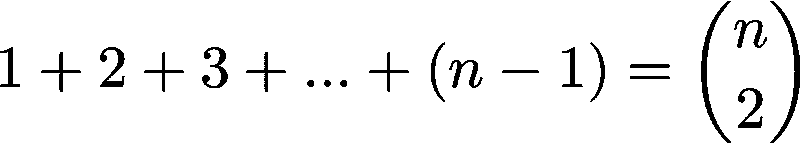
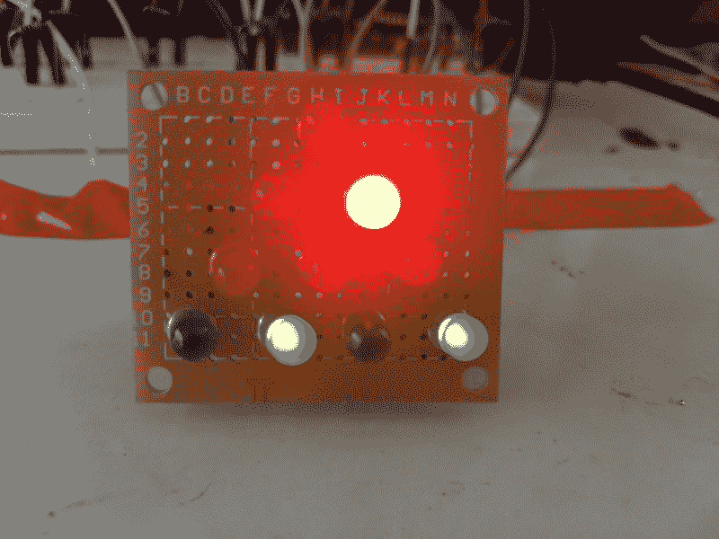
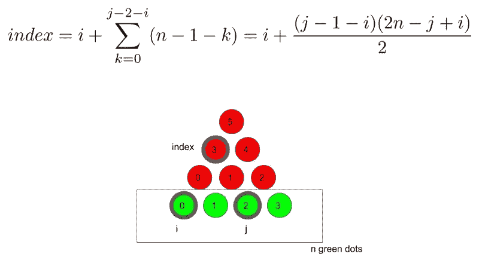
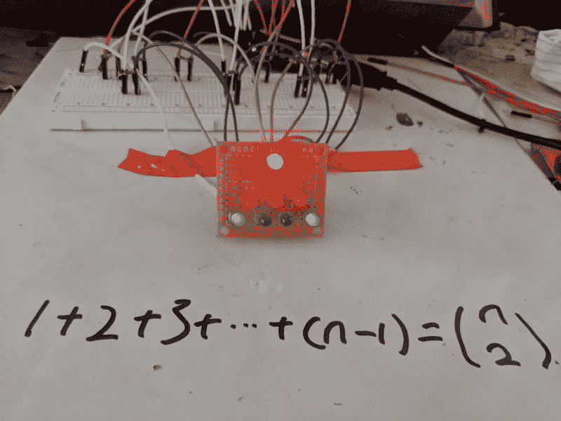

# 一个优雅的 LED 插图的数学身份

> 原文：<https://www.freecodecamp.org/news/an-elegant-led-illustration-of-a-mathematical-identity-de88ee88c963/>

作者 Chris Lam

# 一个优雅的 LED 插图的数学身份

我是科学玩具的忠实粉丝。我一直在寻找一个结合了数学和编程的优雅有一段时间了。然而，在搜索中没有太大的成功。所以，我决定自己做一个。

这是一个演示。闪烁的发光二极管用于直观地说明数学身份。

### 数学

数学恒等式如下。等式左边是从 1 到 *n-1* 的算术和，等式右边是“ [n 选 2](https://en.wikipedia.org/wiki/Combination) ，从 *n* 项中选择 2 项的唯一方式数。

Mathematical identity

优雅的不是身份本身，而是视觉证明本身。我们来看下图。插图中有 *n=4* 个绿点。

LED illustration

对于底行上的每两个绿点，在上面的三角形中总有一个独特的红点与之对应。红点是等边三角形的顶点，底边由绿点指定。

因此，从 *n* 个绿点中选择 2 个绿点的方式数等于红点之和，1+2+3+……+(*n*-1)。

在这种情况下，它是 1+2+(4–1)= 6。

这个观察最初是由 Loren C. Larson 在[这篇文章](https://www.tandfonline.com/doi/abs/10.1080/07468342.1985.11972910?journalCode=ucmj20&)中提出的。

### 编程；编排

虽然从视觉上追踪红点和绿点很容易，但用代码指定关系更有趣也更具挑战性。

让我们假设我们知道绿点的指数(比如 I 和 j)。编程挑战是指定红点的对应索引，红点与绿点形成等边三角形。

乍一看很难。

但是当我们调整标记红点的方式时，问题可以简化很多。我们可以从自下而上而不是自上而下来标注红点。

使用该索引方案，我们可以通过以下公式指定红点的索引。

An illustration of how to index the red dots using the indices of the green dots.

下面是使用 Arduino 来闪烁 led 的完整代码。

### 电子学

我将 led 焊接在电路板上，并通过 1k 电阻将 led 连接到 Arduino 输出引脚。使用电阻非常重要，因为它们可以保护 led。

连接如下。

Schematics

而当你把它们放在一起，把软件加载到 Arduino，它就会开始闪烁，如下图。

Final result

希望你喜欢这个小玩意！