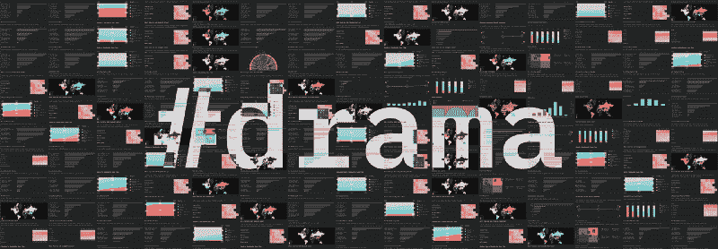
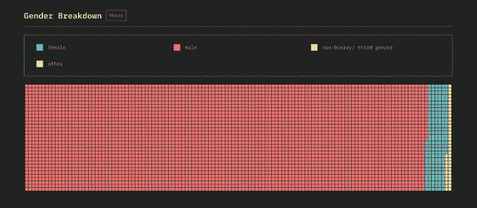
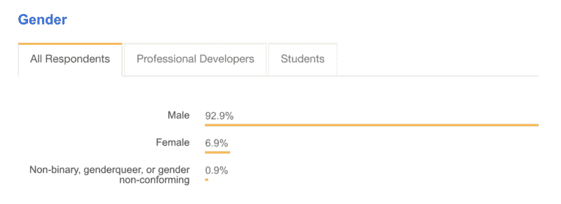
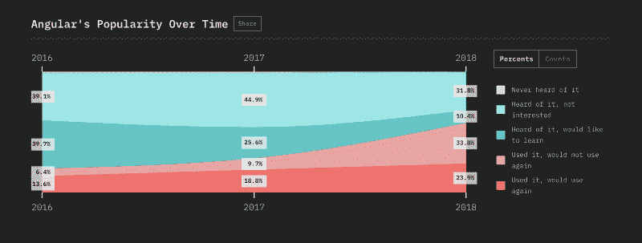
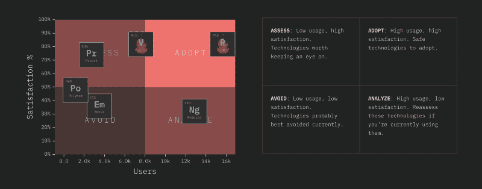

# JavaScript 2018 年的三个有争议的图表

> 原文：<https://www.freecodecamp.org/news/three-controversial-charts-from-the-state-of-js-2018-ec9dda45749/>

萨沙·格里菲

# JavaScript 2018 年的三个有争议的图表

#### 你认为统计数据和图表很无聊？再想想…

“有争议的”从字面上看是互联网上使用最多的词，可能“从字面上看”是个例外。但这一次是真的:我们的 [2018 年 JavaScript 调查结果](http://2018.stateofjs.com)中的一些图表比其他图表引起了更多的争论。我们来看看为什么！

### 性别差距是真实的

我相信你听说过科技领域存在性别差距。如果你上个月问我，我可能会说 80/20%男性/女性。你呢，你的估计是多少？

向下滚动看答案！

…

向下滚动…

…

继续滚动…

…

再多一点点…

…

想象一下，当我们的数据显示出红点的海洋和 95/5%的故障时，我有多惊讶！

我的第一直觉是，我们的方法一定有问题。毕竟，很多人是通过 Hacker News 或 Reddit 之类的地方听说这项调查的，这些地方本身就可能扭曲了人口统计数据。

但是[栈溢出开发者调查](https://insights.stackoverflow.com/survey/2018/#developer-profile-gender)证实我们的数字并没有差太远:

(注意:要找到其他开发人员调查来看看我们的和堆栈溢出是否是异常值，实际上并不容易。如果你发现了什么，请告诉我！)

你可以想象，这张图表产生了很多失望的推文:

那么能做些什么呢？我们的第一反应是想办法接触更多的女性和少数民族，这无疑是一个良好的开端。但是，虽然让调查本身更具包容性是必要的(我们对此有一些想法，从[将其翻译成其他语言](https://github.com/StateOfJS/StateOfJS/issues/87)开始)，但记住调查只反映现实也很重要。

我们不希望最终专注于让数字看起来不错，然后就到此为止。因此，最终目标仍然应该是让整个行业尽可能地受欢迎，这样未来的调查自然会反映出这种新的情况。

### 角度与角度

自从 Angular 大分裂成 [Angular](http://angular.io) (新热度)和 [AngularJS](https://angularjs.org/) (老版本)之后，谈论框架就变得棘手了。

今年，我不得不承认我们在处理这件事上做得不是特别好。

首先，以下是在过去 3 年的调查中，角度问题是如何解决的:

*   2016 年:在两个不同的问题中被问及棱角和角度
*   2017 年:在两个独立的问题中被问及角度和角度
*   2018:只问棱角分明

下面是结果图表:

这个图表显示了所有三年的角度。AngularJS 年和 2017 年的数据根本没有纳入图表。

我们认为这是合乎逻辑的事情:AngularJS 是一种过时的技术，所以我们简单地将其从调查中删除，继续前进。

当然，正如你可能从图表中猜到的，问题是许多受访者并不这么看。他们中的一些人认为我们关于 Angular 的问题也是关于 AngularJS 的问题，这解释了 2018 年“不会再次使用”答案的突然增加。

这并不顺利:

在我们的辩护中，我们只是像对待调查中提到的任何其他框架一样对待 Angular，使用它的正式名称(“Angular”)。也许我们应该主动用类似“Angular 2+”的东西来代替，尽管这不是官方的命名法；或者至少添加了一个特殊的澄清说明来解释这种情况。

无论如何，我承认我们在解释整个问题上做得不好，为此我们道歉。

#### 抽样偏误

我们也听到了对抽样偏见的指责，通常来自统计人员，或者在维基百科上读到过一些的人。

这里有一些有趣的事情需要注意:JS 状态团队的所有三个成员都是 React 用户，而不是 Angular 用户。这似乎会让我们更有可能接触到使用 React 的观众，对吗？

虽然这肯定是一种可能性，但大多数受访者是通过 Reddit 或黑客新闻等“中立”来源发现这项调查的。此外，除了已经讨论过的角度问题，我们的数据似乎与其他调查的数据相匹配:

除非…NPM 队也用 React 吗？哦，阴谋…！

但说真的，正如你可能想象的那样，我们已经在尽一切努力将调查传播给更广泛的受众。我们只能希望，随着调查受众的逐年增加，我们可能引入的任何抽样偏差都会自然消失。

### 真的应该避开 Ember.js 吗？

我们最后的争议是关于我们“避免”某些技术的建议。

嗯，图表上确实写着“避免”，我不能否认。

作为一个 Ember、Polymer 或任何其他技术的用户，如果不幸地处于“避免”象限，这可以理解地让你抓狂。仅仅因为一些开发人员在几年前对一个库有不好的体验，并不意味着每个人都应该避免它！

我当然能理解这种情绪，因为我和你处境相同。我自己也是一个重度 [Meteor](http://meteor.com) 用户:我写了一本关于它的书，我甚至在它上面建立了一个[的完整开源框架](http://vulcanjs.org)，然而我不得不接受 Meteor 也落入了“避免”象限:

我认为《流星》很棒，但这不仅仅是我*或你*的想法。大约是 2 万个开发者的想法。**

是的，从“大多数开发人员不会再使用 X”到“你应该避免 X”确实是一个飞跃。我们可以只给你数据，让你自己得出结论。

但是这又回到了我们最初进行调查的全部原因:帮助你做决定。如果你已经知道并热爱余烬，流星，或任何其他技术，那么更多的权力给你！我们无意批评你的选择。

另一方面，如果你想用它来获得洞察力和指导，那么我们认为最好的方法就是要清楚，甚至有点生硬。像“每个图书馆都有它的优点和缺点，你应该根据你的需要选择最好的”这样的话可能不会冒犯任何人，但它也不会真正帮助任何人。

### (一些)JavaScript 的状态

在一天结束时，重要的是要记住调查只能到此为止。我们尽最大努力成为整个 JavaScript 生态系统的代表，但 20，000 名开发人员仍然只是社区的一小部分。

不过，我们不认为这意味着不值得一试。在你们的帮助下，我们相信我们可以年复一年地不断改进。

所以，不管是好是坏，保持你的反馈。当然还有 2019 年再见！