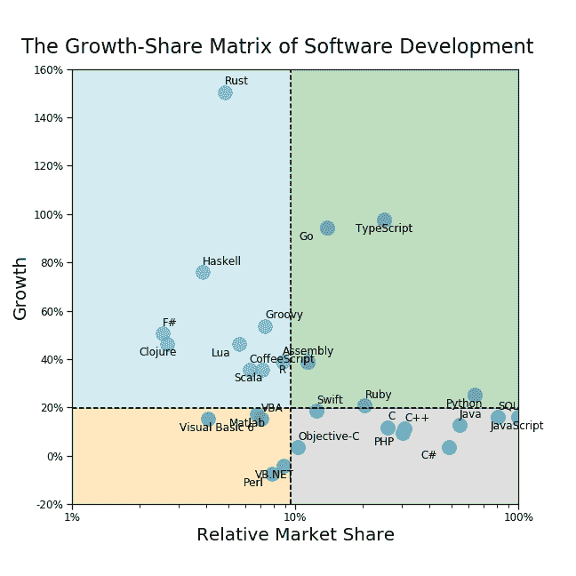

# 使用这个框架来选择你的下一个编程语言

> 原文：<https://www.freecodecamp.org/news/how-the-growth-share-matrix-of-software-development-can-help-you-decide-which-language-to-learn-d457593709a5/>

人力资本是我们最大的资产。

像金融资本一样，[复合增长的全能力量](https://whoisnnamdi.com/you-dont-understand-compound-growth/)意味着技能获得率的微小差异可以导致职业结果的巨大差异。

因此，选择磨练哪些技能是职业成长和成功的最重要的关键之一。

在各种形式的人力资本中，技术能力正迅速成为 21 世纪知识工作的关键技能。

然而，有许多技术是人们可以深入研究并试图掌握的。它们具有不同的用途和实用性。

那么，在众多选择中，你如何决定把时间“投资”在哪里呢？

我发现一个对这项任务非常有帮助的心智模型是[增长份额矩阵](https://www.economist.com/news/2009/09/11/growth-share-matrix)。这是一个 50 年前由波士顿咨询集团发明的框架。

该框架最初是作为一种工具来帮助高管区分不同业务的优先级。这是基于他们各自的相对市场份额和增长。这两个维度将市场格局划分为象限，每个象限都具有某些特征:

*   “明星”成长性高，市场占有率高
*   “摇钱树”成长性低，但市场份额高
*   “问号”高增长但市场份额低
*   “狗”成长性低，市场份额低

波士顿咨询集团建议客户投资“明星”，利用“摇钱树”获取现金流。他们应该评估“问号”的潜力，尽快退出或出售“狗”。

增长份额矩阵最初是用于产品线或业务单元——一个公司可以拥有的资产。

在这方面，您可能会认为这个框架对编程语言的适用性有限。没有一个人“拥有”任何特定的语言。

没那么快！

我认为我们每个人都拥有一小部分编程语言。不是以股权或股票的形式，而是以人力资本的形式。

通过对有用技能“组合”的精心管理，我们的学习努力获得了回报——对我们时间和努力的回报。

学习编程语言就是一个很好的例子。

但是从职业的角度来看，是什么让编程语言变得有用呢？

任何给定的编程语言的职业价值都与懂得该语言的其他人的数量以及使用该语言的公司的数量直接相关。

对一些人来说，这可能听起来显而易见，但事实上这完全违背直觉。

在生活的大部分技能中，我们寻求掌握罕见的东西——别人做不到的东西。

我们认为，拥有一套独特的人才将让我们在竞争日益激烈的世界中更加耀眼。学习罕见的技能将会带来有意义的回报，或者是这样的想法。

是的，知道一门很少有人知道的晦涩的语言可能会为你在市场上开拓出一个很好的位置。

但我认为，对大多数人来说，掌握一门很多人也会的语言实际上更有价值。

大多数人认为编程就是你和计算机说话的方式。真的，这是你和其他开发者说话的方式。

由于网络效应以及软件开发项目和团队不断增长的规模、规模和范围，了解"[通用语](https://en.wikipedia.org/wiki/Lingua_franca)"可能比成为某种濒危语言的专家更有价值。

矛盾的是，用高市场份额的语言来说，个人市场份额低其实并不是一件坏事。

### 构建矩阵

为了构建编程语言的增长份额矩阵，我们将利用 StackOverflow 的[年度开发者调查](https://insights.stackoverflow.com/survey/)。

对于 [2018 版](https://insights.stackoverflow.com/survey/2018/)，他们调查了全球超过 10 万名开发者，涵盖了从工作满意度到薪酬等广泛的话题。这里我们将关注美国的开发者。

对我们来说，关键问题是:

> *“在过去的一年里，您在以下哪种编程、脚本和标记语言中做了大量的开发工作？”*

这个问题的答案应该给我们一个任何给定语言受欢迎程度的粗略代理，由使用过特定语言的开发人员的比例来定义。

对于增长，我们可以比较 2017 年和 2018 年对这个问题的回答，以得出每种语言的增长估计值。

我们将增长定义为过去一年中使用该语言的受访者的百分比增长率。

因此，一门语言从 10%的覆盖率增长到 13%将被视为增长了 30%(而不是 3 个百分点)。

象限边界将设定在增长率的中间值和相对市场份额。

最后一点——按照增长份额矩阵的惯例，我们将显示相对于市场份额最大的语言的市场份额。

因此，轴将在 100%结束(代表最流行的语言)。我们还将在对数尺度上展示这一点，以更好地展示分布情况，相对市场份额低于 10%时，分布情况往往会非常拥挤。

我们现在拥有了构建增长份额矩阵所需的一切！

看一看结果:

一个引人注目的特征立即显现出来——很少有语言的受欢迎程度出现净下降。

几乎每种语言都在发展，从定义上来说，这意味着普通开发人员在工作中使用的语言越来越多。

让我们浏览一下每个象限，并讨论一些亮点。

### 明星

#### **Python**

[Python 已经存在了几十年](https://en.wikipedia.org/wiki/Python_(programming_language))，但直到最近才作为数据分析和机器学习用例的首选语言取得长足发展。

Python 被广泛认为是数据驱动分析的最佳语言之一。这是因为它的相对易用性和大量的开源库简化和加速了分析。

与其他语言相比，Python 的语法非常简单。易用性和速度在数据科学中尤为重要，因为数据科学家在确定首选规范之前，通常会反复运行一个模型。

像 Jupyter 笔记本这样的交互式和可复制的计算环境越来越受欢迎，这与 Python 在开发人员中的份额激增非常吻合。我个人很高兴看到 Python 如此受欢迎，因为我花了两年时间自学这门语言！

#### 红宝石

Ruby 一直以其在 web 开发中的易用性和强大而闻名。

许多 web 开发人员用 Ruby 编写了他们的第一个 web 应用程序。Ruby on Rails 框架只是进一步扩展了这种用户友好性，使得 Ruby 在那些希望以一种简单的方式快速开发和部署功能性 web 应用程序的开发人员中非常流行。

然而，出于几个原因，Ruby 的增长正在放缓，而且已经持续了几年。

[不，Ruby 没有“死”](https://www.techrepublic.com/article/the-death-of-ruby-developers-should-learn-these-languages-instead/)。但随着最初的声势逐渐消退，它很可能会转移到摇钱树区。Ruby 仍然是一种很好地为开发人员服务的伟大语言。

#### **出发**

Go 是一种新的语言，在开发者中被迅速采用。它简化了编写代码的过程，从而提高了开发人员的效率。

围棋最初诞生于谷歌。它有助于解决工程问题，这些问题在代码库、多核处理器和网络感知应用日益庞大的时代似乎只会越来越多。

Go 的构建考虑到了并发性，使得构建多线程应用程序相对容易。在谷歌之外，使用 Go 的主要公司包括优步、网飞、Adobe、IBM、英特尔、Dropbox、CloudFlare 等等。

#### ***打字稿***

鉴于它与 JavaScript 有很强的相似性和重叠性，我在这里讨论过将 TypeScript 作为它自己的语言。

但是有语言经验的开发人员似乎是一个值得关注的独特群体。

在过去的几年里，这种语言也经历了飞速的发展。

TypeScript 的基本目标是简化用普通 JavaScript 编写的大型应用程序的开发。相应地，TypeScript 是 JavaScript 的超集，也可以编译成简单的 JavaScript。

那么为什么会有这种区别呢？除了强类型、泛型和接口之外，Typescript 还为核心 JavaScript 添加了许多其他语言通用的特性，如类和模块。TypeScript 由微软开发和维护。

#### **外卖**

这些语言非常受欢迎，将为任何初露头角的开发人员或产品经理打下坚实的基础。如果你至少对一些明星还没有基本的熟练程度，我恳求你:学习这些成长的行业工具。

### 摇钱树

#### ***JavaScript***

JavaScript 已经成为现代网络开发的主流语言，许多[衍生框架](https://raygun.com/blog/popular-javascript-frameworks/)利用了它的核心元素。

如今，JavaScript 比 Java 更受欢迎，这是因为如今 web 应用程序无处不在，以及应用程序消费向 SaaS 和其他基于 web 的模式的转移。

在这里，JavaScript 处于领先地位，数字反映了这一点。

不过需要注意的是，尽管命名方式相似， [Java 和 JavaScript 并没有紧密的联系](https://www.geeksforgeeks.org/difference-between-java-and-javascript/)(一言难尽)。两者都是面向对象的，但相似之处仅此而已。

#### ***Java***

Java 一直是跨平台开发的流行语言。随着移动平台等新平台的出现，这种灵活性得以延续。

Java 的许多约定之一是“[编写一次，在任何地方运行](https://en.wikipedia.org/wiki/Write_once,_run_anywhere)”的思想。这意味着用 Java 编写的代码可以在任何其他支持 Java 的平台上运行，无需重新编译。

完成后，Java 应用程序被编译成运行在 Java 虚拟机上的字节码。它最初是由 Sun Microsystems 公司制造的，但通过收购，今天它已落入甲骨文公司手中。

#### ***SQL***

SQL(结构化查询语言)是一种老掉牙的工具，无需介绍。它已经存在很久了。它是分析师从关系数据库和数据仓库中查询和提取数据的主要手段。

尽管“ [NoSQL](https://www.mongodb.com/nosql-explained) 和其他非关系框架很流行， [SQL 仍然是王者](https://raygun.com/blog/popular-javascript-frameworks/)。近年来，为了简化数据提取和转换，许多其他框架都采用了类似 SQL 的接口。

随着公司从更广泛的来源收集数据并继续将这些信息存储在中央数据库中，SQL 的重要性只会增加。

#### ***C 族***

这没什么大不了的。一段时间以来，C 语言的扩展家族在软件开发社区中占据了强势地位。如今，它仍然是我们所熟知和喜爱的许多关键应用的主干。

此外，C 也找到了进入其他语言的途径。

比如 Python 的参考实现 CPython 就是用 C 和 Python 写的。Python 核心代码库的重要部分实际上是用 C 语言编写的，因为它是一种编译(而不是解释)语言，因此在运行时具有更快的性能。

C 是一种影响力巨大的语言，不会很快消失。

#### ***PHP***

PHP 勉强进入摇钱树类别。PHP 是一种服务器端脚本语言，主要适用于 web 开发。其本义“个人主页”就证明了这一点。

众多流行的网站和网络应用程序都是基于 PHP 开发的，包括最著名的 WordPress。

然而，这种语言在普及方面停滞不前。这部分是由于它的笨拙和安全漏洞。PHP 在历史上遭受过多次严重的攻击(例如: [SQL 注入](https://en.wikipedia.org/wiki/SQL_injection))。

也就是说，这是另一种拥有惊人市场份额的语言，将在相当长的一段时间内继续被广泛使用。

#### ***雨燕***

Swift 的流行直接源于 macOS 和 iOS 设备的潜在流行。尽管在智能手机总出货量中只占少数，但它们代表了一个巨大的安装基数——尤其是在更富裕的西方人口中。

Swift 于 2014 年推出，最初增长迅猛，[成为历史上增长最快的语言之一](https://9to5mac.com/2018/03/09/swift-ranking-programming-languages/)。Swift 深受另一棵摇钱树 Objective-C 的影响，最近其受欢迎程度超过了 Objective-C。作为苹果的心血结晶，Swift 的生死将取决于苹果自己的成功，所以要做好相应的规划。

#### **外卖**

这些语言真的支付账单。如果你已经精通以上任何一种语言，很好——利用节省下来的时间在《明日之星》中学习一些技能。

如果你现在还不太了解这些语言，评估一下它们对于你不久的将来要从事的项目的实用性和必要性。

### 问号

#### ***锈***

Rust 是最近十年才出现的相对较新的编程语言。

Rust 在技术上是一种通用语言。但是，由于它的低级本质，它最适合用于接近裸机运行的嵌入式系统。

Rust 和 C++之间经常进行比较，部分是因为它们的语法相似性。

众所周知，Rust 能够激发用户的高度忠诚度。虽然远非最受欢迎的语言之一，但它确实受到使用它最多的人的喜爱。

Rust 的开发如今相当活跃，这确保了在可预见的未来，这种语言仍将处于前沿。

#### ***Scala***

像 Go 一样，Scala 是一种面向提高开发人员生产力的语言。

Scala 这个名字是“可伸缩”和“语言”的结合体。这暗示了该语言的初衷是为了实现大规模应用程序和用户群的高性能。

Scala 构建在 JVM 之上，结合了面向对象和函数式编程的元素。由于这些强大的联系，Scala 经常被视为“下一代”Java。

Scala 非常适合并行和分布式计算，提供了许多遗留语言所缺乏的面向未来的能力。

尽管在某些开发人员中很受欢迎，但相对于像 Go 或 Rust 这样的语言，它的增长似乎过早地减缓了。它的支持者希望 Scala 有一天能超越 Java，但这在一段时间内不会发生，如果有可能的话。

#### ***R***

r 稍微错过了明星身份的截止日期。但是，鉴于其令人难以置信的~40%的增长率，这种语言明年将很容易跨越边界。

出于和 Python 一样的原因，r 正变得越来越流行。然而，[大多数人认为 Python 在速度、易用性和普遍适用性方面优于](https://www.datacamp.com/community/tutorials/r-or-python-for-data-analysis)。

R 在数据科学和统计分析方面的历史优势现在正在推动 R 的重大复兴。今年早些时候，R 的爱好者庆祝了 R 的 25 周年纪念日，并且这种语言没有放缓的迹象。

#### ***哈斯克尔***

功能重于形式，或者对于 Haskell 来说，两者兼而有之。

Haskell 是一种纯函数式编程语言。它侧重于将不可变值作为输入并每次都产生完全相同的输出的函数。

这也是[懒](https://en.wikipedia.org/wiki/Lazy_evaluation)，简单的说就是直到绝对必要的时候才评估结果。

这些和其他特性使 Haskell 成为一种非常强大和高效的语言——但也潜在地限制了它的适用性。

哈斯克尔的狂热追随者正在从它的小基数迅速增长，但很难说这种情况会持续多久。

#### **外卖**

它们被称为“问号”是有原因的。没有人真正知道这些语言的未来会如何。今天，他们可能不值得把农场押在上面。但是它们也是成为前瞻性开发团队中下一个“必须知道”的工具的主要候选者。盯着他们。

### 狗

#### ***【Visual Basic(所有口味)***

VB.NET、VBA、VB6——不管你喜欢哪个版本，Visual Basic 生态系统显然已经失宠了。VB.NET 语是增长份额矩阵中仅有的两种在 2018 年实际失去份额的语言之一。

现在 C#中有大量 VB 的功能。微软对这些语言的立场还不是 100%明确。他们原本计划在 2008 年停止对该语言的支持。但是他们最近宣布 [Windows 10 将在操作系统的生命周期内支持 VB 运行时间](https://docs.microsoft.com/en-us/previous-versions/visualstudio/visual-basic-6/visual-basic-6-support-policy)。

这对于使用 Visual Basic 构建的遗留应用程序来说非常好，但是这些应用程序不可避免地需要用现代语言重写，或者被终止使用。

#### **外卖**

与真正的狗不同，增长份额矩阵中的“狗”必然会引起争议。开发人员和开发团队需要认真应对这些语言所面临的现状。他们应该决定是否花费大量的时间和资源来构建由这些不太流行的语言支持的应用程序。

### (人力)资本分配

这个故事的寓意是——批判性地思考你的时间应该投资在哪里。

要明确的是，如果你选择了“错误的”语言，这并不是世界末日。事实上，这里真的没有任何错误的选择，即使是“狗”。使用工作中最好的工具。

然而，这无疑有助于避免试图重新定位自己或在以后迎头赶上所固有的过渡成本。

如果有的话，不要试图重新定位自己。相反，通过至少掌握几种不同的语言来提高你的整体价值和能力广度。

与口语类似，能够用多种有价值的语言交流的人通常会从他们的学习努力中获得不成比例的价值。这些倾向于相互复合，尤其是当基本特征构成了许多方言的基础时。

请记住，这个心智模型虽然不完美，但可以说足够灵活，可以容纳许多技能——不仅仅是编程。

我希望这个框架对你有用，当你作为一个精通技术的个人决定在哪里发展你的人力资本时。

您可以在 Jupyter 笔记本和中找到此分析的完整备份。my [GitLab](https://gitlab.com/whoisnnamdi/growth-share-matrix) 或 [GitHub](https://github.com/whoisnnamdi/growth-share-matrix) 的 py 脚本格式。

如果你喜欢这篇文章，请用掌声表示你的支持？？？或者和朋友分享。

如果您想了解最新的未来内容，请在下面输入您的电子邮件地址。

最初发表于[whoisnnamdi.com](https://whoisnnamdi.com/the-growth-share-matrix-of-software-development/)