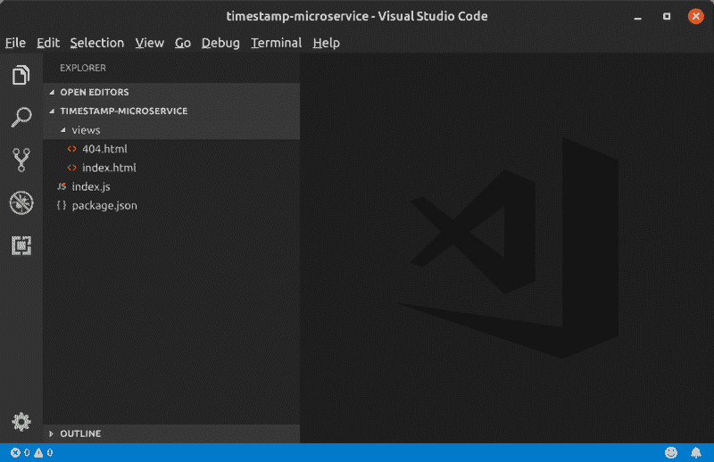
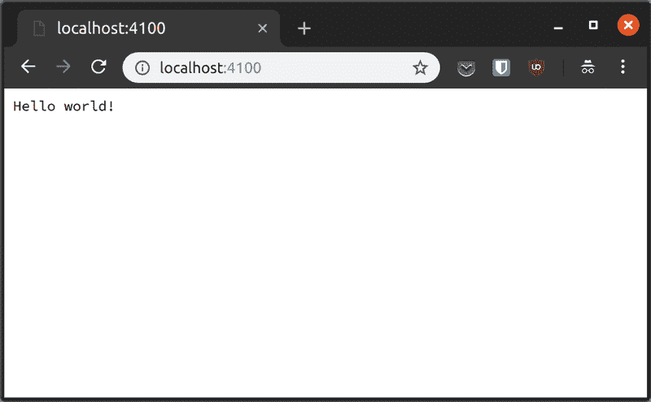
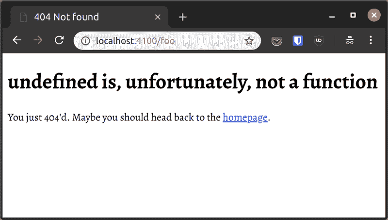

# 通过搭建时间戳微服务 app 学习 Node.js

> 原文：<https://www.freecodecamp.org/news/microservice-8edfdb9be811/>

作者 Ayo Isaiah

# 通过搭建时间戳微服务 app 学习 Node.js


Photo by [Devon Janse van Rensburg](https://unsplash.com/@devano23?utm_source=medium&utm_medium=referral) on [Unsplash](https://unsplash.com?utm_source=medium&utm_medium=referral)

Node.js 是构建应用程序的优秀平台的原因之一是社区为几乎所有常见用例开发了大量的库。这使得在相对较短的时间内从想法到生产就绪的应用程序变得非常容易。

也就是说，至少了解 Node.js 的标准库对您总是有好处的，尤其是如果您想更深入地了解 Node.js 是如何工作的。

在本文中，您将了解如何使用几个内置的 Node.js 模块构建一个[时间戳微服务](https://learn.freecodecamp.org/apis-and-microservices/apis-and-microservices-projects/timestamp-microservice)。这是我们将要建造的[现场演示](https://ayo-timestamp.herokuapp.com/)。你可以在这个 [GitHub repo](https://github.com/ayoisaiah/timestamp-microservice) 中找到这个项目的完整源代码。

### 先决条件

您需要有在浏览器中构建 JavaScript 应用程序的经验，但不需要有 Node.js 的经验。在继续之前，您需要安装 Node.js 和`npm`。

您可以访问 [Node.js 网站](https://nodejs.org/en/download/)查看您的操作系统的安装说明。 [npm](https://npmjs.com/) 与 Node 捆绑在一起，所以一旦你安装了 Node，你也可以使用`npm`命令。

我在构建这个项目时使用的版本如下:

*   Node.js v10.9.0
*   npm 版本 6.4.1

您可以通过在终端中运行以下命令来查看已安装的 Node 和`npm`的版本:

```
node -vnpm -v
```

### 用户故事

以下是这个项目的用户案例:

1.  API 端点为`GET [project_url]/api/timestamp/:date_string?`
2.  如果日期字符串能够被`new Date(date_string)`成功解析，则它是有效的。请注意，unix 时间戳需要是指定毫秒的整数(不是字符串)。在我们的测试中，我们将使用符合 ISO-8601 的日期字符串(例如“2016-11-20”)，因为这将确保 UTC 时间戳。
3.  如果日期字符串为空，它应该相当于触发器`new Date()`，即服务使用当前时间戳。
4.  如果日期字符串有效，API 将返回一个 JSON，其结构为`{"unix": <date.getTime()>, "utc" : <date.toUTCSt` ring() `> } e.g. {"unix": 1479663089000 ,"utc": "Sun, 20 Nov 2016 17` :31:29 GMT"}。
5.  如果日期字符串无效，API 将返回一个结构为`{"error" : "Invalid Date" }`的 JSON。

### 入门指南

在您的计算机上打开一个新的终端实例，然后在您的文件系统中为这个项目创建一个新目录，并使用以下命令切换到该目录:

```
mkdir timestamp-microservicecd timestamp-microservice
```

启动新节点项目的第一步是用一个`package.json`文件初始化它。这个文件包含了一个项目的一些信息，包括它的名字，描述，作者和它所依赖的所有包。下面是帮助您为项目创建一个`package.json`文件的命令:

```
npm init
```

运行上述命令会打开一个提示符，允许您按以下顺序输入项目特定部分的信息:

1.  项目的名称。
2.  项目的初始版本。
3.  项目描述。
4.  项目的入口文件。
5.  项目的测试命令。
6.  项目的 git 存储库，
7.  与项目相关的关键字。
8.  项目许可证。

如果您对命令在每个字段(在括号中)旁边提供的建议感到满意，只需按 Enter 键接受它，然后继续到下一个字段，直到命令退出。您还可以使用`npm init -y`用所有默认值快速填充一个`package.json`文件。

下一步是在项目目录的根目录下创建一个`index.js`文件。这是我们将为这个项目编写代码的地方。

```
touch index.js
```

最后，在项目目录的根目录下创建一个`views`文件夹。这个文件夹将包含两个 HTML 文件:`index.html`和`404.html`。

```
mkdir viewstouch views/index.html views/404.html
```

在你最喜欢的文本编辑器中打开项目文件夹。我们现在可以开始构建应用程序了。



### 创建 HTTP web 服务器

打开`index.js`,输入以下代码:

```
const http = require("http");
```

```
const requestHandler = (req, res) => {  console.log(req.url);  res.end('Hello world!');};
```

```
const server = http.createServer(requestHandler);
```

```
server.listen(process.env.PORT || 4100, err => {  if (err) throw err;
```

```
console.log(`Server running on PORT ${server.address().port}`);});
```

第一行需要 Node 附带的`http`模块，并通过`http`变量访问它。然后，我们利用 http 模块上的`createServer`方法创建一个 HTTP 服务器的新实例，然后存储在`server`变量中。

注意在`http`变量下创建的`requestHandler`函数。这个函数将在每个传入的 web 服务器请求中被调用。`req`和`res`参数是分别代表客户端请求和服务器响应的对象。

`listen`方法启动服务器，让它在`PORT`环境变量(在`process.env`对象上可用)上监听传入的连接，如果没有传入的连接，则在`4100`上监听。传递给`listen`方法的回调函数将在服务器启动时执行。如果提供的端口已被占用，或者服务器由于任何其他原因无法启动，则会引发错误。否则，在终端中打印`console.log()`语句。

您可以通过在终端中运行`node index.js`来启动服务器。一旦你的服务器开始运行，在你的浏览器中访问 [http://localhost:4100](http://localhost:4100/) 。你应该看到“你好，世界！”。



### 创建根路由

由于`http`模块非常基础，所以没有为我们提供路由器。因此，我们必须手动检查 URL，以决定如何处理每条路由。我们希望提供如何使用时间戳微服务的说明，一旦根路由被命中，就像在演示中一样。

我们可以这样修改`requestHandler`函数:

```
const requestHandler = (req, res) => {  if (req.url === "/") {    // Do something  }};
```

一个简单的`if`语句可以帮助我们检查传入的请求 url 是否完全是`/`，然后我们可以将该路由的逻辑放在花括号中。在这种情况下，我们希望返回一些解释微服务如何工作的 HTML。在继续之前，复制并粘贴以下内容到我们之前创建的`views/index.html`文件中，并保存该文件。

```
<!DOCTYPE html><html lang="en"><head>  <meta charset="UTF-8">  <meta name="viewport" content="width=device-width, initial-scale=1.0">  <meta http-equiv="X-UA-Compatible" content="ie=edge">  <title>Timestamp Microservice</title>  <style>    body {      font-family: -apple-system, BlinkMacSystemFont, 'Segoe UI', Roboto, Oxygen-Sans, Ubuntu, Cantarell, 'Helvetica Neue', sans-serif;      color: #333;        background-color: #f6f6f6;    }
```

```
.container {      width: 100%;      max-width: 800px;      margin-left: auto;      margin-right: auto;    }
```

```
li {      margin-bottom: 10px;    }
```

```
li, p {      font-size: 18px;    }
```

```
code {      font-size: 90%;    }
```

```
a {      color: #006fc6;    }  </style></head><body>  <div class="container">    <h1>API Project: Timestamp Microservice</h1>    <h3>User Stories:</h1>    <ol class="user-stories">      <li>The API endpoint is <code>GET [project_url]/api/timestamp/:date_string</code></li>      <li>A date string is valid if can be successfully parsed by <code>new Date(date_string)</code>.<br>        Note that the unix timestamp needs to be an <strong>integer</strong> (not a string) specifying <strong>milliseconds</strong>.<br>        In our test we will use date strings compliant with ISO-8601 (e.g. <code>"2016-11-20"</code>) because this will ensure an UTC timestamp.</li>      <li>If the date string is <strong>empty</strong> it should be equivalent to trigger <code>new Date()</code>, i.e. the service uses the current timestamp.</li>      <li>If the date string is <strong>valid</strong> the api returns a JSON having the structure<br><code>{"unix": <date.getTime()>, "utc" : <date.toUTCString()> }</code><br>        e.g. <code>{"unix": 1479663089000 ,"utc": "Sun, 20 Nov 2016 17:31:29 GMT"}</code></li>      <li>If the date string is <strong>invalid</strong> the api returns a JSON having the structure <br>        <code>{"error" : "Invalid Date" }</code>.      </li>    </ol>
```

```
<h3>Example Usage:</h3>    <ul>      <li>        <a href="api/timestamp/2015-12-25">[project url]/api/timestamp/2015-12-25</a>      </li>      <li>        <a href="api/timestamp/1450137600000">[project url]/api/timestamp/1450137600</a>      </li>    </ul>
```

```
<h3>Example Output:</h3>    <p>      <code>{"unix":1451001600000, "utc":"Fri, 25 Dec 2015 00:00:00 GMT"}</code>    </p>  </div></body></html>
```

那么我们如何向浏览器发送 HTML 响应呢？我们可以使用内置的`fs`模块读取文件，然后使用代表服务器响应的`res`参数将文件内容发送给浏览器。

要求`fs`模块位于`http`模块的正下方，如下所示:

```
const http = require("http");const fs = require("fs");
```

然后修改`requestHandler`函数，如下所示:

```
const requestHandler = (req, res) => {  if (req.url === "/") {    fs.readFile("views/index.html", "utf8", (err, html) => {      if (err) throw err;
```

```
res.writeHead(200, { "Content-Type": "text/html" });      res.end(html);    });  }};
```

`readFile()`方法使用提供的编码(`utf8`)异步读取第一个参数(`views/index.html`)中提供的文件，并执行提供的回调函数。如果读取文件时出错，将引发异常。否则，在这种情况下，文件的内容在回调函数(`html`)的第二个参数中变得可用。

现在，我们可以将`html`的内容发送到浏览器。但是我们需要设置 [HTTP 响应代码](https://freshman.tech/http-status-codes/)以及一个响应头来告诉浏览器返回内容的实际媒体类型。

在这种情况下，使用服务器响应对象上的`writeHead()`方法。它接受状态代码作为第一个参数，接受表示响应头的对象作为第二个参数。我们已经将`Content-Type`头设置为`text/html`，以确保浏览器将我们的响应内容解释为 HTML。

接下来，`end()`方法将`index.html`文件的内容发送到响应主体中的浏览器，并发出服务器响应结束的信号。

要尝试代码的新添加，您需要使用 Ctrl-C 停止服务器，并使用`node server.js`再次启动它，然后刷新您的浏览器。您应该在页面上看到来自`views/index.html`文件的 html。

### 设置 Nodemon 以自动重启节点进程

默认情况下，每当您对代码进行更改时，都必须终止服务器进程并重新启动它，但是有一个简单的方法可以解决这个问题。

您需要安装一个名为 [Nodemon](https://nodemon.io/) 的工具，它会在您的代码发生变化时自动重启节点进程。您可以使用`npm`在您的机器上全局安装该工具:

```
npm install -g nodemon
```

一旦安装了 Nodemon，终止服务器进程并使用`nodemon index.js`重新启动它。现在，只要您在代码中做了更改，web 服务器就会自动重启。很漂亮吧？

下一步是为时间戳微服务设置路由。根据用户故事#1，该服务应该在`/api/timestamp/:date_string?`下可用，其中`:date_string?`表示将传递给该服务的日期字符串。

修改您的`index.js`文件，使其看起来像这样:

```
// require statements
```

```
const getTimestamp = date => ({  unix: date.getTime(),  utc: date.toUTCString()});
```

```
const requestHandler = (req, res) => {  if (req.url === "/") {    fs.readFile("views/index.html", (err, html) => {      if (err) throw err;
```

```
res.writeHead(200, { "Content-Type": "text/html" });      res.end(html);    });  } else if (req.url.startsWith("/api/timestamp")) {    const dateString = req.url.split("/api/timestamp/")[1];    let timestamp;
```

```
if (dateString === undefined || dateString.trim() === "") {      timestamp = getTimestamp(new Date());    } else {      const date = !isNaN(dateString)        ? new Date(parseInt(dateString))        : new Date(dateString);
```

```
if (!isNaN(date.getTime())) {        timestamp = getTimestamp(date);      } else {        timestamp = {          error: "invalid date"        };      }    }
```

```
res.writeHead(200, { "Content-Type": "application/json" });    res.end(JSON.stringify(timestamp));  }};
```

```
// rest of the file
```

我知道有很多代码需要处理，所以让我一点一点地向您介绍。我们在`requestHandler`中有一个`else if`语句，它检查请求 URL 是否以`/api/timstamp`开头。如果是这样，我们`split`将请求 URL 一分为二，并从结果数组中取出`dateString`部分。

如果`dateString`是`undefined`或空字符串，则意味着请求中没有提供日期字符串。用户故事#3 要求我们将这种情况视为当前日期被请求，这就是`getTimestamp(new Date())`所做的。

如果一个`dateString`确实存在，我们需要检查它是 unix 时间戳还是 ISO-8601 日期字符串(比如“2018-11-22”)，这样我们就可以决定是将一个数字还是一个字符串传递给`new Date()`。注意，如果您将一个 unix 时间戳作为字符串传递给`new Date()`，您将得到一个无效的结果。这就是为什么这一步是必要的。

接下来，我们检查存储在`date`变量中的日期对象是否有效。如果是，我们像以前一样获得时间戳对象，否则我们将`timestamp`变量设置为用户故事#5 中指定的无效日期的结构。

最后一步是将`timestamp`变量的内容发送到浏览器。在这种情况下，我们将`Content-Type`头设置为`application/json`,以便响应体被正确地解释为 JSON。我们还通过调用`JSON.stringify(timestamp)`并将输出传递给`end`方法来确保我们发送的是有效的 JSON 值。

现在，通过在`/api/timestamp/`之后传递有效的日期字符串或 unix 时间戳来测试应用程序，或者不传递日期字符串来获得当前日期的 JSON 响应。您还可以尝试传递无效的日期字符串，以确认服务将其识别为无效日期。

### 实现一个 404 页面

我们已经完成了这个应用程序的所有用户故事，但是还有最后一件事我想让我们做。如果浏览器请求的 url 不是`/`或以`/api/timestamp`开头，我们应该设置服务器向浏览器发送 404 响应。

首先，用以下代码填充`views/404.html`文件:

```
<!DOCTYPE html><html lang="en"><head>  <meta charset="UTF-8">  <meta name="viewport" content="width=device-width, initial-scale=1.0">  <meta http-equiv="X-UA-Compatible" content="ie=edge">  <title>404 Not found</title></head><body>  <h1>undefined is, unfortunately, not a function</h1>  <p>You just 404'd. Maybe you should head back to the <a href="/">homepage</a>.</p><script></script></body></html>
```

接下来，修改`index.js`中的`requestHandler`函数，如下所示:

```
const requestHandler = (req, res) => {  if (req.url === "/") {    fs.readFile("views/index.html", (err, html) => {      if (err) throw err;
```

```
res.writeHead(200, { "Content-Type": "text/html" });      res.end(html);    });  } else if (req.url.startsWith("/api/timestamp")) {    const dateString = req.url.split("/api/timestamp/")[1];    let timestamp;
```

```
if (dateString === undefined || dateString.trim() === "") {      timestamp = getTimestamp(new Date());    } else {      const date = !isNaN(dateString)        ? new Date(parseInt(dateString))        : new Date(dateString);
```

```
if (!isNaN(date.getTime())) {        timestamp = getTimestamp(date);      } else {        timestamp = {          error: "invalid date"        };      }    }
```

```
res.writeHead(200, { "Content-Type": "application/json" });    res.end(JSON.stringify(timestamp));  } else {    fs.readFile("views/404.html", (err, html) => {      if (err) throw err;
```

```
res.writeHead(404, { "Content-Type": "text/html" });      res.end(html);    });  }};
```

我在`requestHandler`函数的末尾添加了一个最后的`else`块，它读取`views/404.html`文件的内容，并将它发送给任何不匹配`/`或`/api/timestamp/:date_string?`的 URL 的浏览器。

试试看。在你的浏览器中输入一个类似[http://localhost:4100/foo](http://localhost:4100/foo)的网址，并确认其有效！



### 部署到 Heroku

一个时间戳微服务如果没人用还有什么用？让我们通过将它部署到 [Heroku](https://heroku.com/) 来与世界分享吧。

第一步是[注册一个免费的 Heroku 账户](https://signup.heroku.com/)。激活您的账户后，[点击此链接](https://dashboard.heroku.com/new-app?org=personal-apps)创建一个新应用。给它一个唯一的名称。我把我的名字叫做“ayo-timestamp”。

一旦你的应用程序创建完成，[按照这里的说明](https://devcenter.heroku.com/articles/heroku-command-line)在你的机器上安装 Heroku CLI。然后在终端运行`heroku login`命令登录到你的 Heroku 账号。

确保您已经为项目初始化了一个 git 存储库。如果没有，运行项目目录根目录下的`git init`命令，然后运行下面的命令将 heroku 设置为 git repo 的远程。将`<app na` me >替换为应用程序的名称。

```
heroku git:remote -a <app name>
```

接下来，在您的项目目录(`touch Procfile`)的根目录下创建一个`Procfile`，并粘贴以下内容:

```
web: node index.js
```

接下来，在`engines`键下的`package.json`文件中指定您正在运行的节点的版本。我指定了版本`10.9.0`,因为那是我在电脑上运行的版本。您应该更改该值以匹配您计算机上的节点版本。

```
{  "name": "timestamp-microservice",  "version": "1.0.0",  "description": "",  "main": "index.js",  "scripts": {    "test": "echo \"Error: no test specified\" && exit 1"  },  "keywords": [],  "author": "Ayo Isaiah",  "license": "MIT",  "engines": {    "node": "10.9.0"  }}
```

最后，使用以下命令提交您的代码并将其推送到 Heroku remote:

```
git add .git commit -m "Initial commit"git push heroku master
```

一旦部署过程完成，您就可以打开`https://<your-app-name>.hero`ku.com 来查看和测试您的项目。

### 包裹

我们仅使用内置节点模块成功构建了时间戳微服务，并将其部署到 Heroku。可以肯定的是，使用像 [Express](https://expressjs.com/) 这样的 web 框架对于重要的应用程序来说更加容易和实用，但是如果您在查看社区所提供的内容之前，至少对它的标准库有一点熟悉，那么您将会是一个更好的节点开发人员。

我还有另外一个教程，讲述了如何使用 Express 作为 web 服务器，使用 [Pug](https://pugjs.org/) 作为模板来构建 Node.js 网站。如果你想更多地练习构建节点项目，你可以去看看，并且[订阅我的时事通讯](http://localhost:5000/newsletter/)以便在我发布新教程时得到通知。

*最初发布于 2018 年 11 月 22 日[新生科技](https://freshman.tech/microservice/)。*