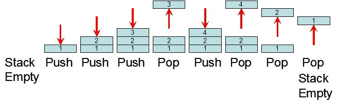
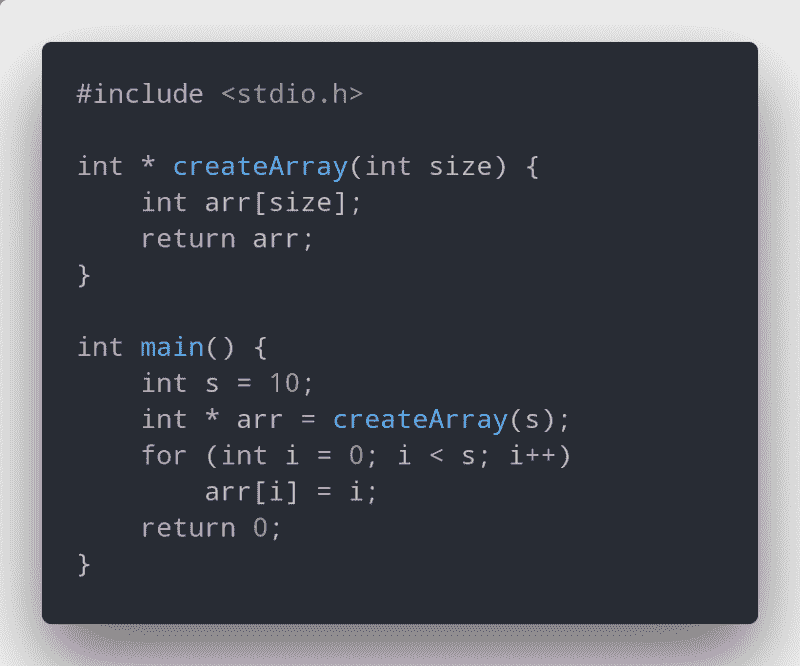
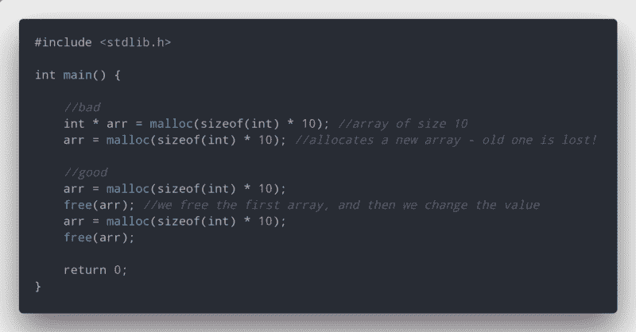
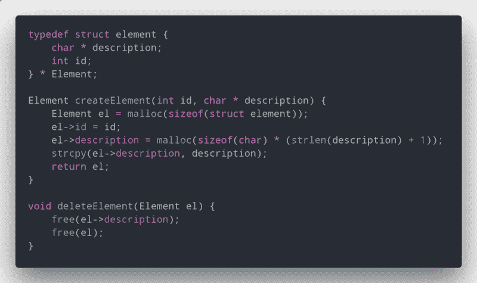

# 如何理解你程序的内存

> 原文：<https://www.freecodecamp.org/news/understand-your-programs-memory-92431fa8c6b/>

由安特卫普

# 如何理解你程序的内存

当用 C 或 C++这样的语言编码时，你可以用一种更低级的方式与你的记忆互动。有时候这会产生很多你之前没有得到的问题: **segfaults** 。这些错误相当烦人，会给你带来很多麻烦。它们通常表明你正在使用不应该使用的内存。

最常见的问题之一是访问已经被释放的内存。这是你用`free`释放的内存，或者是你的程序自动释放的内存，比如从堆栈中。

理解这一切真的很简单，它肯定会让你以更聪明的方式更好地编程。

### 内存是怎么划分的？

High stands for ***high addresses***

内存分为多个段。对于本文来说，最重要的两个是**栈**和**堆**。栈是有序的插入位置，而堆是随机的——你可以在任何地方分配内存。

堆栈内存有一套工作方式和操作。它是保存处理器的一些寄存器信息的地方。它是关于你的程序的相关信息的地方——哪些函数被调用，你创建了什么变量，以及一些更多的信息。这个内存也是由程序管理的，**不是**是由开发者管理的。

堆通常用于分配大量内存，只要开发人员愿意，这些内存就应该存在。也就是说，**控制堆上内存的使用是开发人员的工作**。当构建复杂的程序时，你经常需要分配大块的内存，这就是你使用堆的地方。我们称之为**动态记忆**。

每次使用`malloc`为某个东西分配内存时，你都是在把东西放到堆上。任何其他类似于`int i;`的调用都是堆栈内存。了解这一点非常重要，这样您就可以轻松地在程序中找到错误，并进一步改进 Segfault 错误搜索。

### 了解堆栈

虽然你可能不知道，你的程序一直在为它分配堆栈内存。你调用的每个局部变量和函数都在那里。有了它，您可以做很多事情——大多数都是您不希望发生的事情——比如缓冲区溢出和访问不正确的内存。

那么它到底是如何工作的呢？

堆栈是一种后进先出的数据结构。你可以把它看做一个放满书的盒子——你放进去的最后一本书是你拿出来的第一本。通过使用这种结构，程序可以通过两个简单的操作轻松地管理它的所有操作和范围: **push** 和 **pop** 。

这两者做的正好相反。Push 将值插入堆栈的顶部。Pop 从中取顶值。

Push and Pop operations.

为了跟踪当前的内存位置，有一个特殊的处理器寄存器叫做**堆栈指针**。每当你需要保存某个东西时——比如变量或函数的返回地址——它会将堆栈指针向上推并移动。每次你从一个函数中退出时，它从堆栈指针弹出所有东西，直到从函数中保存的返回地址。很简单！

为了测试你是否理解，让我们用下面的例子(试着找出☺️):的错误

Everything looks ok — until you run it.

如果你运行它，程序就会自动退出。为什么会这样？一切看起来都很到位！除了……堆栈。

当我们调用函数`createArray`时，堆栈:

*   保存回邮地址，
*   在堆栈内存中创建`arr`并返回它(一个数组只是一个指向包含其信息的内存位置的指针)
*   但是由于我们没有使用`malloc`,它被保存在堆栈内存中。

在我们返回指针后，由于我们对栈操作没有任何控制，程序从栈中弹出信息并在需要时使用它。当我们从函数返回后试图填充数组时，我们破坏了内存—使程序 segfault。

### 了解堆

与堆栈相反，当您希望某个东西独立于函数和作用域存在一段时间时，可以使用堆。要使用这种内存，C 语言 **stdlib** 确实不错，因为它带来了两个很棒的函数:`malloc`和`free`。

**Malloc** (内存分配)向系统请求所请求的内存量，并返回一个指向起始地址的指针。 **Free** 告诉系统我们请求的内存不再需要，可以用于其他任务。看起来真的很简单——只要你避免错误。

系统无法覆盖开发人员的要求。所以就靠我们人类，用上面的两个功能来管理它。这为一个人为错误打开了大门:内存泄漏。

内存泄漏是指当程序结束或指向其位置的指针丢失时，用户请求的从未释放的内存。这使得程序使用了比预期多得多的内存。为了避免这种情况，每当我们不再需要堆分配的元素时，我们就释放它。

Pointers: bad vs good.

上图中，坏的方式永远不会释放我们使用的内存。这最终浪费了 20 * 4 字节(64 位中的 int size in 字节。这可能看起来没那么多，但是想象一下在一个巨大的程序中不这样做。我们最终可能会浪费千兆字节！

管理堆内存对于提高程序的内存效率至关重要。但是你也需要小心使用它。就像在堆栈内存中一样，在内存被释放后，访问或使用它可能会导致 segfault。

### 额外收获:结构和堆

使用结构时的一个常见错误是释放结构。这很好，**只要**我们没有将内存分配给结构体内部的指针。如果内存被分配给结构体内部的指针，我们首先需要释放它们。然后我们可以释放整个结构。

Look at how I used free

### 我如何解决内存泄漏问题

当我用 C 语言编程时，大部分时间我都在使用结构。因此，我总是在我的结构中使用两个强制函数:构造函数**和析构函数**。****

**这两个函数是我在 struct 上唯一使用 mallocs 和 frees 的函数。这使得解决我的内存泄漏变得非常简单和容易。**

**(如果你想了解更多关于让代码更容易阅读的知识，请查看我关于抽象的帖子。**

**

A way to create, and a way to destroy!** 

### **一个伟大的内存管理工具——Valgrind**

**很难管理你的记忆并确保你正确地处理了每件事。验证你的程序是否运行正常的一个很好的工具是 [Valgrind](https://en.wikipedia.org/wiki/Valgrind) 。这个工具验证你的程序，告诉你你分配了多少内存，释放了多少，如果你试图在一个不正确的内存区域写…使用它是一个伟大的方式来验证是否一切正常，人们应该使用它来避免安全危害。**

**

An example of using valgrind, giving you information about what went wrong** 

### **别忘了跟着我！**

**除了在 Medium 上发帖，我还在 Twitter 上发帖。**

**如果您有任何问题或建议，请随时联系我。**