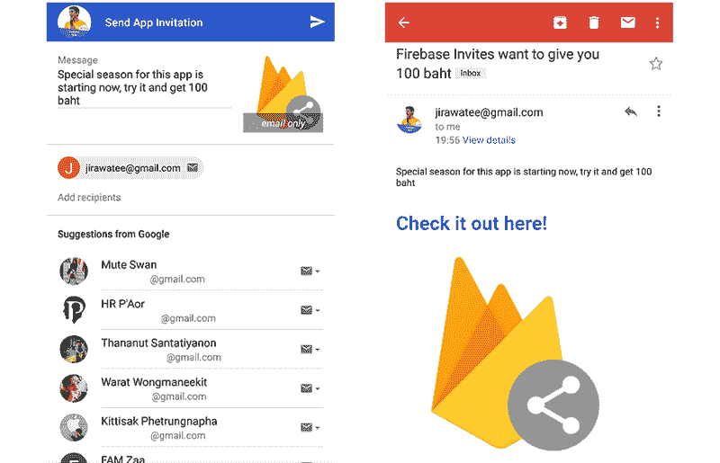

# 以下是我希望在开始使用 Firebase 之前就知道的事情

> 原文：<https://www.freecodecamp.org/news/heres-what-i-wish-i-knew-before-i-started-using-firebase-9110d393e193/>

尼基·斯里达尔

# 以下是我希望在开始使用 Firebase 之前就知道的事情

#### 在选择云 Firestore 作为您的数据库之前，您应该考虑的优点和缺点列表

在过去的几年里，Firebase 已经发展成为一个越来越受欢迎的后端解决方案。尤其是在云 Firestore 发布之后。Firestore 是一个灵活的云数据库，具有丰富的查询和实时更新功能。在用 Cloud Firestore 开发了我的第一个应用程序之后，我整理了一个优缺点列表。此列表将帮助您选择 Firestore 是否适合您。

在我开始之前，你必须了解云火石的数据模型。Firestore 将数据存储在文档中，组织成集合。*每个* ***文档*** *包含一组键值对*。Cloud Firestore 针对存储大量小文档进行了优化。*所有文件必须存储在* ***集合中*** 。文档可以包含子集合和嵌套对象。B *它们都可以包含像字符串这样的原语字段或者像列表这样的复杂对象*。

现在您已经了解了基础知识，下面是 Cloud Firestore 中的一个列表，它可以决定您的应用程序的成败。

### 优势#1:事务和批量写入

在读取和写入数据库时，错误处理可能是最乏味的任务之一。在某些情况下，如果在读取或写入数据库中的某个位置时出错，您可能希望取消整个操作。这就是批量写入和事务的用武之地。

**批量写入是一组自动执行的写入操作。在一组原子操作中，要么所有操作都成功，要么都不成功。**如果您的应用程序成功地将数据写入一个文档，但无法将数据写入另一个文档，则不会执行任何写入操作。会引发一个错误。

事务的工作方式类似。它们更强大，因为它们允许您以原子的方式读写文档。

批处理写和事务可以通过一个例子得到最好的解释。最简单的是在社交媒体平台上添加好友。当用户 A 将用户 B 添加为好友时，您希望将数据写入用户 A 的文档和用户 B 的文档，以表示他们是朋友。但是，如果写入用户 A 的文档或用户 B 的文档失败，您希望撤消任何更改并抛出一个错误。批量写入和事务仅用几行代码就简化了这一过程。

### 优势 2:邀请

Firebase Invites 可能是最强大的内置技术*，尤其是当你的应用运行在多个平台(iOS、Android 等)上的时候。).它允许你**提示当前用户是否愿意邀请他的朋友加入你的应用。**然而，更重要的是，Firebase 实际上允许你为被邀请的用户创建一个临时用户，以便为当前用户提供最佳的客户体验。*

*例如，假设你正在开发一个类似于 Venmo 的应用程序。这个应用程序允许用户跟踪费用并最终结算。用户 A 想要向用户 B 付款，而用户 B 目前没有账户。使用 Firebase Invites，您可以允许用户 A 邀请用户 B，然后为用户 A 设置一个临时帐户来跟踪费用，直到用户 B 接受邀请并创建自己的帐户。邀请通过**电子邮件和短信提供应用推荐。**这是获得新用户并让现有用户比以往任何时候都更开心的好方法。*

### *优势 3:动态链接*

*Firebase 动态链接提供了最佳的用户入门体验。这些链接可以跨平台工作。一旦用户打开某个链接 *，它们允许你在应用程序中提供自定义体验。*动态链接最好在与 Firebase Invites 集成时使用。*

*让我们以前面的优势为例。用户 B 已被用户 A 邀请使用您的应用程序，现在他决定创建一个帐户来查看他欠用户 A 的任何债务。当用户 B 通过电子邮件收到邀请并点击动态链接时，他将被定向到 AppStore，并在那里下载您的应用程序。然后，当他打开应用程序并开始注册时，由于动态链接传递的**信息，他的电子邮件已经被填写好了。***

### *缺点 1:按子集合查询*

*Cloud Firestore 最令人失望的一点是**无法通过其子集合**查询文档。例如，假设您有以下数据结构:*

***收藏**的用户- >美国**er docum**ent**->coll**收藏好友->**；朋友** doc **umen** t - >关于该朋友的数据(姓名、电子邮件等。)*

*在这种结构中，不可能获取所有拥有特定姓名和电子邮件的朋友的用户。Firebase 最终计划提供一个解决方案。目前看来，**唯一的解决方案是用数组**替换子集合，在数组中可以查询文档。*

*虽然这个修复看起来足够了，但它并不足够。随着应用程序的增长，阵列也会增长，**这会显著影响读写文档的性能**。*

### *缺点 2:按位置查询*

**

*根据应用程序的功能，这可能是最大的缺陷。虽然 Cloud Firestore 确实提供了位置数据类型，**但它不允许您查询给定位置**半径范围内的所有文档。*

*让我们假设你正在构建一个和优步一样的应用程序。当用户登录应用程序时，您希望获取当前用户位置一定半径范围内的所有汽车，以提醒用户附近是否有任何司机。如果没有第三方库的帮助，这项任务是不可能完成的。*

*幸运的是，如果您正在使用实时数据库，Firebase 现在推荐您使用 [GeoFire](https://github.com/googlearchive/geofire) 库来按位置查询文档。但是，如果您计划使用云 Firestore，则没有推荐的解决方案。*

*尽管有一些图书馆试图解决这个问题，比如 GeoFirestore，Firebase 还没有证实它们是可靠的来源。*

### *缺点 3:全文搜索*

*这个问题肯定会影响任何使用云 Firestore 的人，因为**它不允许你通过“不完整文本”**查询文档。这个问题可以通过一个例子得到最好的说明。*

*假设您的应用程序允许用户互相添加好友。一个用户键入“Al”试图搜索他的朋友“Alex”。**您想要获取数据库中名称包含文本“Al”的所有用户，以帮助用户缩小搜索范围。这个任务光靠云 Firestore 是不可能完成的**。**需要第三方服务 Algolia 来实现全文搜索**。所有文件必须上传到 Algolia 作为记录。然后可以通过不完整的文本来查询这些记录。*

*更多提示，请继续关注我。如果你喜欢这篇文章，请按下那个按钮。*