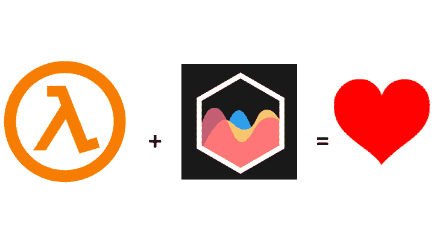

# 如何使用 AWS lambda 和 ChartJS 创建无服务器映像

> 原文：<https://www.freecodecamp.org/news/how-to-create-serverless-images-using-aws-lambda-and-chartjs-3d18254b05ef/>

马丁·范·弗利特

# 如何使用 aws lambda 和图表创建无服务器映像

Lambda + ChartJS = Goodness

我正在做一个[项目，将 sprint burndown 信息推送给在 Slack](https://sprintlr.io) 工作的分布式 Scrum 团队。整个应用程序是无服务器的，在 AWS 内部运行。为了生成燃尽图像，我想构建一个 lambda 函数来创建一个图像，然后将其推送到 S3 桶。在本文中，我将描述我想到的解决方案。

首先，图表库。在研究了许多选项之后，我决定使用 [ChartJS 库](http://www.chartjs.org/)。这是一个很棒的 Javascript 图表库，可以使用 HTML5 画布呈现各种图形。也非常灵活和可配置。但是我如何在 lambda 中无头运行它呢？

我的第一次尝试是在我的 MacBook 上使用三个 NPM 包创建一个简单的 lambda:**chart . js**和另外两个库:[**chart js-node-canvas**](https://www.npmjs.com/package/chartjs-node-canvas)和[**canvas-pre build**](https://www.npmjs.com/package/canvas-prebuilt)。前者是 ChartJS 的包装器，支持在 node 中呈现图表。后者是一个预构建的 HTML5 画布的本机版本，允许在没有浏览器的情况下无标题地呈现画布。我用[无服务器框架](https://serverless.com/)构建了 lambda，这是一个创建和部署无服务器应用程序的非常有用的工具。

这是我的样本 lambda:

我的 lambda 生成了一个样本图，当我在本地运行它时，一切看起来都很好。然而，在 AWS 上，它失败了。怎么回事？

事实证明，ChartJS 使用*原生 NPM 模块*直接渲染到画布上。显然，我在 MacBook 上使用的本机模块不能在 lambda 中运行。那怎么办呢？

为了在 lambda 中运行本地模块，我需要使用 lambda 运行时环境需要的本地库。所以我在 EC2 上启动了 lambda 运行时 AMI 的一个实例，并登录到其中。在那里，我使用我之前构建的 lambda，在 EC2 实例上运行 **npm install** 。这会下载 ChartJS 需要的原生 NPM 库，但这次是针对 lambda 运行时环境。有了这些库作为 lambda 函数的一部分，ChartJS 就可以像平常一样渲染图像了。耶！

与普通的 NPM 项目相反，我将下载的节点模块签入到我的 git 存储库中。当更新或构建 graphing lambda 时，注意不要覆盖任何依赖项。这种方法的一个副作用是，我不能再在本地笔记本电脑上运行代码进行测试。

接下来:将生成的图像文件存储在 S3 桶中。这实际上是一个相当简单的任务，有许多在线代码片段可供学习。为了完整起见，这里是我的:

就是这样！现在，您可以根据需要廉价地生成图像！

然而，使用本地库并不是没有问题。我让整个设置工作或失败，这取决于我使用的**canvas-pre build**的确切版本。当前的设置实际上使用了两个。一个通过**chart js-node-canvas**(2 . 0 . 0-alpha . 14)传递的依赖关系。一个我直接指定的版本(1.6.5-prerelease.1)。如果我删除其中一个，应用程序会由于一些链接错误而无法启动。YMMV。

如果您想尝试一下，我已经将 git repo 与示例代码和二进制文件放在了一起。[查看源代码](https://github.com/techfu-io/chartjs-lambda)。

*Martin 在 [StackState](https://www.stackstate.com) 担任工程副总裁，他和他的团队正在开发下一代监控和 AIOps 产品。作为一个兼职项目，马丁正在开发 [Sprintlr](https://sprintlr.io) ，一个改进分布式 Scrum 团队的工具，以及 [techfu.io](https://techfu.io) ，一个自动评估技术人才的工具。*