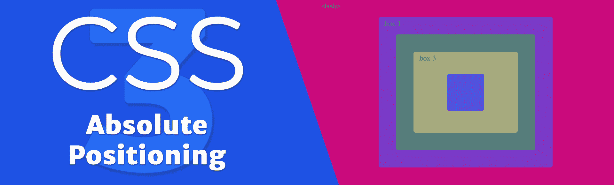
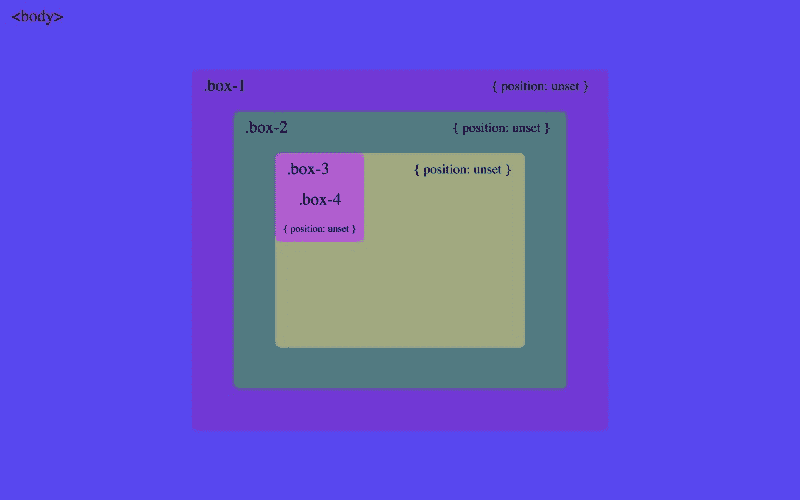
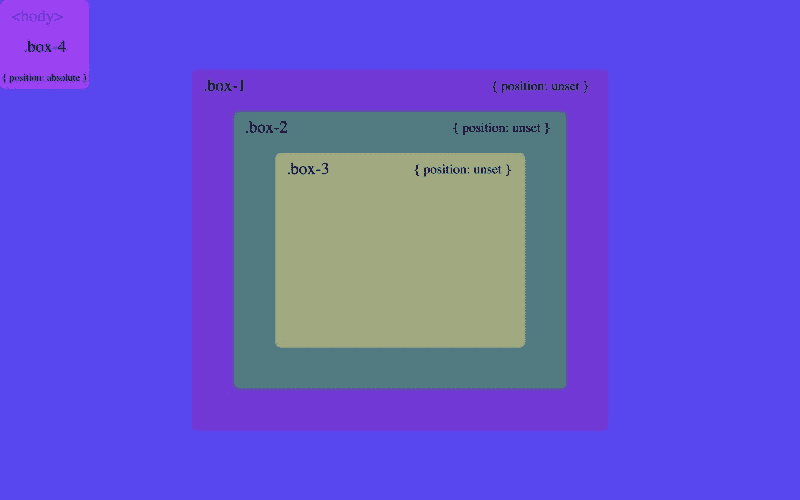
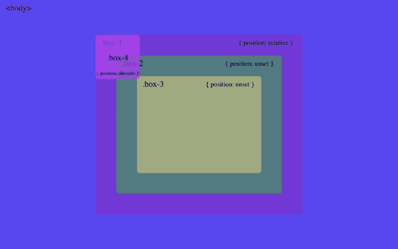
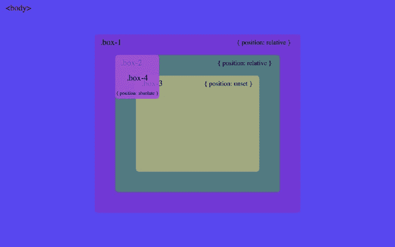

# 如何一劳永逸地理解 CSS 定位绝对

> 原文：<https://www.freecodecamp.org/news/how-to-understand-css-position-absolute-once-and-for-all-b71ca10cd3fd/>

作者玛丽娜·费雷拉

# 如何一劳永逸地理解 CSS 定位绝对

#### 通过理解一个物体是如何定位的，不要在屏幕上丢失你的元素



绝对定位元素更多的是关于元素的容器位置，而不是它自己的位置。为了能够定位自己，它必须知道它要相对于哪个父 div 来定位自己。

下面的代码显示了四个嵌套的 div。`.box-1`到`.box-3`仅由`display: flex`和`margin: auto`居中。`.box-4`没有设置`margin`，它位于文档流中的默认位置。

```
<body>  <div class="box-1">    <div class="box-2">      <div class="box-3">        <div class="box-4"></div>      </div>    </div>  </div></body>
```

所有元素都不设置`position`属性。

```
body {  display: flex;}
```

```
.box-1,.box-2,.box-3 {  display: flex;  margin: auto;}
```



.box-4 default position

为了能够定位自己，元素必须知道两件事:

*   由`top`、`right`、`bottom`、`left`中的任意一个设定其`x`和`y`位置的坐标
*   它会相对于哪一个父母来定位自己

将`position: absolute`应用到`.box-4`时，元件从`[normal document flow](https://developer.mozilla.org/en-US/docs/Learn/CSS/CSS_layout/Normal_Flow)`中移除。由于没有设置它的坐标，它只是停留在默认位置，即左上角的父 div。


.box-4 position absolute without offset.

通过设置`top: 0`和`left: 0`，元素必须知道它将哪个父元素作为参考点。作为参考，必须用`position: relative`将元素定位到屏幕上。`.box-4`然后开始询问其父 div 是否已定位。首先，它询问`.box-3`并得到`No, I am not positioned.`作为回答。同样的道理也适用于`.box-2`和`.box-1`，因为它们都有`position: unset`。

由于`.box-4`无法找到已定位的父节点，它相对于`body`定位自己。该元素始终位于屏幕上:



.box-4 position absolute. Parent divs position unset.

如果我们将`position: relative`设为`.box-1`，当`.box-4`询问它:`Are you positioned?`时，它会得到`Yes I am.`的回答。然后`.box-4`将相对于`.box-1`定位:



.box-4 position absolute, .box-1 position relative.

同样的道理也适用于`.box-2`和`.box-3`。

绝对定位的元素将相对于最近定位的祖先来定位自己。

一旦找到定位的祖先，它上面的元素的位置就不再相关。下图分别显示了设置`position: relative`到`.box-2` 和`.box-3`的布局:



.box-4 position absolute, .box-2 and .box-3 position relative, respectively.

也可以在[码素描频道](https://youtu.be/VFt_n4M9Vyk)找视频讲解？。

感谢阅读！✌️

*最初发表于[marina-ferre IRA . github . io](https://marina-ferreira.github.io/tutorials/css/position-absolute/)。*

