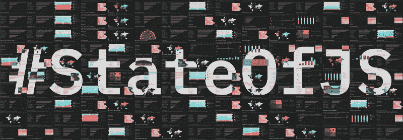
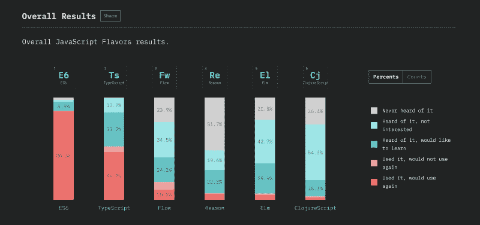
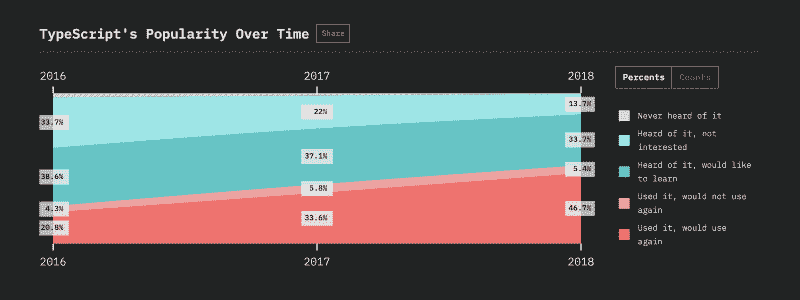
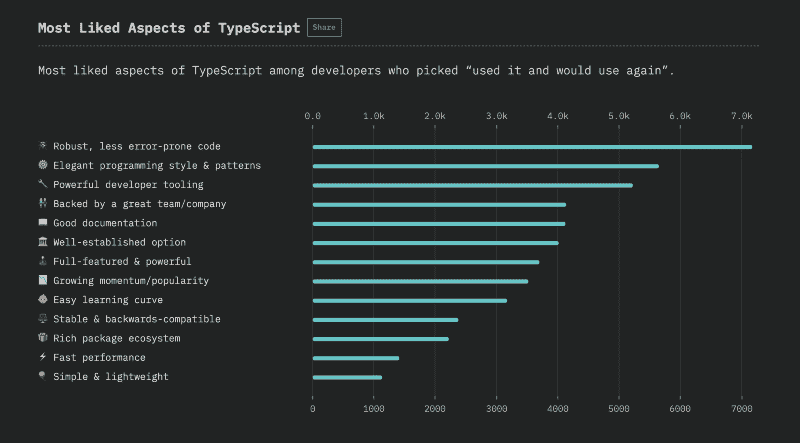
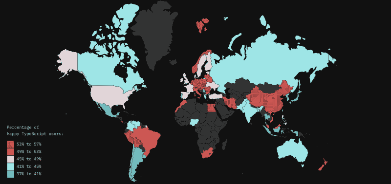
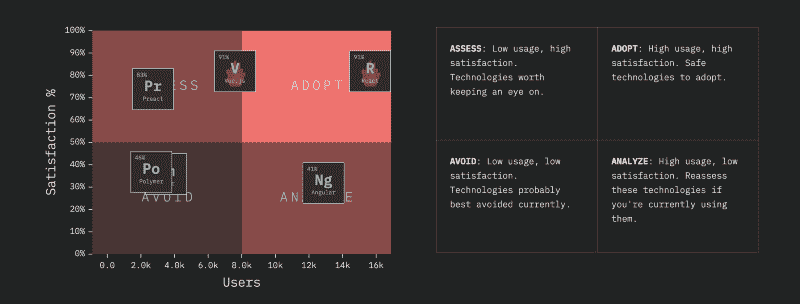
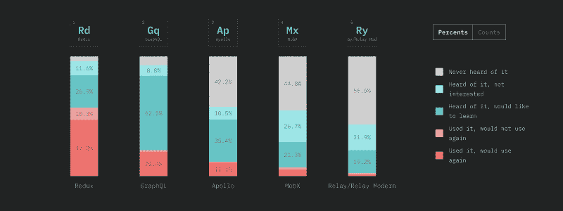
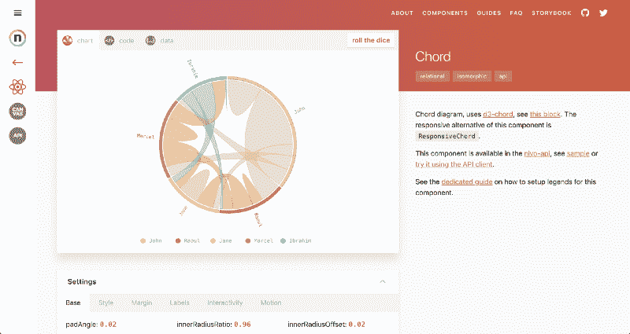

# JavaScript 2018 的状态

> 原文：<https://www.freecodecamp.org/news/the-state-of-javascript-2018-8322bcc51bd8/>

萨沙·格里菲

# JavaScript 2018 的状态

#### 我们调查了 20，000 多名 JavaScript 开发者。这是他们告诉我们的。

我在俄罗斯上空的某个地方写下这几行字，是因为有人愿意带我飞越半个地球去参加一个会议，就为了听我谈论 JavaScript 趋势。

如果你问我，我会说这是一个很好的衡量 JavaScript 调查的[状态有多受欢迎的方法，以及 JavaScript 生态系统保持增长的速度有多快。](http://stateofjs.com)

今年，我们再次调查了 20，000 多名 JavaScript 开发人员，以了解他们在使用什么，他们对什么满意，以及他们想学习什么。结果是一个独特的统计数据和见解的集合，有望帮助您在 JavaScript 生态系统中找到自己的路。

#### ？检查结果

…或者继续阅读，了解有关该项目的更多信息。

### 今年有什么新东西

#### 深色模式

如果你以前看过这个调查，你注意到的第一件事可能是新的、更深的配色方案。我们认为它改变了一些东西，让图表更流行，看起来很酷！

#### 单个页面

除了将库分成前端、后端等几个大的部分之外，我们还决定给每个库一个自己的页面。这使得忽略与你无关的数据更容易，同时更深入地研究你确实使用的工具。

#### 史料

因为这是第三版调查，我们现在可以向您展示过去两年的历史数据！这对于看到长期趋势非常有帮助，而不仅仅是一个冻结的时间快照。

#### 喜欢和不喜欢

我们决定今年减少图书馆的数量，但反过来会对每个图书馆提出更多的后续问题。所以我们不仅问了你用什么，还问了你为什么用它。

#### 没有 CSS

遗憾的是，今年将没有 CSS 部分。CSS 是一个如此庞大的主题，它本身几乎值得一个调查，所以这次我们决定只关注 JavaScript，而不是半途而废。

#### 更多分享

我们采取了额外的步骤，为调查中的每个图表生成图像预览，以便更容易在社交媒体上或通过电子邮件分享它们。

### 主要趋势

我们鼓励你[查看完整的结果](http://2018.stateofjs.com),但也许你很着急，只想知道它的要点？

TL；大卫:今年情况没有太大变化。

#### JavaScript“口味”

我们把可以编译成 JavaScript 的各种语法和语言称为“风格”，比如 TypeScript。

说到 TypeScript，[它显然是这一领域的领导者。](https://2018.stateofjs.com/javascript-flavors/typescript/)在大多数地方，超过 40%的开发者表示他们已经使用过它，并且很乐意再次使用它，在一些国家，这一比例甚至超过了 50%。

TypeScript satisfaction ratio worlwide

#### 前端框架

这里有一个图表，描绘了[开发人员对前端库的满意度与他们拥有的用户数量的关系](https://2018.stateofjs.com/front-end-frameworks/conclusion/):

Front-End Frameworks Quadrant Chart

正如你所看到的，只有 React 既有很高的满意率，又有很大的用户群，尽管 Vue 肯定会达到这一点。另一方面，Angular 确实拥有庞大的用户群，但它的用户似乎不太高兴。

#### 数据层

数据层集合了所有用于传输和管理数据的技术。虽然 Redux 在原始数据方面占主导地位，但我们认为这一趋势有利于 GraphQL 和 Apollo 等相邻技术:

Data Layer Trends

当然，理论上你可以同时使用 Redux 和 GraphQL，但是实际上这种组合可能会被一个 GraphQL 特有的工具所取代，比如 Apollo 的内置状态管理。

要了解测试、后端框架和更多方面的情况，[阅读完整结果](https://2018.stateofjs.com/)！

### 堆栈

谈论技术栈的核心是一个简单的静态站点，这可能看起来很奇怪。但这毕竟是我们在谈论的 JavaScript！所以你知道事情永远不会那么简单！

*   我们使用[字型](https://www.typeform.com/)收集数据。我们构建了自己的命令行工具，通过他们的 API 从 YAML 大纲中生成调查，这对快速迭代有很大的帮助。
*   然后，我们使用 [Elasticsearch](https://www.elastic.co/) 对数据进行处理和标准化。
*   我们将生成的 JSON 文件插入到 [Gatsby](https://gatsbyjs.org) 来生成网站。我们结合使用 Gatsby 的 GraphQL 数据查询特性和普通的老式`import`来加载数据。
*   最后，我们使用 React 惊人的 [Nivo.js](http://nivo.rocks) 数据可视化库生成了所有图表。

如果你很好奇，出于学习目的，GitHub 上提供了整个项目。

Nivo

### 关于团队

如果你对调查背后的人感到好奇:

#### [Sacha Greif](http://twitter.com/sachagreif) (我！)

我在 2016 年创建了这项调查，以回答我自己关于学习最佳技术的问题。两年后，我仍在学习，并试图将所有新获得的知识重新投入到我自己的 JavaScript 框架中。

#### 拉斐尔·贝尼特

Raphael 是 [Nivo](http://nivo.rocks) 的创造者，是一个全方位的数据可视化专家，也是一个前端坏蛋。他还负责调查的所有数据分析任务。

#### [迈克尔拉姆波](https://twitter.com/michaelrambeau)

Michael 是 BestOfJS 的创始人，这是一个关于 JavaScript 生态系统的数据和趋势的聚合器。当你需要一些晦涩难懂的 JavaScript 库的数据时，他是最合适的人选！

### 下一步是什么

推出今年的网站是两个多月努力收集、分析和展示数据的结果。但是我们还有很多可以做的。

例如，我们希望搜索结果网站能提供更多的语言版本。这将需要我们进行一些重新设计，因为目前很多字符串都是硬编码的，但这应该是可能的。

如果你想帮助翻译你的语言，请查看这个 GitHub 主题。

随着我们投入的所有工作，我们开始认为在其他调查中重复使用我们的设置可能是一个好主意。涡轮帕斯卡的状态怎么样？嗯，也许不是。但是如果你有任何建议，请在评论中告诉我们！