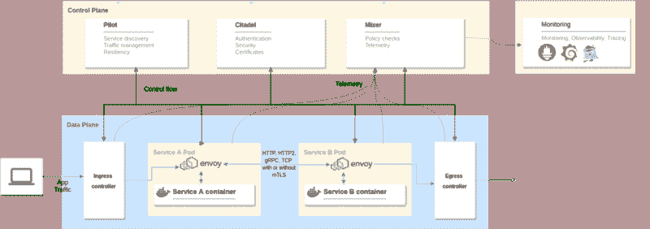

# 如何在 Kubernetes 上使用 Istio 服务网格设置 JHipster 微服务

> 原文：<https://www.freecodecamp.org/news/jhipster-microservices-with-istio-service-mesh-on-kubernetes-a7d0158ba9a3/>

由 Deepu K Sasidharan

# 如何在 Kubernetes 上使用 Istio 服务网格设置 JHipster 微服务

你可以在这里找到这篇文章的最新版本，它使用了 JHipster 6 和最新的 Istio & Kubernetes 版本[。](https://dev.to/deepu105/how-to-set-up-java-microservices-with-istio-service-mesh-on-kubernetes-5bkn)

* * *

Istio 现在是 DevOps 和 Cloud block 上最酷的孩子。对于那些没有密切关注的人来说，Istio 是分布式应用架构的服务网，尤其是那些使用 Kubernetes 在云上运行的应用架构。Istio 与 Kubernetes 配合得非常好，好到你可能会认为它是 Kubernetes 的一部分。

如果你还想知道，到底什么是服务网格或 Istio？那么我们来对 Istio 做一个概述。

Istio 在分布式应用程序架构中提供了以下功能:

*   服务发现——传统上由平台提供，如[网飞尤里卡](https://github.com/Netflix/eureka/wiki)或[领事](https://www.consul.io/)。
*   自动负载平衡——你可能已经为此使用了[网飞·祖尔](https://github.com/Netflix/zuul/wiki)。
*   路由、断路、重试、故障转移、故障注入——想想[网飞丝带](https://github.com/Netflix/ribbon/wiki)、[海崔克斯](https://github.com/Netflix/Hystrix)等等。
*   针对访问控制、速率限制、A/B 测试、流量分流和配额的策略实施——同样，您可能已经使用 Zuul 完成了其中的一些任务。
*   度量、日志和跟踪——想想 [ELK](https://www.elastic.co/elk-stack) 或[堆栈驱动程序](https://cloud.google.com/stackdriver/)
*   安全的服务对服务通信

下面是 Istio 的架构。

Istio architecture

它可以分为两个不同的层面。

****数据平面**** :由[特使](https://www.envoyproxy.io/)代理组成，部署为应用容器的侧柜。它们控制着容器的所有进出流量。

****控制平面**** :使用 Pilot 管理和配置代理路由流量。它还配置 Mixer 来执行策略和收集遥测数据。它还有其他组件，如管理安全性的 Citadel 和管理配置的 Galley。

Istio 还配置了一个[格拉夫纳](https://grafana.com/)、[普罗米修斯](https://prometheus.io/)和[耶格](https://www.jaegertracing.io/)的实例用于监控和观察。您可以使用它，也可以使用您现有的监控堆栈。

我希望这提供了对 Istio 的概述，现在让我们关注本文的目标。

### Devoxx 2018

我在 2018 年 Devoxx 大会上做了一次演讲，与 T2 的朱利安·杜波依斯一起做了同样的演示，并承诺我会写一篇详细的博客。

> 在 [#devoxx2018](https://twitter.com/hashtag/devoxx2018?src=hash&ref_src=twsrc%5Etfw) 度过了一段美好的时光，遗憾的是由于工作任务不得不提前离开。
> 已经谈了 3 次，其中一次是和我的朋友和真正的潮人 [@juliendubois](https://twitter.com/juliendubois?ref_src=twsrc%5Etfw) ，所有的谈话都很受欢迎，我很感激所有的积极反馈。很快会写博客
> 
> — ????? ? ?????????? (@deepu105) [November 15, 2018](https://twitter.com/deepu105/status/1063010906777497600?ref_src=twsrc%5Etfw)