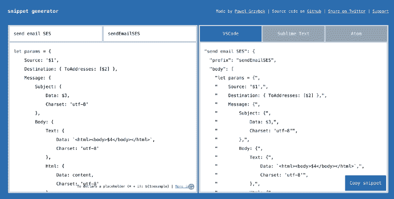

# VS 代码片段:提高编码效率的最强大的工具

> 原文：<https://www.freecodecamp.org/news/the-most-powerful-tool-to-boost-your-coding-productivity-2dc80e0eff00/>

作者:萨姆·威廉姆斯

# VS 代码片段:提高编码效率的最强大的工具

#### 用更少的按键编写更多的代码


Photo by [Dlanor S](https://unsplash.com/@dlanor_s?utm_source=medium&utm_medium=referral) on [Unsplash](https://unsplash.com?utm_source=medium&utm_medium=referral)

每个人都希望能够以更少的击键次数产生更多的代码。JavaScript 中的箭头函数最近变得非常流行——它们只为您节省了 6 个字符！

```
(function(){console.log('a')})() // 32 charachters(()=>{console.log('a')})() // 26 charachters
```

但是有一种更好的方法可以节省打字时间——本文将向您展示实现这一目的的工具。

### 代码片段

多年来，人们一直使用代码片段来节省时间——无论它们是常见的功能、文件结构还是整个系统的模板。这不是一个新的想法。

许多现有系统的问题是，这些片段通常存储在文本文件或其他文件系统中，需要手动复制并粘贴到任何需要的地方。

这对于大代码片段来说非常好。但是一行程序通常比搜索、复制和粘贴文件更快。

下一步是像 TextExpander 或 AutoHotKeys 这样的工具，它们可以设置特殊的按键序列，将代码片段粘贴到你输入的任何地方。这些都很棒，可以节省你大量的时间…但是我们可以更进一步。

### VS 代码片段


VS Code 有一个甚至比 TextExpander 或者 AutoHotKeys 更强大的系统。它内置的代码片段可以被配置为做更多的事情，而不仅仅是粘贴代码。

在讨论这些奇特的特性之前，我们将学习如何创建一个代码片段。

在 VS 代码中，按 ctrl+shift+P 打开命令面板并搜索代码段。选择“配置用户代码片段”会显示一个编码语言列表，您可以为这些语言创建代码片段。我们将使用 JavaScript。

这将打开代码片段编辑器。有一个注释向您展示了如何创建一个基本的代码片段，但是我们将创建自己的代码片段。

这段代码是我最喜欢的一行代码。这是一个很好的承诺处理模式。

```
const handle = prom => prom.then(res => [null, res]).catch(err => [err, null]);
```

为了创建我们的代码片段，我们需要在对象中创建一个新的键。这个键指向一个带有`prefix`、`body`和`description`的对象。

```
"insert handle function": {    "prefix": "",    "body": [],    "description": ""}
```

前缀是我们想要输入来触发这个代码片段的文本。你需要确保这是独一无二的。调用它`handle`会在每次调用函数时触发代码片段，所以我们可以使用类似`promHandle`的东西。

正文是代码段中的一组行。如果你有多行代码，那么你会在主体数组中有多个字符串。当您在 VS 代码中看到建议时，描述将会显示出来。

当所有这些都完成后，您会得到如下结果:

```
"insert handlefunction": {    "prefix": "promHandle",    "body": [        "const handle = prom => prom.then(res => [null, res]).catch(err => [err, null]);"    ],    "description": "inserting a 'handle' function"}
```

保存您的代码片段文件后，当您开始键入`promhandle`时，您会得到一个新的建议。向下按键显示代码片段的描述以及代码的第一行。


现在，您可以通过创建自己的代码片段来节省数百个字符。但是还有一些更强大的功能！

#### 制表符插入点

当你粘贴你的代码片段时，通常会有一些你需要添加的信息。无论是命名函数还是选择变量，您都可以在代码中设置需要输入数据的点。当您经过这些片段时，您可以在这些插入点之间切换。

要添加一个插入点，只需要为第一个点添加`$1`，为第二个点添加`$2`，以此类推。这对于需要对象的函数非常有用。

```
"sendMessage": {    "prefix": "sendMessage",    "body": [        "await botHelper.sendToUser({message$1, userID});"    ],    "description": "await sending a message using bot helper"},
```


您可以在整个代码中分布多个 tab 点，这意味着您可以快速而轻松地填充代码片段，而不必单击或使用箭头键指向每个点。

#### 特定于语言的片段

当我们第一次打开代码片段编辑器时，我们看到了一个语言列表。我们选择了 JavaScript，但你也可以选择其他 44 种语言中的任何一种。VS 代码片段的伟大之处在于它们可以被锁定到特定的文件类型。

如果你正在编写一个 HTML 文件，你不会得到所有的 JavaScript 或 Python 代码片段。这也意味着你可以让相同的前缀基于你当前工作的文件类型产生不同的代码片段！但是不要担心，如果您希望能够在任何文件类型中使用它们，您仍然可以添加全局代码段。

#### 特定于位置的片段

与特定于语言的代码段类似，您也可以创建特定于文件夹的代码段。当同一个命名的函数在两个不同的项目中做不同的事情时，这是非常好的。

选择语言时，只需选择`New Snippet file for '...'`。

### 创建更多片段

现在你知道了 VS 代码片段可以提高你的生产力的强大的方法，你可能想要加载。不幸的是，创建它们可能会令人沮丧。幸运的是，有两种解决方案:

#### 代码片段生成器

代码片段生成器是一个让你粘贴一些代码并轻松将其转换成代码片段格式的网站。

它真的很容易使用，并让您快速创建片段，您只需复制并直接粘贴到您的片段文件。它适用于任何语言，而且完全免费。



#### 代码片段扩展

如果你使用一个框架，比如 React 或者 Angular，你会想要创建很多代码片段。幸运的是，这是其他人以前遇到过的问题，所以他们为每个框架创建了公共代码片段库。

在 VS Code extension marketplace 中搜索`snippets`,会产生数百个您可以安装的结果。从 React，Angular，Vue 到 ES6 JS，C#和 PHP，应有尽有。这些通常有各种各样的片段，可以大大减少你打字的时间。

这些扩展的一个缺点是你必须学习前缀(触发器)是什么，但是你会很快记住你最常用的那些。

感谢阅读这篇关于使用 VS 代码片段提高编码效率的文章。如果你学到了什么，那就鼓掌吧？按钮，并关注我以获得更多提示、技巧和教程！

