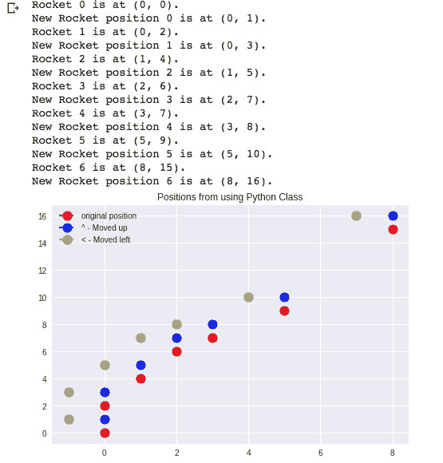
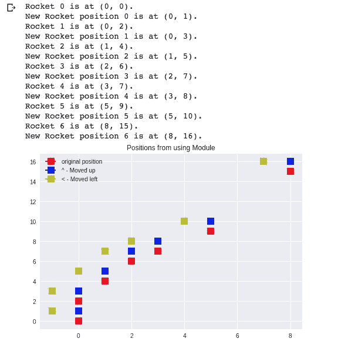
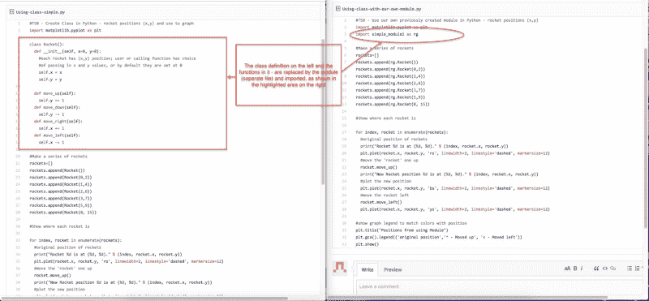
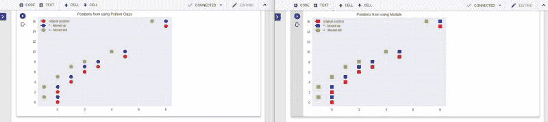

# 让我们上档次:如何用 Python 创建模块和类

> 原文：<https://www.freecodecamp.org/news/lets-get-classy-how-to-create-modules-and-classes-with-python-44da18bb38d1/>

作者:哈里·桑塔南

# 让我们上档次:如何用 Python 创建模块和类


Cubes

在 Python 等面向对象的计算机语言中，类基本上是创建自己的对象的模板。对象是将变量和函数封装成一个实体。对象从类中获取它们的变量和函数。

说什么？

这里有一些例子可以帮助你理解——继续读下去。还有一个交互式代码外壳，只需按下特定窗口顶部的“运行”按钮。

描述类以及如何使用它们的最简单的方法是这样的:

想象你有强大的力量。你创造了一个物种(“类”)。

然后你为这个物种创造属性(“属性”)——身高、体重、四肢、肤色、力量等等。

然后你创建一个该物种的实例——狗菲多，权力的游戏中的卓耿，等等。然后处理这些实例:

*   例如，在游戏中，他们会使用他们的属性参与行动，互动。
*   在银行应用程序中，它们是不同的交易。
*   在车辆购买/销售/交易/租赁应用程序中，车辆类可以衍生出子类，如汽车。每个都有属性，如里程，选项，功能，颜色和装饰。

您已经可以看到为什么这是有用的。您正在以一种非常高效、合理和有用的方式创建、重用、调整和增强项目。

到目前为止，您可能已经意识到这是一种分类和分组方式，类似于人类的学习方式:

*   从基本意义上说，动物是生物，不是人也不是树
*   然后你会看到不同种类的动物——狗、猫可能是我们大多数人最先了解的动物
*   然后你转向动物的不同属性——形状、大小、声音、附肢等等。

例如，当你还是个孩子的时候，你对狗的第一印象可能是它有四条腿，会叫。然后你学会区分一些是真正的狗，另一些是玩具。这个“狗”的概念包含许多种类。

创建和使用类基本上是:

*   建立一个放“东西”的模板——一个分类
*   然后可以对其进行操作。例如，调出所有养狗的人，你可以要求他们链接到一个关于宠物的博客，或者所有可能成为新信用卡潜在客户的银行客户。

这里的要点是**类**是可以产生那些模板的实例的对象，在这些模板上可以应用操作和方法。对于任何组织或过程来说，这都是概念化、组织和建立层次结构的一个很好的方法。

随着我们的世界变得越来越复杂，这是一种从层次角度模拟复杂性的方法。它还从虚拟信息技术的角度加深了对业务、技术和社会环境的流程和交互的理解。

一个例子可能是你创建的视频游戏。每个角色都可以是一个“类”，拥有自己的属性，与其他类的实例进行交互。“国王”类的乔治国王可能会与“小丑”类的宫廷小丑小丑互动，等等。例如，一个国王可能有一个皇家的“仆人”类，而一个“仆人”类总是有一个“国王”类。

这是我们将要做的:

*   创建一个类并使用它
*   创建一个模块，并将类的创建和初始化移到该模块中
*   在新程序中调用该模块以使用该类

代码可以在 GitHub [这里](https://github.com/HariSan1/class-module)获得。

```
#TSB - Create Class in Python - rocket positions (x,y) and graph
```

```
#some items and comments bolded to call attention to processimport matplotlib.pyplot as plt
```

```
class Rocket():  def __init__(self, x=0, y=0):    #each rocket has (x,y) position; user or calling function has choice    #of passing in x and y values, or by default they are set at 0    self.x = x    self.y = y      def move_up(self):    self.y += 1      def move_down(self):    self.y -= 1      def move_right(self):    self.x += 1      def move_left(self):    self.x -= 1
```

```
#Make a series of rockets - x,y positions, I am calling it rocketrockets=[]rockets.append(Rocket())rockets.append(Rocket(0,2))rockets.append(Rocket(1,4))rockets.append(Rocket(2,6))rockets.append(Rocket(3,7))rockets.append(Rocket(5,9))rockets.append(Rocket(8, 15))  #Show on a graph where each rocket is
```

```
for index, rocket in enumerate(rockets):  #original position of rockets  print("Rocket %d is at (%d, %d)." % (index, rocket.x, rocket.y))  plt.plot(rocket.x, rocket.y, 'ro', linewidth=2, linestyle='dashed', markersize=12)  #move the 'rocket' one up  rocket.move_up()  print("New Rocket position %d is at (%d, %d)." % (index, rocket.x, rocket.y))  #plot the new position  plt.plot(rocket.x, rocket.y, 'bo', linewidth=2, linestyle='dashed', markersize=12)  #move the rocket left, then plot the new position  rocket.move_left()  plt.plot(rocket.x, rocket.y, 'yo', linewidth=2, linestyle='dashed', markersize=12)
```

```
#show graph legend to match colors with positionplt.gca().legend(('original position','^ - Moved up', '< - Moved left'))plt.show()#plt.legend(loc='upper left')
```



Output from code above, using Python class

现在让我们创建一个模块，并将上面的一些代码移到这个模块中。任何时候我们需要在任何程序中创建这个简单的 x，y 坐标集，我们都可以使用这个模块来完成。

### 什么是模块，我们为什么需要它？

模块是包含 Python 定义和语句的文件。模块是 Python 代码，可以从其他程序调用它来完成常用任务，而不必在每个使用它们的程序中键入它们。

例如，当您调用“matplotlib.plot”时，您正在调用一个包模块。如果你没有这个模块，你将不得不在每个使用绘图图的**程序中定义绘图功能。**

来自 Python [文档](https://docs.python.org/2/tutorial/modules.html):

> 如果您退出 Python 解释器并再次输入，您所做的定义(函数和变量)将会丢失。因此，如果您想编写一个稍微长一点的程序，您最好使用一个文本编辑器来为解释器准备输入，并以该文件作为输入来运行它。这就是所谓的创建脚本。随着程序变得越来越长，你可能想把它分成几个文件以便于维护。您可能还想使用您在几个程序中编写的一个方便的函数，而不必将其定义复制到每个程序中。

> 为了支持这一点，Python 有办法将定义放在文件中，并在脚本或解释器的交互式实例中使用它们。这样的文件称为模块；模块中的定义可以导入到其他模块或主模块中(在顶层和计算器模式下执行的脚本中可以访问的变量集合)。

这是我们的简单模块。它需要创建类并使用函数将该类的一个实例从上面的程序移到它自己的类中。然后，我们将在一个新的程序中使用它，只需调用和引用这个模块:

注意我们在上面做了什么:

*   创建并初始化了该类
*   创建了一个函数，以四个主要方向(上、下、右、左)和增量移动该类的一个实例——作为函数的参数或自变量
*   使用图形距离公式创建了另一个函数来计算类的两个实例之间的距离

下面是我们将如何使用新模块重写第一部分中的相同程序。注意在开始的导入部分，我们现在导入刚刚创建的`simple_module1`模块:

这是使用我们的模块的代码的输出。请注意，除了图表标题和位置标记的形状之外，它们是相同的，为了便于比较，我对它们进行了更改。



Output from code from creating and calling our own module!



Comparison of the original file-left(create class, use it) and same functionality using a module, right



Comparison of the output. On the right side, I change the marker shape for distinction, but the positions are unchanged.

你可能会说，这太好了，它还有什么其他用途吗？一个典型的例子是银行账户。客户类可能包含姓名和联系信息，更重要的是，帐户类将包含存款和取款元素。

这过于简单了，但是为了说明的目的，这是有用的。就是这样—创建一个模板，然后用细节(属性)定义该模板的实例，并通过添加、减去、修改、移动和使用这些实例为您的计划目标增加价值。

还在想课程的事？好吧，让我们变得“优雅”——这是另一个简单的例子。我们将把这个类称为“人”。它只有两个属性—姓名和年龄。然后，我们将添加一个带有姓名和年龄的实例，并打印出来。根据你的目标，你可以想象你可能添加的所有其他细节——例如，婚姻状况和社交网络应用程序的位置偏好，多年的工作经验和职业相关应用程序的行业专长。按下面的小三角形，看看它的工作。

所以你有它。您可以创建许多不同的类，包括父类、子类等等。感谢阅读——如果你喜欢，请鼓掌。如果您想了解更多信息，以下是一些其他参考资料:

*   [Python 文档—类](https://docs.python.org/3/tutorial/classes.html)
*   [Python 面向对象—教程要点](https://www.tutorialspoint.com/python/python_classes_objects.htm)
*   [类和对象——learnpython.org](https://www.learnpython.org/en/Classes_and_Objects)