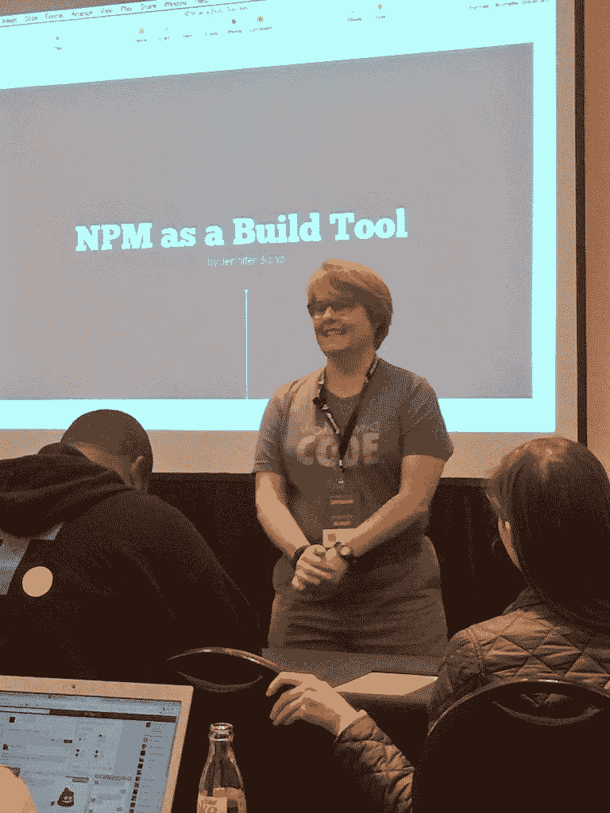

# 三年前，我参加了一个编码训练营。今天，我成为了谷歌开发者的拥护者。

> 原文：<https://www.freecodecamp.org/news/three-years-ago-i-attended-a-coding-bootcamp-today-i-became-a-google-developer-advocate-b89fae03d476/>

#### 这是我的旅程和我如何到达那里的故事

I am a Google Developer Expert in Web Technologies

### 什么是谷歌开发者专家？

我先说谷歌的官方定义，然后我再来说说我的定义。

谷歌开发专家(GDE)是指被谷歌认为在他们的一个或多个产品方面具有典范专长的人。谷歌开发者专家计划奖励 GDEs。谷歌建立并管理这个项目。

对我来说，谷歌开发专家是他们专业领域的领导者。此人还为技术社区做出了贡献。贡献可以包括演讲、写作、开源贡献、培训课程或维护 repo 的任意组合。

### 如何成为谷歌开发者专家？

要获得 GDE 奖，其他 GDE 人必须承认你是专家。你不能申请这个项目。你必须得到现任 GDE 的提名。

一旦你被提名，你必须填写一份申请表。此表显示了您的专业水平和您对技术社区的贡献水平。如果你的申请通过了，那么你会经历许多轮面试。你将接受采访，以判断你对技术社区的贡献。其他面试会评估你的技术知识。技术知识由谷歌员工完成，他是你专业领域的专家。如果你通过了所有这些步骤，那么谷歌将承认你是 GDE。

### 我的背景简史

很多年前，我是一名 Lotus Notes 开发人员。我这样做了 10 多年。我专门研究 IBM AS/400 上的 Lotus Notes 部署。结果，IBM 聘请我写一本关于 Lotus Notes 开发的书。如果您读过《在 AS/400 上使用 Lotus Domino 开发电子商务应用程序》这本书，那么您就读过我的书。

如果您曾经使用过 Lotus Notes，我敢打赌您今天可能不会使用它。正是因为这种使用率的下降，我不再是一名开发人员。我转向了其他领域。

在此期间，我开始学习网络营销。我建立了一个互联网营销业务，让我在 51 岁退休。我退休前的最后一份工作是在亚伦公司的培训部担任项目经理。

退休一年半后，我在 Barnes & Noble 的清仓架上花 1 美元买了一本关于 JavaScript 编程的书。这是 2014 年 11 月。接下来的一个半月，我通读了这本书，完成了所有的练习。就在这个时候，我想起了我对编程的热情。

### 我成为 GDE 的旅程

2014 年 12 月，我决定重返编程行业。回到大学去获得四年制学位是完全不可能的。幸运的是，编码训练营开始出现了。2014 年 12 月，我申请并被一个编码训练营接受。我的新兵训练营将于 2015 年 3 月开始。

如果你不熟悉编码训练营，它是一个为期三个月的培训项目，教你如何成为一名开发人员。我参加的新兵训练营非常紧张，训练是一天 12 小时，一周 6 天。2015 年 6 月毕业。毕业后整整 30 天，我开始了在 CNN 的开发工作。

要成为一名 GDE，你必须有很强的技术能力以及对社区的贡献。让我来分享一下我是如何努力提高我的技能的。

#### 提高我的技能

当你为一家每天点击量超过一百万次的公司工作时，你可以想象他们的应用程序有成千上万行代码。从新兵训练营出来，说我不知所措是一种保守的说法。如果我想以自己期望的水平做出贡献，我需要快速提高我的 JavaScript 技能。为了加强我的技能，我在 CodeSchool(现在的 PluralSight)、freeCodeCamp、Lynda、treehouse 和 Udacity 完成了培训。对我的技能提高最多的两个项目是 CodeSchool 和 freeCodeCamp。

我采用了我用来建立成功的网络营销业务的游戏计划来帮助我提高技能。这意味着每天早上上班前花一个小时。然后每天晚上下班后花一个小时。我每周至少要花 10 个小时进行培训。在周末，我会尽可能花每一分钟来训练。

#### 自由代码营

freeCodeCamp 最初的课程认证比现在少。完成每项认证所需的时间也比现在长。freeCodeCamp 估计完成这三项认证需要 1200 个小时。我在六个月内完成了它们。

在完成所有三个认证后，我被选中为一个非营利项目工作。我和一个同伴为针对女性的犯罪创建了一个会议日程安排应用程序。您可以观看此视频，了解我们创建的应用程序的演示。

#### 代码学校

我还在 CodeSchool 上完成了整个 JavaScript 培训课程。*(注:最近 PluralSight 收购了 CodeSchool，所以原来的培训项目已经不提供了。)*

这种培训加上我在编码训练营学到的东西极大地提高了我的技能。CodeSchool JavaScript 专题讲座涵盖了 JavaScript、jQuery、Node.js、Express.js、Angular.js 和 Backbone。这些都是我在新兵训练营学到的。完成培训以巩固我所学到的知识并加以应用是非常宝贵的。

### 社区贡献

做一个扎实的开发者是一回事。GDE 还会根据他们对社区的贡献进行评估。正如我前面提到的，贡献可以包括演讲、写作、开源贡献、培训课程或维护 repo 的任意组合。

我的第一次演讲活动发生在从编码训练营毕业不到六个月后。我和即将从我的编码训练营毕业的人谈过，他们可以做些什么来提高他们被快速雇用的机会。我花了大约 45 分钟谈论如何欺骗你的 LinkedIn 个人资料以及如何改进你的 GitHub repos。

大多数人担心他们不够“专业”，不能对任何事情发表意见。这不是真的。我谈到了我刚刚经历的事情，那就是从编码训练营毕业后找到一份工作。不到一个月就要毕业的学生非常感谢我分享了我对招聘过程的第一手知识。

Speaking at my first Tech Conference

在最初的演讲之后，我继续在当地集会上演讲。我演讲的前三个聚会是 AngularJS，女性编码和 NodeJS 聚会团体。我谈到了用 Postman 来测试你的 API，用 LinkedIn 来招聘，用 NPM 作为构建工具。

那年晚些时候，我在我的第一次重要技术会议上发言。几个月后，我会在我的第二次技术会议上发言。在过去的 35 个月里，我讲了 27 次。这是连续三年平均每月一次。如果你想知道我在哪里讲过或者我在[讲了什么，你可以在这里](https://www.jenniferbland.com/speaking/)访问我的网站。

#### 给亚特兰大编码的女人

我在 2015 年 1 月加入了《编码亚特兰大的女人》。有六个人出席了我的第一次聚会。创建 WWCAtl 的是 Erica Stanley，我和另外四名女性。两年后，WWCAtl 创建了有 400 名与会者的 WeRise 会议。

这次会议是由“妇女为妇女”组织的，其中 85%的发言人和与会者是女性。今年与会人数增加了 25%以上。我很自豪能够在今年的大会上做主题演讲。

我去年是 WWCAtl 领导委员会的成员，今年是，2019 年还会是。我是每月“代码堵塞”的技术负责人我的工作是帮助任何需要帮助的人学习一些东西或从事当前的项目。此外，我还教授了几个关于 NodeJS/ExpressJS/MongoDB 和高级 JavaScript 的三小时研讨会。

我还在每月例会上多次发言，并参加小组讨论。我在首届 WeRISE 大会上发言，今年我做了主题演讲，还教授了半天的研讨会。

#### 自由代码营

我已经提到过，我已经完成了最初 freeCodeCamp 课程中的所有三个认证。(注意:他们已经修改了他们的课程，现在包括 6 种认证。)我还为 freeCodeCamp 的一个非盈利项目做了贡献。当我在做课程的时候，我在他们的论坛上非常活跃。我会回答问题，提供鼓励，并给出代码示例。

freeCodeCamp 也有一份关于 medium.com 的出版物。来自世界各地的用户提交文章。志愿者编辑在这些文章发表前对其进行编辑。在过去的一年里，我一直是一名编辑。我每周会编辑 7 到 30 篇文章。

今年早些时候，我制作了一系列视频，展示了技术面试的“白板”过程。我经历了几个小时的实际面试问题，并展示了如何回答这个问题。我甚至展示了如何重构代码，解释了我的思维过程，并提出了测试代码的可能方法。这个视频系列涵盖了关于 HTML、CSS、JavaScript 和 jQuery 的面试问题。freeCodeCamp 获得了这些视频，你可以在这里观看。

在自由代码营的历史上，创始人昆西·拉森第一次承认那些贡献最大的营员为“顶级贡献者”我很自豪在颁奖的第一年被评为“最佳贡献者”。今年早些时候，我参加了在纽约举行的颁奖仪式。

#### 写作

我在编码训练营的时候就开始写作了。毕业后，我继续写我正在学习的东西。我会写下我推荐的学习编程的 JavaScript 书籍。我做了一个关于[的三部分系列，用 Angular](https://www.jenniferbland.com/introduction-to-angularjs-your-first-angular-application/) 创建你的第一个应用，并给它添加特性。

今天我在 medium.com 写了我的[文章，然后交叉发布在我的](https://medium.com/@ratracegrad)[个人博客](https://www.jenniferbland.com/)上。作为我申请 GDE 的一部分，我必须提供我所写的每一篇文章的链接。我还必须提供阅读它们的人数的统计数据。

当我提交申请的时候，我的文章已经被浏览了超过 26 万次。我很自豪有超过 25 万人阅读了我的文章。我平均每天有 1000 多人在 medium 上阅读我的文章。

#### 培养

衡量你的另一个方面是你是否为他人创建了培训课程。我已经提到过我通过亚特兰大编码妇女组织的三小时和半天的研讨会。除此之外，我还创建了三个培训网站。

第一个网站是 [in5Days.tech](https://www.in5days.tech/) 。该网址是特定的，因为你可以注册一个快速介绍广泛的主题。只要输入你的电子邮件地址，在接下来的 5 天里，我会给你发一封电子邮件告诉你这个话题。

我创建的下一个网站是关于 JavaScript 函数式编程的速成介绍。我正在教授一门高级 JavaScript 课程，人们想知道他们的技能是否足够强大，可以让他们参加高级课程。所以我组织了一个关于函数式编程的短期培训课程。

最后一个网站将是我的官方网站，上面有我所有的培训课程。你可以报名参加一个课程，然后观看一系列视频来了解更多关于这个话题的信息。*(注:如果您访问网站时，并非所有培训课程都可用，请给我时间。我在业余时间录制、编辑和发布视频培训课程，需要花费数小时。因此，请继续回来，检查进展。)*

#### 教学和指导

我贡献的另一个领域是在亚特兰大的南方科技人才中心当老师。我给他们教过课。我是 Thinkful 在线编码训练营的导师。我会每周指导学生三天，帮助他们完成课程。有很多亚特兰大的女性编码员参加过编码训练营。在他们参加编码训练营的时候，我已经指导了其中的六个人。

#### NodeJS 导师计划

NodeJS 组织正试图让更多的人参与到 NodeJS 这个开源项目中来。他们即将宣布一项计划，目前的贡献者将与几个有兴趣贡献的人配对。他们将配对 6 个月。毕业后，他们的期望是成为 NodeJS 的贡献者。

为了启动这个项目，他们运行了一个最初的测试版导师项目，在这个项目中，他们从 800 多名申请人中挑选了 4 人。我参加了最初的测试项目。我写了一篇关于我在这个项目中的经历的日记，你可以在这里看到。我还[制作了一系列关于我所学的视频](https://www.youtube.com/watch?v=ig5Yx4OSNGo&list=PLjJlQgygxY7e_7FMBvkUFkUwIPC5vg5OL)，并记录了我与我的导师的所有会面，你们可以观看。

### 结论

谷歌在广泛的技术领域承认人是 gde。其中一些领域是 web、Angular、Android、谷歌地图、Chrome 和谷歌云。你被选中参加其中一个领域的项目。我被选中学习网络技术。

我想与你分享我的旅程，以及我为达到这一点所做的一切。我的技能、我的演讲、我的训练以及我对 WWCAtl、freeCodeCamp、Thinkful 和 Tech Talent South 的贡献的结合促使我获得了这一荣誉。目前，谷歌只承认 59 人是网络技术领域的 GDE。我为自己是第六十名而自豪。