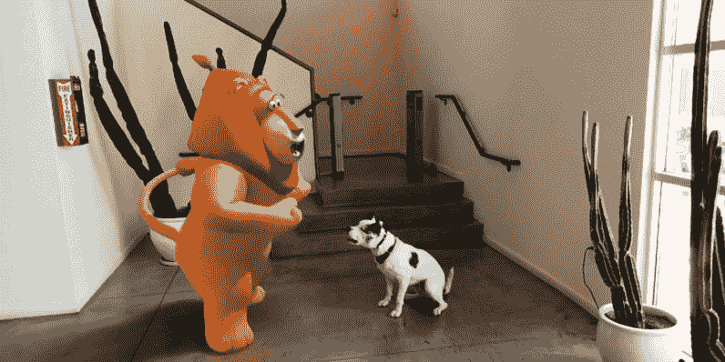
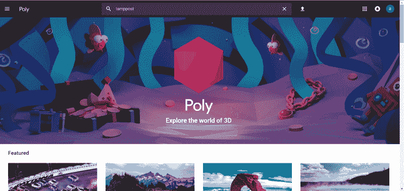
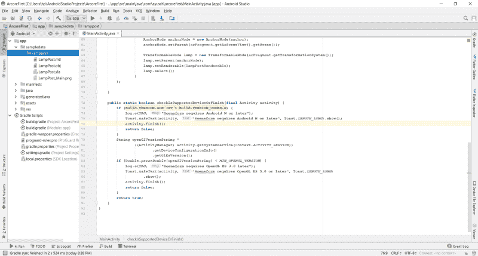

# 如何用 ARCore 和 Android Studio 构建一个增强现实 Android 应用

> 原文：<https://www.freecodecamp.org/news/how-to-build-an-augmented-reality-android-app-with-arcore-and-android-studio-43e4676cb36f/>

作者:阿尤施·贾恩

# 如何用 ARCore 和 Android Studio 构建一个增强现实 Android 应用



> 本文原帖[此处](http://ayusch.com/building-arcore-app-android-studio/)

在之前的帖子中，我解释了[ARCore 是什么](https://ayusch.com/what-is-arcore/)，以及它如何帮助开发者构建令人敬畏的增强现实应用，而无需理解 **OpenGL** 或 **Matrix** maths。

如果您还没有查看它，我强烈建议您在阅读本文和深入 ARCore 应用程序开发之前查看一下。

### 概观

[根据维基百科](https://en.wikipedia.org/wiki/ARCore)的说法，ARCore 是谷歌开发的一个软件开发工具包，允许构建增强现实应用。

**ARCore** 使用三项关键技术将虚拟内容与真实环境相结合:

1.  **运动追踪:**它可以让手机了解自己相对于世界的位置。
2.  **环境理解:**这允许手机检测所有类型表面的大小和位置，垂直、水平和倾斜。
3.  **光线估计:**它允许手机估计环境的当前光线条件。

### 入门指南

要开始开发 ARCore 应用程序，首先需要在项目中启用 ARCore。这很简单，因为我们将使用 Android Studio 和 Sceneform SDK。Sceneform 自动执行两个主要操作:

1.  **检查 ARCore 的可用性**
2.  **请求相机许可**

使用 Sceneform SDK 创建 ARCore 应用程序时，您不需要为这两个步骤费心。但是您确实需要在项目中包含 Sceneform SDK。

创建一个新的 Android Studio 项目，并选择一个空活动。

**将以下依赖项添加到您的项目级 build.gradle 文件中:**

```
dependencies {    classpath 'com.google.ar.sceneform:plugin:1.5.0'}
```

**将以下内容添加到您的应用程序级 build.gradle 文件中:**

```
implementation "com.google.ar.sceneform.ux:sceneform-ux:1.5.0"
```

现在同步项目和 Gradle 文件，等待构建完成。这会将 Sceneform SDK 安装到项目中，并将 Sceneform 插件安装到 **AndroidStudio** 中。它将帮助您查看。 **sfb** 文件。这些文件是在您的相机中渲染的 3D 模型。它还可以帮助您导入、查看和构建 **3D 资产**。

### 构建您的首个 ARCore 应用程序

现在，我们的 **Android Studio** 安装完成，Sceneform SDK 安装完毕，我们可以开始编写我们的第一个 **ARCore 应用了。**

首先，我们需要将 Sceneform 片段添加到布局文件中。这将是我们放置所有 3D 模型的场景。它负责摄像机初始化和权限处理。

转到你的主布局文件。在我的例子中，它是 **activity_main.xml** 并添加了 Sceneform 片段:

```
<?xml version="1.0" encoding="utf-8"?><FrameLayout xmlns:android="http://schemas.android.com/apk/res/android"    xmlns:tools="http://schemas.android.com/tools"    android:layout_width="match_parent"    android:layout_height="match_parent"    tools:context=".MainActivity">
```

```
 <fragment android:name="com.google.ar.sceneform.ux.ArFragment"        android:id="@+id/ux_fragment"        android:layout_width="match_parent"        android:layout_height="match_parent" />
```

```
</FrameLayout>
```

我已经设置了宽度和高度来匹配父对象，因为这将覆盖我的整个活动。您可以根据需要选择尺寸。

### 兼容性检查

这是您在布局文件中需要做的全部工作。现在转到 java 文件，在我的例子中是 MainActivity.java。将下面的方法添加到您的类中:

```
public static boolean checkIsSupportedDeviceOrFinish(final Activity activity) {    if (Build.VERSION.SDK_INT < Build.VERSION_CODES.N) {        Log.e(TAG, "Sceneform requires Android N or later");        Toast.makeText(activity, "Sceneform requires Android N or later", Toast.LENGTH_LONG).show();        activity.finish();        return false;    }    String openGlVersionString =            ((ActivityManager) activity.getSystemService(Context.ACTIVITY_SERVICE))                    .getDeviceConfigurationInfo()                    .getGlEsVersion();    if (Double.parseDouble(openGlVersionString) < MIN_OPENGL_VERSION) {        Log.e(TAG, "Sceneform requires OpenGL ES 3.0 later");        Toast.makeText(activity, "Sceneform requires OpenGL ES 3.0 or later", Toast.LENGTH_LONG)                .show();        activity.finish();        return false;    }    return true;}
```

该方法检查您的设备是否支持 Sceneform SDK。SDK 要求 Android API 级别 27 或更高，以及 OpenGL ES **版本 3.0** 或更高。如果设备不支持这两个，场景将不会被渲染，您的应用程序将显示一个空白屏幕。

不过，你仍然可以继续提供你的应用程序的所有其他功能，这些功能不需要 Sceneform SDK。

现在，随着设备兼容性检查的完成，我们将建立我们的 3D 模型，并将其附加到场景中。

### 添加资产

您需要添加将在屏幕上呈现的 3D 模型。如果您熟悉 3D 模型创建，现在您可以自己构建这些模型。或者，你可以去参观**保利。**

在那里你会发现一个巨大的 3D 资源库可供选择。它们可以免费下载。只要相信造物主，你就可以走了。



在 Android Studio 中，展开左侧项目窗格中的应用程序文件夹。你会注意到一个 **"** sampledata **"** 文件夹。此文件夹将保存您的所有 3D 模型资产。在示例数据文件夹中为您的模型创建一个文件夹。

当你从 poly 下载 zip 文件时，你很可能会找到 3 个文件。

1.  **。mtl 文件**
2.  **。对象文件**
3.  **。png 文件**

这 3 个中最重要的是。对象文件。这是你的真实模型。将所有 3 个文件放在 **sampledata** **- >“你的模型的文件夹** r”中。



**现在右击。obj** **文件**。第一种选择是导入 Sceneform 资产。单击它，不要更改默认设置，只需在下一个窗口中单击 finish。您的 gradle 将同步以将资产包含在资产文件夹中。一旦 gradle 构建完成，您就可以开始了。

您已经完成了在项目中导入 Sceneform 使用的 3D 资源。**接下来**，让我们从代码中构建资产，并将其包含在场景中。

### 构建模型

将下面的代码添加到您的 MainActivity.java 文件中(或者您案例中的任何内容)。别担心，我会逐行解释所有代码:

```
private static final String TAG = MainActivity.class.getSimpleName();private static final double MIN_OPENGL_VERSION = 3.0;
```

```
ArFragment arFragment;ModelRenderable lampPostRenderable;
```

```
@Override@SuppressWarnings({"AndroidApiChecker", "FutureReturnValueIgnored"})
```

```
protected void onCreate(Bundle savedInstanceState) {    super.onCreate(savedInstanceState);    if (!checkIsSupportedDeviceOrFinish(this)) {        return;    }    setContentView(R.layout.activity_main);    arFragment = (ArFragment) getSupportFragmentManager().findFragmentById(R.id.ux_fragment);
```

```
 ModelRenderable.builder()            .setSource(this, Uri.parse("LampPost.sfb"))            .build()            .thenAccept(renderable -> lampPostRenderable = renderable)            .exceptionally(throwable -> {                Toast toast =                        Toast.makeText(this, "Unable to load andy renderable", Toast.LENGTH_LONG);                toast.setGravity(Gravity.CENTER, 0, 0);                toast.show();                return null;            });
```

```
}
```

**首先**，我们找到包含在布局文件中的 **arFragment** 。这个片段负责承载场景。你可以把它想象成我们场景的容器。

**接下来**，我们将使用 **ModelRenderable** 类来构建我们的模型。借助 setSource 方法，我们从。 **sfb** 文件。该文件是在我们导入资产时生成的。一旦模型构建完成，Accept 方法就会接收它。我们将加载的模型设置为我们的**lampbostrenderable。**

对于错误处理，我们有**。破例**法。在抛出异常的情况下调用它。

所有这些都是异步发生的，因此你不需要担心多线程或者处理 XD

随着模型被加载并存储在**lampostrenderable**变量中，我们现在将它添加到我们的场景中。

### 将模型添加到场景中

**arFragment** 托管我们的场景，并将接收点击事件。因此，我们需要将 onTap 监听器设置到我们的片段，以注册 Tap 并相应地放置一个对象。将以下代码添加到 onCreate 方法中:

```
arFragment.setOnTapArPlaneListener(        (HitResult hitresult, Plane plane, MotionEvent motionevent) -> {            if (lampPostRenderable == null){                return;            }
```

```
 Anchor anchor = hitresult.createAnchor();            AnchorNode anchorNode = new AnchorNode(anchor);            anchorNode.setParent(arFragment.getArSceneView().getScene());
```

```
 TransformableNode lamp = new TransformableNode(arFragment.getTransformationSystem());            lamp.setParent(anchorNode);            lamp.setRenderable(lampPostRenderable);            lamp.select();        });
```

我们将 **onTapArPlaneListener** 设置为我们的 **AR 片段**。接下来你看到的是 **Java 8 语法**，如果你不熟悉的话，我推荐你看看这个指南 。

**首先，**我们使用 **hitresult.createAnchor()** 从 HitResult 创建我们的锚，并将其存储在一个锚对象中。

**接下来**，从这个锚点创建一个节点。它将被称为**锚节点。**通过对其调用 setParent 方法并从片段中传递场景，它将被附加到场景中。

现在我们创建一个 **TransformableNode** ，它将成为我们的**灯柱**，并将其设置为锚点或锚节点。该节点仍然没有关于它必须呈现的对象的任何信息。我们将使用 **lamp.setRenderable** 方法传递该对象，该方法接受一个 Renderable 作为其参数。最后调用 lamp . select()；

唷！！这里有太多的术语，但别担心，我会全部解释清楚。

1.  场景:这是你所有 3D 物体被渲染的地方。这个场景由我们包含在布局中的 AR 片段托管。锚节点附加到这个屏幕上，充当树的根，所有其他对象都作为它的对象呈现。
2.  **HitResult** :这是一条来自无穷远处的假想线(或光线)，它给出了自身与现实世界物体的交点。
3.  **锚点**:锚点是现实世界中固定的位置和方位。可以理解为 3D 空间中的 x，y，z 坐标。可以从中获取一个主播的帖子信息。**姿态**是场景中物体的位置和方向。这用于将对象的局部坐标空间转换为真实世界的坐标空间。
4.  AnchorNode:这是在世界中自动定位自己的节点。这是检测到平面时设置的第一个节点。
5.  **TransformableNode** :可以交互的节点。它可以移动，缩放，旋转等等。在这个例子中，我们可以缩放**灯**并旋转它。因此得名可变形。

这里没有火箭科学。真的很简单。整个场景可以被视为一个图形，其中 scene 作为父节点， **AnchorNode** 作为子节点，然后分支出不同的节点/对象以在屏幕上呈现。

你最终的 MainActivity.java 看起来应该是这样的:

```
package com.ayusch.arcorefirst;
```

```
import android.app.Activity;import android.app.ActivityManager;import android.content.Context;import android.net.Uri;import android.os.Build;import android.support.v7.app.AppCompatActivity;import android.os.Bundle;import android.util.Log;import android.view.Gravity;import android.view.MotionEvent;import android.widget.Toast;
```

```
import com.google.ar.core.Anchor;import com.google.ar.core.HitResult;import com.google.ar.core.Plane;import com.google.ar.sceneform.AnchorNode;import com.google.ar.sceneform.rendering.ModelRenderable;import com.google.ar.sceneform.ux.ArFragment;import com.google.ar.sceneform.ux.TransformableNode;
```

```
public class MainActivity extends AppCompatActivity {    private static final String TAG = MainActivity.class.getSimpleName();    private static final double MIN_OPENGL_VERSION = 3.0;
```

```
 ArFragment arFragment;    ModelRenderable lampPostRenderable;
```

```
 @Override    @SuppressWarnings({"AndroidApiChecker", "FutureReturnValueIgnored"})    protected void onCreate(Bundle savedInstanceState) {        super.onCreate(savedInstanceState);        if (!checkIsSupportedDeviceOrFinish(this)) {            return;        }        setContentView(R.layout.activity_main);        arFragment = (ArFragment) getSupportFragmentManager().findFragmentById(R.id.ux_fragment);
```

```
 ModelRenderable.builder()                .setSource(this, Uri.parse("LampPost.sfb"))                .build()                .thenAccept(renderable -> lampPostRenderable = renderable)                .exceptionally(throwable -> {                    Toast toast =                            Toast.makeText(this, "Unable to load andy renderable", Toast.LENGTH_LONG);                    toast.setGravity(Gravity.CENTER, 0, 0);                    toast.show();                    return null;                });
```

```
 arFragment.setOnTapArPlaneListener(                    (HitResult hitresult, Plane plane, MotionEvent motionevent) -> {                        if (lampPostRenderable == null){                            return;                        }
```

```
 Anchor anchor = hitresult.createAnchor();                        AnchorNode anchorNode = new AnchorNode(anchor);                        anchorNode.setParent(arFragment.getArSceneView().getScene());
```

```
 TransformableNode lamp = new TransformableNode(arFragment.getTransformationSystem());                        lamp.setParent(anchorNode);                        lamp.setRenderable(lampPostRenderable);                        lamp.select();                    }            );
```

```
 }
```

```
 public static boolean checkIsSupportedDeviceOrFinish(final Activity activity) {        if (Build.VERSION.SDK_INT < Build.VERSION_CODES.N) {            Log.e(TAG, "Sceneform requires Android N or later");            Toast.makeText(activity, "Sceneform requires Android N or later", Toast.LENGTH_LONG).show();            activity.finish();            return false;        }        String openGlVersionString =                ((ActivityManager) activity.getSystemService(Context.ACTIVITY_SERVICE))                        .getDeviceConfigurationInfo()                        .getGlEsVersion();        if (Double.parseDouble(openGlVersionString) < MIN_OPENGL_VERSION) {            Log.e(TAG, "Sceneform requires OpenGL ES 3.0 later");            Toast.makeText(activity, "Sceneform requires OpenGL ES 3.0 or later", Toast.LENGTH_LONG)                    .show();            activity.finish();            return false;        }        return true;    }}
```

**恭喜你！！**您刚刚完成了第一个 ARCore 应用程序。开始添加对象，看它们在现实世界中变得栩栩如生！

这是你第一次看到如何用 Android studio 从头开始创建一个简单的 ARCore 应用程序。在下一个教程中，我会更深入地研究 ARCore，并为应用程序添加更多的功能。

> 如果你有任何建议或者任何你想得到指导的话题，只要在评论区提出来，我会很乐意帮忙的。

喜欢你读的书吗？别忘了在[](https://www.facebook.com/AndroidVille)****Whatsapp**和 **LinkedIn** 上分享这个帖子。**

***你可以在 [LinkedIn](https://www.linkedin.com/in/ayuschjain) 、 [Quora](https://www.quora.com/profile/Ayusch-Jain) 、 [Twitter](https://twitter.com/ayuschjain) 和 [Instagram](https://www.instagram.com/androidville/) 上关注我，在那里我**回答与**移动开发相关的**问题，尤其是 Android 和 Flutter** 。***