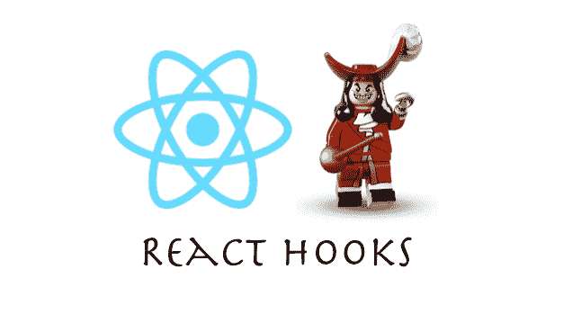
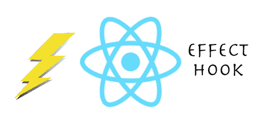

# React 挂钩简介

> 原文：<https://www.freecodecamp.org/news/an-introduction-to-react-hooks-12843fcd2fd9/>

哈什·马卡迪亚

# React 挂钩简介

随着 ReactJs 库获得新的更新，有许多东西被添加进来，也有一些被弃用。由于这些更新，ReactJs 正变得日益强大。作为一名开发人员，您需要随时了解每个版本中出现的新特性。

#### 你听说过 React Hooks 吗？

好吧，React Hooks，一个在 *React v16.7.0-alpha 中可用的特性，*是你应该知道的很棒的东西。

这是一个反应钩子的预告片。

React Hooks

在上面的代码中，`useState`是第一个钩子。

现在让我们进入 reactions Hooks 将要解决的问题。

毕竟，每一个新特性的引入都是为了解决一个问题。下面是[官方 react 网站](https://reactjs.org/docs/hooks-intro.html)对于将要解决的问题不得不说的事情列表。

#### 很难在组件之间重用有状态逻辑

可重用行为不能附加到 React 组件。一个很好的例子就是连接到商店。如果你有一些 React 方面的经验，你可能知道一些模式，比如[渲染道具](https://reactjs.org/docs/render-props.html)和[高阶组件](https://reactjs.org/docs/higher-order-components.html)，在解决这类问题时会很方便。使用这样的模式，组件必须被重新构造以便使用它们，这使得代码更难遵循和维护。

通过引入钩子，可以从组件中提取有状态逻辑。这允许它被独立测试，并且它可以被重用。

> 有了钩子，你可以重用有状态逻辑，而不用真正改变你的组件层次结构。

#### 复杂的组件变得难以理解

有时候，一个组件会从一个小状态发展到一个无法管理的有状态逻辑状态。

每种生命周期方法有时都包含一些不相关的逻辑。例如，一个组件可能通过 API 调用在`componentDidMount`和`componentDidUpdate`中执行一些数据获取。然而，同样的`componentDidMount`方法也可能包含一些不相关的逻辑。

该逻辑设置事件监听器，并在`componentWillUnmount`中执行清理。一起更改的相关代码会被拆分。
合并到一个方法中的不相关代码会带来错误和不一致。

我们经常会遇到这样的情况，由于有状态值的原因，我们无法将一个大的组件分割成更小的组件。此外，测试它们也变得很困难。

为了解决这个问题， **Hooks 允许你根据相关的部分将一个组件分割成更小的功能。一个很好的例子是设置订阅或获取数据**，而不考虑基于生命周期方法的代码分割。

> ***有了钩子，React 的更多特性可以不用类就能使用。***

### 但是钩子究竟是如何工作的呢？

下面是我们在上面看到的代码片段:

[链接到 CodeSandbox](https://codesandbox.io/s/lpokw8ox67)

`useState`的用法就是我们说的钩子。

我们在函数组件内部调用它，为它添加一个本地状态。React 将在所有重新渲染之间保持这种状态。`useState`返回一个包含当前状态值*和允许您更新该值的函数的对。*

您可以从事件处理程序或其他地方调用该函数。它类似于 React 类中的`this.setState`,但是它没有将新旧状态完全合并。

`useState`只有一个自变量，即初始状态。在上面给出的这个例子中，初始状态是`0`，因为我们的计数器从零开始。注意，与`this.state`不同，这里的状态不一定是一个对象——但是如果你愿意，它可以是一个对象。

#### 声明多个状态变量

[数组析构](https://developer.mozilla.org/en-US/docs/Web/JavaScript/Reference/Operators/Destructuring_assignment#Array_destructuring)语法给我们通过调用`useState`声明的状态变量起了不同的名字。这些名称不属于`useState` API。相反，React 假设如果您多次调用 lot，那么在每次渲染期间，您都是以相同的顺序进行调用。

> ***注意:*** *钩子是让你从函数组件中“钩入”React 状态和生命周期特性的函数。挂钩在 React 类中不起作用——它们允许你在没有类的情况下使用 React。*

### 效果挂钩

使用 React 您可能已经处理过数据获取、订阅或从 React 组件手动更改 DOM。我们称这些操作为“副作用”(或简称“效果”)。

效果挂钩`useEffect`增加了从功能组件执行副作用的能力。它与 React 类中的`componentDidMount`、`componentDidUpdate`和`componentWillUnmount`具有相同的用途，但是统一到一个 API 中。

例如，下面的组件在 React 更新 DOM 后设置文档标题:

[链接到 CodeSandbox](https://wn8q6741xl.codesandbox.io/)

当您调用`useEffect`时，您是在告诉 React 在刷新 DOM 更改后运行您的“effect”函数。效果是在组件内部声明的，因此可以访问它的属性和状态。默认情况下，React 会在每次渲染后运行效果— *包括*第一次渲染。

### 钩子的规则

Hooks Rules

钩子是 JavaScript 函数，但是它们有两个额外的规则:

*   只调用顶层的钩子**。不要试图在循环、条件或嵌套函数中调用钩子。**
*   只从 React 函数组件调用钩子**。不要试图从常规的 JavaScript 函数中调用钩子。**

这是对 React 钩子的一个快速浏览。如需更详细的说明，请点击以下链接:

[**一目了然——React**](https://reactjs.org/docs/hooks-overview.html)
[*一个用于构建用户界面的 JavaScript 库*reactjs.org](https://reactjs.org/docs/hooks-overview.html)

快乐学习！？？